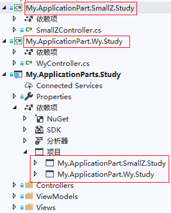

# ASP.NET Core中的应用程序部件

**名词描述**

应用程序部件（Application Part）： 对应的C#类名为ApplicationPart，AssemblyPart 类表示受程序集支持的应用程序部件。 

**代码引用来源**

```
services.AddMvc().AddApplicationPart(...);
或
services.AddMvc()
    .ConfigureApplicationPartManager(apm => apm.ApplicationParts.Add(...));
```

本文的核心是ApplicationPartManager类，主要介绍了该类及其属性相关的类的用法，ApplicationPartManager类的定义如下：

```c#
public class ApplicationPartManager
{
    public ApplicationPartManager();
	public IList<IApplicationFeatureProvider> FeatureProviders { get; }
    public IList<ApplicationPart> ApplicationParts { get; }
	public void PopulateFeature<TFeature>(TFeature feature);
}
```

其中ApplicationPart类、IApplicationFeatureProvider接口，以及PopulateFeature()方法，都会在本文被介绍。


## 应用程序部件介绍 —— ApplicationPart

应用程序部件从代码层面上来讲，就是一系列派生自抽象类ApplicationPart的后代类（例如AssemblyPart类，就是一种应用程序部件，用于封装程序集引用以及公开类型和编译引用）。

MVC应用可以通过应用程序部件发现和加载MVC功能，比如控制器、视图组件、标记帮助程和Razor编译源等。

应用程序部件是受程序集支持的，它的主要用途是：允许将应用配置为从程序集中发现（或避免加载）MVC 功能。

默认情况下，MVC将搜索依赖项树并查找控制器（甚至在其他程序集中）。例如，创建下图文件结构的类库，分别为My.ApplicationPart.SmallZ.Study和My.ApplicationPart.Wy.Study，并在MVC项目中添加这两个类库的引用：



不需要进行其他的配置，直接运行MVC项目，访问这两个程序集中的SmallZ控制器操作方法或Wy控制器操作方法，可以直接得到正确的结果：

```c#
http://localhost:20989/wy
http://localhost:20989/smallz
```

正如上所述，默认情况下，MVC将搜索依赖项树并查找控制器（甚至在其他程序集中）。

也可以使用下述方法加载任意程序集后，使用应用程序部件：

```c#
var pluginAssembly = Assembly.Load(new AssemblyName("Plugin"));
                    services.AddMvc()
                        .AddApplicationPart(pluginAssembly);
                        
或：
services.AddMvc()
    .ConfigureApplicationPartManager(apm => apm.ApplicationParts.Add(pluginAssembly));
```

### ApplicationPartManager.ApplicationParts

上述代码中的apm是 ApplicationPartManager类型，该类针对那些可用于MVC 应用的应用程序部件和功能提供程序，进行跟踪。ApplicationPartManager 的 ApplicationParts 集合用来控制应用可用的部件（或程序集），可以向该集合添加或移除程序集（需要借助AssemblyPart类）或应用程序部件。

例如，可以使用应用程序部件避免查找特定程序集或位置中的控制器。 通过将指定的程序集从ApplicationPartManager 的 ApplicationParts 集合中移除，这样MVC应用将不会发现该程序集中的功能：

```c#
services.AddMvc()
.ConfigureApplicationPartManager(apm =>
{
    var aps = apm.ApplicationParts;

    var dependentLibrary = apm.ApplicationParts
        .FirstOrDefault(part => part.Name == "SmallZ");
    if (dependentLibrary != null)
    {
        apm.ApplicationParts.Remove(dependentLibrary);
    }
})
```

**ApplicationPartManager 的 ApplicationParts 集合注意事项：**

- ApplicationParts 集合中的部件条目的顺序并不重要。
- 重要的是，在使用ApplicationPartManager 配置容器中的服务之前，应该对ApplicationPartManager 进行完全配置。也就是说，应该对ApplicationPartManager 中的组件进行完全配置之后，才能使用其他服务。例如，如果没有完全配置ApplicationPartManager，就调用AddControllersAsServices方法，那么在该方法之后添加的应用程序部件中的控制器，将不会受AddControllersAsServices方法的影响，不会注册为服务，这可能导致不正确的应用程序行为。

**备注说明**：在官方文档中，有这样一句话，“若要加载任意程序集（例如，从在编译时未引用的插件），可以使用应用程序部件。”，其原理是使用Assembly类加载程序集，然后通过AssemblyPart，将其添加到ApplicationPartManager.ApplicationParts集合中，而实际在使用中，发现没有通过添加引用的方式得到的程序集，并不能使用Assembly.Load()方法进行加载，问题是出在如何使用Assembly获取程序集，只要最终能够正确的得到Assembly对象，就可以通过AssemblyPart添加到组件集合中。

>除了项目的程序集及其从属程序集，ApplicationPartManager 还默认包含 Microsoft.AspNetCore.Mvc.TagHelpers 和 Microsoft.AspNetCore.Mvc.Razor 的部件。

 

## 应用程序功能提供程序 ——`IApplicationFeatureProvider<T>`

应用程序功能提供程序用于检查应用程序部件，并为这些部件提供功能。

应用程序功能提供程序从代码层面上来说，就是一组实现了泛型接口`IApplicationFeatureProvider<T>`的后代类，这些后代类包括MVC应用中内置的功能提供程序，如：

- 控制器功能提供程序 —— ControllerFeatureProvider 

  ```c#
  public class ControllerFeatureProvider : Microsoft.AspNetCore.Mvc.ApplicationParts.IApplicationFeatureProvider<Microsoft.AspNetCore.Mvc.Controllers.ControllerFeature>
  ```

- 元数据引用功能提供程序 —— MetadataReferenceFeatureProvider（已过时）

- 标记帮助程序功能提供程序 —— TagHelperFeatureProvider 

  ```c#
  public class TagHelperFeatureProvider : Microsoft.AspNetCore.Mvc.ApplicationParts.IApplicationFeatureProvider<Microsoft.AspNetCore.Mvc.Razor.TagHelpers.TagHelperFeature>
  ```

- 视图组件功能提供程序 —— ViewComponentFeatureProvider 

  ```c#
  public class ViewComponentFeatureProvider : Microsoft.AspNetCore.Mvc.ApplicationParts.IApplicationFeatureProvider<Microsoft.AspNetCore.Mvc.ViewComponents.ViewComponentFeature>
  ```

如上所述，功能提供程序从 `IApplicationFeatureProvider<T> `继承，其中 T 是功能的类型。

### ApplicationPartManager.FeatureProviders

可以通过ApplicationPartManager.FeatureProviders属性，获取功能提供程序集合。

**注意：**ApplicationPartManager.FeatureProviders 集合中的功能提供程序的顺序可能很重要，因为靠后的提供程序可以对前面的提供程序所执行的操作作出反应。

可以通过实现`IApplicationFeatureProvider<T>`接口来定义自己的功能提供程序，并将其添加到ApplicationPartManager.FeatureProviders集合中。