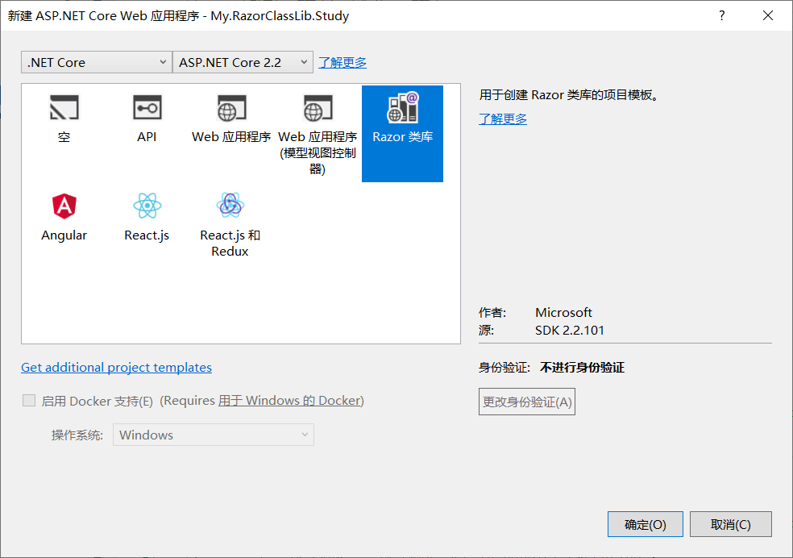

# ASP.NET Core Razor类库项目

**本文中的术语说明**

RCL：全称是Razor Class Library，即Razor类库。


## Razor类库

Razor类库简称为RCL，即Razor Class Library，它可以将Razor视图、Razor页面、控制器、页面模型、视图组件和数据模型等构建在一起，生成的一个可重用的类库，即为Razor类库。

RCL可以打包并重复使用，应用程序可以包含若干个RCL，并可以重写其中包含的视图和页面。如果在Web应用和RCL中都能找到视图（或部分视图、Razor页面），则优先使用Web应用中的Razor标记（.cshtml文件）。


## 创建Razor类库项目

打开Visual Studio 2017，选择 `“新建“ => ”项目” => “ASP.NET Core Web应用程序”`，在模板中选择”Razor类库“，注意，为了避免与已生成的视图库发生文件名冲突，建议库名称不要以`.Views`结尾。



创建完成之后，打开项目对应的.csproj文件，内容如下：

```xml
<Project Sdk="Microsoft.NET.Sdk.Razor">

  <PropertyGroup>
    <TargetFramework>netstandard2.0</TargetFramework>
  </PropertyGroup>

  <ItemGroup>
    <PackageReference Include="Microsoft.AspNetCore.Mvc" Version="2.2.0" />
  </ItemGroup>
</Project>
```

