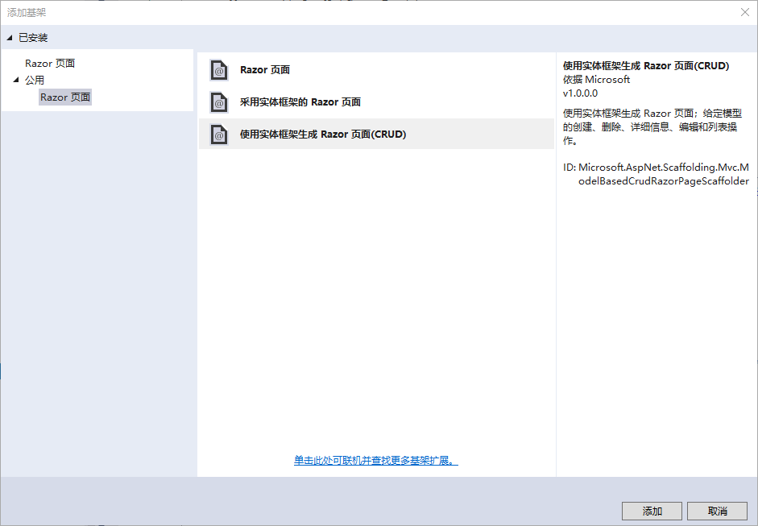

# ASP.NET Core Razor Pages


## 创建Razor Web应用

大多数文档中都采用“Web应用程序”项目模板来创建Razor应用，本文为了更好的说明Razor使用的过程，采用“空”项目模板进行创建，创建完成之后，手动的添加wwwroot和Pages文件夹，项目结构如下图所示：


要想让创建的应用输出Razor页面，需要在Startup.cs中添加MVC组件，代码如下：

```c#
public void ConfigureServices(IServiceCollection services)
{
    services.AddMvc().SetCompatibilityVersion(
        Microsoft.AspNetCore.Mvc.CompatibilityVersion.Version_2_2);
}
public void Configure(IApplicationBuilder app, IHostingEnvironment env)
{
    if (env.IsDevelopment())
    {
        app.UseDeveloperExceptionPage();
    }    
    app.UseMvc();
}
```

接着在Pages文件夹中，手动的添加Razor页面Index，Index.cshtml文件的代码如下：

```html
@page
@model My.Razor.Study.Pages.IndexModel
@{
    Layout = null;
}

<!DOCTYPE html>

<html>
<head>
    <meta name="viewport" content="width=device-width" />
    <title>Index</title>
</head>
<body>
    <h1>Hello ,Razor!</h1>
    <h2>@DateTime.Now</h2>
</body>
</html>
```

以上就是运行一个Razor应用所需要的最少资源，运行项目将会看到如下结果：


## Pages 文件夹

接下来对Pages文件夹进行扩展，右击“Pages”文件夹，选择“添加新项”，依次添加“Razor布局”、“Razor视图开始”、“Razor视图导入”三个文件，名称使用默认名称即可，如下图所示：


添加完成之后，在Pages文件夹下，存在以下文件：


_Layout.cshtml：该文件用于设置应用程序的布局。

```html
<!DOCTYPE html>
@{
    Console.WriteLine("_Layout.cshtml");
}
<html>
<head>
    <meta name="viewport" content="width=device-width" />
    <title>@ViewBag.Title</title>
</head>
<body>
    <h1>Hello Layout Razor!</h1>
    <div>
        @RenderBody()
    </div>

    @RenderSection("Scripts", required: false)
</body>
</html>
```

_ViewImports.cshtml： 该文件包含要导入每个 Razor 页面的 Razor 指令。

```c#
@{
    Console.WriteLine("_ViewImports.cshtml");
}
@using My.Razor.Study
@namespace My.Razor.Study.Pages
@addTagHelper *, Microsoft.AspNetCore.Mvc.TagHelpers
```

_ViewStart.cshtml：在运行Pages下的所有Razor页面之前，都会先执行该文件，用于指定布局页。

```c#
@{
    Layout = "_Layout";
    Console.WriteLine("_ViewStart.cshtml");
}
```


## 添加实体数据模型和对应的Razor页面

#### 添加实体数据模型

右击该项目，添加“新建文件夹”，命名为“Models”，在Models中添加一个实体类StudentModel：

```c#
namespace My.Razor.Study.Models
{
    public class StudentModel
    {
        public int Id { get; set; }
        public string Name { get; set; }
        public string StuNumber { get; set; }

        [DataType(DataType.Date)]
        public DateTime BirthDate { get; set; }
    }
}
```

上述代码中使用了[DataType(DataType.Date)]特性，用来指定BirthDate的数据类型为Date，使用该特性后，用户在日期字段中无需输入时间信息，并且该字段仅显示日期（而不显示时间信息）。

添加完实体数据模型后，接着来创建Student操作的相关Razor页面，这些页面包含基本的增删改查操作，为了便于后期数据的存储，此处使用Entity Framework Core基于内存数据库进行数据的读写。

#### 添加DbContext

右击该项目，添加“Data”文件夹，在该文件夹中添加一个DbContext，用于EF Core数据操作：

```c#
public class MyRazorContext : DbContext
{
    public MyRazorContext(DbContextOptions<MyRazorContext> options):base(options)
    {

    }
    public DbSet<StudentModel> Students { get; set; }
}
```

接着在Startup的ConfigureServices方法中添加该服务：

```c#
public void ConfigureServices(IServiceCollection services)
{
    services.AddDbContext<MyRazorContext>(options =>
            options.UseInMemoryDatabase("myAppDB")
    )
    .AddMvc()
        .SetCompatibilityVersion(
        Microsoft.AspNetCore.Mvc.CompatibilityVersion.Version_2_2);
}
```

上述中代码不会创建真正的数据库实体，而是基于内存进行数据处理。

#### 添加Razor页面

在Pages文件夹下创建Students文件夹，右击“Students”文件夹，添加“Razor页面”，在弹出的“添加基架”对话框中，可以选择Razor页面一个一个的添加，这里为了简单，直接选择“使用实体框架生成Razor页面（CRUD）“，如图所示：



在弹出的窗口中，选择模型类和刚才创建的数据上下文：


点击“添加”，将会在“Students”文件夹下添加相关的Razor页面，由于勾选了“引用脚本库”选项，因此还会在Pages文件夹下添加_ValidationScriptsPartial.cshtml文件，如下图所示：


运行该项目，使用https://localhost:5001/Students进行访问，各个页面呈现如下：


由于是基于内存数据库进行数据存储，因此每次运行该项目时，上一次输入的内容都会丢失。

#### Razor页面内容介绍


在Pages文件夹下创建“Student”文件夹，


