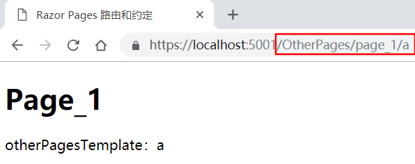
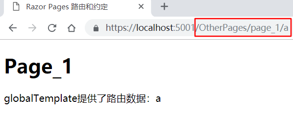
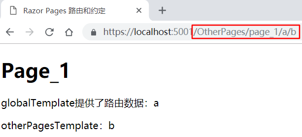

# ASP.NET Core Razor页面路由和约定

**本文适用范围**

只适用于Razor Pages应用，不适用于MVC应用。

**本文中的术语说明**

- 路由：本文中的路由均指的是在Razor页面应用下的路由，非MVC控制器路由，当然中间有与MVC控制器路由相关联或相同的地方。在ASP.NET Core的内部，Razor Pages 路由和 MVC 控制器路由共享一个实现。
- 应用程序模型：用于表示Web 应用程序的各个组件的抽象接口和具体实现类，通过使用应用程序模型，可以修改应用以遵循与默认行为不同的约定。
- 约定：英文名Convention，默认情况下，Web应用（例如MVC应用程序）遵循特定的约定，以确定将哪些类（模型）视为控制器，这些类上的哪些方法是操作，以及参数和路由的行为方式。可以创建自己的约定来满足应用的需要，将它们应用于全局或作为属性应用。

**快速理解技巧**

- 如果类名、接口名、方法名、属性名等，只要名称中出现“Convention”，都和“约定”有关。
- 如果名称中出现“ModelConvention”，都和“模型约定”相关。
- 如果名称中出现“Page”，一般都用于Razor Pages，而不是MVC。

**本文关联的成员**

成员的代码来源：

```c#
public void ConfigureServices(IServiceCollection services)
{
    services.AddMvc()
        .AddRazorPagesOptions(options =>
        {
            //重点RazorPagesOptions.Conventions
            PageConventionCollection pam = options.Conventions;
        })
        .SetCompatibilityVersion(CompatibilityVersion.Version_2_2);
}
```

从代码层面上讲，本文主要是对上述代码中的options.Conventions获得到的PageConventionCollection类型，及其用法进行讲解。


## PageConventionCollection和PageConventionCollectionExtensions

PageConventionCollection可以由RazorPagesOptions.Conventions获取，它的定义如下（F12可查看）：

```c#
public class PageConventionCollection : Collection<IPageConvention>
{
	public PageConventionCollection();
    public PageConventionCollection(IList<IPageConvention> conventions);
    
    // 与Area相关的
    public IPageApplicationModelConvention AddAreaFolderApplicationModelConvention(
    string areaName, string folderPath, Action<PageApplicationModel> action);
    
    public IPageRouteModelConvention AddAreaFolderRouteModelConvention(
    string areaName, string folderPath, Action<PageRouteModel> action);
    
    public IPageApplicationModelConvention AddAreaPageApplicationModelConvention(
    string areaName, string pageName, Action<PageApplicationModel> action);

	public IPageRouteModelConvention AddAreaPageRouteModelConvention(
	string areaName, string pageName, Action<PageRouteModel> action);
	
	//更常用的
	public IPageApplicationModelConvention AddFolderApplicationModelConvention(
	string folderPath, Action<PageApplicationModel> action);
	
	public IPageRouteModelConvention AddFolderRouteModelConvention(
	string folderPath, Action<PageRouteModel> action);
	
	public IPageApplicationModelConvention AddPageApplicationModelConvention(
	string pageName, Action<PageApplicationModel> action);
	
	public IPageRouteModelConvention AddPageRouteModelConvention(
	string pageName, Action<PageRouteModel> action);
	
	//很少用到的
	public void RemoveType<TPageConvention>() where TPageConvention : IPageConvention;
	public void RemoveType(Type pageConventionType);
}
```

本文主要对上述中常用的4个方法进行讲解（Area相关的方法与其类似），除此之外，还包括PageConventionCollectionExtensions类型的扩展方法。

PageConventionCollectionExtensions的定义如下（可F12查看源码）：

```c#
public static class PageConventionCollectionExtensions
{
    //常用
    public static PageConventionCollection Add(
    this PageConventionCollection conventions, 
    IParameterModelBaseConvention convention);
    
	public static PageConventionCollection AddAreaPageRoute(
    this PageConventionCollection conventions, 
        string areaName, string pageName, string route);
    //常用
	public static PageConventionCollection AddPageRoute(
        this PageConventionCollection conventions, string pageName, string route);
    
	public static PageConventionCollection AllowAnonymousToAreaFolder(
        this PageConventionCollection conventions, 
        string areaName, string folderPath);
    
	public static PageConventionCollection AllowAnonymousToAreaPage(
        this PageConventionCollection conventions, 
        string areaName, string pageName);
	
    public static PageConventionCollection AllowAnonymousToFolder(
        this PageConventionCollection conventions, string folderPath);
	
    public static PageConventionCollection AllowAnonymousToPage(
        this PageConventionCollection conventions, string pageName);
    
	public static PageConventionCollection AuthorizeAreaFolder(
        this PageConventionCollection conventions, 
        string areaName, string folderPath, string policy);
    
	public static PageConventionCollection AuthorizeAreaFolder(
        this PageConventionCollection conventions, 
        string areaName, string folderPath);
	
    public static PageConventionCollection AuthorizeAreaPage(
        this PageConventionCollection conventions, 
        string areaName, string pageName);
	
    public static PageConventionCollection AuthorizeAreaPage(
        this PageConventionCollection conventions, 
        string areaName, string pageName, string policy);
    
	public static PageConventionCollection AuthorizeFolder(
        this PageConventionCollection conventions, 
        string folderPath, string policy);
    
	public static PageConventionCollection AuthorizeFolder(
        this PageConventionCollection conventions, string folderPath);
    
	public static PageConventionCollection AuthorizePage(
        this PageConventionCollection conventions, string pageName);
    
	public static PageConventionCollection AuthorizePage(
        this PageConventionCollection conventions, string pageName, string policy);
    //常用
	public static PageConventionCollection ConfigureFilter(
        this PageConventionCollection conventions, IFilterMetadata filter);
    //常用
	public static IPageApplicationModelConvention ConfigureFilter(
        this PageConventionCollection conventions, 
        Func<PageApplicationModel, IFilterMetadata> factory);

}
```

通过PageConventionCollection和PageConventionCollectionExtensions的源码，可以看出PageConventionCollection继承自IPageConvention集合，因此可以使用Add()方法添加实现了接口IPageConvention的成员。

而在PageConventionCollectionExtensions的扩展方法中，同样存在Add()方法：

```c#
public static PageConventionCollection Add(
    this PageConventionCollection conventions, 
    IParameterModelBaseConvention convention);
```

因此如果引入了扩展方法，在使用PageConventionCollection的Add()方法时，该方法的参数可以接受实现了接口IParameterModelBaseConvention或IPageConvention的成员。

**重要说明：**

本文主要是对PageConventionCollection的内部方法和扩展方法的使用进行讲解，这些方法主要有：

- Add()，返回类型：PageConventionCollection或void，取决于调用的是否是扩展方法。
- AddFolderRouteModelConvention()，返回类型：IPageRouteModelConvention
- AddPageRouteModelConvention()，返回类型：IPageRouteModelConvention
- AddFolderApplicationModelConvention()，返回类型：IPageApplicationModelConvention
- AddPageApplicationModelConvention()，返回类型：IPageApplicationModelConvention
- ConfigureFilter()，返回类型：PageConventionCollection或IPageApplicationModelConvention
- AddPageRoute()，返回类型：PageConventionCollection

下面对这些方法的使用进行分类讲解。


## 使用Add()方法添加应用于Razor页面的模型约定

在上文中已经提到过，PageConventionCollection的Add()方法接受的参数可以是实现了IPageConvention接口或IParameterModelBaseConvention接口（来自于扩展方法）的成员对象。

由于IPageConvention和IParameterModelBaseConvention都是原始接口（这两个接口都没有实现任何基接口，只被其他类或接口实现），实现这两个接口的后代成员有很多，这里只对常用的进行讲述。

更具体的说，主要有以下几个：

```c#
public interface IPageRouteModelConvention : IPageConvention
```

 ```c#
public interface IPageApplicationModelConvention : IPageConvention
 ```

```c#
public interface IPageHandlerModelConvention : IPageConvention
```

```c#
public class PageRouteTransformerConvention : IPageRouteModelConvention, IPageConvention
```

上述只是列出的一部分，只要是IPageConvention或IParameterModelBaseConvention的后代，在使用Add()方法时都可以作为参数传入，包括实现了后代接口的后代类。

下面对上述中的成员的使用加以说明。

### IPageRouteModelConvention——路由模型约定

可以创建实现了IPageRouteModelConvention接口的实体类，并将其实例作为参数传递给PageConventionCollection的Add()方法，通过这种方式，这些实例将在页面路由模板构造过程中应用，可以将自己的路由模板添加到应用中的所有页面。

创建一个实现了IPageRouteModelConvention接口的实体类：

```c#
public class GlobalTemplatePageRouteModelConvention : IPageRouteModelConvention
{
    ILogger _logger;
    public GlobalTemplatePageRouteModelConvention(ILogger logger)
    {
        _logger = logger;
    }
    public void Apply(PageRouteModel model)
    {
        StringBuilder log = new StringBuilder();
        log.AppendLine("==================================");
        log.AppendLine($"Count：{model.Selectors.Count}  ViewEnginePath:{model.ViewEnginePath}    RelativePath:{model.RelativePath}");

        var selectorCount = model.Selectors.Count;
        for (var i = 0; i < selectorCount; i++)
        {
            var selector = model.Selectors[i];
            log.AppendLine("未添加前");
            log.AppendLine($"Order：{selector.AttributeRouteModel.Order} ， Template：{selector.AttributeRouteModel.Template}");

            //在现有的基础上添加新的路由模板
            model.Selectors.Add(new SelectorModel
            {
                AttributeRouteModel = new AttributeRouteModel
                {
                    Order = 1,//设置路由匹配顺序
                    //有当前的模板和自定义模板合并为一个新的模板
                    Template = AttributeRouteModel.CombineTemplates(
                        //获取当前的模板
                        selector.AttributeRouteModel.Template,
                        "{globalTemplate?}"),
                }

            });

            log.AppendLine($"添加完之后，Count:{model.Selectors.Count}");
            foreach (var s in model.Selectors)
            {
                log.AppendLine($"Order：{s.AttributeRouteModel.Order} ， Template：{s.AttributeRouteModel.Template}");
            }

            _logger.LogDebug(log.ToString());
        }
    }
}
```

Apply()方法会在构造每个页面对应的路由模型过程中被依次调用。

AttributeRouteModel的Order属性，用于设置[路由匹配顺序](https://docs.microsoft.com/zh-cn/aspnet/core/razor-pages/razor-pages-conventions?view=aspnetcore-2.2#route-order)，这里作简要说明。

路由顺序说明：

- 路由按照Order值进行顺序处理的（ -1、0、1、2...n）。
- 顺序值为-1时，将在处理其他路由之前处理该路由。
- 未指定顺序值时，或Order=null，将按照顺序值为0进行处理。
- 除上述之外，可以设置其他顺序值（1、2...n）。
- 当路由具有相同的Order顺序值时，优先匹配更具体的路由。例如/a/b/c和/a/b，优先匹配/a/b/c。

**注意：实际应用中，应该避免设置Order的值，不应该显示设置路由顺序，因为这样会容易让人困惑。**本文只是为了说明路由的匹配顺序而显示进行的设置，通常不建议这么做。

创建完实体类后，在Startup的ConfigureServices方法中，调用RazorPagesOptions.Conventions.Add()方法，将其添加到IPageConvention实例集合中，代码如下：

```c#
private readonly ILoggerFactory loggerFacotry;
public IConfiguration Configuration { get; }

public Startup(ILoggerFactory _loggerFactory, IConfiguration configuration)
{
    this.loggerFacotry = _loggerFactory;
    this.Configuration = configuration;
}

public void ConfigureServices(IServiceCollection services)
{
    services.AddMvc()
        .AddRazorPagesOptions(options =>
        {
            //添加路由模型约定
            options.Conventions.Add(
                new GlobalTemplatePageRouteModelConvention(
 loggerFacotry.CreateLogger<GlobalTemplatePageRouteModelConvention>()
                ));
        })       .SetCompatibilityVersion(Microsoft.AspNetCore.Mvc.CompatibilityVersion.Version_2_2);
}
```

上述中的路由模型约定会把自定义的路由模板（`{globalTemplate?}`）添加到应用中的所有页面，直接运行将会看到如下日志输出：


通过日志，可以很清楚的看到每个页面的路由模型在构建过程中，添加了新的路由模板到路由模型中。

以Index页面为例：

```c#
public class IndexModel : PageModel
{
    public string RouteDataGlobalTemplateValue { get; private set; }

    public void OnGet()
    {
        if(RouteData.Values["globalTemplate"]!=null)
        {
            RouteDataGlobalTemplateValue = $"globalTemplate提供了路由数据：{RouteData.Values["globalTemplate"]}";
        }
    }
}
```

Index.cshtml：

```html
<body>
    <h1>Razor页面路由和约定</h1>
    <div>@Model.RouteDataGlobalTemplateValue</div>
</body>
```

运行程序，直接访问Index页面，不会得到路由模板中globalTemplate的值：


这是因为，模板为“Index”的Order值为null，而“Index/{globalTemplate?}”的Order值为1，如下：

```
dbug: My.RazorRoute.Study.Conventions.GlobalTemplatePageRouteModelConvention[0]
      ==================================
      Count：2  ViewEnginePath:/Index    RelativePath:/Pages/Index.cshtml
      未添加前
      Order： ， Template：Index
      添加完之后，Count:3
      Order： ， Template：Index
      Order： ， Template：
      Order：1 ， Template：Index/{globalTemplate?}
```

在地址栏中，输入：/Index/wy，显示效果如下：


此时可以得到路由模板中globalTemplate的值。

### IPageApplicationModelConvention——应用模型约定

可以创建实现了IPageApplicationModelConvention接口的实体类，并将其实例作为参数传递给PageConventionCollection的Add()方法。这些实例将在页面应用模型构造过程中应用。

创建一个实现了IPageApplicationModelConvention接口的实体类：

```c#
public class GlobalHeaderPageApplicationModelConvention : IPageApplicationModelConvention
{
    public void Apply(PageApplicationModel model)
    {
        model.Filters.Add(new AddHeaderAttribute("GlobalHeader", 
            new string[] { "Global Header Value" }));
    }
}
```

上述中的AddHeaderAttribute是一个基于ResultFilterAttribute特性类的自定义属性，ResultFilterAttribute是一个内置筛选器，[可以通过它进行扩展](https://docs.microsoft.com/zh-cn/aspnet/core/razor-pages/filter?view=aspnetcore-2.2#implement-a-filter-attribute)：

```c#
public class AddHeaderAttribute: ResultFilterAttribute
{
    private readonly string _name;
    private readonly string[] _values;

    public AddHeaderAttribute(string name,string [] values)
    {
        _name = name;
        _values = values;
    }

    public override void OnResultExecuting(ResultExecutingContext context)
    {
        context.HttpContext.Response.Headers.Add(_name, _values);
        base.OnResultExecuting(context);
    }
}
```

在Startup类的ConfigureServices方法中进行添加：

```c#
public void ConfigureServices(IServiceCollection services)
{  
    services.AddMvc()
        .AddRazorPagesOptions(options =>
        {       
            options.Conventions.Add(
            new GlobalHeaderPageApplicationModelConvention());
        })
		.SetCompatibilityVersion(CompatibilityVersion.Version_2_2);     
}
```

运行项目，访问任意页面， 均可在响应的标头信息中，看到上述中添加的GlobalHeader值：


实现IPageApplicationModelConvention接口的实例的Apply()方法，会在每个页面的应用模型构造过程中被调用。

### IPageHandlerModelConvention——处理程序模型约定

可以创建实现了IPageHandlerModelConvention接口的实体类，并将其实例作为参数传递给PageConventionCollection的Add()方法，这些实例将在页面处理程序模型构造过程中应用。

创建实现了IPageHandlerModelConvention接口的实体类：

```c#
public class GlobalPageHandlerModelConvention
    : IPageHandlerModelConvention
{
    public void Apply(PageHandlerModel model)
    {
        ...
    }
}
```

在Startup类的ConfigureServices()方法中进行添加：

```c#
services.AddMvc()
    .AddRazorPagesOptions(options =>
        {
            options.Conventions.Add(new GlobalPageHandlerModelConvention());
        });
```

实现了IPageHandlerModelConvention接口的Apply()方法，将在任意页面的处理程序模型构造过程中被调用。

### PageRouteTransformerConvention——页面路由参数转换约定

PageRouteTransformerConvention是一个实现了IPageConvention接口和IPageRouteModelConvention接口的类，它的定义如下：

```c#
public class PageRouteTransformerConvention : IPageRouteModelConvention, IPageConvention
{
    public PageRouteTransformerConvention(IOutboundParameterTransformer parameterTransformer);
    public void Apply(PageRouteModel model);
	protected virtual bool ShouldApply(PageRouteModel action);
}
```

因此它的实例也可以作为参数，传递给PageConventionCollection的Add()方法。

PageRouteTransformerConvention包含一个参数为IOutboundParameterTransformer的构造函数，IOutboundParameterTransformer接口用于参数值转换，可以自定义一个实现该接口的实体类，这样在调用PageRouteTransformerConvention类的构造函数时，就可以将实体类的实例作为参数进行传入。这个实体类被称为参数转换程序，它可以将输入的路由值更改为另一个值输出。

PageRouteTransformerConvention仅将来自Razor中的Pages文件夹和文件名称自动生成的段对应的页面路由进行转换，例如，假如一个Razor页面在/Pages/My/Abc.cshtml下，那么PageRouteTransformerConvention仅对自动生成的段/My/Abc.cshtml进行转换，如果页面使用了@page指令，指定了路由模板，PageRouteTransformerConvention将不会转换@page指令设置的路由，同时也不会转换通过其他方法（例如AddPageRoute）添加的路由。一句话概括就是，PageRouteTransformerConvention只可以转换基于文件目录自动生成的页面路由中的段。

上文中已经提到过，使用PageRouteTransformerConvention时，必须有实现IOutboundParameterTransformer接口的实体类，这样才能调用它的构造函数。

首先定义一个实现了IOutboundParameterTransformer接口的实体类：

```c#
public class SlugifyParameterTransformer : IOutboundParameterTransformer
{
    public string TransformOutbound(object value)
    {
        if (value == null) { return null; }
        string str= Regex.Replace(value.ToString(),"([a-z])([A-Z])", "$1-$2").ToLower();
        return str;
    }
}
```

上述自定义的SlugifyParameterTransformer类即为一个转换程序，它用于将默认的段转换为另一个形式，例如，如果段为OtherPages，执行上述方法之后，将会返回other-pages，如下图所示：


在Startup类的ConfigureServices()方法中进行调用：

```c#
public void ConfigureServices(IServiceCollection services)
{
    services.AddMvc()
        .AddRazorPagesOptions(options =>
            {
                options.Conventions.Add(
                    new PageRouteTransformerConvention(
                        new SlugifyParameterTransformer()));
            });
}
```

运行程序，通过上图中的断点执行情况来看，自定义的转换程序会在自动生成页面路由的段时执行（不会在每个页面访问前运行），有多少个段就执行多少次，例如/Pages/OtherPages/Page_1.cshtml页面，自动生成的路由段有OtherPages和Page_1，因此针对这个页面会执行两次（具体可以加断点进行验证），一旦执行了转换程序，就不能直接使用/OtherPages/Page_1路由访问页面，而只能使用/Other-Pages/page_1进行访问。

### Add()方法的参数如何选择与对比

上文中分别讲述了可以为Add()方法传入的参数可选类型，下面对这些类型进行概括和比较：

#### 触发时机

IPageApplicationModelConvention、IPageHandlerModelConvention会在页面路由第一次被请求时执行，例如/About页面，当第一次访问该页面时，这两个方法接口对应的方法都会执行，如果再次访问就不会触发。

IPageRouteModelConvention会在所有的页面路由模型生成时执行，访问具体的页面时不会被触发。

PageRouteTransformerConvention会在自动生成的路由段时被执行，访问具体的页面不会被触发。

#### Apply()方法参数和适用场景

IPageRouteModelConvention和PageRouteTransformerConvention类的成员方法Apply()的参数都是PageRouteModel类型，PageRouteModel类可以对路由的模板和顺序值进行设置，因此如果是针对路由模板的操作，优先使用这两个类型的成员，其中PageRouteTransformerConvention主要用于路由值的转换，除此之外，优先使用IPageRouteModelConvention成员。

IPageApplicationModelConvention的Apply()方法的参数是PageApplicationModel类型，PageApplicationModel类的Filters属性可以执行筛选操作。

IPageHandlerModelConvention的Apply()方法的参数是PageHandlerModel类型，该类型可以获取处理的类型（GET、Post）、参数等信息，PageHandlerModel的Page属性也可以获取到PageApplicationModel类型对象，用法和IPageApplicationModelConvention.Apply()的参数PageApplicationModel用法类似。


## AddFolderRouteModelConvention()和AddPageRouteModelConvention()

除了Add()方法之外，PageConventionCollection还提供了AddFolderRouteModelConvention()和AddPageRouteModelConvention()方法。这两个方法都返回IPageRouteModelConvention，并且传入的委托都是PageRouteModel类型。

### AddFolderRouteModelConvention()

该方法的声明如下：

```c#
public Microsoft.AspNetCore.Mvc.ApplicationModels.IPageRouteModelConvention AddFolderRouteModelConvention (string folderPath, Action<Microsoft.AspNetCore.Mvc.ApplicationModels.PageRouteModel> action);
```

需要注意的是该方法返回的类型是IPageRouteModelConvention，它与上文介绍的Add()方法传入的参数是IPageRouteModelConvention类型的一样，因此调用AddFolderRouteModelConvention()方法，与直接为Add()方法传入IPageRouteModelConvention类型的参数的用法类似，只不过是一个需要显示的在Apply()方法中进行处理，而AddFolderRouteModelConvention()方法，只需要在第二个参数对应的委托中进行处理即可。

另外需要注意的是，AddFolderRouteModelConvention()方法可以为指定文件夹下的所有页面调用PageRouteModel上的操作，而Add()方法（参数为IPageRouteModelConvention的版本）针对的是所有页面， 除此之外二者没有区别。

下述代码使用AddFolderRouteModelConvention()方法为OtherPages文件夹下的所有页面的路由模板追加"`{otherPagesTemplate?}`"：

```c#
options.Conventions.AddFolderRouteModelConvention("/OtherPages", model =>
{
    var selectorCount = model.Selectors.Count;
    for (var i = 0; i < selectorCount; i++)
    {
        var selector = model.Selectors[i];
        model.Selectors.Add(new SelectorModel
        {
            AttributeRouteModel = new AttributeRouteModel
            {
                Order = 2,
                Template = AttributeRouteModel.CombineTemplates(
                    selector.AttributeRouteModel.Template, 
                    "{otherPagesTemplate?}"),
            }
        });
    }
});
```

Page_1.cshtml.cs：

```c#
public class Page_1 : PageModel
{
    public string RouteDataGlobalTemplateValue { get; private set; }

    public string RouteDataOtherPagesTemplateValue { get; private set; }

    public void OnGet()
    {
        if(RouteData.Values["globalTemplate"]!=null)
        {
            RouteDataGlobalTemplateValue = $"globalTemplate提供了路由数据：{RouteData.Values["globalTemplate"]}";
        }

        if (RouteData.Values["otherPagesTemplate"] != null)
        {
            RouteDataOtherPagesTemplateValue =
                 $"otherPagesTemplate：{RouteData.Values["otherPagesTemplate"]}"; 
        }
    }
}
```

Page_1.cshtml：

```html
<body>
    <h1>Page_1</h1>
    <div>@Model.RouteDataGlobalTemplateValue</div>

    <p>@Model.RouteDataOtherPagesTemplateValue</p>
</body>
```

运行程序，如果只含有上述配置项时，访问/OtherPages/page_1/a，显示效果如下：



如果同时启用本文前面的Add()方法，传入实现了IPageRouteModelConvention接口的实体：

```c#
options.Conventions.Add(
    new GlobalTemplatePageRouteModelConvention(
        loggerFacotry.CreateLogger<GlobalTemplatePageRouteModelConvention>()
    ));
```

仍然访问/OtherPages/Page_1/a，此时显示效果如下：



这是因为在GlobalTemplatePageRouteModelConvention实现IPageRouteModelConvention的Apply()方法时，将AttributeRouteModel的Order属性值设置为了1，因此它有更高的优先级匹配路由数据值。这正是Order属性的用处。

若在同时启用了Add()和AddFolderRouteModelConvention()方法的情况下，同时显示这两个路由值，可以访问/OtherPages/Page_1/a/b，显示效果如下：



目前对这种显示现象没有特别官方的说明。

### AddPageRouteModelConvention()

与AddFolderRouteModelConvention()方法都返回相同类型（IPageRouteModelConvention）的值，并且调用方法的方式和传入的委托参数的类型（PageRouteModel）都相同，唯一不同的是，AddFolderRouteModelConvention()方法中的PageRouteModel上的操作，针对的是指定名称的文件夹下的页面，而AddPageRouteModelConvention()针对的是指定名称的页面调用PageRouteModel上的操作。除此之外，其他的方法调用和PageRouteModel操作都一样。

下述代码使用AddPageRouteModelConvention()方法将"{aboutTemplate?}"路由模板添加到About页面（About.cshtml未在OtherPages文件夹下）：

```c#
options.Conventions.AddPageRouteModelConvention("/About", model =>
{
    var selectorCount = model.Selectors.Count;
    for (var i = 0; i < selectorCount; i++)
    {
        var selector = model.Selectors[i];
        model.Selectors.Add(new SelectorModel
        {
            AttributeRouteModel = new AttributeRouteModel
            {
                Order = 2,
                Template = AttributeRouteModel.CombineTemplates(
                    selector.AttributeRouteModel.Template, 
                    "{aboutTemplate?}"),
            }
        });
    }
});
```

它的显示效果和说明与调用AddFolderRouteModelConvention()类似，此处不再累述。


## AddFolderApplicationModelConvention()和AddPageApplicationModelConvention()


## 使用AddPageRoute()方法配置页面路由


## 使用ConfigureFilter()方法配置筛选器

### 配置指定的筛选器

### 配置筛选器工厂


 


## 替换默认页面应用模型提供程序

### 默认的未命名处理程序方法

### 默认的已命名处理程序方法

### 自定义处理程序方法名称


## MVC 筛选器和页面筛选器 (IPageFilter)


## 自定义路由

https://docs.microsoft.com/zh-cn/aspnet/core/razor-pages/index?view=aspnetcore-2.2&tabs=visual-studio#custom-routes