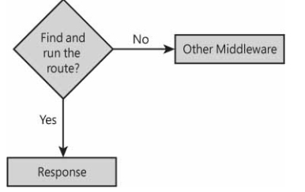
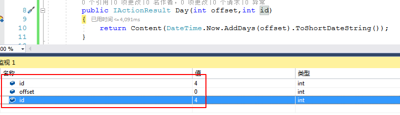
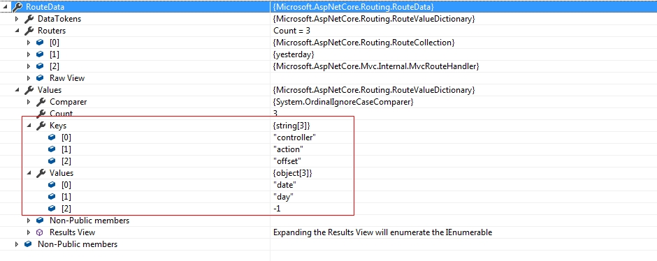
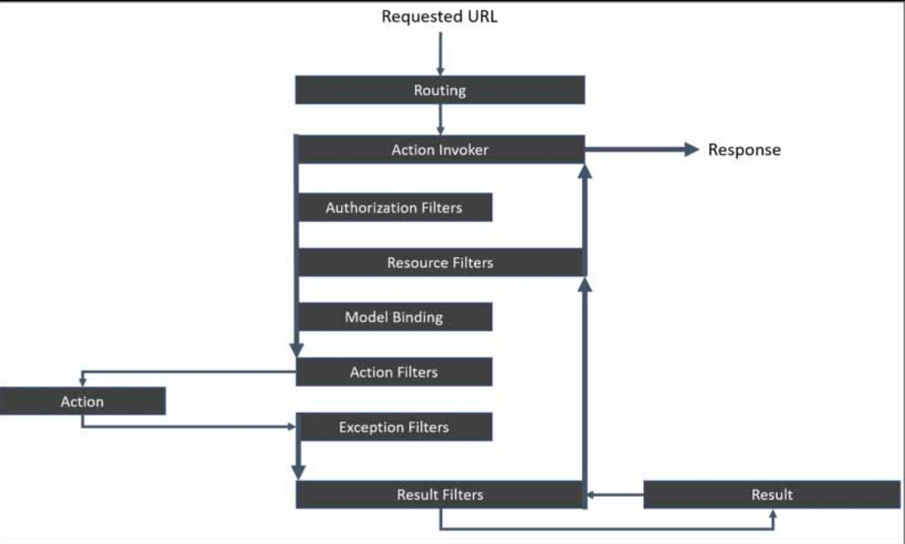

# ASP.NET Core MVC 初探

ASP.NET Core完全支持传统的ASP.NET模型 - 视图 - 控制器（MVC）应用程序模型，其中传入请求的URL被解析为一对控制器/操作项，其中 控制器项标识类名， 操作项标识控制器类上的方法。如果要使用ASP.NET Core MVC 模型，必须显式的启用。

## 注册MVC服务

MVC应用程序模型的核心是`MvcRouteHandler`服务，它是负责解析MVC路由的URL，调用所选控制器方法以及处理操作结果的引擎。

注意：`MvcRouteHandler`也是经典ASP.NET MVC实现中使用的类的名称。 但是，在经典的ASP.NET MVC中，该类的作用比ASP.NET Core中的作用更为有限。 为了捕捉该类在ASP.NET Core中的作用，而不仅仅依赖于搜索引擎的能力，最好直接查看它的实现。

要将`MvcRouteHandler`服务添加到ASP.NET Host，只需向启动类的`ConfigureServices()`方法添加一行代码即可。

    public void ConfigureServices(IServiceCollection services)
    {
    	services.AddMvc();
    }

`AddMvc()`方法有两个重载。 无参数方法接受MVC服务的所有默认设置。 第二个重载，如下所示，允许您选择临时选项。

```c#
services.AddMvc(options =>
{
    options.ModelBinderProviders.Add(new SmartDateBinderProvider());
    options.SslPort = 345;
});
```

选项通过`MvcOptions`类的实例指定。 该类是可以在MVC框架中更改的配置参数的容器。 例如，上面的代码片段添加了一个新的模型绑定器，它将特定字符串解析为有效日期，并指定在使用`RequireHttpsAttribute`修饰控制器类时要使用的SSL端口。 完整的可配置选项列表可在此处找到：https://docs.microsoft.com/zh-cn/dotnet/api/microsoft.aspnetcore.mvc.mvcoptions

#### 已启用的其他附加服务

当使用`AddMvc()`方法注册服务后，在该方法下，许多其他服务也一同被初始化并添加到管道中。

下面是使用`AddMvc()`方法后，一同被启用的MVC服务介绍：

- MVC Core：MVC应用程序模型的核心服务集，包括路由和控制器。
- API Explorer：服务负责收集和公开有关控制器和动作的信息，以便动态发现功能和帮助页面。
- Authorization：认证和授权背后的服务。
- Default Framework Parts：将输入标记助手和URL解析助手添加到应用程序部件列表的服务。
- Formatter Mappings：设置默认媒体类型映射的服务。
- Views：处理操作的服务结果为HTML视图。
- Razor Engine：将Razor视图和页面引擎注册到MVC系统中。
- Tag Helpers：服务引用标签助手的框架部分。
- Data Annotations：服务以引用关于数据注释的框架部分。
- JSON Formatters：处理操作的服务结果为JSON流。
- CORS：服务以引用关于跨源资源共享（CORS）的框架部分。

注意：在上述服务中，某些服务仅在您公开Web API时才有用。 这些服务是API Explorer，Formatter Mappings和CORS。

如果您有内存限制 - 例如，您在云中托管应用程序 - 您可能希望应用程序只引用框架的裸机。 上述中的服务列表可以缩短; 缩短程度主要取决于您在应用程序中需要具备的实际功能。 以下代码足以在没有更高级功能的情况下提供纯HTML视图，例如表单验证和标记帮助程序的数据注释。

```c#
public void ConfigureServices(IServiceCollection services)
{
    var builder = services.AddMvcCore();
    builder.AddViews();
    builder.AddRazorViewEngine();
}
```

但是，上面的代码不足以返回格式化的JSON数据。 要添加该功能，您只需添加：

```c#
builder.AddJsonFormatters();
```


#### 激活MVC服务

在启动类的`Configure()`方法中，调用`UseMvc()`方法来配置ASP.NET Core管道以支持MVC应用程序模型。此时，除了传统路由之外，MVC应用程序模型周围的所有内容都已完全设置。

路由是应用程序可以识别和处理的URL模板。路由最终映射到一对控制器和操作名称。可以根据需要添加任意数量的路由，这些路由几乎可以采用你喜欢的任何形式。内部MVC服务负责请求路由，启用MVC Core服务时会自动注册。


## 启用常规路由

为了可以使用，你的应用程序应提供规则来选择它想要处理的URL。但是，并非所有可行的URL都必须明确列出， 一个或多个带占位符的URL模板将完成这项工作。 存在默认路由规则，有时称为传统路由。 通常，默认路由足以满足整个应用程序的需要。

#### 添加默认路由

如果您对路由没有任何特殊顾虑，最简单的方法是仅使用默认路由。

```c#
public void Configure(IApplicationBuilder app)
{
    app.UseMvcWithDefaultRoute();
}
```

`UseMvcWithDefaultRoute()`方法背后的实际代码如下所示：

```c#
public void Configure(IApplicationBuilder app)
{
    app.UseMvc(routes =>
    {
        routes.MapRoute(
            name: "default",
            template: "{controller=Home}/{action=Index}/{id?}");
    });
}
```

路由参数在传入请求的整体处理中起着关键作用， 特别是名为`controller`和`action`的路由参数 ，因为它们以某种方式指向实际产生响应的代码。任何成功映射到路由的请求都将通过在控制器类上执行方法来处理。名为`controller`的路由参数标识控制器类，名为`action`的路由参数标识要调用的方法。

#### 没有配置路由时

可以在没有参数的情况下调用`UseMvc()`方法。发生这种情况时，ASP.NET MVC应用程序功能齐全，但没有可以处理的已配置路由。

```c#
public void Configure(IApplicationBuilder app)
{
    app.UseMvc();
}
```

上面的代码完全等同于下面的代码段：

```c#
app.UseMvc(routes => { });
```

如果在`Configure()`方法中存在如下代码：

```c#
//使用默认路由配置
app.UseMvcWithDefaultRoute();
//添加终止中间件到管道
app.Run(async (context) =>
{
    await context.Response.WriteAsync("Hello World!");
});
```

如果使用了`UserMvc()`或者`UseMvcWithDefaultRoute()`语句，它们会改变管道的结构，当使用了与配置的路由相匹配的控制器和视图访问页面时，它将绕过了你可能定义的任何终止中间件（比如上述中的输出“Hello World”语句），优先显示视图对应的页面内容，只有在找不到路由的情况下，或者由于缺少控制器或方法而无法工作（终止中间件），则终止中间件将重新获得管道中的位置并按预期运行（即会输出“Hello world”）。

#### 路由服务和管道

在内部，`UseMvc()`方法定义路由构建器服务并将其配置为使用提供的路由和默认处理程序。 默认处理程序是`MvcRouteHandler`类的实例，该类负责查找匹配的路由以及从模板中提取控制器和操作方法名称。

此外，`MvcRouteHandler`类还将尝试执行`action`方法。 如果成功，它会将请求的上下文标记为已处理，以便没有其他中间件可以触及生成的响应。 否则，它允许请求继续通过管道直到完全处理。



注意：在传统的ASP.NET MVC中，如果找不到URL的匹配路由，将导致HTTP 404状态代码。 相反，在ASP.NET Core中，任何终止中间件都有机会处理请求。


## 配置路由表

定义路由的方式有两种，配置URL模板或者定义属性路由。

#### 路由剖析

路由基本上由唯一名称和URL模板指定。 URL模板可以由静态文本组成，也可以包括动态参数，其值从URL和可能的整个HTTP上下文中摘录。定义路由的完整语法如下所示。

```c#
app.UseMvc(routes => 
{   
   routes.MapRoute(
       name: "your_route",
       template: "...",
       defaults: new { controller = "...", action = "..." },
       constraints: { ... },
       dataTokens: { ... });
})
```

`template`参数指的是您选择的URL模式。如上所述，对于默认的常规路由，它等于：

```
{controller}/{action}/{id?}
```

定义其他路由可以采用您喜欢的任何形式，并且可以包括静态文本和自定义路由参数。 `defaults`参数指定模板中的路由参数的默认值。 template参数可以与defaults参数融合。发生这种情况时，省略`defaults`参数，模板参数采用以下形式。

```
template: "{controller=Home}/{action=Index}/{id?}"
```

如上所述，如果`?`符号附加到参数名称，表示该参数是可选的。

`constraints`参数指的是在特定路由参数上设置的约束，例如可接受的值或所需类型。 

`dataTokens`参数引用与路由关联的其他自定义值，但不用于确定路由是否与URL模式匹配。

#### 定义自定义路由

常规路由从URL的各个分段自动计算出控制器和方法名称。 自定义路由只使用替代算法来计算相同的信息。 更常见的是，自定义路由由显式映射到控制器/方法对的静态文本组成。

通常，不需要禁用传统路由，只需添加一些临时路由即可拥有一些受控URL来调用应用程序的某种行为。

为了说明自定义路由的使用，首先定义一个控制器/视图，代码如下：

DateController：

```c#
public class DateController : Controller
{
    public IActionResult Day(int offset)
    {
        return Content(DateTime.Now.AddDays(offset).ToShortDateString());
    }

    public IActionResult Index()
    {
        return View();
    }
}
```

然后在`Configure()`方法中，自定义路由：

```c#
public void Configure(IApplicationBuilder app, IHostingEnvironment env)
{
    if (env.IsDevelopment())
    {
        app.UseDeveloperExceptionPage();
    }

    //自定义路由
    app.UseMvc(routes =>
    {
        routes.MapRoute(
            name: "route-today",
            template: "today",
            defaults: new { controller = "date", action = "day", offset = 0 });

        routes.MapRoute(
            name: "route-yesterday",
            template: "yesterday",
            defaults: new { controller = "date", action = "day", offset = -1 });

        routes.MapRoute(
            name: "route-tomorrow",
            template: "tomorrow",
            defaults: new { controller = "date", action = "day", offset = 1 });
    });

    //常规路由（默认路由）
    app.UseMvcWithDefaultRoute();

    app.Run(async (context) =>
    {
        await context.Response.WriteAsync("Hello World!");
    });
}
```

访问方式一，使用路由`template`进行访问：

```
http://localhost:17699/today
http://localhost:17699/tomorrow
http://localhost:17699/yesterday
```

使用上述形式访问，将会自动把`offset = 0` / `offset = 1` / `offset = -1` 赋值给控制器中的`Day(int offset)`的`offset`参数。即控制器中的方法参数`offset`可以得到传入的实参值

访问方式二，结合传统路由使用URL参数形式进行访问：

```
http://localhost:17699/date/day?offset=4
```

上述形式进行访问，将会自动映射到控制器`Date`中的`Day()`方法，并将传入的`?offset=4`自动映射到`offset`参数，即`offset`参数也可以得到实际传入的值。

错误访问形式：

```
//错误访问形式
http://localhost:17699/date/day/4
```

注意：如果使用上述中的访问形式，虽然也能调用`DateController`中的`Day`视图，但是参数`offset`却不能得到正确的值，虽然在URL中，传入了`4`，但是`Day(int offset)`方法并不能正确解析`offset`参数的值，将会始终为`0`（int默认值），之所以这样，是因为，虽然`/date/day/4`与任何自定义路由都不匹配，但是它与默认路由完美匹配。`controller`参数设置为`Date`，`action`参数设置为`Day`，但是，默认路由具有第三个可选参数——`id`参数 ， 其值从URL的第三个段中摘取，也就是URL中的值`4`实际分配给了名为`id`的变量，而不是名为`offset`的变量。这样一来，`offset`变量的值将始终是`int`默认值`0`。如下图所示，假如将控制器中的方法改写，指定变量`id`，调用`/date/day/4`，将会看到：



如果想要使用`/date/day/4`访问，并且正确的解析到变量`offset`的值，可以在自定义路由中添加一个新路由：

```c#
//使用/date/day/8这种形式进行访问
routes.MapRoute(
    name: "route-day",
    template: "date/day/{offset}", 
    defaults: new { controller = "date", action = "day", offset = 0 });
```

如果定义了上述这种形式的路由，就可以使用`/date/day/4`这种形式进行访问。同样，将之前的路由进行改写：

```c#
//使用/today/10这种形式进行访问
routes.MapRoute(
    name: "route-today",
    template: "today/{offset}",
    defaults: new { controller = "date", action = "day", offset = 0 });
```

此时，就可以使用`/today/10`这种形式进行访问了，使用`/{offset}`这样形式配置路由模板，可以在控制器中的视图方法中正确的解析到参数`offset`的值。

注意：无论用于请求的HTTP谓词如何，`MapRoute()`方法都将URL映射到一对控制器/方法。您也可以使用其他映射方法（如`MapGet`，`MapPost`和`MapVerb`）映射到特定的URL动词。

#### 路由顺序

如果不使用自定义路由时，可以直接使用传统路由。否则，必须在启用常规路由之前，列出所有的自定义路由，这是因为，当使用多个路由时，路由服务将从上到下扫描路由表，并在路由表出现时对其进行评估，扫描到第一个匹配项时就停止，因此，**自定义路由应在默认路由之前定义**，这样可以避免默认路由贪婪捕获URL的风险。

例如，上述示例中，如果将`app.UseMvcWithDefaultRoute()`语句放在自定义路由之前，那么当使用`/today`请求时，默认路由将会先解析`Today`控制器和`Index`方法，如果程序中缺少`TodayController`和`Index`操作方法，则会丢弃默认路由，并继续搜索下一个路由，直到找到匹配的路由，如果都没有找到，将会抛出404错误。因此，常见的做法是，在默认路由之后，定义一个包含所有路由的形式，即它能在自定义路由和默认路由都不能匹配的情况下进行匹配，从而避免程序报错，甚至可以作为一个恢复步骤，代码如下：

```c#
 //定义路由
 ...
 //常规路由
 app.UseMvcWithDefaultRoute();

//路由都不能解析的情况下，定义的全能路由
 app.UseMvc(routes =>
 {
     routes.MapRoute(
         name: "catch-all", 
         template: "{*url}", 
         defaults: new { controller = "error", action = "message" });
 });
```

上述代码中中，catch-all路由映射到`ErrorController`类的`Message`方法，该方法接受名为`url`的路由参数。星号符号表示此参数抓取URL的其余部分。

#### 以编程方式访问路由数据

有关与请求的URL匹配的路由的可用信息将保存到`RouteData`类型的数据容器中。例如，当我们使用`/yesterday`进行访问时，在控制器中监视`RouteData`属性，可以看到下图所示数据：



传入的URL已与默认路由匹配，并且由于URL模式，第一个段映射到控制器路由参数，而第二个段映射到操作路由参数。路径参数通过`{parameter}`表示法在URL模板中定义。相反，`{parameter = value}`表示法定义了在缺少给定段的情况下要使用的参数的默认值。可以使用以下表达式以编程方式访问路径参数：

```c#
var controller= RouteData.Values["controller"];
var action = RouteData.Values["action"];
```

如果控制器不是从基类`Controller`继承得到的，则不能直接获取`RouteData`属性。此时需要注入一个可以操作上下文的服务——注入`IActionContextAccessor`服务。代码如下：

`PocoController`没有继承自基类`Controller`，它就是一个普通的类：

```c#
public class PocoController
{
    private IActionContextAccessor _accessor;
    //将一个操作上下文访问器注入控制器
    public PocoController(IActionContextAccessor accessor)
    {
        _accessor = accessor;
    }

    public IActionResult Index()
    {
        object controller = _accessor.ActionContext.RouteData.Values["controller"];
        object action = _accessor.ActionContext.RouteData.Values["action"];
        string text = string.Format("{0}.{1}", controller, action);
        return new ContentResult { Content = text };
    }
}
```

在Startup.cs中的`ConfigureServices()`中添加该服务：

```c#
services.AddSingleton<IActionContextAccessor, ActionContextAccessor>();
```

此时直接访问`/poco`，可以在页面中显示对应的结果。

注意：不建议注入`IActionContextAccessor`服务去访问`RouteData`，因为它表现不佳，更重要的是，很少真正需要它，因为大多数都可以使用模型绑定来获取输入的HTTP数据。


## 路由的高级应用

可以通过约束和数据标记进一步表示路由。约束是一种与路由参数关联的验证规则，如果未验证约束，则路由不匹配。相反，数据令牌是与可用于控制器的路由相关联的简单信息位，但不用于确定URL是否与路由匹配。

#### 路由约束

从技术上讲，约束是一个实现`IRouteConstraint`接口的类，它实质上验证了传递给指定路由参数的值。例如，您可以使用约束来确保仅当给定参数接收到期望类型的值时才匹配路由。以下是定义路由约束的方法：

```c#
//路由约束
app.UseMvc(routes =>
{
    routes.MapRoute(
        name: "route-today",
        template: "today/{offset}",
        defaults: new { controller = "date", action = "day", offset = 0 },
        constraints: new { offset = new IntRouteConstraint() });
});
```

在该示例中，路由的`offset`参数受`IntRouteConstraint`类的操作影响，`IntRouteConstraint`类是ASP.NET MVC Core框架中的预定义约束类之一。你可以查看源码了解`IntRouteConstraint`的实现，它的实质是由约束类从路由值的字典中提取`routeKey`参数的值，并对其进行合理的检查。 `IntRouteConstraint`类只是检查该值是否可以成功解析为整数。

注意，约束可以与唯一的名称字符串相关联，该字符串解释了如何使用约束。约束名称可用于更紧凑地指定约束。如下：

```c#
routes.MapRoute(
    name: "route-day",
    template: "date/day/{offset:int}",
    defaults: new { controller = "date", action = "day", offset = 0 });
```

`IntRouteConstraint`类的名称是`int`，意味着`{offset:int}`将类的操作与`offset`参数相关联。 `IntRouteConstraint`是ASP.NET MVC Core中预定义的路径约束类之一，它们的名称在启动时设置并完整记录。如果创建自定义约束类，则应在向系统注册时设置约束的名称，假如存在一个自定义约束类`YourRouteConstraint`，同样实现了`IRouteConstraint接口`，此时你可以使用下述语句先注册该约束：

```c#
services.Configure<RouteOptions>(options => 
    options.ConstraintMap.Add("your-routes", typeof(YourRouteConstraint)));
```

基于此，您现在可以使用`{parametername：contraintprefix}`表示法将约束绑定到给定的路由参数。

#### 预定义的路由约束

| 映射名称     | 类                         | 描述                                            |
| ------------ | -------------------------- | ----------------------------------------------- |
| Int          | IntRouteConstraint         | 确保route参数设置为整数                         |
| Bool         | BoolRouteConstraint        | 确保将route参数设置为布尔值                     |
| datetime     | DateTimeRouteConstraint    | 确保将route参数设置为有效日期                   |
| decimal      | DecimalRouteConstraint     | 确保route参数设置为decimal                      |
| double       | DoubleRouteConstraint      | 确保route参数设置为double                       |
| Float        | FloatRouteConstraint       | 确保route参数设置为float                        |
| Guid         | GuidRouteConstraint        | 确保将route参数设置为GUID                       |
| Long         | LongRouteConstraint        | 确保将route参数设置为长整数                     |
| minlength(N) | MinLengthRouteConstraint   | 确保将route参数设置为不短于指定长度的字符串     |
| maxlength(N) | MaxLengthRouteConstraint   | 确保将route参数设置为不超过指定长度的字符串     |
| length(N)    | LengthRouteConstraint      | 确保将route参数设置为指定长度的字符串           |
| min(N)       | MinRouteConstraint         | 确保将route参数设置为大于指定值的整数           |
| max(N)       | MaxRouteConstraint         | 确保将route参数设置为小于指定值的整数           |
| range(M, N)  | RangeRouteConstraint       | 确保将route参数设置为落在指定值范围内的整数     |
| alpha        | AlphaRouteConstraint       | 确保将route参数设置为由字母字符组成的字符串     |
| regex(RE)    | RegexInlineRouteConstraint | 确保将route参数设置为符合指定正则表达式的字符串 |
| required     | RequiredRouteConstraint    | 确保route参数在URL中具有指定的值                |

如果要确保路由参数从一组已知的可能值中获取值，要以这种方式约束参数，可以使用正则表达式，如下所示：

```
{format:regex(json|xml|text)}
```

此时，仅当参数采用任何列出的子字符串时，URL才会匹配具有此类格式参数的路由。

例如，假如必须使用`/tomorrow/A`或者`/tomorrow/B`，或者`/tomorrow/C`才能访问该路由，可以在`template`参数中，显示的指定正则表达式进行约束：

```c#
routes.MapRoute(
    name: "route-tomorrow",
    template: "tomorrow/{format:regex(A|B|C)}",
    defaults: new { controller = "date", action = "day", offset = 1 });
```

此时，如果只使用`/tomorrow`访问，并不能正确解析到指定的控制器中。

#### 数据令牌（Data Tokens）

在ASP.NET MVC中，路由不限于URL中的信息。 URL段用于确定路由是否与请求匹配，但是附加信息可以与路由相关联并且稍后以编程方式检索。要将额外信息附加到路径，请使用数据令牌。

数据令牌是使用路由定义的，只不过是名称/值对。任何路由都可以包含任意数量的数据令牌。数据令牌是未用于匹配路由的URL的免费信息位。 

```c#
//数据令牌
app.UseMvc(routes =>
{
    routes.MapRoute(
        name: "catch-all",
        template: "{*url}",
        defaults: new { controller = "home", action = "index" },
        constraints: new { },
        dataTokens: new { reason = "catch-all" });
});
```

数据令牌不是ASP.NET MVC路由系统必不可少的必备功能，但它们有时很有用。例如，假设您有一个映射到控制器/操作对的catch-all路由，该路由也用于其他目的，并且假设`Home`控制器的`Index`方法用于与任何路由都不匹配的URL 。如果无法确定更具体的URL，则想法显示主页。如何区分主页的直接请求和由于全部路由而显示的主页？数据令牌是一种选择。以下是以编程方式检索数据令牌的方法。

```c#
var catchall = RouteData.DataTokens["reason"] ?? "";
```

数据令牌使用路由定义，但仅以编程方式使用。


## ASP.NET MVC请求响应的过程概述



路由是获取HTTP请求以生成响应的较长过程的第一步。路由过程的最终结果是配对的控制器/操作，它将处理未映射到物理静态文件的请求。

首先，URL通过路由系统并映射到控制器名称和操作名称。

#### 动作调用者（Action Invoker）

动作调用程序是整个ASP.NET MVC基础结构的核心，也是编排处理请求所需的所有步骤的组件。动作调用程序接收控制器工厂和控制器上下文，填充路径数据和HTTP请求信息的容器对象。如上图所示，调用程序运行自己的操作过滤器管道，并为实际执行请求之前和之后运行的某些临时应用程序代码提供挂钩。

调用者使用反射来创建所选控制器类的实例并调用所选方法。在这样做时，它还解析方法和构造函数的参数，从HTTP上下文读取，路由数据和系统的DI容器。

任何控制器方法都应该返回包含在`IActionResult`容器中的对象。顾名思义，控制器方法仅返回用于生成将发送回客户端的实际响应的数据。控制器方法决不会直接写入响应输出流。控制器方法确实具有对响应输出流的编程访问，但推荐的模式是该方法将数据打包到动作结果对象中，并向调用者提供有关如何进一步处理它的指令。

#### 处理动作结果

控制器方法的操作结果是实现`IActionResult`接口的类。 ASP.NET MVC框架为控制器方法可能要返回的各种类型的输出定义了几个这样的类：HTML，JSON，纯文本，二进制内容和特定的HTTP响应。

该接口只有一个方法-`ExcuteResultAsync`-动作调用者调用该方法来处理嵌入特定动作结果对象中的数据。执行操作结果的最终效果是写入HTTP响应输出过滤器。

接下来，动作调用程序运行其内部管道并调出请求。客户端（通常是浏览器）将接收任何生成的输出。

#### 动作过滤器

动作过滤器是围绕执行控制器方法运行的一段代码。最常见的动作过滤器类型是在执行控制器方法之前或之后运行的过滤器。例如，如果请求不是通过Ajax或来自未知的IP地址或引用URL，则可以使用仅向请求添加HTTP标头的操作过滤器或拒绝运行控制器方法的操作过滤器。

Action过滤器可以用两种方式实现：作为控制器类中的方法覆盖，或者最好是作为不同的属性类。具体，见后述说明。


------


#### 参考资源

- 《Programming ASP.NET Core》


本文后续会随着知识的积累不断补充和更新，内容如有错误，欢迎指正。

最后一次更新时间：2018-10-16


------


