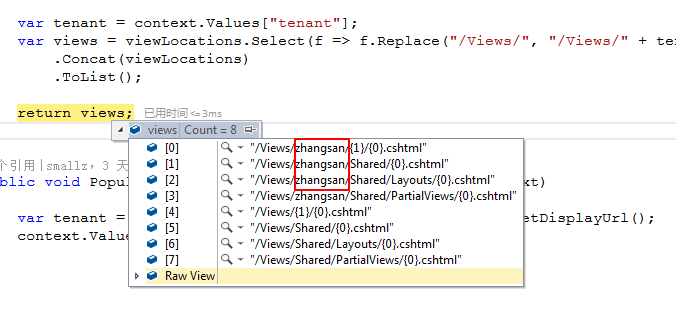

# ASP.NET Core MVC 视图

大多数ASP.NET MVC请求都要求将HTML标记提供给浏览器。从架构上讲，返回HTML标记的请求与返回纯文本或JSON数据的请求之间没有任何区别。但是，因为生成HTML标记有时可能需要大量工作（并且总是需要很大的灵活性），所以ASP.NET MVC提供了一个专用的系统组件 - 视图引擎 - 负责为浏览器生成纯HTML以进行处理。在这这个过程中，视图引擎混合应用程序数据和标记模板来创建HTML标记。

## 生成HTML内容

在ASP.NET Core中，应用程序可以通过各种方式为HTML提供服务，同时开发人员也可以对其进行越来越复杂的控制。

### 通过终止中间件生成HTML

ASP.NET Core应用程序可以是围绕某些终止中间件构建的非常简洁的Web服务器。终止中间件是处理请求的一段代码。基本上，它是一个处理HTTP请求的函数。通过它可以执行所有操作，下面的代码返回一段HTML字符串：

```c#
public class Startup
{
    public void Configure(IApplicationBuilder app)
    {
        app.Run(async (context) =>
        {
            string str = "<h1>Hello World!</h1><script>alert('ASP.NET Core!');</script>";
            await context.Response.WriteAsync(str);
        });
    }
}
```

 上述代码执行效果如下图所示：


### 从控制器生成HTML

ASP.NET Core应用程序利用MVC应用程序模型并使用控制器类，任何请求都被映射到控制器类上的一个方法。所选方法可以访问HTTP上下文，可以检查传入的数据，并确定要采取的操作。一旦方法收集了所有必要的数据，就可以准备响应了。 

#### 从Action方法中将HTML作为纯文本提供

下面的代码演示了控制器方法的模式，该方法以某种方式检索数据，然后将其格式化为有效的HTML布局。

```c#
public IActionResult Info(int id)
{
	var data = _service.GetInfoAsHtml(id);
	return Content(html, "text/html");
}
```

### 从Razor模板生成HTML

提供HTML内容的最常用方法是依靠模板文件来表示所需的布局，以及使用独立的引擎来解析模板，并使用实时数据填充它。在ASP.NET MVC中，Razor是用于表达类似HTML的模板的标记语言，而视图引擎是将模板呈现为可视化HTML的系统组件。

```c#
public IActionResult Info(int id)
{
   var model = _service.GetInfo(id);
   return View("template", model);
}
```

视图引擎由View函数调用触发，该函数返回一个对象，该对象将Razor模板文件的名称打包使用——一个扩展名为`.cshtml`的文件，以及一个包含在最终HTML布局中显示的数据的视图模型对象。

#### 从Razor Pages生成HTML

在ASP.NET Core 2.0中，Razor页面是另一种提供HTML内容的方式。基本上，它是关于拥有Razor模板文件，可以直接使用，而无需通过控制器和控制器操作。只要Razor页面文件位于Pages文件夹下，并且其相对路径和名称与URL匹配，那么视图引擎就会处理内容并生成HTML。

Razor页面和常规控制器驱动视图之间的最大区别在于，Razor页面可以是单个文件 ，非常类似于ASPX页面， 包含代码和标记。他们可以执行数据库访问，依赖注入，并且可以发布和重定向。然而，有了这些功能，与常规控制器驱动视图的差距非常小。


## 视图引擎

视图引擎是MVC应用程序模型的核心组件，负责从视图创建HTML。视图通常是HTML元素和C＃代码片段的混合。

### 调用视图引擎

在控制器方法中，您可以通过调用`View()`方法来调用视图引擎，如下所示：

```c#
public IActionResult Index()
{
	return View(); // same as View("index");
}
```

`View()`方法是一个负责创建`ViewResult`对象的辅助方法。 `ViewResult`对象需要了解视图模板，一个可选的主视图以及要合并到最终HTML中的原始数据。

#### View()方法

尽管在上述代码段中，方法`View()`没有参数，但这并不意味着没有实际传递数据。下面代码是该方法的完整声明：

```c#
protected ViewResult View(String viewName, String masterViewName, Object viewModel)
```

下面是一个更常见的控制器方法模式：

```c#
public IActionResult Index(...)
{
	var model = GetRawDataForTheView(...);
	return View(model);
}
```

在本例中，视图的名称默认为操作的名称，无论是从方法名称隐式推断还是通过`ActionName`属性显式设置。该视图是一个Razor文件(带有`.cshtml`扩展名)，位于Views项目文件夹下。主视图默认为一个名为`_Layout`的Razor文件。是基于视图的HTML布局。最后，变量模型指示要合并到模板中的数据模型以生成最终的HTML。

#### 处理ViewResult对象

`View()`方法将Razor模板、主视图和视图模型打包，以返回实现`IActionResult`接口的单个对象。该类被命名为`ViewResult`，并对处理Action方法后得到的结果进行抽象。当控制器方法返回时，还没有生成HTML，也没有写入输出流。

```c#
public interface IActionResult
{
	Task ExecuteResultAsync(ActionContext context);
}
```

如您所见，在其核心部分，`IActionResult`接口包含一个方法，该方法的自解释名称为`ExecuteResultAsync`。在`ViewResult`类内部，以及作为动作结果类的任何其他类中，都有一个处理嵌入数据以形成响应的逻辑

然而，`ExecuteResultAsync`方法的触发器不是控制器。当控制器返回时，动作调用程序获取动作结果并执行它。当`ViewResult`类的实例调用了`ExecuteResultAsync`方法时，将触发视图引擎以生成实际的HTML。

视图引擎是为浏览器物理构建HTML输出的组件。视图引擎开始处理每个请求，这些请求以返回HTML的控制器操作结束。它通过混合视图模板和控制器传入的任何数据来准备输出。

模板用特定于引擎的标记语言表示(例如Razor)，数据以字典或强类型对象的形式传递。

### Razor视图引擎 

在ASP.NET Core中，视图引擎只是一个实现固定接口的类——`IViewEngine`接口。每个应用程序都可以有一个或多个视图引擎，并在不同情况下使用所有这些引擎。然而，在ASP.NET Core中，每个应用程序都只有一个默认视图引擎 —— `RazorViewEngine`类。视图引擎对开发影响最大的方面是它支持定义视图模板的语法。

Razor语法非常简洁友好。视图模板本质上是一个带有一些代码占位符的HTML页面。每个占位符都包含一个可执行表达式 —— 非常类似于代码段。当视图呈现时，代码片段中的代码将被评估，生成的标记将集成到HTML模板中。代码片段可以用C＃或.NET Core平台支持的其他.NET语言编写。

注意：除了ASP.NET Core提供的`RazorViewEngine`类之外，还可以基于自定义语法实现自己的视图引擎。

#### Razor视图引擎的概述

Razor视图引擎从磁盘上的物理位置读取模板。任何ASP.NET Core项目都有一个名为Views的根文件夹，其中模板存储在子目录的特定结构中。 Views文件夹通常有一些子文件夹，每个子文件夹以现有控制器命名。每个特定于控制器的子目录都包含物理文件，其名称应与操作名称匹配。对于Razor视图引擎，扩展必须是`.cshtml`。（如果你在Visual Basic中编写ASP.NET Core应用程序，则扩展名必须为`.vbhtml`。）

ASP.NET MVC要求您将每个视图模板放在使用它的控制器命名的目录下。如果需要多个控制器调用相同的视图，那么可以将视图模板文件移动到共享文件夹下。

请务必注意，部署站点时，必须在生产服务器上复制在Views文件夹下项目级别存在的相同目录层次结构。

#### 视图模板的位置格式

Razor视图引擎定义了一些属性，通过这些属性你可以控制视图模板的位置。对于Razor视图引擎的内部工作来说，在默认项目配置和使用区域时都需要为主视图、常规视图和部分视图提供一个默认位置。

下表显示了Razor视图引擎所支持的具有预定义值的位置属性。 `AreaViewLocationFormats`属性是一个字符串列表，每个字符串都指向一个定义虚拟路径的占位符字符串。此外，`ViewLocationFormats`属性是一个字符串列表，其中包含的每个字符串都引用视图模板的有效虚拟路径。

Razor视图引擎的默认位置格式：

| 属性                      | 默认位置格式                          |
| ------------------------- | ------------------------------------- |
| `AreaViewLocationFormats` | `~/Areas/{2}/Views/{1}/{0}.cshtml`    |
|                           | `~/Areas/{2}/Views/Shared/{0}.cshtml` |
| `ViewLocationFormats`     | `~/Views/{1}/{0}.cshtml`              |
|                           | `~/Views/Shared/{0}.cshtml`           |

如您所见，位置不是完全限定的路径，但最多包含三个占位符。

- 占位符`{0}`引用视图的名称，因为它是从控制器方法调用的。
- 占位符`{1}`引用在URL中使用的控制器名称。
- 最后，如果指定，控制器`{2}`引用区域名称。

视图、部分视图和布局是相似的，系统以相同的方式处理和发现它们。要为部分视图或布局视图添加自定义视图位置，只需将其添加到`viewlocationformat`列表。

#### ASP.NET MVC中的Areas

Areas是MVC应用程序模型的一个特性，用于在单个应用程序的上下文中对相关功能进行分组。使用区域相当于使用多个子应用程序，它是将大型应用程序划分为更小的部分的一种方法。

区域提供的分区类似于名称空间，在MVC项目中，添加一个Area（可以从Visual Studio菜单中完成）会导致添加一个项目文件夹，其中包含一个独特的控制器、模型类型和视图列表。这允许您为应用程序的不同区域提供两个或多个`HomeController`类。区域划分由您决定，不一定是功能性的。您还可以考虑使用角色一对一的区域。

最后，Areas不再是技术性的或功能性的；相反，它们主要与项目和代码的设计和组织有关。当使用时，区域对路由有影响。区域的名称是常规路由中要考虑的另一个参数。有关更多信息，请参阅：

https://docs.microsoft.com/zh-cn/aspnet/core/mvc/controllers/areas?view=aspnetcore-2.1

#### 自定义位置格式

使用与默认配置不同的配置的主要原因始终是需要在特定文件夹中组织视图和部分视图，以便在视图和部分视图的数量超过几十个的情况下更简单、更快地检索文件。Razor视图可以按照任何一种命名约定给任意一个名称。虽然命名约定和自定义文件夹组织都不是严格要求的，但最终，这两种方法对管理和维护代码都很有用。

个人最喜欢的命名约定是在视图名称中使用前缀。例如，我所有的部分视图都以`pv_`开头，而布局文件以`layout_`开头。这保证即使在同一文件夹中找到了相当多的文件，它们也会按名称分组，很容易被发现。另外，我仍然希望有一些额外的子文件夹至少用于部分视图和布局。下面的代码显示了如何在ASP.NET Core中自定义视图位置。

```c#
public void ConfigureServices(IServiceCollection services)
{
    services.AddMvc()
        //自定义位置格式
        .AddRazorOptions(options =>
        {
            //清除当前的视图位置格式列表。 此时列表包含默认的视图位置格式。
            options.ViewLocationFormats.Clear();

            // {0} - Action Name
            // {1} - Controller Name
            // {2} - Area Name
            options.ViewLocationFormats.Add("/Views/{1}/{0}.cshtml");
            options.ViewLocationFormats.Add("/Views/Shared/{0}.cshtml");
            options.ViewLocationFormats.Add("/Views/Shared/Layouts/{0}.cshtml");
            options.ViewLocationFormats
                .Add("/Views/Shared/PartialViews/{0}.cshtml");
        });
}
```

对`Clear()`的调用清空了视图位置字符串的默认列表，以便系统只能根据自定义位置规则工作。下图显示了示例项目中显示的结果文件夹结构。请注意，现在只有位于`Views/Shared`或`Views/Shared/PartialViews`下才会发现部分视图，并且布局文件只在位于`Views/Shared`或`Views/Shared/Layouts`下才会被发现。


#### 视图位置扩展

视图位置格式是视图引擎的静态设置。在应用程序启动时定义视图位置格式，它们在整个生命周期中都是活动的。每次必须呈现视图时，视图引擎都会遍历已注册位置列表，直到找到包含所需模板的位置。如果未找到模板，则抛出异常。

相反，如果需要根据每个请求动态地确定视图的路径，该怎么做？例如，假设你有一个应用程序，它被多个客户同时作为服务使用，它们具有相同的代码基层（比如控制器，数据访问），但是每个用户都可以提供特定版本的视图，只是视图的样式或布局不同，针对这种情况的应用程序，一种常见方法是定义默认视图集合，然后允许客户添加自定义视图。例如，假设客户张三导航到视图`index.cshtml`并期望看到`Views/zhangsan/Home/index.cshtml`而不是`Views/Home/index.cshtml`中的默认视图。你会怎么编码？

在经典的ASP.NET MVC中，您必须创建一个自定义视图引擎，并覆盖逻辑才能找到视图。它的工作量并不大，只需几行代码， 但你必须改动自己的视图引擎，并了解它的内部结构。在ASP.NET Core中，view location expanders是一种用于动态解析视图的新型组件。视图位置扩展器是一个实现`IViewLocationExpander`接口的类。

```c#
public class MultiTenantViewLocationExpander : IViewLocationExpander
{
    public IEnumerable<string> ExpandViewLocations(ViewLocationExpanderContext context, IEnumerable<string> viewLocations)
    {
        if (!context.Values.ContainsKey("tenant") || 
            string.IsNullOrWhiteSpace(context.Values["tenant"]))
            return viewLocations;

        var tenant = context.Values["tenant"];
        var views = viewLocations.Select(f => f.Replace("/Views/", "/Views/" + tenant + "/"))
            .Concat(viewLocations)
            .ToList();

        return views;
    }

    public void PopulateValues(ViewLocationExpanderContext context)
    {
        var tenant = context.ActionContext.HttpContext.Request.GetDisplayUrl();
        context.Values["tenant"] = "zhangsan";  //tenant;
    }  
}
```

在`PopulateValues()`中，您可以访问HTTP上下文并确定将要使用的视图路径的键值。这可能是您以某种方式从请求URL中提取的租户的代码。用于确定路径的键值存储在视图位置扩展器上下文中。在`ExpandViewLocations`中，您接收当前视图位置格式列表，根据当前上下文进行适当的编辑并返回它。编辑列表通常意味着插入附加的和上下文相关的视图位置格式。

运行上述代码，可通过调试观察更改的结果：



特定于租户的位置格式已添加到列表顶部，这意味着任何被覆盖的视图将优先于任何默认视图。

自定义扩展器必须在启动阶段注册：

```c#
public void ConfigureServices(IServiceCollection services)
{
    services.AddMvc()
        .AddRazorOptions(options =>
        {
            options.ViewLocationExpanders.Add(new MultiTenantViewLocationExpander());
        });
}
```

注意，默认情况下，系统中未注册任何视图位置扩展器。

### 添加自定义视图引擎

自定义视图引擎基于IViewEngine接口，如下所示。

```c#
public interface IViewEngine
{
		ViewEngineResult FindView(ActionContext context, string viewName, bool isMainPage);
		ViewEngineResult GetView(string executingFilePath, string viewPath, bool isMainPage);
}
```

`FindView()`方法负责定位指定的视图，在ASP.NET Core中，它的行为很大程度上可以通过位置扩展器进行定制。相反，`GetView()`方法负责创建视图对象，即随后将呈现给输出流以捕获最终标记的组件。通常，没有必要重写`GetView`的行为，除非您需要做一些不寻常的事情，比如更改模板语言。 

目前，Razor语言和Razor视图基本上已经足够满足大多数需求，替代视图引擎的例子很少。然而，一些开发人员开始创建和发展使用Markdown (MD)语言来表达HTML内容的替代视图引擎。在我看来，这是真正拥有(或使用)自定义视图引擎的少数情况之一。

无论如何，如果您碰巧有一个定制的视图引擎，您可以通过`ConfigureServices`中的以下代码将其添加到系统中。

```c#
services.AddMvc()
        .AddViewOptions(options =>
            {
                options.ViewEngines.Add(new SomeOtherViewEngine());
            });
```

另外，请注意`RazorViewEngine`是ASP.NET Core中注册的唯一视图引擎。因此，上面的代码只是添加了一个新的引擎。如果要使用自己的引擎替换默认引擎，则必须在注册新引擎之前清空`ViewEngines`集合。

### Razor视图的结构

从技术上讲，视图引擎的主要目标是从模板文件生成视图对象并提供视图数据。然后，Action调用程序基础结构使用视图对象，并生成实际的HTML响应。因此，每个视图引擎都定义了自己的视图对象。让我们进一步了解由默认Razor视图引擎管理的视图对象。

#### 视图对象的概述

如上所述，视图引擎是由一个控制器方法触发，该方法调用基本控制器类的View方法以呈现特定视图。此时，Action调用程序 ——管理任何ASP.NET Core请求执行的系统组件 ——遍历已注册视图引擎的列表，并给每个引擎一次处理视图名称的机会。这是通过`FindView`方法的服务实现的。

视图引擎的`FindView`方法接收视图名称，并验证具有给定名称和适当扩展名的模板文件是否存在于其支持的文件夹树中。如果找到匹配项，就会触发`GetView`方法来解析文件内容并安排一个新的视图对象。最终，视图对象是实现`IView`接口的对象。

```c#
public interface IView
{
	string Path { get; }
	Task RenderAsync(ViewContext context);
}
```

动作调用程序只调用`RenderAsync`来生成HTML并写入输出流。

#### 解析Razor模板

Razor模板文件被解析为不同语言代码片段的静态文本。 Razor模板本质上是一个HTML模板，其中包含一些用C＃编写的代码块（或者通常是ASP.NET Core平台支持的任何语言）。任何C＃代码段都必须以`@`符号为前缀。示例Razor模板文件如下所示。  

```html
<!-- test.cshtml located in Views/Home -->

<h1>Hi everybody!</h1>
<p>It's @DateTime.Now.ToString("hh:mm")</p>
<hr>
Let me count till ten.
<ul>
@for(var i=1; i<=10; i++)
{
     <li>@i</li>
}
</ul>
```

模板文件的内容被拆分为两种类型的文本项列表：静态HTML内容和代码片段。

`@`符号用于告诉解析器在静态内容和代码片段之间发生转换的位置。然后根据支持语言的语法规则（在本例中为C＃语言）解析`@`符号后面的任何文本。

#### 从Razor模板构建View对象

在Razor模板文件中发现的文本项构成了动态构建完全代表模板的C＃类的基础。使用.NET平台（Roslyn）的编译器服务动态创建和编译C＃类。假设示例Razor文件名为`test.cshtml`并且它位于`Views/Home`中，以下是实际Razor视图类静默生成的代码：

```c#
public class _Views_Home_Test_cshtml : RazorPage<dynamic>
{
    public override async Task ExecuteAsync()
    {
        WriteLiteral("<h1>Hi everybody!</h1>\r\n<p>It\'s ");
        Write(DateTime.Now.ToString("hh:mm"));
        WriteLiteral("</p>\r\n<hr>\r\nLet me count till ten.\r\n<ul>\r\n");
        for(var i=1; i<=10; i++)
        {
            WriteLiteral("<li>");
            Write(i);
            WriteLiteral("</li>");
        }
        WriteLiteral("</ul>\r\n");
    }
}
```

该类继承自`RazorPage <T>`，后者又实现了`IView`接口。由于`RazorPage <T>`基页的预定义成员（可在`Microsoft.AspNetCore.Mvc.Razor`命名空间中获得），您可以使用对象访问Razor模板主体中的请求和您自己的数据，比如Html、Url、Model和ViewData。

通常情况下，Razor视图是由多个`.cshtml`文件组合而成的，比如视图本身、布局文件以及两个名为`_viewstart.cshtml`和`_viewimports.cshtml`的可选全局文件。

Razor系统中的全局文件：

| 文件名                | 描述                                                         |
| --------------------- | ------------------------------------------------------------ |
| `_ViewStart.cshtml`   | 包含在呈现任何视图之前运行的代码。您可以使用此文件添加应用程序中所有视图通用的任何配置代码。通常使用此文件为所有视图指定默认布局文件。`_ViewStart.cshtml`文件必须位于根视图文件夹中（和传统的ASP.NET MVC一样） |
| `_ViewImports.cshtml` | 包含要在所有视图中共享的Razor指令。您可以在不同的视图文件夹中拥有此文件的多个副本。其内容的范围影响同一文件夹或其以下的所有视图，除非文件的另一个副本存在于内部级别。（经典ASP.NET不支持此文件。但是，在经典ASP.NET中，使用web.config文件可以实现相同的目的） |

当涉及多个Razor文件时，编译过程分步进行。首先处理布局模板，然后是`_ViewStart`和实际视图。然后合并输出，使`_ViewStart`中的公共代码在视图之前呈现，视图输出布局中的内容。

上表中的文件是您可能需要运行ASP.NET Core MVC应用程序的全局唯一文件。在Visual Studio 2017中，一些预定义的应用程序模板会创建一些其他文件（例如`_ValidationScriptsPartial.cshtml`），除非您发现这些文件对您的目的有用，否则可以直接选择忽略它们。

#### Razor指令

Razor解析器和代码生成器的行为由一些可选指令驱动，您可以使用这些指令进一步配置渲染上下文。下表列出了常用的Razor指令。

常用的Razor指令：

| 指令        | 描述                                                         |
| ----------- | ------------------------------------------------------------ |
| `@using`    | 将命名空间添加到编译上下文。与C＃的using指令相同。`@using MyApp.Functions` |
| `@inherits` | 指示用于动态生成的Razor视图对象的实际基类。默认情况下，基类是`RazorPage <T>`，但是`@inherits`指令允许您使用自定义基类，而基类必须继承自`RazorPage <T>`。`@inherits MyApp.CustomRazorPage` |
| `@model`    | 指示用于向视图传递数据的类的类型。通过`@model`指令指定的类型成为`RazorPage <T>`的泛型参数`T`。如果未指定，则`T`默认为`dynamic`。`@model MyApp.Models.HomeIndexViewModel` |
| `@inject`   | 在视图上下文中注入绑定到给定属性名称的指定类型的实例。该指令依赖于系统的DI基础设施。`@inject IHostingEnvironment CurrentEnvironment` |

`@using`和`@model`指令几乎在任何Razor视图中都很常见。相反，`@inject`指令代表了Razor视图和ASP.NET Core的DI系统之间的连接点。通过`@inject`，您可以解析任何已注册的类型，并在视图中拥有它的新实例。注入的实例将通过动态生成的Razor视图代码中具有该名称的属性提供。

#### 预编译视图

在调用视图时，将动态生成和编译Razor视图。只有当系统检测到Razor视图模板已经被修改时，生成的程序集才会被缓存并删除。当检测到这一点时，视图将在第一次访问时重新生成和重新编译。

从ASP.NET Core 1.1开始，您可以选择预编译Razor视图，并将它们作为应用程序的程序集部署。预编译请求相对容易，包括手动或通过IDE的接口（如果支持）更改`.csproj`文件。您需要做的就是引用`Microsoft.AspNetCore.Mvc.Razor.ViewCompilation`包，并确保`.csproj`文件包含以下内容：

```xml
<PropertyGroup> 
  <TargetFramework>netcoreapp2.0</TargetFramework> 
  <MvcRazorCompileOnPublish>true</MvcRazorCompileOnPublish> 
  <PreserveCompilationContext>true</PreserveCompilationContext> 
</PropertyGroup>
```

总而言之，考虑预编译视图有两个原因。然而，决定这些原因的相关性取决于开发团队。如果部署预编译视图，则第一个访问给定视图的用户将更快地获得页面。其次，在执行预编译步骤时，任何未检测到的编译错误都会快速显示，并且可以立即修复。


## 向视图传递数据

将数据传递给Razor视图有三种不同的、非独占的方式。在ASP.NET Core中，还有第四种方式，通过`@inject`指令进行依赖注入。您可以使用`ViewData`或`ViewBag`，或者使用强类型视图模型类。

### 内置的词典

控制器将数据传递给视图的最简单方法是将任何信息填充到名称/值字典中。这可以通过两种方式来实现。

#### ViewData字典

`ViewData`是一个经典的名称/值字典。该属性的实际类型是`ViewDataDictionary`，它不是派生自系统的任何字典类型，但仍然公开.NET Core框架中定义的公共字典接口。

基类`Controller`类公开一个`ViewData`属性，该属性的内容自动刷新到视图后面的`RazorPage <T>`类的动态创建实例中。这意味着，存储在控制器`ViewData`中的任何值都可以在视图中使用。

```c#
public IActionResult Index()
{
    ViewData["PageTitle"] = "Hello";
    ViewData["Copyright"] = "(c) Dino Esposito";
    ViewData["CopyrightYear"] = 2017;
    return View();
}
```

`index.cshtml`视图不需要声明模型类型，只需要读取任何传递的数据。  

一般来说，只有在调用没有使用变量命名规则定义的名称时，才会使用`ViewData`进行访问。比如名称中带有减号。  

#### ViewBag动态对象

`ViewBag`是在基类`Controller`类上定义的另一个属性，其内容被自动刷新到视图类中。 `ViewBag`不同于`ViewData`，因为它允许直接编程访问属性，从而避免了`ViewData`支持的字典标准访问。这是一个例子：

```c#
public IActionResult Index()
{
    ViewBag.CurrentTime = DateTime.Now;
    ViewBag.CurrentTimeForDisplay = DateTime.Now.ToString("HH:mm");
    return View();
}
```

请注意，在`ViewBag`上使用索引器的任何访问都将失败，这将导致异常。换句话说，以下两个表达式不相同，而且只有前者有效。

```c#
//正确调用
ViewBag.CurrentTimeForDisplay = DateTime.Now.ToString("HH:mm");      // works
//错误使用
ViewBag["CurrentTimeForDisplay"] = DateTime.Now.ToString("HH:mm");   // throws
```

`ViewBag`在`Controller`基类上定义`为DynamicViewDat`a属性，而`DynamicViewData`是ASP.NET Core类型，定义如下：

```c#
namespace Microsoft.AspNetCore.Mvc.ViewFeatures.Internal
{
  public class DynamicViewData : DynamicObject 
  {
  ...
  }
}
```

C＃语言通过动态语言运行时（DLR）支持动态特性，`DynamicObject`类是其中的一部分。每当遇到对动态类型变量的引用时，c#编译器就会跳过类型检查并发出代码，这些代码可以归结为DLR来在运行时解析调用。这意味着即使在预编译视图的情况下，也只会在运行时发现错误(如果有的话)。

还有一个地方需要注意的是，`ViewBag`设置的内容会自动同步到`ViewData`字典的内容。这是因为`DynamicViewData`类的构造函数接收到`ViewData`字典的引用，并从一个相应的`ViewData`条目读写任何接收到的值。因此，下列表达式是等价的。

```c#
var p1 = ViewData["PageTitle"];
var p2 = ViewBag.PageTitle;
```

### 强类型视图模型

有些开发人员似乎不喜欢使用视图模型类，因为要编写更多的类，而且这样做需要一些预先考虑。但是，通常情况下，强类型的视图模型是将数据传递给视图的更好方法，因为它强制您作为开发人员将重点放在进出视图的数据流上。

与使用字典相比，视图模型类只是将数据传递给视图的一种不同方式。与视图模型类看起来像稀疏对象值的集合不同，数据被很好地安排在一个层次结构中，每个数据块都保留自己的真实类型。

#### 视图模型类参考

视图模型类是一个完全表示呈现到视图中的数据的类。类的结构应尽可能地匹配视图的结构。虽然可以重用，但一般而言，您应该针对每个Razor视图模板设置一个特殊视图模型类。

一个常见的错误是使用实体类作为视图模型类。例如，假设您的数据模型具有`Customer`类型的实体。如果视图允许您更改客户的国家/地区，那么您可能需要将视图传递给可供选择的国家/地区列表。通常，理想的视图模型是类似于以下类的类：

```c#
public class CustomerEditViewModel
{
   public Customer CurrentCustomer { get; set; }
   public IList<Country> AvailableCountries { get; set; }
}
```

唯一可以接受将实体模型直接传递给视图的情况是当您真正拥有CRUD视图时。但是，坦率地说，纯CRUD视图目前只存在于教程和摘要文章中。建议始终从通用基类开始创建视图模型类。这是一个简单而有效的起点。

```c#
public class ViewModelBase
{
    public ViewModelBase(string title = "")
    {
        Title = title;
    }
    public string Title { get; set; }
}
```

因为主要期望类对HTML视图进行建模，所以至少需要公开`Title`属性来设置页面的标题。只要您确定应用程序中所有页面共有的其他属性，就可以添加更多属性。此外，可以在视图模型基类中使用格式化方法，而不是在Razor视图中放置大量的c#代码。

#### 将数据流集中到视图中

下面是一个Razor代码片段。它只是一个DIV元素，它在内部呈现当前时间，并提供一个链接以导航回到上一页

```html
@model IndexViewModel
@using Microsoft.Extensions.Options;
@inject IOptions<GlobalConfig> Settings 
<div>
   <span>
      @DateTime.Now.ToString(Settings.Value.DateFormat)
   </span>
   <a href="@Model.ReturnUrl">Back</a>
</div>
```

视图中没有单一的数据流。数据实际上从三个不同的来源流入：视图模型（`Model`属性），注入的依赖项（`Settings`属性）以及对系统的`DateTime`对象的静态引用。

在Razor视图中应该避免直接使用静态引用甚至是DI注入的引用，因为它们会扩大数据流入的带宽。如果您正在寻找关于如何构建可维护视图的指导，那么您应该致力于只给每个视图提供一种获取其数据的方法:视图模型类。因此，如果视图需要静态引用或全局引用，只需将这些属性添加到视图模型类。

### 通过DI系统注入数据

在ASP.NET Core中，您还可以向视图中注入DI系统注册的任何类型的实例。您可以通过`@inject`指令来完成。如上所述，`@inject`指令添加了另外一个数据可以流到视图中的通道。


## Razor页面

在经典的ASP.NET MVC中，无法直接通过URL引用Razor模板。 URL可用于链接静态HTML页面或由控制器操作方法安排的HTML输出。 ASP.NET Core也不例外。但是，从ASP.NET Core 2.0开始，可以使用一个新特性—— Razor页面，它允许您直接通过URL调用Razor模板，而无需任何控制器中介。

### 发现Razor Pages背后的原理

我们来看看下面的代码：

```c#
public class HomeController
{
    public IActionResult About()
    {
       return View(); 
    }
    public IActionResult ContactUs()
    {
       return View(); 
    }
}
```

可以看到，没有数据从控制器传递到视图，在实际视图中几乎没有呈现逻辑。为什么要对这样一个简单的请求使用过滤器和控制器的开销呢？Razor页面就是为了这个目的。

### Razor Pages的实现

Razor页面的主要原因是，当你所需要的只是比静态HTML多一点，比包含所有基础结构的纯Razor视图少很多的时候，可以节省控制器的成本。 Razor页面可以支持相当高级的编程场景，例如访问数据库，发布表单，验证数据等。但是，如果这是您需要的，那么为什么要使用普通页面呢？

#### @page指令

以下代码显示了一个简单但功能强大的Razor页面的源代码。

```html
@page
@{
    var title = "Hello, World!";
}
<html>
  <head>
    <title>@title</title>
  </head>
  <body>
     <!-- Some relatively static markup -->
  </body>
</html>
```

Razor页面就像一个无布局的Razor视图，除了`@page`指令。 Razor页面完全支持Razor语法的所有方面，包括`@inject`指令和C＃语言。

`@page`指令对于将Razor视图转换为Razor页面至关重要，因为这个指令一旦被处理，它会指示ASP.NET Core基础结构将请求视为一个操作，即使它未绑定到任何控制器。注意`@page`指令必须是页面上的第一个Razor指令，这一点很重要，因为它会影响其他受支持的指令的行为。

#### 支持文件夹

Razor页面是位于新Pages文件夹下的普通`.cshtml`文件。 Pages文件夹通常位于根级别。在Pages文件夹中，可以有任意多级别的子目录，每个目录都可以包含Razor页面。换句话说，Razor页面的位置与文件系统目录中的文件位置基本相同。

注意：Razor页面不能位于Pages文件夹之外。

#### 映射到URL

调用Razor页面的URL取决于文件在Pages文件夹中的物理位置和文件的名称。名为`about.cshtml`的文件位于Pages文件夹中，可以作为`/about`访问。类似的，一个位于`Pages/Misc`下的名为`contact.cshtml`的文件可以作为`/misc/contact`访问。一般的映射规则是，获取Razor页面文件相对于Pages的路径并删除文件扩展名。

如果您的应用程序还有一个带有`Contact`操作方法的`MiscController`类，会发生什么？在这种情况下，当调用URL`/misc/contact`时，它会通过`MiscController`类还是Razor页面运行的？控制器将获胜。

~~另请注意，如果Razor页面的名称是index.cshtml，那么也可以在URL中删除名称index，并且可以通过/ index和via /来访问页面。~~

### 从Razor页面提交数据

所有的Razor页面都可以提交表单。

#### 向Razor页面添加表单

以下代码显示了带有表单的Razor页面，并说明了如何初始化表单并发布其内容。

```asp
@inject IContactRepository ContactRepo
@functions {
    [BindProperty]
    public ContactInfo Contact { get; set; }
    public void IActionResult OnGet()
    {
        Contact.Name = "";
        Contact.Email = "";
        return Page();
    }

    public void IActionResult OnPost()
    {
        if (ModelState.IsValid)
        {
            ContactRepo.Add(Contact);
            return RedirectToPage();
        }
        return Page();
    }
}

<html>
<body>
    <p>Let us call you back!</p> 
    <div asp-validation-summary="All"></div>
    <form method="POST">
      <div>Name: <input asp-for="ContactInfo.Name" /></div>
      <div>Email: <input asp-for="ContactInfo.Email" /></div>
      <button type="submit">SEND</button>
    </form>
</body>
</html>
```

该页面分为两个主要部分：标记区域和代码区域。标记区域是一个普通的Razor视图，具有Razor视图的所有特性，包括标记助手和HTML助手。代码区域包含用于初始化页面和处理提交数据的所有代码。

#### 初始化表单

`@functions`指令充当页面周围所有代码的容器。它通常由两种方法组成 ——`OnGet`和`OnPost`。调用前者来初始化标记的输入元素。调用后者来处理从表单提交的任何内容。

使用模型绑定层执行HTML输入元素和代码元素之间的绑定。使用`BindProperty`属性修饰，`Contact`属性在`OnGet`中初始化，并在HTML中呈现其值。当表单回发时，相同的属性包含（通过模型绑定）已提交的值。

#### 处理表单的输入

`OnPost`方法可以使用`ModelState`属性来检查错误， 如果一切正常，就会面临处理已提交数据的问题。如果检测到错误，则返回调用`page()`函数的页面，这会导致对相同URL的GET请求。

处理表单的输入实际上意味着访问数据库。您可以通过应用程序的`DbContext`对象或某个专用存储库直接访问数据库。在这两种情况下，对工具的引用都必须通过页面中的DI注入。同样，您可以使用`@inject`指令在Razor页面上下文中提供任何必要的信息。


------


#### 参考资源

- 《Programming ASP.NET Core》


本文后续会随着知识的积累不断补充和更新，内容如有错误，欢迎指正。

最后一次更新时间：2018-10-23


------


