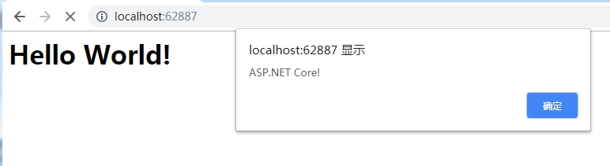
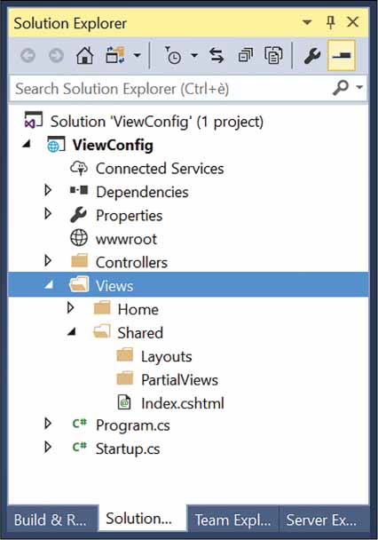
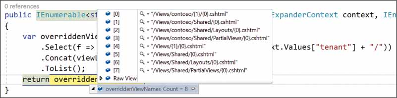
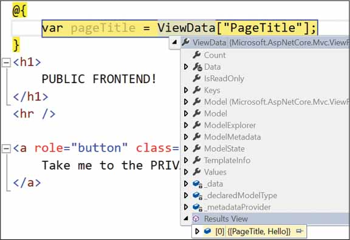

# ASP.NET Core MVC 视图

大多数ASP.NET MVC请求都要求将HTML标记提供给浏览器。从架构上讲，返回HTML标记的请求与返回纯文本或JSON数据的请求之间没有任何区别。但是，因为生成HTML标记有时可能需要大量工作（并且总是需要很大的灵活性），所以ASP.NET MVC提供了一个专用的系统组件 - 视图引擎 - 负责为浏览器生成纯HTML以进行处理。在这这个过程中，视图引擎混合应用程序数据和标记模板来创建HTML标记。

## 生成HTML内容

在ASP.NET Core中，应用程序可以通过各种方式为HTML提供服务，同时开发人员也可以对其进行越来越复杂的控制。

### 通过终止中间件生成HTML

ASP.NET Core应用程序可以是围绕某些终止中间件构建的非常简洁的Web服务器。终止中间件是处理请求的一段代码。基本上，它是一个处理HTTP请求的函数。通过它可以执行所有操作，下面的代码返回一段HTML字符串：

```c#
public class Startup
{
    public void Configure(IApplicationBuilder app)
    {
        app.Run(async (context) =>
        {
            string str = "<h1>Hello World!</h1><script>alert('ASP.NET Core!');</script>";
            await context.Response.WriteAsync(str);
        });
    }
}
```

 上述代码执行效果如下图所示：



### 从控制器生成HTML

ASP.NET Core应用程序利用MVC应用程序模型并使用控制器类，任何请求都被映射到控制器类上的一个方法。所选方法可以访问HTTP上下文，可以检查传入的数据，并确定要采取的操作。一旦方法收集了所有必要的数据，就可以准备响应了。 

#### 从Action方法中将HTML作为纯文本提供

下面的代码演示了控制器方法的模式，该方法以某种方式检索数据，然后将其格式化为有效的HTML布局。

```c#
public IActionResult Info(int id)
{
	var data = _service.GetInfoAsHtml(id);
	return Content(html, "text/html");
}
```

### 从Razor模板生成HTML

提供HTML内容的最常用方法是依靠模板文件来表示所需的布局，以及使用独立的引擎来解析模板，并使用实时数据填充它。在ASP.NET MVC中，Razor是用于表达类似HTML的模板的标记语言，而视图引擎是将模板呈现为可视化HTML的系统组件。

```c#
public IActionResult Info(int id)
{
   var model = _service.GetInfo(id);
   return View("template", model);
}
```

视图引擎由View函数调用触发，该函数返回一个对象，该对象将Razor模板文件的名称打包使用——一个扩展名为.cshtml的文件，以及一个包含在最终HTML布局中显示的数据的视图模型对象。

#### 从Razor Pages生成HTML

在ASP.NET Core 2.0中，Razor页面是另一种提供HTML内容的方式。基本上，它是关于拥有Razor模板文件，可以直接使用，而无需通过控制器和控制器操作。只要Razor页面文件位于Pages文件夹下，并且其相对路径和名称与URL匹配，那么视图引擎就会处理内容并生成HTML。

Razor页面和常规控制器驱动视图之间的最大区别在于，Razor页面可以是单个文件 ，非常类似于ASPX页面， 包含代码和标记。他们可以执行数据库访问，依赖注入，并且可以发布和重定向。然而，有了这些功能，与常规控制器驱动视图的差距非常小。


## 视图引擎

视图引擎是MVC应用程序模型的核心组件，负责从视图创建HTML。视图通常是HTML元素和C＃代码片段的混合。

### 调用视图引擎

在控制器方法中，您可以通过调用View()方法来调用视图引擎，如下所示：

```c#
public IActionResult Index()
{
	return View(); // same as View("index");
}
```

View()方法是一个负责创建ViewResult对象的辅助方法。 ViewResult对象需要了解视图模板，一个可选的主视图以及要合并到最终HTML中的原始数据。

#### View()方法

尽管在上述代码段中，方法View()没有参数，但这并不意味着没有实际传递数据。下面代码是该方法的完整声明：

```c#
protected ViewResult View(String viewName, String masterViewName, Object viewModel)
```

下面是一个更常见的控制器方法模式：

```c#
public IActionResult Index(...)
{
	var model = GetRawDataForTheView(...);
	return View(model);
}
```

在本例中，视图的名称默认为操作的名称，无论是从方法名称隐式推断还是通过ActionName属性显式设置。该视图是一个Razor文件(带有.cshtml扩展名)，位于Views项目文件夹下。主视图默认为一个名为_Layout的Razor文件。是基于视图的HTML布局。最后，变量模型指示要合并到模板中的数据模型以生成最终的HTML。

#### 处理ViewResult对象

View方法将Razor模板、主视图和视图模型打包，以返回实现IActionResult接口的单个对象。该类被命名为ViewResult，并对处理Action方法后得到的结果进行抽象。当控制器方法返回时，还没有生成HTML，也没有写入输出流。

```c#
public interface IActionResult
{
	Task ExecuteResultAsync(ActionContext context);
}
```

如您所见，在其核心部分，IActionResult接口包含一个方法，该方法的自解释名称为ExecuteResultAsync。在ViewResult类内部，以及作为动作结果类的任何其他类中，都有一个处理嵌入数据以形成响应的逻辑

然而，ExecuteResultAsync方法的触发器不是控制器。当控制器返回时，动作调用程序获取动作结果并执行它。当ViewResult类的实例调用了ExecuteResultAsync方法时，将触发视图引擎以生成实际的HTML。

视图引擎是为浏览器物理构建HTML输出的组件。视图引擎开始处理每个请求，这些请求以返回HTML的控制器操作结束。它通过混合视图模板和控制器传入的任何数据来准备输出。

模板用特定于引擎的标记语言表示(例如Razor);数据以字典或强类型对象的形式传递。

### Razor视图引擎 TODO

在ASP.NET Core中，视图引擎只是一个实现固定接口的类--IViewEngine接口。每个应用程序都可以有一个或多个视图引擎，并在不同情况下使用所有这些引擎。但是，在ASP.NET Core中，每个应用程序都只有一个默认视图引擎 - RazorViewEngine类。最影响开发的视图引擎的方面是它支持定义视图模板的语法。

Razor语法非常干净和友好。视图模板本质上是一个带有几个代码占位符的HTML页面。每个占位符都包含一个可执行表达式 - 非常类似于代码段。在呈现视图时评估片段中的代码，并将生成的标记集成到HTML模板中。代码片段可以用C＃或.NET Core平台支持的其他.NET语言编写。

注意除了ASP.NET Core提供的RazorViewEngine类之外，还可以基于自定义语法实现自己的视图引擎

#### Razor View引擎的一般性

Razor视图引擎从磁盘上的物理位置读取模板。任何ASP.NET Core项目都有一个名为Views的根文件夹，其中模板存储在子目录的特定结构中。 Views文件夹通常有一些子文件夹 - 每个子文件夹以现有控制器命名。每个特定于控制器的子目录都包含物理文件，其名称应与操作名称匹配。扩展必须是Razor视图引擎的.cshtml。 （如果您在Visual Basic中编写ASP.NET Core应用程序，则扩展名必须为.vbhtml。）

ASP.NET MVC要求您将每个视图模板放在使用它的控制器命名的目录下。如果需要多个控制器调用相同的视图，则将视图模板文件移动到共享文件夹下。

请务必注意，部署站点时，必须在生产服务器上复制在Views文件夹下项目级别存在的相同目录层次结构。

#### 查看位置格式

Razor视图引擎定义了一些属性，您可以通过这些属性控制视图模板的位置。对于Razor视图引擎的内部工作，有必要在默认项目配置和使用区域时为主视图，常规视图和部分视图提供默认位置。

下表中显示了Razor视图引擎支持的具有预定义值的位置属性。 AreaViewLocationFormats属性是一个字符串列表，每个字符串都指向一个定义虚拟路径的占位符字符串。此外，ViewLocationFormats属性是字符串列表，其中包含的每个字符串都引用视图模板的有效虚拟路径。

Razor视图引擎的默认位置格式：

| 属性                    | 默认位置格式                        |
| ----------------------- | ----------------------------------- |
| AreaViewLocationFormats | ~/Areas/{2}/Views/{1}/{0}.cshtml    |
|                         | ~/Areas/{2}/Views/Shared/{0}.cshtml |
| ViewLocationFormats     | ~/Views/{1}/{0}.cshtml              |
|                         | ~/Views/Shared/{0}.cshtml           |

如您所见，位置不是完全限定的路径，但最多包含三个占位符。

- 占位符{0}引用视图的名称，因为它是从控制器方法调用的。
- 占位符{1}引用在URL中使用的控制器名称。
- 最后，控制器{2}（如果指定）引用区域名称。

注意如果您熟悉经典的ASP.NET MVC开发，您可能会惊讶地发现，在ASP.NET Core中，没有像部分视图和布局的视图位置格式那样。通常，~~正如我们将在第6章中看到的那样~~，视图，局部视图和布局是相似的，并且系统以相同的方式对其进行处理和发现。这可能是这一决定背后的理由。因此，要为部分视图或布局视图添加自定义视图位置，只需将其添加到ViewLocationFormats列表即可。

#### ASP.NET MVC中的区域

区域是MVC应用程序模型的一个特征，用于在单个应用程序的上下文中对相关功能进行分组。使用区域与使用多个子应用程序相当，它是将大型应用程序划分为较小段的方法。

区域提供的分区类似于名称空间，在MVC项目中，添加区域（可以从Visual Studio菜单执行）会导致添加项目文件夹，其中包含不同的控制器，模型类型和视图列表。这允许您为应用程序的不同区域提供两个或更多HomeController类。区域划分取决于您，并不一定是功能性的。您还可以考虑使用与角色一对一的区域。

最后，领域不是技术或功能;相反，它们主要与项目和代码的设计和组织有关。使用时，区域会对路由产生影响。该区域的名称是传统路由中要考虑的另一个参数。有关更多信息，请参阅http://docs.microsoft.com/en-us/aspnet/core/mvc/controllers/areas。

#### 自定义位置格式

使用与默认配置不同的配置的主要原因始终是需要在特定文件夹中组织视图和部分视图，以便在视图和部分视图的数量超过几十个时更简单，更快速地检索文件。 Razor视图可以按照任何类型的命名约定赋予任何名称。虽然严格要求命名约定和文件夹的自定义组织，但最终两者都有助于管理和维护代码。

我最喜欢的命名约定是基于在视图名称中使用前缀。例如，我的所有部分视图都以pv_开头，而布局文件以layout_开头。这保证即使在同一文件夹中找到相当多的文件，它们也会按名称分组，并且可以轻松发现。此外，我仍然希望至少部分视图和布局有一些额外的子文件夹。下面的代码显示了如何在ASP.NET Core中自定义视图位置。

```c#
public void ConfigureServices(IServiceCollection services)
{
    services.AddMvc()
        //自定义位置格式
        .AddRazorOptions(options =>
        {
            //清除当前的视图位置格式列表。 此时列表包含默认的视图位置格式。
            options.ViewLocationFormats.Clear();

            // {0} - Action Name
            // {1} - Controller Name
            // {2} - Area Name
            options.ViewLocationFormats.Add("/Views/{1}/{0}.cshtml");
            options.ViewLocationFormats.Add("/Views/Shared/{0}.cshtml");
            options.ViewLocationFormats.Add("/Views/Shared/Layouts/{0}.cshtml");
            options.ViewLocationFormats
                .Add("/Views/Shared/PartialViews/{0}.cshtml");
        });
}
```

对Clear的调用清空了视图位置字符串的默认列表，以便系统仅根据自定义位置规则工作。下图显示了示例项目中显示的结果文件夹结构。请注意，现在只有位于Views / Shared或Views / Shared / PartialViews下才会发现部分视图，并且只有位于Views / Shared或Views / Shared / Layouts下才会发现布局文件。



#### 查看位置扩展器

查看位置格式是视图引擎的静态设置。您可以在应用程序启动时定义视图位置格式，并在整个生命周期内保持活动状态。每次必须呈现视图时，视图引擎都会遍历已注册位置的列表，直到找到包含所需模板的位置。如果未找到模板，则抛出异常。到现在为止还挺好。

相反，如果您需要基于每个请求动态确定视图的路径，该怎么办？如果它听起来像一个奇怪的用例，请考虑多租户应用程序。想象一下，您有一个同时被多个客户作为服务使用的应用程序。它始终是相同的代码库，并且它始终是相同的逻辑视图集，但每个用户可以提供特定版本的视图，可能采用不同的样式或使用不同的布局。

此类应用程序的常用方法是定义默认视图的集合，然后允许客户添加自定义视图。例如，假设客户Contoso导航到视图index.cshtml并期望看到Views / Contoso / Home / index.cshtml而不是Views / Home / index.cshtml中的默认视图。你会怎么编码？

在经典的ASP.NET MVC中，您必须创建自定义视图引擎并覆盖逻辑以查找视图。这不是一项大量的工作 - 只需几行代码 - 但你必须推出自己的视图引擎并学习很多内部知识。在ASP.NET Core中，视图位置扩展器是一种新类型的组件，用于动态分析视图。视图位置扩展器是实现IViewLocationExpander接口的类。

```c#
public class MultiTenantViewLocationExpander : IViewLocationExpander
{
    public IEnumerable<string> ExpandViewLocations(ViewLocationExpanderContext context, IEnumerable<string> viewLocations)
    {
        if (!context.Values.ContainsKey("tenant") || 
            string.IsNullOrWhiteSpace(context.Values["tenant"]))
            return viewLocations;

        var tenant = context.Values["tenant"];
        var views = viewLocations.Select(f => f.Replace("/Views/", "/Views/" + tenant + "/"))
            .Concat(viewLocations)
            .ToList();

        return views;
    }

    public void PopulateValues(ViewLocationExpanderContext context)
    {
        var tenant = context.ActionContext.HttpContext.Request.GetDisplayUrl();
        context.Values["tenant"] = "contoso";  //tenant;
    }  
}
```

在PopulateValues中，您可以访问HTTP上下文并确定将确定要使用的视图路径的键值。这很容易就是您从请求URL以某种方式提取的租户代码。用于确定路径的键值存储在视图位置扩展器上下文中。在ExpandViewLocations中，您将收到当前视图位置格式列表，根据当前上下文进行适当编辑，然后返回。编辑列表通常意味着插入其他特定于上下文的视图位置格式。

根据上面的代码，如果您从http://contoso.yourapp.com/home/index获得请求并且租户代码是“contoso”，则返回的视图位置格式列表可以如下图所示：



特定于租户的位置格式已添加到列表顶部，这意味着任何被覆盖的视图将优先于任何默认视图。

您的自定义扩展器必须在启动阶段注册：

```c#
public void ConfigureServices(IServiceCollection services)
{
    services.AddMvc()
        .AddRazorOptions(options =>
        {
            options.ViewLocationExpanders.Add(new MultiTenantViewLocationExpander());
        });
}
```

请注意，默认情况下，无视图位置扩展器已在系统中注册。

### 添加自定义视图引擎

在ASP.NET Core中，视图位置扩展器组件的可用性极大地减少了拥有自定义视图引擎的需要，至少需要自定义检索和处理视图的方式。自定义视图引擎基于IViewEngine接口，如下所示。

```c#
public interface IViewEngine
{
		ViewEngineResult FindView(ActionContext context, string viewName, bool isMainPage);
		ViewEngineResult GetView(string executingFilePath, string viewPath, bool isMainPage);
}
```

方法FindView负责定位指定的视图，在ASP.NET Core中，它的行为很大程度上可以通过位置扩展器进行定制。相反，方法GetView负责创建视图对象，即随后将呈现给输出流以捕获最终标记的组件。通常，除非您需要一些不寻常的东西，例如更改模板语言，否则无需覆盖GetView的行为。

目前，Razor语言和Razor视图在很大程度上足以满足大多数需求，并且备用视图引擎的示例很少见。但是，一些开发人员开始创建和发展使用Markdown（MD）语言表达HTML内容的备用视图引擎的项目。在我看来，这是真正拥有（或使用）自定义视图引擎的少数案例之一。

无论如何，如果您碰巧有自定义视图引擎，可以通过ConfigureServices中的以下代码将其添加到系统中。

```c#
services.AddMvc()
        .AddViewOptions(options =>
            {
                options.ViewEngines.Add(new SomeOtherViewEngine());
            });
```

另请注意，RazorViewEngine是ASP.NET Core中注册的唯一视图引擎。因此，上面的代码只是添加了一个新的引擎。如果要使用自己的引擎替换默认引擎，则必须在注册新引擎之前清空ViewEngines集合。

### Razor视图的结构

从技术上讲，视图引擎的主要目标是从模板文件生成视图对象并提供视图数据。然后，视图对象由动作调用程序基础结构使用，并导致生成实际的HTML响应。因此，每个视图引擎都定义了自己的视图对象。让我们了解一下默认Razor视图引擎管理的视图对象的更多信息。

#### 视图对象的一般性

如上所述，视图引擎由控制器方法触发，该方法调用基本控制器类的View方法以呈现特定视图。此时，动作调用程序 - 管理任何ASP.NET核心请求执行的系统组件 - 遍历已注册视图引擎的列表，并为每个人提供处理视图名称的机会。这通过FindView方法的服务发生。

视图引擎的FindView方法接收视图名称，并验证其支持的文件夹树中是否存在具有给定名称和到期扩展名的模板文件。如果找到匹配项，则触发GetView方法以解析文件内容并安排新的视图对象。最终，视图对象是实现IView接口的对象。

```c#
public interface IView
{
	string Path { get; }
	Task RenderAsync(ViewContext context);
}
```

动作调用者只是调用RenderAsync来生成HTML并将其写入输出流。

#### 解析Razor模板

解析Razor模板文件以将静态文本与语言代码片段分开。 Razor模板本质上是一个HTML模板，其中包含一些用C＃编写的编程代码块（或者通常是ASP.NET Core平台支持的任何语言）。任何C＃代码段都必须以@符号为前缀。示例Razor模板文件如下所示。  

```c#
<!-- test.cshtml located in Views/Home -->

<h1>Hi everybody!</h1>
<p>It's @DateTime.Now.ToString("hh:mm")</p>
<hr>
Let me count till ten.
<ul>
@for(var i=1; i<=10; i++)
{
     <li>@i</li>
}
</ul>
```

模板文件的内容被拆分为两种类型的文本项列表：静态HTML内容和代码片段。

@符号用于告诉解析器静态内容和代码片段之间发生转换的位置。然后根据支持语言的语法规则（在本例中为C＃语言）解析@符号后面的任何文本。

#### 从Razor模板构建View对象

在Razor模板文件中发现的文本项构成了动态构建完全代表模板的C＃类的基础。使用.NET平台（Roslyn）的编译器服务动态创建和编译C＃类。假设示例Razor文件名为test.cshtml并且它位于Views / Home中，以下是实际Razor视图类静默生成的代码：

```c#
public class _Views_Home_Test_cshtml : RazorPage<dynamic>
{
    public override async Task ExecuteAsync()
    {
        WriteLiteral("<h1>Hi everybody!</h1>\r\n<p>It\'s ");
        Write(DateTime.Now.ToString("hh:mm"));
        WriteLiteral("</p>\r\n<hr>\r\nLet me count till ten.\r\n<ul>\r\n");
        for(var i=1; i<=10; i++)
        {
            WriteLiteral("<li>");
            Write(i);
            WriteLiteral("</li>");
        }
        WriteLiteral("</ul>\r\n");
    }
}
```

该类继承自RazorPage <T>，后者又实现了IView接口。由于RazorPage <T>基页的预定义成员（可在Microsoft.AspNetCore.Mvc.Razor命名空间中获得），您可以使用明显魔术对象来访问Razor模板正文中的请求和您自己的数据。值得注意的例子是Html，Url，Model和ViewData。当我们讨论可用于生成HTML视图的Razor语法时，我们将在第6章中看到这些属性对象。Razor视图通常由多个.cshtml文件组合而来，例如视图本身，布局文件以及两个名为_viewstart.cshtml和_viewimports.cshtml的可选全局文件。这两个文件的作用解释如下。

Razor系统中的全局文件：

| 文件名              | 描述                                                         |
| ------------------- | ------------------------------------------------------------ |
| _ViewStart.cshtml   | 包含在呈现任何视图之前运行的代码。您可以使用此文件添加应用程序中所有视图通用的任何配置代码。您通常使用此文件为所有视图指定默认布局文件。此文件必须位于根视图文件夹中，并且在经典ASP.NET MVC中也受支持 |
| _ViewImports.cshtml | 包含要在所有视图中共享的Razor指令。您可以在各种视图文件夹中拥有此文件的多个副本。除非文件的另一个副本存在于内层，否则其内容的范围会影响同一文件夹或其下的所有视图。经典ASP.NET不支持此文件。但是，在经典ASP.NET中，使用web.config文件可以实现相同的目的 |

当涉及多个Razor文件时，编译过程分步进行。首先处理布局模板，然后是_ViewStart和实际视图。然后合并输出，以便在视图之前呈现_ViewStart中的公共代码，并且视图在布局中输出其内容。

上表中的文件是您可能需要运行ASP.NET Core MVC应用程序的全局文件。在Visual Studio 2017中，一些预定义的应用程序模板会创建一些其他文件（例如_ValidationScriptsPartial.cshtml），除非您发现它们对您的用途有用，否则您可以愉快而幸福地忽略这些文件。

#### Razor指令

Razor解析器和代码生成器的行为由一些可选指令驱动，您可以使用这些指令进一步配置渲染上下文。下表列出了常用的Razor指令。

最流行的Razor指令：

| 指令      | 描述                                                         |
| --------- | ------------------------------------------------------------ |
| @using    | 将命名空间添加到编译上下文。与C＃的using指令相同。@using MyApp.Functions |
| @inherits | 指示用于动态生成的Razor视图对象的实际基类。默认情况下，基类是RazorPage <T>，但是@inherits指令允许您使用自定义基类，而基类必须继承自RazorPage <T>。@inherits MyApp.CustomRazorPage |
| @model    | 指示用于将数据传递到视图的类的类型。通过@model指令指定的类型成为RazorPage <T>的泛型参数T.如果未指定，则T默认为动态。@model MyApp.Models.HomeIndexViewModel |
| @inject   | 在视图上下文中注入绑定到给定属性名称的指定类型的实例。该指令依赖于系统的DI基础设施。@inject IHostingEnvironment CurrentEnvironment |

@using和@model指令几乎在任何Razor视图中都很常见。相反，@ impject指令代表Razor视图和ASP.NET Core的DI系统之间的连接点。通过@inject，您可以解析任何已注册的类型，并在视图中有一个新的实例。注入的实例将通过动态生成的Razor视图代码中具有该名称的属性提供。

#### 预编译视图

在调用视图时，动态生成和编译Razor视图。仅当系统检测到Razor视图模板已被修改时，才会缓存和删除生成的程序集。检测到此情况时，将在第一次访问时重新生成并重新编译视图。

从ASP.NET Core 1.1开始，您可以选择预编译Razor视图并将它们作为程序集部署到您的应用程序中。预编译相对容易请求，包括手动或通过IDE的接口（如果支持）更改.csproj文件。您需要做的就是引用Microsoft.AspNetCore.Mvc.Razor.ViewCompilation包，并确保.csproj文件包含以下内容：

```xml
<PropertyGroup> 
  <TargetFramework>netcoreapp2.0</TargetFramework> 
  <MvcRazorCompileOnPublish>true</MvcRazorCompileOnPublish> 
  <PreserveCompilationContext>true</PreserveCompilationContext> 
</PropertyGroup>
```

总而言之，考虑预编译视图有两个原因。然而，确定这些原因的相关性取决于开发团队。如果部署预编译视图，则第一个访问给定视图的用户将更快地获得页面。其次，在完成预编译步骤时，任何未检测到的编译错误都会快速显示，并且可以立即修复。


## 将数据传递给视图

将数据传递到Razor视图有三种不同的非排他方式。在ASP.NET Core中，您还可以通过@inject指令进行第四次路径依赖注入。您可以使用两个内置词典中的一个 - ViewData和/或ViewBag - 或者使用强类型视图模型类。从纯粹的功能观点来看，这些方法之间没有差异，甚至从性能的角度来看，差异可以忽略不计。

但是，在设计，可读性以及随后的维护方面存在巨大差异。不同之处在于支持使用强类型视图模型类。

### 内置词典

控制器将数据传递给视图的最简单方法是将任何信息填充到名称/值字典中。这可以通过两种方式中的任何一种来完成。

#### ViewData字典

ViewData是一个经典的名称/值字典。该属性的实际类型是ViewDataDictionary，它不是从任何系统的字典类型派生的，但仍然公开.NET Core框架中定义的公共字典接口。

基本Controller类公开ViewData属性，该属性的内容自动刷新到视图后面的RazorPage <T>类的动态创建实例中。这意味着存储在控制器ViewData中的任何值都可以在视图中使用，而无需您做任何进一步的努力。

```c#
public IActionResult Index()
{
    ViewData["PageTitle"] = "Hello";
    ViewData["Copyright"] = "(c) Dino Esposito";
    ViewData["CopyrightYear"] = 2017;
    return View();
}
```

index.cshtml视图不需要声明模型类型，只能读回任何传递的数据。这是墙上的第一个裂缝出现的地方。负责编写视图的开发人员可能不了解通过字典传递的数据。她必须依赖内部文档和实时通信渠道，或者她可以放置断点并在Visual Studio中检查字典（参见图5-4）。在任何情况下，即使同一个人写控制器和视图，它也不会是愉快的体验。



外，考虑到因为ViewData条目是通过名称标识的（例如，魔术字符串），您的代码经常会出现拼写错误，在这种情况下，即使是预编译的视图也不能保护您免受意外的运行时异常或不可预测的错误内容的影响。使用常量而不是魔术字符串可以缓解这个问题，但代价是强制将这些常量的内部文档和传递给视图的整个数据集合。

ViewData字典是一个字符串/对象字典，这意味着您存储在其中的任何数据都作为通用对象公开。如果您只在相对较小的字典中显示视图中的内容，这可能不是什么大问题。对于大型字典，您可能会遇到装箱/拆箱性能问题。如果需要使用某些ViewData项进行比较或其他类型敏感操作，则必须在获取可用值之前执行类型转换。

使用像ViewData这样的弱类型字典的最令人信服的原因是编程的简单性和即时性。然而，这总是以使代码变得脆弱为代价，并且任何使其不那么脆弱的努力都不可避免地迫使您努力使用强类型类，而没有使用类所带来的固有清晰度。

重要虽然我们不建议在Web应用程序中广泛使用ViewData字典，但我们认识到在某些边缘情况下可以节省生命，例如当您发现更新强类型模型时会出现问题（例如，您不拥有源代码），仍然需要将其他数据传递给视图。如前所述，事实上，字典和视图模型可以一起使用。另一个棘手的场景是，当您将数据从视图传递到子部分视图时，有时可以将字典与强类型视图模型并排使用。当我们讨论部分视图时，我们将在第6章介绍这种情况。

#### ViewBag动态对象

ViewBag是在基本Controller类上定义的另一个属性，其内容自动刷新到视图类中。 ViewBag与ViewData不同，因为它允许对属性进行直接编程访问，从而避免了ViewData支持的字典标准访问。这是一个例子：

```c#
public IActionResult Index()
{
    ViewBag.CurrentTime = DateTime.Now;
    ViewBag.CurrentTimeForDisplay = DateTime.Now.ToString("HH:mm");
    return View();
}
```

请注意，在ViewBag上使用索引器的任何访问都将失败，这将导致异常。换句话说，以下两个表达式不相同，而且只有前者有效。

```c#
//正确调用
ViewBag.CurrentTimeForDisplay = DateTime.Now.ToString("HH:mm");      // works
//错误使用
ViewBag["CurrentTimeForDisplay"] = DateTime.Now.ToString("HH:mm");   // throws
```

这里有趣部分是ViewBag不包含任何像CurrentTime和CurrentTimeForDisplay这样的属性的定义。您可以在ViewBag对象引用旁边键入任何属性名称，C＃编译器永远不会抱怨。原因是ViewBag在Controller基类上定义为DynamicViewData属性，而DynamicViewData是ASP.NET Core类型，定义如下：

```c#
namespace Microsoft.AspNetCore.Mvc.ViewFeatures.Internal
{
  public class DynamicViewData : DynamicObject 
  {
  ...
  }
}
```

C＃语言通过动态语言运行时（DLR）支持动态功能，DynamicObject类是其中的一部分。每当遇到对动态类型变量的引用时，C＃编译器就会跳过类型检查并发出可归结为DLR的代码，以便在运行时解析调用。这意味着即使在预编译视图的情况下，也只会在运行时发现错误（如果有）。

ViewBag的另一个有趣的方面是它的内容自动同步到ViewData字典的内容。发生这种情况是因为DynamicViewData类的构造函数接收对ViewData字典的引用，只是从相应的ViewData条目读取和写入任何接收到的值。因此，以下表达式是等效的。

```c#
var p1 = ViewData["PageTitle"];
var p2 = ViewBag.PageTitle;
```

那么使用ViewBag有什么意义呢？总而言之，ViewBag显然很酷。它只是通过摆脱丑陋的基于字典的代码来对你的代码进行一些修改，而这样做是以牺牲任何读写的DLR解释代码为代价的。这样做，它允许您定义可能实际不存在的属性，因此它甚至不会在运行时将您从空引用异常中保存。

注意ViewBag等动态对象在从ASP.NET Core控制器和视图传递数据的上下文中没有多大意义，但在C＃中具有动态功能是非常有益的。例如，LINQ和社交网络API利用了该语言中的这种动态功能。

### 强类型视图模型

一些开发人员似乎讨厌使用视图模型类，因为它只是一堆更多的类来编写，这样做需要一些预见。但是，作为一般规则，强类型视图模型是将数据传递给视图的首选方法，因为它迫使您作为开发人员专注于进出视图的数据流。

与使用字典相比，视图模型类只是布置要传递给视图的数据的不同方式。使用视图模型类，数据不是看起来像稀疏对象值的集合，而是在分层结构中很好地布局，其中每个数据片段保留其自己的实际类型。

#### 视图模型类的准则

视图模型类是一个完全表示呈现到视图中的数据的类。类的结构应尽可能地匹配视图的结构。虽然一些重用总是可行的（并且在某种程度上是可取的），但一般而言，您应该针对每个Razor视图模板设置一个特殊视图模型类。

一个常见的错误是使用实体类作为视图模型类。例如，假设您的数据模型具有Customer类型的实体。您应该如何将数据传递到允许编辑客户记录的Razor视图？您可能想要将视图传递给您要编辑的Customer对象的引用。这可能是也可能不是一个好的解决方案。最后，这一切都取决于视图的实际结构和内容。例如，如果视图允许您更改客户的国家/地区，那么您可能需要将视图传递给可供选择的国家/地区列表。通常，理想的视图模型是类似于以下类的类：

```
public class CustomerEditViewModel
{
   public Customer CurrentCustomer { get; set; }
   public IList<Country> AvailableCountries { get; set; }
}
```

直接传递给视图的实体模型可以接受的唯一情况是你真的有一个CRUD视图。但是，坦率地说，现在纯CRUD视图仅存在于教程和摘要文章中。我建议您始终从通用基类开始创建视图模型类。这是一个简单而有效的起点。

```c#
public class ViewModelBase
{
    public ViewModelBase(string title = "")
    {
        Title = title;
    }
    public string Title { get; set; }
}
```

因为主要期望类对HTML视图进行建模，所以至少需要公开Title属性来设置页面的标题。只要您确定应用程序中所有页面共有的其他属性，就可以添加更多属性。此外，在视图模型基类中使用格式化方法是一个好主意，而不是在Razor视图中放置相同的大量C＃代码。

你应该从上面的ViewModelBase类派生所有的视图模型类吗？理想情况下，您应该为您使用的每个布局类都有一个基本视图模型类。这些视图模型类将使用特定布局的公共属性扩展ViewModelBase。最后，基于特定布局的每个视图将由从布局基础视图模型类派生的类的实例提供。

#### 将数据流集中到视图中

让我们来看看以下基本但仍然相关的Razor代码片段。它只是一个DIV元素，它在内部呈现当前时间，并提供一个链接以导航回到上一页

```c#
@model IndexViewModel
@using Microsoft.Extensions.Options;
@inject IOptions<GlobalConfig> Settings 
<div>
   <span>
      @DateTime.Now.ToString(Settings.Value.DateFormat)
   </span>
   <a href="@Model.ReturnUrl">Back</a>
</div>
```

视图中没有单一的数据流。数据实际上从三个不同的源流入：视图模型（Model属性），注入的依赖项（Settings属性）以及对系统的DateTime对象的静态引用。虽然完全没有妥协，但是在具有数百个视图且非常复杂的大型应用程序中处理上述方法的视图功能可能存在问题。

在Razor视图中应该避免直接使用静态引用甚至是DI注入的引用（ASP.NET Core的骄傲和喜悦），因为它们会扩大数据流入的带宽。如果您正在寻找有关如何构建的指导可维护的视图，那么你应该只为每个视图提供一种获取数据的方法：视图模型类。因此，如果您的视图需要静态引用或全局引用，只需将这些属性添加到视图模型类。特别是，当前时间可能只是可以添加到超级ViewModelBase类的一个属性。

### 通过DI系统注入数据

在ASP.NET Core中，您还可以向视图中注入DI系统注册的任何类型的实例。您可以通过@inject指令执行此操作。如上所述，@ inject指令增加了一个通道，数据可以通过该通道流入视图，从长远来看，这可能是一个容易维护代码的问题。

但是，对于短期应用程序或仅作为快捷方式注入视图的外部引用是一个完全支持的功能，欢迎您使用。无论不同设计可能带来什么好处，都应该注意ViewData字典和@inject指令一起提供了一种功能强大且极其快速的方法，可以在Razor视图中检索您可能需要的任何数据。这不是我申请或鼓励的做法，但它得到了支持，它绝对有效。


## Razor页面

在经典的ASP.NET MVC中，无法通过直接URL引用Razor模板。 URL可用于链接静态HTML页面或由控制器操作方法排列的HTML输出。 ASP.NET Core也不例外。但是，从ASP.NET Core 2.0开始，可以使用一个新功能 - Razor页面 - 允许您直接通过URL调用Razor模板，而无需任何控制器中介。

### 发现Razor Pages背后的基本原理

但是，有时您可以使用控制器方法来提供一些相当静态的标记。典型示例是标准网站的“关于我们”或“联系我们”页面。我们来看看下面的代码。

```c#
public class HomeController
{
    public IActionResult About()
    {
       return View(); 
    }
    public IActionResult ContactUs()
    {
       return View(); 
    }
}
```

如您所见，没有数据从控制器传递到视图，并且在实际视图中几乎不需要渲染逻辑。为什么要对这样一个简单的请求使用过滤器和控制器的开销？剃刀页面就是为了这个目的。

使用Razor页面的另一个场景是它们的使用在某种程度上降低了熟练的ASP.NET编程的障碍。我们来看看如何。

### Razor Pages的实现

Razor页面的主要原因是当你需要的只是静态HTML而不是一个完整的Razor视图及其所有基础设施时，可以节省控制器的成本。 Razor页面可以支持相当高级的编程方案，例如访问数据库，发布表单，验证数据等。但是，如果这是您需要的，那么为什么要使用普通页面呢？

#### @page指令

以下代码显示了一个简单但功能强大的Razor页面的源代码。 Razor代码过于简单并非巧合。

```c#
@page
@{
    var title = "Hello, World!";
}
<html>
  <head>
    <title>@title</title>
  </head>
  <body>
     <!-- Some relatively static markup -->
  </body>
</html>
```

Razor页面就像一个无布局的Razor视图，除了root指令 - @page指令。 Razor页面完全支持Razor语法的所有方面，包括@inject指令和C＃语言。

@page指令对于将Razor视图转换为Razor页面至关重要，因为它是一个经过处理的指令，它指示ASP.NET Core基础结构将请求视为操作，即使它未绑定到任何控制器。注意@page指令必须是页面上的第一个Razor指令是关键，因为它会影响其他受支持指令的行为。

#### 支持的文件夹

Razor页面是位于新Pages文件夹下的常规.cshtml文件。 Pages文件夹通常位于根级别。在Pages文件夹中，您可以拥有任意级别的子目录，每个目录都可以包含Razor页面。换句话说，Razor页面的位置与文件系统目录中的文件位置大致相同。

Razor页面不能位于Pages文件夹之外。

#### 映射到URL

调用Razor页面的URL取决于Pages文件夹中文件的物理位置以及文件名。名为about.cshtml的文件位于Pages文件夹中，可以作为/ about访问。同样，位于Pages / Misc下的名为contact.cshtml的文件可以作为/ misc / contact访问。一般映射规则是您获取Razor页面文件相对于Pages的路径并删除文件扩展名。

如果您的应用程序还有一个带有Contact操作方法的MiscController类，会发生什么？在这种情况下，当调用URL / misc / contact时，它是通过MiscController类还是Razor页面运行的？控制器将获胜。

另请注意，如果Razor页面的名称是index.cshtml，那么也可以在URL中删除名称索引，并且可以通过/ index和via /来访问页面。

### 从Razor页面发布数据

Razor页面的另一个现实场景是所有页面都可以发布表单。此功能非常适用于基本的基于表单的页面，例如contact-us页面。

#### 向Razor页面添加表单

以下代码显示了带有表单的Razor页面，并说明了如何初始化表单并发布其内容。

```asp
@inject IContactRepository ContactRepo
@functions {
    [BindProperty]
    public ContactInfo Contact { get; set; }
    public void IActionResult OnGet()
    {
        Contact.Name = "";
        Contact.Email = "";
        return Page();
    }

    public void IActionResult OnPost()
    {
        if (ModelState.IsValid)
        {
            ContactRepo.Add(Contact);
            return RedirectToPage();
        }
        return Page();
    }
}

<html>
<body>
    <p>Let us call you back!</p> 
    <div asp-validation-summary="All"></div>
    <form method="POST">
      <div>Name: <input asp-for="ContactInfo.Name" /></div>
      <div>Email: <input asp-for="ContactInfo.Email" /></div>
      <button type="submit">SEND</button>
    </form>
</body>
</html>
```

该页面分为两个主要部分：标记区域和代码区域。标记区域是一个常规的Razor视图，具有Razor视图的所有功能，包括标记帮助程序和HTML帮助程序。代码区包含初始化页面和处理其发布数据的所有代码。

#### 初始化表格

@functions指令充当页面周围所有代码的容器。它通常由两种方法组成 - OnGet和OnPost。调用前者来初始化标记的输入元素。调用后者来处理从表单发布的任何内容。

使用模型绑定层执行HTML输入元素和代码元素之间的绑定。使用BindProperty属性修饰，Contact属性在OnGet中初始化，其值以HTML格式呈现。当表单回发时，相同的属性包含（通过模型绑定）发布的值。

#### 处理表格的输入

OnPost方法可以使用ModelState属性来检查错误 - 整个验证基础结构的工作方式与在控制器方案中的工作方式相同 - 如果一切正常，则会面临处理发布数据的问题。如果检测到错误，则会回显调用页面调用Page（）函数，这会导致对同一URL的GET请求。

实际处理表单的输入意味着访问数据库。您可以通过应用程序的DbContext对象或通过某个专用存储库直接访问数据库。在这两种情况下，必须通过页面中的DI注入工具。同样，您可以使用@inject指令在Razor页面的上下文中提供任何必要的信息。

重要如果您查看Razor页面的文档，您会发现一些更多支持的选项和工具可用于更高级的方案。坦率地说，Razor页面的真正力量在于它们允许基本场景的快速覆盖。超出这个水平使得Razor页面的复杂性和控制器的复杂性几乎相同。并且控制器提供了更深层次的代码分层以及更多的关注点分离。除了这里讨论的复杂程度之外，在控制器上使用Razor页面只是个人偏好的问题。


## 概要

视图是Web应用程序的基础，在ASP.NET Core中，视图是处理模板文件的结果 - 通常是Razor模板文件 - 并将其与调用者提供的一些数据混合 - 通常但不一定是控制器 方法。 在本章中，我们首先讨论了视图引擎架构，然后深入研究了Razor视图的渲染。 接下来，我们继续比较将数据传递给视图的各种方法。 我们在本章结束时看了一下Razor页面，这些页面对于快速安排非常简单和基本的视图很有用; 它们也是从不同角度学习ASP.NET Core中的Web编程的工具。

本章包含许多Razor代码片段。 Razor是一种标记语言，其语法看起来像HTML，但允许多种扩展和特定功能。 


