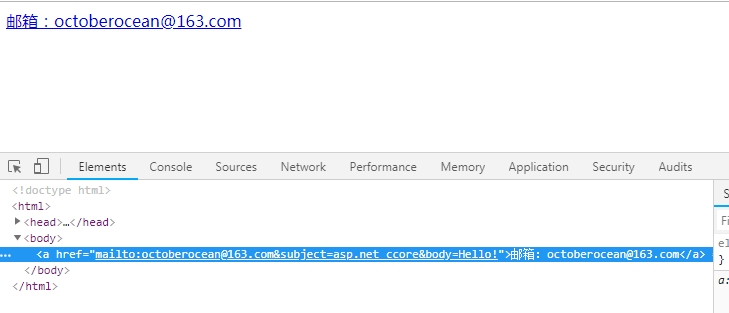

# ASP.NET Core Razor语法

ASP.NET Core自带一个默认视图引擎——Razor视图引擎。 Razor是用于定义应用程序HTML视图布局的标记语言。


## 语法元素

Razor文件是一个文本文件，包含两个主要语法项——HTML表达式和代码表达式。 HTML表达式是逐字生成的，相反，将计算代码表达式，并将其输出与HTML表达式合并。代码表达式是指预定义编程语言的语法。

编程语言是通过Razor文件的扩展来标识的。默认情况下，扩展名为.cshtml，表达式的编程语言为C＃。无论选择哪种编程语言，@字符总是表示Razor代码表达式的开始。

### 处理代码表达式

代码表达式可以是内联发出的直接值（例如，变量或普通表达式），也可以是由控制流元素（如循环和条件）组成的复杂语句。在Razor中，您必须始终指明代码片段的开头，但在此之后，内部解析器使用所选编程语言的语法来确定代码表达式的结束位置。

#### 内联表达式

示例一：

```html
<div>
   @CultureInfo.CurrentUICulture.DisplayName
</div>
```

在上述代码中，将计算CultureInfo.CurrentUICulture.DisplayName表达式，并将输出结果发送到输出流。

示例二：

```c#
@{
   var message = "Hello";
}
<div>
   @message
</div>
```

@message表达式输出message变量的当前值。在该示例中，我们看到另一个语法元素：@ {...}代码块。

#### 代码块

代码块允许多行语句，包括声明和计算。除非内容包含在标记标签中，否则@ {...}块的内容被认为是代码。标记标签主要是HTML标签。

示例：

```c#
@{
    var culture = CultureInfo.CurrentUICulture.DisplayName;
    Your culture is @culture
}
```

在这种情况下，代码块需要包含代码和静态标记。假设您希望发送给浏览器的标记是纯文本，周围没有任何的HTML元素，上面代码片段的最终效果是，解析器试图根据当前编程语言的语法来处理文本“Your culture is ...”。这可能会导致编译错误。

上述示例重写版：

```c#
@{
    var culture = CultureInfo.CurrentUICulture.DisplayName;
    <text>Your culture is @culture</text>
}
```

`<text>`标记可用于逐字标记一些静态文本，而不需要向响应呈现一些周围的标记元素。

##### 说明：

任何Razor代码片段都可以与普通标记混合使用，即使代码片段包含控制流语句（如if / else或for / foreach）也是如此。

示例：

```html
<body>
    <h2>My favorite cities</h2>
    <hr />
    <table>
        <thead>
           <th>City</th>
           <th>Country</th>
           <th>Ever been there?</th>
        </thead>
    @foreach (var city in Model.Cities) {
       <tr>
          <td>@city.Name</td>
          <td>@city.Country</td>
          <td>@city.Visited ?"Yes" :"No"</td>
       </tr>
    }
    </table>
</body>
```

注意，位于源代码中间的右花括号(可以在@foreach行中看到)被解析器正确地识别和解释。

可以使用圆括号将多个标记（例如，标记和代码）组合在同一表达式中：

```
<p> @("Welcome, " + user) </p>
```

你创建的任何变量都可以在以后检索和使用，就像代码属于单个块一样。

#### 输出编码

Razor中处理的任何内容都是自动编码的，这使得你的HTML输出非常安全，不需要额外的努力就能抵抗XSS脚本注入。记住这一点，并避免显式编码输出，因为它可能会导致双编码文本。

但是，在某些情况下，你的代码只需要发出未编码的HTML标记。在这种情况下，您可以使用Html.Raw辅助方法。如下：

```c#
Compare this @Html.Raw("<b>Bold text</b>")
to the following: @("<b>Bold text</b>")
```

#### HTML助手

HTML帮助程序是HtmlHelper类的扩展方法。抽象地说，HTML助手只不过是一个HTML工厂。在视图中调用方法，插入一些HTML是由提供的输入参数（如果有的话）产生的。在内部，HTML助手只是将标记累积到内部缓冲区中，然后输出它。视图对象在属性名Html下合并了HtmlHelper类的一个实例。

ASP.NET Core提供了一些现成的HTML帮助程序，包括CheckBox，ActionLink和TextBox。

HTML帮助程序方法：

| 方法名                                  | 类型       | 描述                                                         |
| --------------------------------------- | ---------- | ------------------------------------------------------------ |
| BeginForm, BeginRouteForm               | Form       | 返回一个内部对象，该对象表示系统用于呈现<form>标记的HTML表单 |
| EndForm                                 | Form       | void方法，关闭挂起的</ form>标记                             |
| CheckBox, CheckBoxFor                   | Input      | 返回复选框输入元素的HTML字符串                               |
| Hidden, HiddenFor                       | Input      | 返回隐藏输入元素的HTML字符串                                 |
| Password, PasswordFor                   | Input      | 返回密码输入元素的HTML字符串                                 |
| RadioButton, RadioButtonFor             | Input      | 返回单选按钮输入元素的HTML字符串                             |
| TextBox, TextBoxFor                     | Input      | 返回文本输入元素的HTML字符串                                 |
| Label, LabelFor                         | Label      | 返回HTML标签元素的HTML字符串                                 |
| ActionLink, RouteLink                   | Link       | 返回HTML链接的HTML字符串                                     |
| DropDownList, DropDownListFor           | List       | 返回下拉列表的HTML字符串                                     |
| ListBox, ListBoxFor                     | List       | 返回列表框的HTML字符串                                       |
| TextArea, TextAreaFor                   | TextArea   | 返回文本区域的HTML字符串                                     |
| ValidationMessage, ValidationMessageFor | Validation | 返回验证消息的HTML字符串                                     |
| ValidationSummary                       | Validation | 返回验证摘要消息的HTML字符串                                 |

使用HTML助手创建一个文本框示例：

```c#
@Html.TextBox("LastName", Model.LastName)
```

每个HTML帮助程序都有一堆重载，可以让您指定属性值和其他相关信息。

例如，以下是使用class属性设置文本框样式的方法：

```c#
@Html.TextBox("LastName", 
              Model.LastName, 
              new Dictionary<String, Object>{{"class", "myCoolTextBox"}})
```

在上表中，有许多用于助手的xxxFor方法。他们与其他助手有什么不同？ xxxFor帮助程序与基本版本不同，因为它只接受lambda表达式，如下所示：

```c#
@Html.TextBoxFor(model => model.LastName, 
                 new Dictionary<String, Object>{{"class", "myCoolTextBox"}})
```

对于文本框，lambda表达式指示要在输入字段中显示的文本。当将填充视图的数据分组到模型对象中时，xxxFor变体特别有用。在这种情况下，您的视图结果更易于阅读和强类型。

使用HTML助手有很强的优点和缺点。复杂的HTM助手需要你编写的更多C＃代码来传递参数，在某种程度上，HTML助手隐藏了渲染复杂标记的复杂性。但与此同时，仅仅因为标记结构作为开发人员隐藏，您就会丢失它的透视图，并将其作为黑盒使用。即使使用CSS对内部块进行样式化也需要进行设计，因为CSS属性必须在API中公开。

尽管ASP.NET Core中完全支持HTML帮助程序，但它们的使用比几年前更不具吸引力。 ASP.NET Core提供了标记帮助程序（稍后参阅）作为一种额外的工具，以灵活和富有表现力的方式呈现复杂的HTML。就个人而言，我最近没有使用过HTML帮助程序，只有一个例外 - CheckBox助手。

#### 布尔值和复选框的奇怪情况

假设您在HTML表单中有一个复选框。一个很好的例子是规范登录表单的“记住我”复选框。如果您不使用CheckBox帮助程序，那么最终使用纯HTML，如下所示：

```html
<input name="rememberme" type="CheckBox" />
```

根据HTML标准，如果选中复选框，浏览器将发布以下内容。

```
rememberme=on
```

如果未选中该复选框，则忽略输入字段而不发送。此时，模型绑定如何处理已提交的数据？模型绑定层被指示将其理解为true，但是如果不为RememberMe的名字赋值，那么它就不能做太多事情了! CheckBox帮助程序会以相同的remember名称默默地附加一个输入隐藏元素，并将其设置为false。但是，如果选中该复选框，则会为相同的名称提交两个值，但是在本例中，模型绑定层只获取第一个值。

#### 注释

当您使用@ {...}在多行代码片段内工作时，可以使用语言语法来进行注释。如果要对标记块进行注释，请使用@ * ... * @语法。如下所示：

```c#
@*
	<div> Some Razor markup </div>
*@
```

### 布局模板

在Razor中，布局模板扮演着母版页的角色。布局模板定义视图引擎将围绕任何映射视图呈现的框架，从而为站点的这些部分提供统一的外观。

每个视图都可以通过设置父视图类的Layout属性来定义自己的布局模板。布局可以设置为硬编码文件，也可以设置为评估运行时条件产生的任何路径。可以使用_ViewStart.cshtml文件为Layout属性指定一个默认属性，从而为所有视图定义一个默认的图形模板。

#### 布局参考

从技术上讲，布局模板与视图(或部分视图)没有任何不同，其内容由视图引擎以相同的方式解析和处理。然而，与大多数视图（以及所有部分视图）不同的是，布局模板是一个完整的HTML模板，以`<html>`元素开头并以`</html>`元素结束。

注意，视图不需要将布局设置为不同的资源。最后，Razor引擎以相同的方式处理布局和常规视图，这意味着一个由HTML元素包装的完整HTML页面视图模板是可以接受的。

因为布局文件是一个完整的HTML模板，所以它应该包含一个全面的HEAD块，其中提供了元信息（以及favicons和常用的CSS和JavaScript文件）。您可以将脚本文件放在HEAD部分或视图正文的末尾。模板的主体为所有派生视图定义布局。一个典型的布局模板包含页眉，页脚和侧栏。这些元素中显示的内容由所有视图继承，可以静态设置为纯本地化文本，也可以从传递的数据绑定。 

注意：在任何视图中，建议通过使用波浪号操作符（~）引用网站的根目录来引用图像、脚本和样式表等资源。在ASP.NET Core中，请注意，只有在Razor引擎解析的代码块中才会出现波浪号操作符（~）。它不能在纯HTML文件中工作(带有. HTML扩展名)，也不能在Razor文件的所有<script>元素中使用。要么将路径表示为代码块，要么使用一些JavaScript技巧来修复URL。

#### 将数据传递给布局

编程上，开发人员只引用一个视图及其视图模型。在经典ASP.NET中，Controller类的View方法也有一个重载，允许您通过代码设置布局。 ASP.NET Core中没有公开该重载。当视图引擎确定正在渲染的视图具有布局时，首先解析布局的内容，然后将其与视图模板合并。

布局可以定义它希望接收的视图模型的类型，但它真正接收的是视图模型对象 ——如果有传递给实际视图的话。因此，布局视图的视图模型必须是用于视图的视图模型的父类。因此，建议对于每个布局，都定义一个特别的视图模型基类，并从中为实际视图派生特定的视图模型类。

布局和视图模型类：

| View Model                | Layout           | desc                               |
| ------------------------- | ---------------- | ---------------------------------- |
| HomeLayoutViewModel       | HomeLayout       | 基于HomeLayout模板的视图模型       |
| InternalLayoutViewModel   | InternalLayout   | 基于InternalLayout模板的视图模型   |
| BackofficeLayoutViewModel | BackofficeLayout | 基于BackofficeLayout模板的视图模型 |

所有布局视图模型类都将从单个父类继承，例如ViewModelBase类。布局视图和其他视图一样，仍然可以通过依赖注入和字典传递数据。

#### 定义自定义部分

对于外部视图内容，任何布局都必须至少有一个注入点。这个注入点包括对方法RenderBody的调用。该方法在用于呈现布局和视图的基视图类中定义。但有时，需要向多个位置注入内容。下述代码中，在布局模板中定义了一个或多个命名部分，并让视图使用标记来填充它们。

```HTML
<body>
   <div class="page">
    @RenderBody()
   </div>
   <div id="footer">
      @RenderSection("footer")
   </div>
</body>
```

每个部分都按名称标识，除非被标记为可选，否则认为是必需的。 RenderSection方法接受一个可选的Boolean参数，该参数表示该部分是否是必需的。要声明一个可选的部分，您可以执行以下操作：

```html
<div id="footer">
	@RenderSection("footer", false)
</div>
```

以下代码在功能上等同于前面的代码，但从可读性的角度来看它更好：

```html
<div id="footer">
	@RenderSection("footer", required:false)
</div>
```

注意，required不是关键字，它是RenderSection方法定义的形式参数的名称。 您可以使用的自定义部分的数量没有限制。如果在视图中填充后，生成的HTML是有效的，则可以在布局中的任何位置使用自定义部分。

如果视图模板不包含需要标记的部分，则会出现运行异常。以下是如何在视图模板中定义部分内容：

```asp
@section footer {
    <p>Written by Dino Esposito</p>
}
```

您可以在Razor视图模板的任何地方为某个部分定义内容。

### 部分视图

部分视图是包含在视图中的一个单独的HTML片段，但它被视为一个完全独立的实体。事实上，为一个视图引擎编写视图和需要另一个视图引擎的引用部分视图是合法的。部分视图类似于HTML子项，应用于两个主要场景：具有可重用的仅限UI的HTML片段，并将复杂视图分解为更小且更易于管理的部分。部分视图是可重用的，但它几乎不是一个独立的HTML片段。

#### 解析复杂视图

部分视图的使用可以将大而复杂的表单分解成更易于管理的部分。大型表单，尤其是多步表单，变得越来越常见，如果没有部分视图，它们的表达和处理可能会有问题。

```html
<form class="form-horizontal" id="largeform"
      role="form" method="post"
      action="@Url.Action("largeform", "sample")">
     <div>
        <!-- Nav tabs -->
        <ul class="nav nav-tabs" role="tablist">
            @Html.Partial("pv_largeform_tabs")
            <li role="presentation" class="active">
               <a href="#tabGeneral" role="tab" data-toggle="tab">General</a>
            </li>
            <li role="presentation">
               <a href="#tabEmails" role="tab" data-toggle="tab">Emails</a>
            </li>
            <li role="presentation">
               <a href="#tabPassword" role="tab" data-toggle="tab">Password</a>
            </li>
        </ul>

        <!-- Tab panes -->
        <div class="tab-content">
            <div role="tabpanel" class="tab-pane active" id="tabGeneral">
                @Html.Partial("pv_largeform_general")
            </div>
            <div role="tabpanel" class="tab-pane" id="tabEmails">
                @Html.Partial("pv_largeform_emails")
            </div>
            <div role="tabpanel" class="tab-pane" id="tabPassword">
                @Html.Partial("pv_largeform_password")
            </div>
        </div>
    </div>
</form>
```

如果您必须编写这样的表单，而不使用分部类，您将在主视图中嵌入一个选项卡的整个标记。假设每个选项卡都可以是它自己的简单视图，那么在一个位置上的标记量(写、读和编辑)是非常巨大的。在此上下文中使用的部分视图很难重用，但它们非常有效地为您服务。

#### 将数据传递给部分视图

视图引擎像处理其他视图一样处理部分视图。因此，部分视图接收数据的方式与常规视图或布局相同。您可以使用强类型视图模型类或词典。但是，如果未将调用中的任何数据传递给部分视图，则部分视图将接收传递给父视图的强类型视图模型。

```
@Html.Partial("pv_Grid")
```

视图词典的内容始终在父视图及其所有部分视图之间共享。如果局部视图被传递给它自己的视图模型，那么它将失去对父视图的视图模型的引用。

下述代码中，父视图接收一组数据对象并在列表中循环。然后将每个数据对象传递给部分视图以进行呈现。

```c#
@foreach(var customer in Model.Customers)
{
	@Html.Partial("pv_customer", customer)
}
```

现在，客户详细信息的呈现完全被转载到pv_customer视图中，这使得它成为应用程序中呈现客户详细信息的惟一方式。到现在为止还挺好。如果您需要将更多信息传递给它所接收的客户数据对象中不可用的部分视图，该怎么办?你有几个选择。

- 首先，您可以重构所涉及的类，以便部分视图接收所需的全部数据。然而，这种方法可能会损害部分视图的整体可重用性。
- 其次，您可以使用一个匿名类型来连接原始数据对象和其他数据。
- 最后，您可以通过ViewData传递任何额外的数据。


## Razor标签助手

使用HTML助手，您可以通过编程方式表达您希望拥有的标记，而无需完全编写它。在某种程度上，HTML Helper是一个智能的HTML工厂，您可以将它配置为输出某些特定的HTML片段。在内部，Helpers由C＃代码组成，在外部，它们作为C＃代码段添加到Razor模板中。

### 使用Tag Helpers

Tag Helpers是服务器端代码，可以绑定到一个或多个标记元素，在运行时，可以检查元素的DOM，并可能更改发出的标记。Tag Helper是编译为程序集的C＃类，需要识别特殊的视图指令。

#### 注册Tag Helpers

Razor视图中的@addTagHelper指令指示解析器链接指定的类，并根据其内容处理未知标记属性和元素。

```
@addTagHelper *, YourTagHelperLibrary
```

上面的语法链接在当前视图中是YourTagHelperLibrary程序集中所有类的潜在标记助手。如果指定的是类型名称而不是*符号，那么只会从指定的程序集中选取这个类。如果插入一个ViewImports.cshtml文件，@ addTagHelper指令将自动添加到正在处理的任何Razor视图中。

#### 将Tag助手附加到HTML元素

初看起来，标记助手可以被视为自定义HTML属性或Razor解析器处理的自定义HTML元素。下面示例是如何使用Tag助手。

```html

```

这是另一个例子：

```html
<environment names="Development">
    <script src="~/content/scripts/yourapp.dev.js" />
</environment>

<environment names="Staging, Production">
    <script src="~/content/scripts/yourapp.min.js" asp-append-version="true" />
</environment>
```

注册为Tag助手的程序集告诉Razor解析器，应该在服务器端处理标记表达式中的哪些属性和元素，以便为浏览器生成实际的标记。在Visual Studio中还会使用特殊颜色强调标识为标记帮助程序的属性和元素。

特别是，asp-append-version标记助手修改了绑定元素，将时间戳添加到引用文件的URL，这样浏览器就不会缓存它。这是为上面的IMG元素生成的实际标记：

```html

```

版本查询字符串参数被自动附加，它被计算为文件内容的散列。这表示每当文件更改时，都会生成一个新的版本字符串，从而使浏览器的缓存失效。这个简单的解决方案修复了一个长期存在的问题:每当外部资源(如图像、样式表或脚本文件)发生更改时，在开发过程中清除浏览器的缓存。

注意，如果引用的文件不存在，则不会输出版本字符串。相反，环境标记帮助程序根据当前检测到的ASP.NET Core托管环境有条件地输出标记。每个标记助手都配置为绑定到特定的HTML元素。可以将多个标记助手附加到同一个HTML元素。

### 内置标签助手

ASP.NET Core附带了一个包含预定义标记助手的包。所有这些都定义在你可能从_ViewImports.cshtml文件中引用的同一个程序集中，它保证内置的助手可以用于所有的Razor视图。

```c#
@addTagHelper *, Microsoft.AspNetCore.Mvc.TagHelpers
```

内置标签助手涵盖了一系列功能。例如，有一些元素会影响到Razor模板中相同的HTML元素：FORM，INPUT，TEXTAREA，LABEL和SELECT。还有许多其他的助手用于验证要显示给用户的消息。所有这些系统的标记助手都共享asp- *名称前缀。 

#### 标签助手的一般结构

标签助手类是由HTML元素或它可以引用的HTML元素来标识。标记助手类主要由实现实际行为时使用的公共属性和私有方法组成。每个公共属性都可能被修饰为与之关联的标记助手属性的名称。

示例，这里是锚标记助手的C＃类声明：

```c#
[HtmlTargetElement("a", Attributes = "asp-action")]
[HtmlTargetElement("a", Attributes = "asp-controller")]
[HtmlTargetElement("a", Attributes = "asp-area")]
[HtmlTargetElement("a", Attributes = "asp-fragment")]
[HtmlTargetElement("a", Attributes = "asp-host")]
[HtmlTargetElement("a", Attributes = "asp-protocol")]
[HtmlTargetElement("a", Attributes = "asp-route")]
[HtmlTargetElement("a", Attributes = "asp-all-route-data")]
[HtmlTargetElement("a", Attributes = "asp-route-*")]
public class AnchorTagHelper : TagHelper, ITagHelper
{
   ...
}
```


#### 锚标记助手

锚标记助手适用于A元素，并允许您以极大的灵活性指定它指向的URL。实际上，您可以通过按路由名称将目标URL分解为区域控制器-操作组件来指定目标URL，甚至可以指定URL的片段，例如主机、片段和协议。

注意，如果同时指定了href属性和route属性，则helper类将抛出异常。

#### Form标签助手

表单标签助手支持通过控制器和操作名称或路由名称设置操作URL的属性。

```html
<form asp-controller="room" asp-action="book">
   ...
</form>
```

上面的Razor代码将method属性设置为POST，将action属性设置为由指定控制器和操作的组合产生的URL。此外，表单标记助手做了一个有趣而棘手的事情，它会为一个隐藏字段注入一个定制的请求验证令牌，以防止跨站点请求伪造（XSRF）攻击。

```html
<form method="POST" action="/room/book"
   <input name="__RequestVerificationToken" type="hidden" value="..." />
   ...
</form>
```

此外，它还添加了一个cookie，该cookie的加密版本存储在字段中。这代表了对XSRF攻击的强大防御，只要您还使用服务器端属性装饰接收控制器，如下所示。

```c#
[AutoValidateForgeryToken]
public class RoomController : Controller
{
   ...
}
```

AutoValidateForgeryToken属性将读取请求验证cookie，对其进行解密，并将其值与请求验证隐藏字段的value属性的内容进行比较。如果未找到匹配项，则抛出异常。如果没有AutoValidateForgeryToken属性，则不执行双重检查。通常，您可能希望在控制器级别使用该属性，或者更好的是，将其用作全局过滤器。在这种情况下，如果只对某些方法禁用它，可以使用IgnoreValidateForgeryToken属性。

注意在ASP.NET Core中，还有一个类似的属性，名为ValidateForgeryToken。与AutoValidateForgeryToken的区别在于后者仅检查POST请求。

#### 输入标签助手

输入标签助手将input元素绑定到模型表达式。绑定通过asp-for属性进行。注意，asp-for属性也适用于label元素。

```html
<div class="form-group">
    <label class="col-md-4 control-label" asp-for="Title"></label>  
    <div class="col-md-4">
        <input class="form-control input-lg" asp-for="Title">
    </div>
</div>
```

input元素的asp-for属性根据表达式生成name，id，type和value属性。在示例中，值Title引用绑定视图模型上的匹配属性。对于label元素，asp-for属性设置for属性和可选的标签内容。结果如下。

```html
<div class="form-group">
    <label class="col-md-4 control-label" for="Title">Title</label>    
    <div class="col-md-4">
        <input class="form-control input-lg" 
               type="text" id="Title" name="Title" value="...">
    </div>
</div>
```

要确定最合适的字段类型，asp-for属性还会查看可能在视图模型类中定义的数据注解。如果已在标记中指定，则不会覆盖受影响的属性。此外，基于数据注解，asp-for属性可以生成从错误消息和验证规则读取的HTML5验证属性。这些data- * validation属性由验证标记助手使用，如果配置为jQuery验证，则由客户端验证使用。

最后，值得注意的是，如果视图模型结构发生了变化， 并且标记助手表达式没有更新，那么编译时就会产生错误。

#### 验证标记助手

验证标记助手有两种类型，验证单个属性和summary。特别是，验证消息助手会使用span元素上的asp-validation-for属性的值。

```html
<span asp-validation-for="Email"></span>
```

SPAN元素设置为相应的HTML5验证消息，电子邮件输入字段可能有输出。如果应该呈现任何错误消息，它们将作为SPAN元素的主体呈现。 

```html
<div asp-validation-summary="All"></span>
```

相反，验证summary助手使用DIV元素的asp-validation-summary属性。它的输出是一个ul元素，列出了表单中的所有验证错误。属性的值确定列出哪些错误。可行值为All，表示列出所有错误；ModelOnly表示仅列出模型错误。

#### select列表标记助手

特别有趣的是select元素的标记助手，因为它现在解决了Web开发人员长期存在的一个问题：找到将枚举类型绑定到下拉列表的最简洁有效的方法。

```html
<select id="room" name="room" class="form-control"
        asp-for="@Model.CurrentRoomType"
        asp-items="@Html.GetEnumSelectList(typeof(RoomCategories))">
</select>
```

在select元素中，asp-for指向一个要计算的表达式，以便在列表中找到选中的项。相反，asp-items属性提供了项的列表。新的Html.GetEnumSelectList扩展方法接收枚举类型，并将其序列化为SelectListItem对象列表。

```c#
public enum RoomCategories
{
    [Display(Name = "Not specified")]
    None = 0,
    Single = 1,
    Double = 2
}
```

好的方法是，如果枚举的任何元素都用Display属性修饰，则呈现的名称是指定的文本，而不是文字值。需要注意的是，生成的选项的值是枚举条目的数值值(而不是名称)。

### 编写自定义Tag助手

标记助手有助于保持Razor模板的可读性和简洁性。 

本示例以自定义电子邮件标签助手作为说明。假设需要在视图中，将电子邮件地址显示为纯文本，当点击这些字符时，弹出Outlook新电子邮件窗口，在HTML中，可以使用以下代码进行实现，要做的就是将文本转换为锚点并使其指向mailto协议字符串。

```html
<a href="mailto:you@yourserver.com">you@yourserver.com</a>
```

在Razor中，它会是这样的：

```html
<a href="mailto:@Model.Email">@Model.Email</a>
```

标记助手可以使其易于阅读，并将隐藏视图转换的细节。如果计划将其转换为标记助手进行实现，您现在可以拥有以下内容：

```html
<email to="@Model.Email.To" 
       subject="@Model.Email.Subject">
   @Model.Email.Body
</email>
```

标签助手类必须注册在视图中，要么在视图本身中注册，要么在_ViewImports.cshtml中的所有视图中注册。

```c#
@addTagHelper *,Your.Assembly
```

新的标记助手具有自定义元素，并且可以通过添加诸如CC之类的额外属性来使其更加复杂。

#### 实现自定义Tag Helper

典型的标记助手类继承自TagHelper并重写方法ProcessAsync。该方法负责为助手控制的任何标记生成输出。

如上所述，要将Razor元素绑定到助手，需要使用HtmlTargetElement特性。该属性包含助手将绑定到的元素的名称。

```c#
[HtmlTargetElement("email")]
public class MyEmailTagHelper : TagHelper
{
    public override async Task ProcessAsync(TagHelperContext context, TagHelperOutput output)
    {
        //评估邮件元素主体的Razor内容
        string body = (await output.GetChildContentAsync()).GetContent();

        //<email>替换为<a>
        output.TagName = "a";
        //准备mailto url
        string to = context.AllAttributes["to"].Value.ToString();
        string subject = context.AllAttributes["subject"].Value.ToString();
        string mailto = "mailto:" + to;
        if (!string.IsNullOrWhiteSpace(subject))
        {
            mailto = $"{mailto}&subject={subject}&body={body}";
        }

        //准备输出
        output.Attributes.Clear();
        output.Attributes.SetAttribute("href", mailto);
        output.Content.Clear();
        output.Content.AppendFormat("邮箱：{0}", to);
    }
}
```

将上述定义的Tag助手应用到视图中，代码如下：

```c#
@addTagHelper *, Microsoft.AspNetCore.Mvc.TagHelpers
@addTagHelper *, RazorSample
@{
    Layout = null;
    var email = "octoberocean@163.com";
    var subject = "asp.net ccore";
}

<!DOCTYPE html>

<html>
<head>
    <meta name="viewport" content="width=device-width" />
    <title>Index</title>
</head>
<body>
    <email to="@email" subject="@subject">Hello!</email>
</body>
</html>
```

运行程序，页面中显示的内容如下图所示，可以通过浏览器的开发者工具查看具体的href值：



如果目标元素的名称不足以在标记帮助器的作用下限制元素，则可以添加属性。

```c#
[HtmlTargetElement("email", Attributes="to, subject")]
```

#### Tag助手与HTML助手的比较

在ASP.NET Core中，您有两个类似的工具来提高Razor视图中标记语言的抽象级别：HTML助手（在经典ASP.NET MVC中也支持）和Tag助手。这两个工具都做同样的工作，并且都为相对复杂和重复的Razor任务提供了一种更易于使用的语法。然而，HTML助手是通过编程方式调用的扩展方法。

```c#
@Html.MyDropDownList(...)
```

- HTML助手合并或以编程方式生成其标记。然而，标记是从外部隐藏的。假设现在需要编辑内部标记的一个简单属性，比如，向某个元素添加CSS类。只要更改是通用的并且适用于帮助程序的所有实例，这是一项简单的任务，只要更改是通用的，并且适用于helper的所有实例。如果您希望能够为每个实例指定不同的CSS属性，那么必须将CSS属性作为helper的输入参数公开。进行此更改对内部标记和周围的API都有显著影响。
- Tag助手只是围绕视图中的标记编写代码。代码只是关于如何操作指定的模板。


## RAZOR VIEW组件

View组件是ASP.NET MVC世界中相对较新的条目。从技术上讲，它们是包含逻辑和视图的自包含组件。在这方面，它们是经典ASP.NET中出现的子动作的修订版本和替代版本。

### 编写视图组件

在视图的上下文中，您通过C＃块引用视图组件，并将所需的任何输入数据传递给它们。在内部，视图组件将运行其自己的逻辑，处理您传入的数据，并返回准备好呈现的视图。

与标记帮助程序不同，ASP.NET Core没有任何预定义的视图组件。因此，视图组件是基于每个应用程序创建的。

#### ViewComponent的实现

视图组件是一个继承自ViewComponent的类，并公开一个InvokeAsync方法，该方法的签名与您可能从Razor中的视图传递的输入数据相匹配。这是视图组件核心代码的合理布局。

```c#
public async Task<IViewComponentResult> InvokeAsync( /* input data */ )
{
    var data = await RetrieveSomeDataAsync(/* input data */);
    return View(data);
}
```

在视图组件类中，您可能具有数据库或服务引用，并可能要求系统为您注入依赖项。它是一个完全独特的业务逻辑，它从数据存储的位置抓取数据并将其打包成一大块HTML。

#### 将组件连接到Razor视图

视图组件类可以放在项目中的任何位置，但视图组件使用的所有视图都限制在特定位置。特别是，您必须具有一个Components文件夹，其中每个视图组件都有一个子文件夹。通常，您只将Components文件夹放在Views / Shared文件夹下，以确保组件的完全可重用性。如果将多个视图组件仅限于一个控制器是有意义的，那么可以在Views中的控制器文件夹下有一个Components文件夹。

视图组件文件夹的名称是视图组件类的名称。请注意，如果类名以ViewComponent后缀结尾，则必须删除后缀。此文件夹包含正在使用的所有Razor视图。从InvokeAsync方法返回时，如果未指定视图名称，则假定为default.cshtml文件。该视图是常规指令的常规Razor视图。

#### 调用视图组件

要从视图中调用视图组件，请使用以下代码。请注意组件。下面的InvokeAsync方法可以接受任何参数，然后将这些参数传递给引用组件的内部实现的InvokeAsync方法。 Component.InvokeAsync方法是正在生成的标记的占位符。

```c#
@await Component.InvokeAsync("LatestBookings", new { maxLength = 4 })
```

请注意，视图组件也可以由控制器调用。在这种情况下，要使用的代码类似于下面显示的代码。

```c#
public IActionResult LatestBookings(int maxNumber)  
{
    return ViewComponent("LatestBookings", maxNumber);
}
```

这种方法类似于返回局部视图。在这两种情况下，调用者都将收到一个HTML片段。部分视图和视图组件之间的区别在于它们的内部实现。局部视图是一个普通的Razor模板，它接收并合并模板中的数据。视图组件接收输入参数，检索其数据，然后将其合并到模板中。

### 组合UI模式

视图组件的目的是帮助组件化视图，使其由不同的和自制的小部件组成。这是“组合UI”模式，尽管名称大胆，但它最终是一个非常直观的概念。

#### 聚合数据和UI模板

理想情况下，应用程序中的某些视图应来自不同查询的数据聚合。在此上下文中，查询不一定是数据库查询，但它是一种返回以视图所需方式形成的数据的操作。您可以定义规范视图模型对象，并让应用程序控制器使用它从多个操作（可能是并行操作）中获取的数据进行填充。让我们考虑仪表板视图的以下视图模型。

```c#
public class DashboardViewModel 
{
   public IList<MonthlyRevenue> ByMonth { get; set; }
   public IList<EmployeeOfTheMonth> TopPerformers { get; set; }
   public int PercentageOfPeopleInTheOffice { get; set; }
}
```

正如您所看到的，定义规范视图模型对象会聚合用户希望在同一视图中看到的三个完全不同的信息：月度收入，最佳表现者列表以及迄今为止登录办公室的人员百分比。

通常，信息可以位于同一数据库中，也可以分布在多个数据库甚至多个服务器上。因此，通常，应用程序服务将触发三次调用以获取数据。

```c#
public DashboardViewModel Populate()
{
    var model = new DashboardViewModel();

    model.ByMonth = RetrieveMonthlyRevenues(DateTime.Now.Year);

    model.TopPerformers = RetrieveTopPerformersRevenues(DateTime.Now.Year, DateTime.Now.Month);
    
    model.PercentageOfPeopleInTheOffice = RetrieveOccupancy(DateTime.Now);
    return model;
}
```

在这种方法中，数据的检索是集中的。该视图可能由三个不同的部分视图组成，每个部分视图接收一个数据块。

```html
<div>@Html.Partial("pv_MonthlyRevenues", Model.ByMonth)</div>
<div>@Html.Partial("pv_TopPerformers", Model.TopPerformers)</div>
<div>@Html.Partial("pv_Occupancy", Model.PercentageOfPeopleInTheOffice)</div>
```

另一种方法包括将此视图拆分为三个较小的独立部分，每个部分专用于一个查询任务。视图组件只是部分视图加上一些专用查询逻辑。然后可以表达相同的视图，如下所示。

```html
<div>@await Component.InvokeAsync("MonthlyRevenues", DateTime.Now.Year)</div>
<div>@await Component.InvokeAsync("TopPerformers", DateTime.Now)</div>
<div>@await Component.InvokeAsync("Occupancy", DateTime.Now)</div>
```

负责呈现仪表板视图的控制器不需要通过应用程序服务，它只能呈现视图。然后渲染视图将触发组件。

#### 查看组件与子操作

乍一看，视图组件看起来非常类似于经典ASP.NET MVC的部分视图和子操作。 ASP.NET Core具有部分视图但缺少子操作。与子操作相比，视图组件更快，因为它不像子操作那样通过控制器管道。特别是，这意味着没有模型绑定，也没有动作过滤器。

视图组件如何与局部视图进行比较？

部分视图只是接收和呈现数据的模板;他们没有后端逻辑。它们通常是无代码的，或者只包含一些渲染逻辑。视图组件通常查询某个数据库以获取其数据。

#### 视图组件的影响

将视图拆分为独立组件主要是组织工作的便捷方式;将视图拆分为独立组件还可以通过让不同的开发人员处理不同的部分来使创建视图的过程更加平行。但是，视图组件不一定是加速应用程序的方法。

由于每个视图组件都是独立渲染（并随后填充），因此数据库逻辑可能会低于优化。除非数据位于不同且不相关的源中，否则多个独立查询可能涉及多个连接和多个命令。

作为一般规则，请确保通过将视图拆分为组件来确保不会影响生成的整体查询逻辑。一个例子如下。假设网站的主页必须呈现一个包含三个最新新闻标题的框，另一个包含最后十个新闻的框，其中包含照片，标题和摘要。不同的视图组件将需要针对同一数据库表的两个不同查询。相反，集中式数据检索过程可能仅适用于一个查询。


## 概要

ASP.NET Core中的Razor语言与经典ASP.NET MVC中的Razor语言基本相同。添加了几个附加指令以提供新的框架功能 - 标记帮助程序和依赖项注入。此外，还添加了视图组件，这是可重用的应用内HTML小部件的新组件。除了这些变化之外，Razor语言在ASP.NET Core中的工作方式与它在ASP.NET MVC中的工作方式类似。

本章完成了对ASP.NET Core应用程序模型的审查。从第7章“设计注意事项”开始，我们将转向跨领域的关注点，并涉及依赖注入，异常处理和配置等主题。


