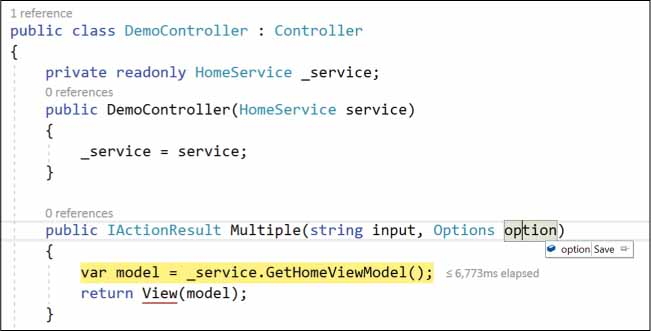
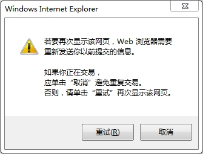

# ASP.NET Core 从客户端提交数据

本文将全面剖析HTML表单，首先概述HTML语法，然后进一步使用一些客户端JavaScript代码来执行表单内容的实际发布。使用JavaScript执行操作会带来额外的问题，例如处理正在进行的服务器端操作的反馈和刷新当前视图的部分。


## 组织HTML表单

当浏览器按下它所包含的一个提交按钮时，HTML表单的内容将自动被提交。浏览器自动扫描FORM元素边界内的输入字段，将其内容序列化为字符串，并将HTTP命令设置为目标URL。HTTP命令的类型(通常是POST)和目标URL是通过HTML FORM元素的属性设置的。 目标URL背后的代码——ASP.NET MVC应用程序中的控制器操作方法，处理发布的内容，通常返回一个新的HTML视图。任何关于处理已发布数据的反馈都被包含在返回的页面中。

### 定义HTML表单

HTML表单由一组输入元素组成，当按下一个提交按钮时，这些元素的值被简化为远程URL。表单可以有一个或多个提交按钮。如果没有定义submit按钮，那么除非通过特定的脚本代码，否则表单无法发布。

```c#
<form method="POST" action="@Url.Action(action, controller)">
   <input type="text" value="" />
   ...
   <button type="submit">Submit</button>
</form>
```

#### 多个提交按钮

HTML代码如下：

```html
<form class="form-horizontal">
<div class="form-group">
    <div class="col-xs-12">
        <button name="option" value="add" type="submit">ADD</button>
        <button name="option" value="save" type="submit">SAVE</button>
        <button name="option" value="delete" type="submit">DELETE</button>
    </div>
</div>
</form>
```

根据设计，浏览器将提交按钮的名称和元素的值一起发布。但是，大多数情况下，并没有为提交按钮设置`name`和`value`属性。当单个按钮可以发布表单时，省略这些属性是可以接受的，但是当存在多个提交按钮时，保留这些属性就变得至关重要。如何设置`name`和`value`属性？在MVC应用程序模型的上下文中，任何提交的数据都由模型绑定层处理。一旦意识到这一点，就可以为所有提交按钮指定相同的`name`，并在`value`属性中存储一个唯一值，该值可以在服务器上使用，用于确定下一个操作。

更好的是，您可以将`value`属性中设置的值与枚举类型的元素相关联，如下所示。

```c#
public enum Options
{
	None = 0,
	Add = 1,
	Save = 2,
	Delete = 3
}
```

下图：显示了在发布带有多个提交按钮的表单时使用这种HTML代码的效果

 

### Post-Redirect-Get 模式

服务器端web开发中存在一些问题，这些问题从早期就存在了，而且一直没有找到一致接受的最终解决方案。其中一个问题是如何处理POST请求的响应，无论是普通的HTML视图、JSON数据包还是错误。处理POST响应的问题不会完全影响客户端应用程序，在客户端应用程序中，POST请求是通过JavaScript从客户端发出和管理的。因此，许多开发人员称这是一个只有老派开发人员才会有的错误问题。但是，如果您在这里选择的是MVC应用程序模型，那么您的解决方案很可能并不完全由客户端交互组成。由此，推荐的处理表单模式：Post-Redirect -Get模式，是值得讨论的。

Post-Redirect-Get模式还从CQRS（Command-Query Responsibility Segregation）的角度进行了说明，这是一种新兴模式，其本质上是将应用程序的查询和命令堆栈分离开来，以便独立开发，部署和扩展它们。在Web应用程序中，表单POST由命令堆栈处理，但是向用户呈现一些与查询堆栈相关的可视响应。因此，post请求在完成所有任务时结束，用户界面以某种其他方式更新。同样，Post-Redirect-Get模式提供了一种在完全按照命令查询堆栈分离方式刷新用户界面的方法。

#### 正式化问题

让我们考虑一个从web页面中提交表单的用户。从浏览器的角度来看，这是一个普通的HTTP POST请求。在服务器上，请求被映射到一个控制器方法，该方法通常返回一个Razor模板。因此，用户会收到一些HTML并感到高兴。一切都很好，问题在哪里?

有两个问题。一个是反映表单操作(比如“save”或“edit”)的显示URL，与当前呈现给用户的视图(即“get”操作)之间存在错位。另一个问题与浏览器跟踪的最后一个操作有关。

所有浏览器都跟踪用户请求的最后一个HTTP命令，并在用户按F5或选择“刷新”菜单项时重复该命令。在这种情况下，最后一个请求是HTTP POST请求。重复一个Post可能是一个危险的操作，因为POST通常是一个改变系统状态的操作。为了安全起见，操作需要是幂等操作（也就是说，如果重复执行，它不会改变状态）。为了警告用户在POST后刷新的风险，所有浏览器都会显示一条众所周知的消息，如图：



这样的窗户已存在多年，它们并没有阻止网络的扩散，但它们看起来很难看。然而，摆脱那些窗户并不像看起来那么容易。为了消除获取此类消息的风险，应该重新访问服务器端Web操作的整个流程，最终会产生新类型的问题。

#### 解决这个问题

Post-Redirect-Get（PRG）模式由一组建议组成，旨在保证每个POST命令实际上以GET结束。它解决了F5刷新问题，并促进了命令和查询HTTP操作之间的巧妙分离。

这个问题源于这样一个事实：在典型的Web交互中，呈现用户界面的POST后面跟着一个隐式GET。 PRG模式只是建议您通过重定向或与重定向具有相同效果的其他客户端请求来显式地实现此功能。这是一些具体的代码。

```c#
[HttpGet]
[ActionName("register")]
public ActionResult ViewRegister()
{
    // 显示用户将要注册的视图
    return View();
}
```

要注册，用户需要填写并提交表单。一个新的请求以POST的形式出现，并由以下代码处理:

```c#
[HttpPost]
[ActionName("register")]
public ActionResult PostRegister(RegisterInputModel input)
{
    // 改变系统的状态。，注册用户)
    ...

    // 为UI目的查询系统的新状态。. 
    // (这一步是隐式GET
    return View()
}
```

如本文所述，方法`PostRegister`改变了系统的状态，并通过内部的服务器端查询将其报告回来。对于浏览器来说，它只是一个带有一些HTML响应的POST操作。将PRG模式应用到这段代码只需要做一个更改：在POST方法中，不返回视图，而是将用户重定向到另一个页面。例如，您可能希望重定向到相同操作的GET方法。

```c#
[HttpPost]
[ActionName("register")]
public ActionResult PostRegister(RegisterInputModel input)
{
    // 改变系统的状态。，注册用户)
    ...

    // 为UI目的查询系统的新状态。
    // (这一步是通过浏览器实现的)
    return RedirectToAction("register")
}
```

因此，最后一次跟踪的操作是GET，这消除了F5问题。但还有更多。浏览器地址栏上显示的URL现在更加重要了。

如果您正在创建一个典型的服务器应用程序，并且在每次请求之后都要刷新整个页面，那么PRG模式就是要遵循的方法。另一种更现代的方法是通过JavaScript发布表单的内容，它不存在POST/GET被融合的问题。


## 通过Javascript发送表单

使用JS发布HTML表单的步骤可以总结如下:

- 从表单的输入字段中收集要发布的数据。
- 将单个字段值序列化为可以打包到HTTP请求中的数据流。
- 准备并运行Ajax调用。
- 接收响应，检查错误，并相应地调整用户界面。

### 上传表单内容

HTML标准文件中定义了携带表单内容的HTTP请求的正确主体。它是由输入名称和相关值的串联给出的字符串。每个名称/值对通过`＆`符号连接到下一个。

```c#
name1=value1&name2=value2&name3=value3
```

有很多方法可以创建这样的字符串。您可以自己从DOM元素中读取值并创建字符串，但是使用jQuery工具更快、更可靠。

#### 序列化表单

特别是，jQuery库提供了`serialize`函数，它接受一个FORM元素，遍历子INPUT元素，并返回最后的字符串。

```c#
var form = $("#your-form-element-id");
var body = form.serialize();
```
jQuery中的另一个选项是`$.param`函数。除了接受不同类型的输入之外，该函数产生与`serialize`相同的输出。而`serialize`只能在表单上调用，并且它会自动扫描输入字段列表，`$.param`需要显式的名称/值对数组，但会产生相同的输出。

#### 发送HTTP请求

这里使用JQuery发送HTTP请求，调用Ajax方法进行实现：

```javascript
var form = $("#your-form-element-id");
$.ajax({
   cache: false,
   url: form.attr("action"),
   type: form.attr("method"),
   dataType: "html",
   data: form.serialize(),
   success: success,
   error: error
});
```

jQuery ajax函数允许您传入两个回调来处理请求的成功或失败。值得注意的是，成功或失败指的是响应的状态代码，而不是物理HTTP请求背后的业务操作。换句话说，如果您的请求触发了一个失败的命令，但是您的服务器代码接收了异常并返回了HTTP 200响应中的错误消息，则永远不会触发错误回调。 

```c#
public IActionResult Login(LoginInputModel credentials)
{
    // 验证证书
    var response = TryAuthenticate(credentials);
    if (!response.Success)
        throw new LoginFailedException(response.Message);
    var returnUrl = ...;
    return Content(returnUrl);
}
```

在这种情况下，如果身份验证失败，就会抛出异常，这意味着请求的状态代码将变成HTTP 500，这将调用错误处理程序。否则，下一个URL将返回到您希望在成功登录后重定向用户的位置。注意，由于此方法是通过Ajax调用的，因此任何重定向到另一个URL只能通过客户端的JavaScript进行。

```js
window.location.href = "...";
```

表单的post在表单按钮的click处理程序中调用。为了防止浏览器在单击时自动发布表单，您可能希望将按钮类型属性更改为按钮而不是submit。

```html
<button type="button" id="myForm">SUBMIT</button>
```


### 刷新网页中的部分区域

除了使用js实现之外，还可以使用视图组件。可以将复杂的HTML块设置为局部视图，并向某个控制器添加一个新的操作方法，该方法只返回部分视图，并根据系统的当前状态进行修改。这是一个例子。

```c#
[HttpGet]
public IActionResult GetLoginView()
{
    // 获取任何必要的数据
    var model = _service.GetAnyNecessaryData();
    return new PartialView("pv_loginbox", model);
}
```

该方法通过Ajax调用，并返回某些用户界面部分的当前状态。它所做的只是收集填充HTML所需的数据，并将其传递给Razor视图引擎，以填充部分视图。客户机应用程序接收一个HTML字符串，并使用jQuery HTML方法更新一个HTML元素(很可能是一个DIV)。

### 将文件上传到Web服务器

在HTML中，尽管文件和原始数据之间存在着很大的差异，但文件几乎被视为任何其他类型的输入。与往常一样，首先创建一个或多个input元素，类型属性设置为file。本机浏览器用户界面允许用户选择一个本地文件，然后文件的内容与表单内容的其余部分一起简化。在服务器上，文件内容被映射到一种新的类型——`IFormFile`类型——从模型绑定层得到的处理要比以前的MVC版本更加统一。

#### 设置表单

要选择本地文件并进行上传，严格地说，只需要以下标记即可。

```html
<input type="file" id="picture" name="picture">
```

由于用户界面的原因，这段代码必须在HTML页面的某个位置找到，但它通常隐藏在视图中。这允许应用程序提供更好的用户界面，同时仍然保留打开本地资源管理器窗口的能力。

一个常见的技巧是隐藏INPUT元素并显示一些不错的用户界面以邀请用户点击。接下来，click的处理程序只是将click事件转发给隐藏的INPUT元素。

```html
<input type="file" id="picture" name="picture">
<div onclick="$('#picture').click()">image not available</div>
```

要正确上传表单内容，还必须使用multipart / form-data的固定值指定enctype属性。

#### 处理服务器上的文件内容

在ASP.NET Core中，文件内容被抽象为`IFormFile`类型，它主要保留了与MVC 5应用程序中使用的`HttpPostedFileBase`类型相同的编程接口。

```c#
public IActionResult UploadForm(FormInputModel input, IFormFile picture)
{
    if (picture.Length > 0)
    {
        var fileName = Path.GetFileName(picture.FileName);
        var filePath = Path.Combine(_env.ContentRootPath, "Uploads", fileName);
        using (var stream = new FileStream(filePath, FileMode.Create))
        {
           picture.CopyTo(stream);
        }
    }
}
```

注意，`IFormFile`引用也可以添加到`FormInputModel`复杂类型中，因为模型绑定可以轻松愉快地按名称映射内容，就像对原始数据类型和复杂数据类型那样。上面的代码从当前内容根文件夹种设置一个文件名，并使用上载文件的原始名称创建文件的服务器副本。如果上载了多个文件，只需引用`IFormFile`类型数组。

如果你是通过JavaScript发布表单的，那么最好使用以下代码替换我们在上面看到的表单序列化代码：

```javascript
var form = $("#your-form-element-id");
var formData = new FormData(form[0]);
form.find("input[type=file]").each(function () {
   formData.append($(this).attr("name"), $(this)[0].files[0]);
});
$.ajax({
   cache: false,
   url: form.attr("action"),
   type: form.attr("method"),
   dataType: "html",
   data: formData,
   success: success,
   error: error
});    
```

该代码确保所有输入文件都被序列化。

#### 文件上传的问题

上面的代码保证适用于小文件，即使很难定义“小”的一般含义。假设你总是可以从这段代码开始，除非你事先知道你要上传30兆字节大的文件。在这种情况下，以及在任何与文件大小相关的web服务器上遇到延迟的情况下，您可能需要考虑流式传输文件的内容。有关详细说明，请访问http://docs.microsoft.com/en-us/aspnet/core/mvc/models/file-uploads。

另一个问题是需要一个高度动态和交互式的用户界面。用户可能期望提供关于上传操作进展的可视化反馈。此外，当要上载的文件是一个图像(例如，注册用户的照片)时，用户甚至可能希望看到预览，并能够取消先前选择的图像，并将字段留空。所有这些操作都是可能的，但并非不费力气。您可以考虑使用一些特殊组件，如Dropzone.js。 （见http://dropzonejs.com）

另一个问题与如何在服务器上保存上传文件的副本有关。上面显示的代码在服务器上创建了一个新文件。注意，如果引用的文件夹不存在，上面的代码将抛出异常。多年来，这种方法都很好，但随着云模型获得更多的相关性，这种方法就失去了吸引力。如果您将上传的文件存储到Azure应用程序服务中托管的web应用程序，那么您的应用程序将透明地工作，因为相同应用程序服务的多个实例将共享相同的存储。上传文件的问题是，一般来说，最好不要将它们放在主服务器上。在云爆炸之前，除了在本地或数据库中存储文件之外，您没有什么可以做的。有了云，您就有了便宜的blob存储，可以用来存储文件，甚至超出传统应用程序服务配置的存储限制。此外，文件的流量在一定程度上是从主服务器转移的。

以下部分只是作为补充说明，无实际编码意义。

> 可以重写上面的代码，将上传的图像保存到Azure blob容器中。为此，您需要一个Azure存储帐户。
>
> ```c#
> // 从Azure门户获取连接字符串
> var storageAccount = CloudStorageAccount.Parse("connection string to your storage account");
> 
> // 创建一个容器并将blob保存到其中
> var blobClient = storageAccount.CreateCloudBlobClient();
> var container = blobClient.GetContainerReference("my-container");
> container.CreateIfNotExistsAsync();
> var blockBlob = container.GetBlockBlobReference("my-blob-name");
> using (var stream = new MemoryStream())
> {
>     picture.CopyTo(stream);
>     blockBlob.UploadFromStreamAsync(stream);
> }
> ```
>
> Azure blob存储在容器中连接，每个容器都绑定到一个帐户。在容器中，您可以拥有任意数量的blob。blob具有二进制流和惟一名称的特征。要访问Azure blob存储，还可以使用REST API，因此可以在web应用程序之外访问blob存储。
>
>
> 要测试Azure blob存储，您可以使用Azure blob模拟器，它允许您在本地使用平台的API。

 


------


#### 参考资源

- 《Programming ASP.NET Core》


本文后续会随着知识的积累不断补充和更新，内容如有错误，欢迎指正。

最后一次更新时间：2018-10-02


------


