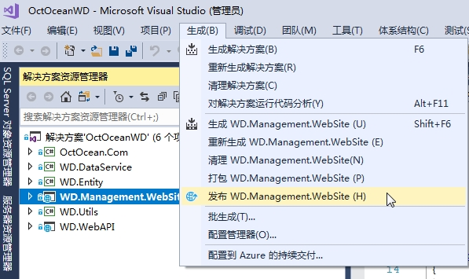

# 部署ASP.NET Core应用程序

本文将探讨各种部署选项和最相关的配置问题。


## 发布应用程序

下面将从一个基本的发布步骤开始理解部署模型。

### 在Visual Studio中发布

首先，假设您有一个完整的、经过全面测试的应用程序，可以部署。下图显示了开始发布过程的Visual Studio菜单项。



#### 选择发布目标

在Visual Studio中单击“生成”菜单中的“发布”项后，将显示另一个视图，以选择要发布的文件的目标。 


支持的发布目标见下表说明：

| Host            | 描述                                                         |
| --------------- | ------------------------------------------------------------ |
| 应用服务        | 该应用程序将发布到新的或现有的Microsoft Azure App Service。  |
| Azure虚拟机     | 该应用程序将发布到现有的Microsoft Azure虚拟机。              |
| IIS、FTP        | 应用程序将通过FTP，WebDeploy或必要文件的直接副本发布到指定的IIS实例。 |
| 文件夹          | 应用程序将发布到本地计算机上的给定文件系统文件夹。           |
| Linux版应用服务 | 该应用程序发布到Linux服务器上。                              |

为了形成关于发布真正需要的文件的概念，这里选择Folder选项。

注意，只有项目尚未包含发布配置文件时，才会看到上图中的内容。当您对任何呈现的目标执行操作时，就会创建一个发布配置文件，并且页面默认为上次使用的配置文件，并提供创建新配置文件的功能。

#### 发布配置文件

发布配置文件是保存在项目的Properties / PublishProfiles文件夹下的.pubxml XML文件。这个文件不应该签入源代码控制，因为它依赖于.user项目文件，而后者又可能包含敏感信息。这两个文件仅在本地计算机上使用。

.pubxml文件是一个MSBuild文件，在Visual Studio的构建过程中会被自动调用。可以编辑该文件以定制预期的行为。一个典型的变化涉及在部署中包含或排除项目文件。

##### 将文件发布到本地文件夹

下图显示了选择发布到文件夹时显示的接口。在文本框中选择将接收文件的实际文件夹。点击高级选项可以看到具体的详细设置，如下图所示：


发布过程将在发布模式下从头编译应用程序，并将所有二进制文件复制到指定的文件夹中。它还自动创建一个发布概要文件，以便将来重复操作。

如果检查发布后的文件夹，将会找到wwwroot文件夹和二进制文件。注意，示例项目没有视图，它使用Razor Pages代替。Razor视图都预编译为DLL。默认情况下，在Visual Studio 2017创建的ASP.NET Core 2.0的项目模板中启用预编译视图。要将其更改回动态编译视图，需要向项目的CSPROJ文件添加以下行：

```xml
<PropertyGroup>
    <TargetFramework>netcoreapp2.0</TargetFramework>
    <MvcRazorCompileOnPublish>false</MvcRazorCompileOnPublish>
</PropertyGroup>
```

在应用程序发布后，应用程序的发布文件夹仅包含应用程序二进制文件，包括任何第三方依赖项。可以使用命令行中的dotnet实用程序或配置主机Web服务器环境来启动主DLL文件。

这里需要注意的关键是，已发布的文件配置了一种可移植的、依赖框架的部署形式。换句话说，要使应用程序正确运行，目标平台的.NET Core框架库必须在服务器上可用。

#### 发布自包含的应用程序

发布可移植应用程序已成为ASP.NET平台整个生命周期的标准。部署的规模很小，仅限于应用程序二进制文件和文件。在服务器上，多个应用程序共享相同的框架二进制文件。使用.NET Core，可移植部署的替代方法是发布自包含的应用程序。

发布自包含应用程序时，还会复制指定运行时环境的.NET Core二进制文件。这使得部署的大小大大增加。对于此处讨论的示例应用程序，可移植部署的大小小于2 MB，但对于针对通用Linux平台的自包含安装，它可以增长到90 MB。

但是，自包含应用程序的优点是，不管安装在服务器上的.NET Core 框架的版本是什么，应用程序都具有运行所需的所有东西。同时，您应该知道，将多个自包含应用程序部署到系统可能会占用大量磁盘空间，因为整个.NET Core Framework是基于每个应用程序复制的。

要支持给定应用程序的自包含部署，必须显式地添加要支持的平台的运行时标识符。当Visual Studio创建新的.NET Core项目时，此信息将丢失，并导致了可移植部署。要启用自包含部署，您必须手动编辑.csproj项目文件并向其添加RuntimeIdentifiers节点。这是示例项目的.csproj内容。

```xml
<Project Sdk="Microsoft.NET.Sdk.Web">
  <PropertyGroup>
    <TargetFramework>netcoreapp2.0</TargetFramework>
    <RuntimeIdentifiers>win10-x64;linux-x64</RuntimeIdentifiers>
  </PropertyGroup>
  <ItemGroup>
    <None Remove="Properties\PublishProfiles\FolderProfile.pubxml" />
  </ItemGroup>
  <ItemGroup>
    <PackageReference Include="Microsoft.AspNetCore.All" Version="2.0.0" />
  </ItemGroup>
  <ItemGroup>
    <DotNetCliToolReference 
         Include="Microsoft.VisualStudio.Web.CodeGeneration.Tools" Version="2.0.0" />
  </ItemGroup>
  <ItemGroup>
    <Folder Include="Pages\Shared\" />
    <Folder Include="Properties\PublishProfiles\" />
  </ItemGroup>
</Project>
```

当前项目可以在Windows 10和通用Linux x64平台上部署。要在RuntimeIdentifiers节点中使用的标记，可参考：https：//docs.microsoft.com/en-us/dotnet/core/rid-catalog。

### 使用CLI工具发布

可以使用CLI工具从命令行执行可在Visual Studio 2017中执行的相同操作。使用命令行工作时，可以使用您选择的IDE编辑器编写代码。如果使用Visual Studio代码，则可以通过“视图”菜单下的“集成终端”项打开命令控制台。 （见图15-7。）


#### 发布框架相关的应用程序

应用程序完成并经过全面测试后，可以使用CSPROJ文件夹中的以下命令进行发布。

```
dotnet publish -f netcoreapp2.0 -c Release
```

该命令在发布模式下编译ASP.NET Core 2.0应用程序，并将生成的文件放在项目名为Publish的Bin文件夹的子目录中。更准确地说，文件夹是

```
\bin\Release\netcoreapp2.0\publish
```

请注意，dotnet工具还会复制PDB文件（程序数据库）以及必要的二进制文件。 PDB文件主要用于调试，不应分发。但是，这些文件应该保存在某个地方，因为在您需要调试应用程序的Release版本时，由于不可预测的异常，错误或其他不当行为，它们可能会派上用场。

#### 发布自包含的应用程序

对于自包含的应用程序，要使用的命令行仅略有不同。基本上，您将运行时标识符添加到用于发布依赖于框架的应用程序的同一命令行中。

```
dotnet publish -f netcoreapp2.0 -c Release -r win10-x64
```

上面的命令行将发布Windows x64平台的文件。总大小超过96 MB。文件所在的目标文件夹是：

```
\bin\Release\netcoreapp2.0\win10-x64\publish
```

要指示运行时标识符，请使用从.NET Core目录中获取的官方ID，网址为https://docs.microsoft.com/en-us/dotnet/core/rid-catalog。

注意如果要发布的应用程序依赖于第三方组件，则应确保将依赖项添加到.csproj文件的<ItemGroup>部分，并且实际文件在发布之前在本地NuGet缓存中可用。


## 部署应用程序

必须使用发布步骤来隔离要复制的文件。在Visual Studio中，您可以使用大量工具在本地或直接将文件发布到IIS或Microsoft Azure。其他选项（例如部署到Linux本地计算机或其他云平台（例如Amazon Web Services））需要特定的上载和配置工作。

让我们更详细地了解将应用程序完全部署到IIS，Azure和Linux计算机所需的内容。

### 部署到IIS

与经典ASP.NET应用程序一样，Any ASP.NET Core应用程序在IIS核心进程之外运行，并且在IIS工作进程的任何实例（w3wp.exe）之外运行。从技术上讲，ASP.NET Core应用程序甚至不需要Web服务器。如果我们将应用程序部署到IIS（或Apache），那是因为我们有理由（主要是安全性和负载平衡）在嵌入式ASP.NET Core本机Web服务器之上放置一个façade。

#### 托管架构

如上所述，经典的ASP.NET应用程序托管在应用程序池中，由IIS w3wp.exe工作进程的实例表示。 IIS中内置的一些.NET工具负责创建HttpRuntime类的特定于应用程序的实例。此对象用于接收http.sys驱动程序捕获的请求，并将它们转发到应用程序池中分配的相应网站。

图15-8概述了ASP.NET Core应用程序的IIS主机架构。 ASP.NET Core应用程序是通过dotnet启动器工具的run命令加载的普通控制台应用程序。 ASP.NET Core应用程序永远不会从IIS工作进程中加载和启动。相反，它们是通过称为ASP.NET核心模块的其他IIS本机ISAPI模块触发的。该模块最终调用dotnet来触发控制台应用程序。


因此，要在IIS计算机上托管ASP.NET Core应用程序，首先需要安装ASP.NET Core ISAPI模块。

注意ASP.NET Core ISAPI模块仅适用于Kestrel。如果您在ASP.NET Core 2.0（或ASP.NET Core 1.x中的WebListener）中使用HttpSys，它将无法正常工作。有关详细信息，请参阅https://docs.microsoft.com/en-us/aspnet/core/fundamentals/servers/aspnet-core-module。该链接还提供下载详细信息。

#### ASP.NET核心模块的配置

ASP.NET Core模块所做的就是确保在第一个应用程序请求进入时正确启动应用程序。此外，它确保进程保留在内存中，并在应用程序崩溃且池正在重新加载时重新加载重新启动。您可能已经注意到，发布向导还会创建一个web.config文件。此文件不会影响应用程序的实际行为，但它的唯一目的是在IIS下配置ASP.NET Core模块。这是一个样本。

```xml
<?xml version="1.0" encoding="utf-8"?>
<configuration>
  <system.webServer>
    <handlers>
      <add name="aspNetCore" path="*" verb="*" 
           modules="AspNetCoreModule" resourceType="Unspecified" />
    </handlers>
    <aspNetCore processPath="dotnet" arguments=".\Ch15.SimplePage.dll" 
                stdoutLogEnabled="false" stdoutLogFile=".\logs\stdout" />
  </system.webServer>
</configuration>
```

配置文件为任何通过模块中编写的代码过滤请求的动词和路径添加HTTP处理程序。路径上的通配符表示ASP.NET Core模块仅处理通过应用程序池的任何请求，包括ASPX请求。因此，建议您不要在同一应用程序池中混合依赖于不同ASP.NET框架的应用程序，或者更好的是，创建一组特定的ASP.NET Core应用程序池。

相反，aspNetCore条目为模块提供了工作参数。该条目指出模块必须在指定的应用程序主DLL上运行dotnet，以及一些日志记录配置。此web.config文件必须是部署的一部分。

注意要在IIS下成功托管，ASP.NET Core应用程序必须通过调用UseIISIntegration扩展方法来配置Web主机。该方法检查可能由ASP.NET核心模块设置的一些环境变量。如果没有找到变量，则该方法为无操作。出于这个原因，您可能希望始终对其进行调用，无论您最终在何处托管应用程序。

#### 最后接触IIS环境

如果将ASP.NET Core应用程序部署到IIS，则打算将IIS用作反向代理。这意味着除了按原样转发流量之外，您不希望IIS执行任何请求处理工作。因此，您可以配置应用程序池，以便它不使用托管代码，并且随后不会实例化任何.NET运行时。 （见图15-9。）


您可能希望关注的IIS配置的另一个方面是承载ASP.NET Core应用程序的应用程序池背后的身份。默认情况下，任何新应用程序池的标识都设置为ApplicationPoolIdentity。这不是真正的帐户名，而是与IIS恰当创建并以应用程序池命名的本地计算机帐户相对应的名字对象。

因此，如果您需要为给定资源（例如服务器文件或文件夹）定义访问控制规则，请注意真实帐户名称（如图15-9所示）是IIS APPPOOL \ AspNetCore。这就是说，您不会以任何方式强制使用默认帐户。通过使用通常的IIS界面，您可以随时将应用程序池后面的标识更改为任何用户帐户。

### 部署到Microsoft Azure

除了将内部部署部署到配备IIS的服务器计算机之外，您还可以在Microsoft Azure上托管ASP.NET Core应用程序。有几种方法可以在Azure上托管网站。 ASP.NET Core应用程序最常见和推荐的是使用App Service。在某些特定情况下，您应该查看Service Fabric，甚至是Azure虚拟机上的托管。后一个选项是您最接近我们迄今为止考虑过的托管方案 - 在IIS下托管内部部署。

让我们了解更多有关各种选项的信息。

#### 使用Azure应用服务

Azure App Service（AAS）发布目标是Visual Studio 2017发布向导提供的第一个选项，如图15-2所示。可以创建新的App Service，甚至可以发布到现有的App Service。

AAS是一种托管服务，可以容纳普通的Web应用程序和Web API，如REST API和移动后端。它不仅限于ASP.NET和ASP.NET Core，它还支持Windows和Linux上的各种其他Web环境，如Node.js，PHP和Java。 AAS提供内置安全性，负载平衡，高可用性，SSL证书，应用程序扩展和管理。此外，它还可以与GitHub和Visual Studio Team Services（VSTS）的持续部署相结合。

AAS根据您选择的应用服务计划确定您使用的计算机资源向您收费。 AAS还与Azure WebJobs服务很好地集成，以便为Web应用程序添加后台作业处理。图15-10显示了“创建应用程序服务”页面，该页面是您在发布到AAS时开始的位置。 （见图15-10。）


通过单击“发布”，Visual Studio将使用WebDeploy将所有必需的文件上载到AAS。该应用程序将在几分钟内启动并运行。图15-11显示了启动并运行的示例应用程序。


发布后，AAS仪表板允许您设置应用程序设置条目（例如，您将在开发期间从用户机密中获取的所有数据）并执行任何必要的微调。

要访问应用程序的物理文件，最明显的是Razor视图或页面（如果未预编译），您可以使用App Service Editor服务。通过这种方式，您可以获得对已部署文件的读/写访问权限，甚至可以即时进行编辑。 （见图5-12。）


#### 使用Service Fabric

AAS提供了许多开箱即用的功能，例如自动扩展，身份验证，限制呼叫率，以及与其他软件服务（如Azure Active Directory，Application Insights和SQL）的轻松集成。使用AAS非常简单，非常适合许多团队，尤其是具有有限站点管理和部署经验的团队。此外，AAS非常适用于紧凑，单片和几乎无状态的应用。相反，如果Web应用程序是更大的分布式系统的一部分，该怎么办？

在这种情况下，您最终可能会使用微服务架构，其中一些节点可以作为AAS部署，但也可以与其他节点严格互操作。Azure Service Fabric（ASF）只是简化了应用程序节点的组合。想象一下，您的应用程序需要两个不同的数据存储（关系和NoSQL），缓存以及服务总线。如果没有ASF，每个节点都是独立的，那么处理容错就取决于您。更糟糕的是，必须为您发布的每项服务处理容错。使用ASF，缓存和其他所有内容将与主应用程序位于同一位置，从而提供更快的访问速度，同时提高可靠性和简化部署 - 单个镜头而不是多个镜头，每个节点一个。

ASF可能是构成池的多机系统的更好选择。 ASF允许您从相对较小的开始，轻松地将架构的分布扩展到甚至数百台机器。这就是说，您甚至可以混合使用AAS和ASF，并将主应用程序部署为AAS，后端在某些时候重新构建为ASF。

表15-2提供了仅AAS或仅ASF支持的功能列表。表中未列出的函数在两种方案中的工作方式相同（或根本不起作用）。从定价角度来看，请注意Service Fabric本身是免费的。您所支付的只是您在其上启用的实际计算资源。在这方面，定价遵循与Azure虚拟机相同的规则

表15-2 AAS和ASF功能

| Azure App Service ONLY          | Azure Service Fabric ONLY  |
| ------------------------------- | -------------------------- |
| 自动操作系统更新                | 远程桌面访问服务器计算机   |
| 将运行时环境从32位切换到64位    | 自由安装任何自定义MSI包    |
| 通过Git，FTP和WebDeploy进行部署 | 定义自定义启动任务         |
| 可用的集成SaaS：MySQL和监控     | 支持Windows事件跟踪（ETW） |
| 远程调试                        |                            |

要点要部署在Azure Service Fabric中，必须将整个应用程序转换为Service Fabric应用程序。这需要安装Service Fabric SDK并使用Visual Studio中的临时应用程序项目模板。有关SDK的更多信息，请访问https://docs.microsoft.com/en-us/azure/service-fabric/service-fabric-get-started。另请注意，Service Fabric与云服务类似，但云服务被视为已被Service Fabric完全取代的传统技术。

#### 使用Azure虚拟机

AAS和ASF之间的某种程度是Azure虚拟机（AVM）。如果您需要的不仅仅是单个单片应用程序，而且同时应用程序需要进行大量更改才能打包为ASF兼容，那么转向AVM可能是一个精明的选择。

AVM就是这个名字所暗示的 - 就配置和设置而言，一台服务器机器实际上是空的并且完全可以处理。 AVM的核心是基础设施即服务（IaaS）样本，而ASF和AAS都是平台即服务的样本。所有Azure虚拟机都具有免费负载平衡和自动扩展功能。在Azure上创建虚拟机后，您可以直接从Visual Studio发布应用程序。

关于成本，最经济的AVM每月开始超过10美元，而合理的AVM至少要花费十倍以上。此金额应添加到您安装的软件的成本中，例如您自己的SQL Server的许可证。总而言之，AVM代表了您必须从现有的内部部署配置迁移到Azure的最简单，最简单的方法。

注意有关Microsoft Azure的各种主机选项的更多详细信息，请访问https://docs.microsoft.com/en-us/azure/app-service/choose-web-site-cloud-service-vm。

#### 从Visual Studio代码中部署

如上所述，从Visual Studio自动部署到Azure几乎是即时的。相反，如果您使用Visual Studio Code，则需要一些额外的工具来实现它。特别是，您可能需要考虑Visual Studio Marketplace提供的Azure工具Visual Studio代码。 （参见https://marketplace.visualstudio.com/items?itemName=bradygaster.azuretoolsforvscode。）

### 部署到Linux

ASP.NET Core的跨平台特性使得在Linux机器上托管相同的应用程序成为可能。常见的方法是将应用程序文件发布到本地文件夹，然后将图像上传（例如通过FTP）到服务器计算机。Linux有两种主要的托管方案：在配备Apache或Nginx的机器上托管。另一种选择是使用Amazon Web Services和Elastic Beanstalk工具包。 （参见https://aws.amazon.com/blogs/developer/aws-and-net-core-2-0。）

#### 部署到Apache

将ASP.NET Core应用程序部署到Apache服务器的实例意味着将服务器环境配置为充当反向代理服务器。我们已经在第14章“ASP.NET核心运行时环境”中讨论了这个方面。让我们简要回顾一下。

要指示Apache充当反向代理，您需要在/etc/httpd/conf.d/目录下有一个.conf文件。下面的示例内容告诉Apache通过端口80侦听任何IP地址以及通过指定代理计算机接收的所有请求。在该示例中，代理机器在端口5000上是127.0.0.1。在这种情况下，假设Apache和Kestrel在同一台机器上运行，但只是更改代理传递IP地址就可以使用不同的机器。

```
<VirtualHost *:80>
        ProxyPreserveHost On
        ProxyPass / http://127.0.0.1:5000/
        ProxyPassReverse / http://127.0.0.1:5000/
</VirtualHost>
```

您还需要一个服务文件来告诉Apache如何处理针对托管的ASP.NET Core应用程序的请求。这是一个示例服务文件。

```
[Unit]
    Description=Programming ASP.NET Core Demo

[Service]
    WorkingDirectory=/var/progcore/ch15/simpleplage
    ExecStart=/usr/local/bin/dotnet /var/progcore/ch15/simpleplage.dll
    Restart=always

    # Restart service after 10 seconds in case of errors
    RestartSec=10
    SyslogIdentifier=progcore-ch15-simplepage
    User=apache
    Environment=ASPNETCORE_ENVIRONMENT=Production 

[Install]
    WantedBy=multi-user.target
```

必须从命令行启用该服务。如果上面的服务文件名为progcore.service，则命令行如下：

```
sudo nano /etc/systemd/system/progcore.service
```

有关更多详细信息，请参阅https://docs.microsoft.com/en-us/aspnet/core/publishing/apache-proxy。特别是，您可能希望查看前面提到的文档，例如添加SSL和防火墙设置，速率限制，监视和负载平衡等方面。

#### 部署到Nginx

Nginx是一个开源的HTTP服务器，越来越受欢迎;它可以轻松地充当反向代理以及IMAP / POP3代理服务器。它的主要特征是使用异步架构来处理请求，而不是更传统的基于线程的架构，如更多规范的Web服务器，如Apache和旧版本的IIS。出于这个原因，Nginx通常用于高度可扩展的场景，并且作为代理而不是高度流量的网站。 （见https://www.nginx.com。）

让我们看看如何将Nginx配置为服务器作为托管ASP.NET Core应用程序的反向代理。您所要做的就是编辑文件/ etc / nginx / sites-available / default的内容，这是一个内容类似于以下行的JSON文件。

```c#
server {
    listen 80;
    location / {
        proxy_pass http://localhost:5000;
        proxy_http_version 1.1;
        proxy_set_header Upgrade $http_upgrade;
        proxy_set_header Connection keep-alive;
        proxy_set_header Host $host;
        proxy_cache_bypass $http_upgrade;
    }
}
```

通过更改proxy_pass属性的值，可以指示Kestrel服务器的位置（如果在服务器计算机外部或侦听不同于5000的端口）。

就像我们在Apache中看到的那样，这只是完全配置环境的第一步。它足以将请求转发给Kestrel，但不能管理Kestrel及其.NET Core Web主机的生命周期。

您需要一个服务文件来启动和监视底层的ASP.NET Core应用程序。你这样做的方式和我们在Apache上看到的一样。有关详细信息，请参阅https://docs.microsoft.com/en-us/aspnet/core/publishing/linuxproduction。


## Docker 容器

容器是一个相对较新的概念，试图复制容器在航运业中的作用。容器是包含应用程序及其完整依赖关系和配置堆栈的软件单元。可以将容器部署到给定的主机操作系统，并且无需任何进一步配置即可运行。

对于开发人员来说，容器代表了任何代码在本地运行的梦想场景 - 在神秘的“我的机器”上，一切正常 - 而且它也在生产中运行。操作系统是保证容器在部署后工作的唯一共同点。

### 容器与虚拟机

乍一看，容器与虚拟机有许多共同之处。但是，两者之间存在根本区别。

虚拟机在某些虚拟化硬件之上运行，并运行自己的操作系统副本。此外，虚拟机还需要构建它的方案所需的所有二进制文件和应用程序。随后，虚拟机可能会达到几千兆字节，通常需要几分钟才能启动。

相反，容器在给定物理机器的顶部运行，并使用机器上安装的操作系统。换句话说，只需要一个容器将主机操作系统的增量传递给运行应用程序所需的环境。因此，容器通常只有几兆字节，因此需要几秒钟才能启动。

最后，容器和虚拟机将应用程序及其依赖关系与周围环境隔离开来，但在同一台机器上运行的多个容器都共享主机操作系统（参见图15-13）。


### 从容器到微服务架构

事实上，多个应用程序可以打包在同一个虚拟化操作系统上并行运行，这导致了一种称为容器化的软件开发新方法。

应用程序及其配置以特殊格式打包 - 容器映像 - 并部署到启用容器的服务器。在DevOps术语中，这也意味着开发环境可以“快照”并转换为可在给定操作系统上运行的可独立部署的代码段。此外，它可以轻松地从服务器移植到服务器，并且只要在兼容的容器启用的基础架构（无论是公共云还是私有云，甚至是物理内部部署服务器）上传输，它都能继续工作。然后，集装箱化的口号是“一次建造，随处运行”。

容器化导致将整体应用程序分解为不同的部分，每个部署到不同的容器中。 SQL数据库可以转到容器，Web API可以转到另一个容器，而Redis缓存可以是另一个不同的容器。此外，不同的容器是可独立部署的部件，可以在将来进行缩放或无痛更新/替换。

### Docker和Visual Studio 2017

只需在创建项目时选择Enable Docker Support，就可以轻松地将ASP.NET Core与Docker兼容，如图15-14所示。结果是一些文本文件自动添加到项目中。

这些文件中最重要的是dockerfile。这是示例内容。

```
FROM microsoft/aspnetcore:2.0

ARG source

WORKDIR /app

EXPOSE 80

COPY ${source:-obj/Docker/publish} .

ENTRYPOINT ["dotnet", "Ch15.SimplePageDocker.dll"]
```

该项目还在名为docker-compose的新文件夹中包含其他几个文件。选择文件夹后，“生成”菜单将更改为显示Docker构建选项。单击它会导致创建映像并将其部署到启用基础容器的服务器的注册表中。要在Windows计算机上本地测试，您需要安装Docker for Windows。

一旦创建了Docker镜像，示例应用程序就会从一个不寻常的IP地址运行，通常是172.x.x.x. （见图15-15。）


可以在obj / docker文件夹中检查Docker镜像的实际文件。


## 概要

在本章中，我们介绍了将ASP.NET Core应用程序部署到生产环境的各种选项。我们首先研究了将应用程序文件发布到文件夹的含义以及如何处理ASP.NET Core的跨平台特性。在这样做时，我们区分了依赖于框架的发布和自包含的应用程序。

接下来，我们详细介绍了Azure上的托管，并探讨了各种服务，包括Service Fabric，虚拟机和App Services。最后，我们简要介绍了Docker和容器的整个主题。

在下一章中，我们通过关注迁移和棕色地带开发以及完全重写应用程序这一主题来结束我们的ASP.NET核心之旅。