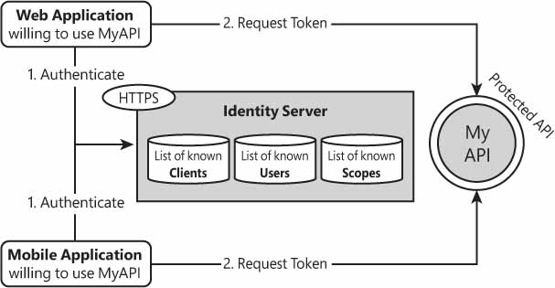

# ASP.NET Core 设计Web API

Web API是由许多公开的HTTP端点组成的编程接口，这些端点通常（但不一定）将JSON或XML数据返回给调用者。 Web API很适合今天看起来相当普遍的应用场景：客户端应用程序需要调用一些远程后端来下载数据或请求处理。客户端应用程序可以采用多种形式，包括JavaScript密集型Web页面，富客户端或移动应用程序。


## 使用ASP.NET Core构建WEB API

Web API的核心是HTTP端点的集合。这意味着在ASP.NET Core中，一个带有终止中间件的应用程序，它可以解析查询字符串并确定要采取的操作，这就是一个最小但工作正常的Web API。不过，更有可能的是，你将使用控制器构建Web API，以更好地组织功能和行为。 API的设计有两种主要方法。可以公开在完全控制下引用实际业务工作流和操作的端点，或者您可以定义业务资源并使用整个HTTP堆栈标头，参数，状态代码和动词来接收输入和返回输出。前一种方法是面向过程的，通常标记为RPC，即远程过程调用的简称。另一种方法受REST理念的启发。

> REST方法更加标准，一般来说，更适合作为企业业务一部分的公共API。如果客户使用你的API，那么您可能希望根据一组普遍接受和已知的设计规则公开它。如果API仅服务于数量有限的客户端——大部分是在API创建器的相同控制下——那么使用RPC或REST设计路由之间就没有真正的区别。
>

### 公开HTTP端点

即使您可以在终止中间件中嵌入一些请求处理逻辑，但最常见的方法是使用控制器。总的来说，通过控制器和MVC应用程序模型可以省去处理路由和绑定参数的负担。

#### 从Action方法返回JSON

要返回JSON数据，您所要做的就是在一个新的或现有的Controller类中创建一个特别的方法。新方法的唯一特定要求是返回JsonResult对象。

```c#
public IActionResult LatestNews(int count)
{
     var listOfNews = _service.GetRecentNews(count);
     return Json(listOfNews);
}
```

Json方法确保将给定对象打包到JsonResult对象中。一旦从控制器类返回，JsonResult对象就由动作调用程序处理，这是实际序列化发生的时间点。可以检索所需的数据，将其打包到对象中，然后将其传递给Json方法。

调用端点（endpoint ）的实际URL可以通过通常的路由方法确定——常规路由或属性路由。

#### 返回其他数据类型

提供其他数据类型不需要不同的方法。模式始终是相同的。检索数据并将其序列化为格式正确的字符串。基础控制器类上的Content方法允许你使用第二个参数序列化任何文本，以指示浏览器有关预期的MIME类型。

```c#
[HttpGet]
public IActionResult Today(int o = 0)
{
    return Content(DateTime.Today.AddDays(o).ToString("d MMM yyyy"), "text/plain");
}
```

要返回服务器文件的内容（例如，下载的PDF文件），您可以按以下步骤操作。

```c#
public IActionResult Download(int id)
{
    // 获取要下载的文件名
    var fileName = _service.FindDocument(id);
    
    // 读取文件内容
    var bytes = File.ReadAllBytes(fileName);
    return File(bytes, "application/pdf", fileName);
}
```

如果文件位于服务器上（例如，您的应用程序驻留在本地），那么你可以按名称找到它。如果文件已上载到数据库或Azure blob存储，那么将以字节流的形式来检索其内容，并将引用传递给适当的File方法重载。你需要设置正确的MIME类型， File方法的第三个参数是指下载文件的名称。

#### 请求特定格式的数据

在前面的示例中，端点的返回类型是固定的，由正在运行的代码确定。相反，相当常见的是，不同的客户端可以请求相同的内容，每个客户端都有自己的首选MIME类型。一般会为特定客户编写的大多数服务只返回格式为JSON的数据。这满足了企业开发人员在.NET，移动和JavaScript应用程序中使用服务的需求。但是，有时候，Flash应用程序也会使用一些端点，出于多种原因，它们更喜欢将数据作为XML处理。解决此问题的一种简单方法是向端点URL添加一个参数。

示例：

```c#
public IActionResult Weather(int days = 3, string format = "json")
{
    var cityCode = "...";
    var info = _weatherService.GetForecasts(cityCode, days, "celsius");

    if (format == "xml")
        return Content(ForecastsXmlFormatter.Serialize(info), "text/xml");
    return Json(info);
}
```

ForecastsXmlFormatter是一个自定义类，它只返回一个自定义的手工编写的XML字符串，该字符串被写入任何在特定上下文中工作的模式。

为了避免使用“json”和“xml”这样的字符串，可以考虑使用MediaTypeNames类定义的MIME类型常量。不过请注意，在类的当前定义中缺少相当多的MIME类型 - 特别是application / json。

#### 限制动词

在目前所考虑的所有示例中，处理请求的代码都是控制器方法。因此，您可以使用控制器操作方法的所有编程特性来控制参数的绑定，更重要的是，使用HTTP谓词和/或必要的标头或cookie来触发代码。

下面的代码限制仅通过GET请求调用端点api / weather.

```c#
[HttpGet]
public IActionResult Weather(int days = 3, string format = "json")
{ 
    ... 
}
```

同样的，你也可以对JavaScript客户端的引用URL和/或同源安全策略施加限制。

### 文件服务器


#### 终止中间件以捕获请求

在前面的内容中， 介绍了终止中间件，下面的代码是提供的一个示例：

```c#
public void Configure(IApplicationBuilder app, 
            IHostingEnvironment env, 
            ICountryRepository country)
{
    app.Run(async (context) =>
    {
        var query = context.Request.Query["q"];
        var listOfCountries = country.AllBy(query).ToList();
        var json = JsonConvert.SerializeObject(listOfCountries);
        await context.Response.WriteAsync(json);
    });
}
```

方法Run——终止中间件——捕获任何没有以其他方式处理的请求。例如，它捕获不经过任何配置控制器的请求。与此同时，无论实际端点是什么，上面的代码都会检查特定的查询字符串参数(名为q)，并根据该值过滤国家的内部列表。可以将代码重构为文件服务器。

#### 终止中间件以仅捕获某些请求

根据设计，终止中间件会捕获任何请求，除非它被限制到某些特定的URL。要限制有效的URL，可以使用Map中间件方法。

```c#
public void Configure(IApplicationBuilder app) 
{
    app.Map("/api/file", DownloadFile);
}

private static void DownloadFile(IApplicationBuilder app)
{
     app.Run(async context =>
     {
         var id = context.Request.Query["id"];
         var document = string.Format("sample-{0}.pdf", id);
         await context.Response.SendFileAsync(document);
     });
}
```

由于Map方法，每次传入的请求指向/api/file路径时，代码都会尝试查找id查询字符串参数。然后，它会构建一个文件路径并将内容返回给调用者。


## 设计一个RESTFUL接口

REST是一种非常常见的方法，用于统一向客户端公开公共API的方式。 

### REST简介

REST背后的核心思想是Web应用程序，主要是Web API，完全基于HTTP协议的全部功能，包括动词，标头和状态代码。REST是Representational State Transfer的简写名称，这意味着应用程序将处理作用于资源的HTTP谓词（GET，POST，PUT，DELETE和HEAD）形式的请求。在REST中，资源几乎与域实体相同，并由唯一的URI表示。

REST是一种基于Web的CRUD，它针对的是URI标识的资源，而不是主键标识的数据库实体。 REST通过HTTP谓词定义操作，就像CRUD通过SQL语句定义操作一样。

REST已经存在了一段时间，尽管它在一开始就被另一个服务概念SOAP混淆了——SOAP是简单对象访问协议的缩写。 REST由Roy Fielding在2000年定义的，SOAP或多或少是同时制定的。

- SOAP是关于访问隐藏在Web外观后面的对象，并且是关于调用它们的操作的。 SOAP是关于公开一组对象的可编程性的，本质上是关于执行远程过程调用（RPC）。
- REST是通过基本的核心操作（HTTP动词）直接作用于对象的。

鉴于这种基本差异，SOAP仅在其实现中使用一小部分HTTP动词——GET和POST。

#### HTTP动词的预期含义

HTTP动词易于记忆，大多是不言自明的含义。它们将数据库的基本create-read-update-delete CRUD语义应用于Web资源。最后，Web资源是您通过Web API访问的业务实体。

下表列出了HTTP谓词的描述：

| HTTP 谓词 | 描述                                                         |
| --------- | ------------------------------------------------------------ |
| DELETE    | 发出删除指定资源的请求，无论这对后端意味着什么。 “删除”操作的实际实现属于应用程序，可以是物理的或逻辑的。 |
| GET       | 发出获取指定资源的当前表示形式的请求。使用额外的HTTP标头可以微调实际的行为。例如，If-Modified-Since标头仅在自指定时间以来发生了更改时才期望响应，从而减轻了请求。 |
| HEAD      | 与GET相同，只是只返回指定资源的元数据，而不返回正文。这个命令主要用于检查资源是否存在。 |
| POST      | 当URI事先不知道时，发出添加资源的请求。对这个请求的REST响应返回新创建资源的URI。同样，“添加资源”实际上是后端的责任。 |
| PUT       | 发出请求以确保指定资源的状态与所提供的信息一致。它是update命令的逻辑副本。 |

这些请求中的每一个都应该有一个关于输入内容(谓词和标头)和输出内容(状态代码和标头)的众所周知的设计。

#### REST请求的结构

REST请求的模式：

| HTTP 谓词 | 请求                                                         | 响应描述                                                     |
| --------- | ------------------------------------------------------------ | ------------------------------------------------------------ |
| DELETE    | 允许识别资源的所有参数。例如，资源的唯一整数标识符：http://apiserver/booking/12345 ，根据上述请求，您打算删除ID为12345的预订资源。 | 响应有多种选择：1、Void response（无效响应）。2、Status code 200 or 204。3、状态代码202表示请求已成功接收并被接受，但将在稍后颁布。 |
| GET       | 允许标识资源的所有参数，以及If-Modified-Since等可选标头。    | 状态代码200.响应正文包含有关所述资源状态的信息               |
| HEAD      | 与上面相同                                                   | 状态代码200.正文为空，资源的元数据作为HTTP标头返回           |
| POST      | 与操作相关的任何数据，POST操作会创建一个新资源，因此不需要传递标识符 | 对于成功的POST操作，有一些注意事项：1、状态代码201（已创建）但状态代码为200或204也是可以接受的。2、响应正文包含对调用者有价值的任何信息。3、Location HTTP标头被设置为新创建的资源的URI |
| PUT       | 允许识别资源的所有参数，以及与操作相关的任何数据             | 响应有多种选择：1、状态代码为200或204。2、void response也是可以接受的。 |

状态代码200表示尝试的任何操作成功。通常，一个成功的操作可能需要返回指定资源的URI。

如果出现错误，您将返回500或更具体的错误代码。如果找不到该资源，则返回404。如果未获得授权，则返回401或更多特定代码。

### ASP.NET Core中的REST

在ASP.NET Core之前，Microsoft有一个称为Web API框架的东西，专门用于构建Web API，并为RESTful Web API提供完整的编程支持。 Web API框架没有与底层ASP.NET管道完全集成，因为一旦路由到框架，请求必须通过专用管道。在ASP.NET MVC 5.x应用程序的上下文中使用Web API可能是也可能不是有效的决策。您可以使用普通的ASP.NET MVC 5.x控制器，甚至RESTful接口实现相同的目标，但是您没有内置的RESTful功能。 

在ASP.NET Core中，没有什么比一个独特的、专用的web API框架更好的了。只有控制器具有一组操作结果和辅助方法。如果要构建Web API，只需返回JSON，XML或其他任何内容，如前所述。如果要构建RESTful API，只需熟悉另一组操作结果和辅助方法即可。

#### RESTful Action Results

与Web API相关的IActionResult类型：

| Type                       | 描述                                                   |
| -------------------------- | ------------------------------------------------------ |
| AcceptedResult             | 返回202状态代码，并设置URI以检查请求的持续状态         |
| BadRequestResult           | 返回400状态代码。                                      |
| CreatedResult              | 返回201状态代码以及在Location头文件中创建的资源的URI。 |
| NoContentResult            | 返回204状态代码和空内容。                              |
| OkResult                   | 返回200状态码                                          |
| UnsupportedMediaTypeResult | 返回415状态码                                          |

除了AcceptedResult和CreatedResult之外，您还可以找到xxxAtActionResult和xxxAtRouteResult类型。不同之处在于类型如何表示URI，以监视已接受操作的状态以及刚刚创建的资源的位置。 xxxAtActionResult类型将URI表示为一对控制器和操作字符串，而xxxAtRouteResult类型使用一个路由名称。

对于一些其他Action结果类型，有一个xxxObjectResult变体。好的例子是OkObjectResult和BadRequestObjectResult。不同之处在于，对象结果类型还允许向响应追加对象。所以OkResult只设置了200状态代码，而OkObjectResult设置了200状态码并附加了你选择的对象。使用此功能的一种常见方法是在出现错误请求时，返回一个使用检测到的错误更新的ModelState字典。另一个例子可能是NotFoundObjectResult，它可以设置请求的当前时间。

最后，另一个有趣的区别是NoContentResult和EmptyResult。两者都返回空响应，但NoContentResult设置状态代码为204，而EmptyResult设置状态代码为200。

#### 常见的Actions纲要

下面代码中，示例控制器具有表示新闻的资源，代码显示了如何编写GET，DELETE，POST和PUT操作。

```c#
[HttpPost]
public CreatedResult AddNews(News news)
{
    //保存新闻
    var newsId = SaveNewsInSomeWay(news);

    // 返回HTTP 201并将URI设置为Location报头
    var relativePath = String.Format("/api/news/{0}", newsId);
    return Created(relativePath, news);
}

[HttpPut]
public AcceptedResult UpdateNews(Guid id, string title, string content)
{
    // 更新新闻
    var news = UpdateNewsInSomeWay(id, title, content);
    var relativePath = String.Format("/api/news/{0}", news.NewsId);
    return Accepted(new Uri(relativePath));   
}

[HttpDelete]
public NoContentResult DeleteNews(Guid id)
{
    // ...
    return NoContent();
}

[HttpGet]
public ObjectResult Get(Guid id)
{
    // 获取新闻
    var news = FindNewsInSomeWay(id);
    return Ok(news);
}
```

所有返回类型都是从IActionResult派生的，而实际实例是使用Controller基类公开的特殊辅助方法创建的。值得注意的是，与以前的Web API相比，在ASP.NET Core中，控制器辅助方法通过捕获大多数常见的REST事务来简化工作。实际上，如果您查看CreatedResult类的源代码，您会看到以下代码：

```c#
// 从基类ObjectResult调用
public override void OnFormatting(ActionContext context)
{
    if (context == null)
        throw new ArgumentNullException("context");
    base.OnFormatting(context);
    context.HttpContext.Response.Headers["Location"] = (StringValues) this.Location;
}
```


#### Content Negotiation(内容协商）

内容协商是ASP.NET MVC 5控制器不支持的ASP.NET Core控制器的一项功能，专门针对Web API框架的需求而引入。在ASP.NET Core中，它内置于引擎中，可供开发人员使用。顾名思义，内容协商是指在调用者和API之间进行的无声协商。协商的是返回数据的实际格式。

如果传入的请求包含一个Accept标头，该标头通告调用者可以理解的MIME，则会考虑内容协商。 ASP.NET Core中的默认行为是将任何返回的对象序列化为JSON。例如，在以下代码中，除非内容协商确定了不同的格式，否则News对象将被序列化为JSON。

```C#
[HttpGet]
public ObjectResult Get(Guid id)
{
    var news = FindNewsInSomeWay(id);
    return Ok(news);
}
```

如果控制器检测到Accept标头，它将遍历标头内容中列出的类型，直到找到它可以提供的格式。扫描遵循MIME类型出现的顺序。如果没有找到控制器可以支持的类型，则使用JSON。

注意，如果传入的请求包含Accept标头，并且控制器发回的响应类型为ObjectResult，则会触发内容协商。如果通过Json方法序列化控制器响应，那么无论发送什么标头信息，都不会进行协商。

另一种操作结果类型UnsupportedMediaTypeResult，表面看起来似乎与内容协商有某种关系。处理此操作结果将返回415 HTTP状态代码，这意味着发送Content-Type标头（除Accept之外的另一个HTTP消息头）来描述请求的内容。例如，Content-Type标头表示正在上载的图像文件的实际格式。如果控制器不支持该内容类型（例如，服务器不支持的PNG被上载），则可能返回415代码。鉴于此，UnsupportedMediaTypeResult类型实际上与内容协商并不真正相关。


## 保护WEB API

在ASP.NET Core中，Action方法的Authorize属性指示运行时，只有经过身份验证的用户才能调用该方法。在ASP.NET Core（以及任何类型的Web应用程序）中，cookie是存储和转发有关用户身份信息的主要方式。当涉及到Web上的API时，还需要考虑其他场景。客户端可以是桌面应用程序，也可以是移动应用程序。突然之间，cookie不再是保护API的有效方式，同时还能让尽可能多的客户端广泛使用它。

总的来说，我将web API的安全选项分为两类：简单但某种程度上有效的方法和最佳实践方法。

### 更简单的访问控制方法

让我们回顾一下在web API之上添加访问控制层的一些选项。没有一个是完美的，但也没有一个是完全无效的。

#### 基本身份验证

在web API中合并访问控制的最简单方法是，使用构建在web服务器中的内置的基本身份验证。基本身份验证是基于每个请求中都打包了用户凭证的思想。

基本认证有利有弊。主流浏览器都支持，它是互联网标准，配置简单。缺点是每次请求都会发送凭据，更糟糕的是，它们以明文的形式发送。

基本身份验证要求将凭证发送到服务器上进行验证。只有凭据有效时才接受请求。如果请求中没有凭证，则显示一个交互式对话框。实际上，基本身份验证还需要一些特定的中间件来检查存储在某些数据库中的帐户的凭据。

注意：如果将基本身份验证与进行证书自定义验证的层结合起来，则基本身份验证简单且非常有效。为了克服以明文形式发送凭证的限制，您应该始终在HTTPS上实现基本的身份验证解决方案。

#### 基于Token的身份验证

其思想是，web API接收一个访问令牌(通常是GUID或字母数字字符串)，并在令牌未过期且对应用程序有效的情况下对其进行验证和服务。发布令牌有多种方法。最简单的是，当客户与公司联系以获得API许可时，令牌会在脱机状态下发出。创建令牌并将其与特定客户关联。从那时起，客户要为API的滥用或误用负责，服务器端方法只有在识别出令牌之后才能工作。

Web API后端需要有一个检查令牌的层。您可以将该层作为普通代码添加到任何方法中，或者更好地将其配置为应用程序中间件的一部分。令牌可以附加到URL(例如，作为查询字符串参数)，也可以作为HTTP头嵌入到请求中。这些方法没有一种是完美的，也没有一种方法是安全的。在这两种情况下，都可以监视令牌的值。使用标头更好，因为HTTP标头在URL中不立即可见。

为了增强防御，您可能需要对令牌使用一些严格的到期策略。总之，这种方法的优点是您始终知道谁应该对API的滥用或滥用负责，并且可以随时阻止他们禁用令牌。

#### 额外的访问控制障碍

另外(或者作为前一种方法的替代方法)，您仍然只能服务来自给定URL和/或IP地址(es)的请求。在控制器方法中，您可以使用以下表达式检查请求来自的IP地址：

```C#
var ip = HttpContext.Connection.RemoteIpAddress;
```

不过请注意，当应用程序位于负载均衡器（例如，Nginx）后面时，获取IP地址可能会有更多的问题，并且可能需要一些回退逻辑来检查和处理X-Forwarded-For HTTP标头。

原始URL通常设置在referer HTTP头文件中，它指示用户在发出请求之前所在的最后一个页面。你可以声明，只有当referer标头包含固定值时，Web API才服务于特定的请求。不过，HTTP头可以通过工具轻松设置。

通常，检查IP地址和/或HTTP标头（如referer甚至用户代理）等技术主要是提高门槛的方法。

### 使用Identity Management Server todo:

通常，身份管理服务器是位于许多应用程序和组件中间并外包身份服务的服务器。换句话说，不是在内部使用身份验证逻辑，而是配置这样的服务器并期望它完成工作。在Web API的上下文中，身份服务器可以在配置的相关API和访问控制之间提供单点登录。在ASP.NET Core空间（但也在经典的ASP.NET空间中），一个流行的选择是Identity Server，ASP.NET Core版本4。 （请参阅http://www.identityserver.com。）Identity Server是一个开源产品，可实现OpenID Connect和OAuth协议。在这方面，它有资格作为委派访问控制以保证您的Web API安全的出色工具。在本章的其余部分中，我们将引用用于ASP.NET Core的Identity Server 4。

注意使用身份服务器控制对Web API的访问的优点是，您仍然使用Authorize属性标记操作方法，但不使用cookie来显示用户的身份。 Web API接收（并检查）作为HTTP标头的授权令牌。一旦配置了用户的数据以访问Web API，令牌的内容就由所选的Identity Server实例设置。由于不涉及cookie，受Identity Server保护的Web API可以轻松地为移动应用程序，桌面应用程序以及任何现有或（为什么不？）未来的HTTP客户端提供服务。

#### 为Identity Server v4做好准备

图10-2显示了Identity Server如何与您的Web API及其启用的客户端进行交互的总体情况。



Identity Server必须是专用的自托管应用程序，在ASP.NET Core中，您可以决定直接通过Kestrel或通过反向代理公开。在任何情况下，您都需要一个众所周知的HTTP地址来访问服务器。公平地说，您需要一个众所周知的HTTPS地址来联系服务器。 HTTPS为通过线路交换的任何内容增加了隐私。 Identity Server提供访问控制，但实际上，您始终希望在身份服务器之上安装HTTPS。

图10-2显示Identity Server最好是与API分开的应用程序。为了充分展示它，我们将有三个不同的项目 - 一个用于托管Identity Server，一个用于托管示例Web API，另一个用于模拟客户端应用程序。

#### 为Identity Server构建主机环境

要托管Identity Server，请开始创建一个全新的ASP.NET Core项目并添加IdentityServer4 NuGet包。如果您已经在使用ASP.NET Identity（请参阅第8章），那么您可能还想添加IdentityServer4.AspNetIdentity。可能需要其他软件包，具体取决于您打开的实际功能。启动类如下所示（后面将介绍Config方法）。

```c#
public class Startup
{
    public void ConfigureServices(IServiceCollection services)
    {
        services.AddIdentityServer()
            .AddDeveloperSigningCredential()
            .AddInMemoryApiResources(Config.GetApiResources())
            .AddInMemoryClients(Config.GetClients());
    }

    public void Configure(IApplicationBuilder app, IHostingEnvironment env)
    {
        app.UseDeveloperExceptionPage();
        app.UseIdentityServer();

        app.Run(async (context) =>
        {
            await context.Response.WriteAsync(
               "Welcome to Identity Server - Pro ASP.NET Core book");
        });
    }
}
```

图10-3显示了您看到的主页。因此，服务器没有端点，也没有用户界面，但添加管理员用户界面来更改配置方面由您决定。 Identity Server 4的AdminUI服务已作为加载项发布。 （见http://www.identityserver.com）。


让我们了解有关服务器配置参数的更多信息，特别是客户端，API资源和签名凭据。

#### 将客户端添加到Identity Server

客户端列表是指允许连接到Identity Server并访问资源和服务器保护的API的客户端应用程序。必须为每个客户端应用程序配置允许执行的操作以及如何执行此操作。例如，客户端应用程序可以限制为仅调用API的一部分。您至少可能希望配置具有ID和密钥以及授权类型和范围的客户端应用程序。

```c#
public class Config
{
    public static IEnumerable<Client> GetClients()
    {
        return new List<Client>
        {
            new Client
            { 
                ClientId = "contoso",
                ClientSecrets = {
                    new Secret("contoso-secret".Sha256())
                },
                AllowedGrantTypes = GrantTypes.ClientCredentials,
                AllowedScopes = { "weather-API" }
            }
        };
    }
    ...
```

如果您曾尝试使用社交网络API，则可能熟悉ID和机密。例如，要访问Facebook数据，首先要创建一个Facebook应用程序，该应用程序完全由几个字符串ID和秘密标识，因为它们在Identity Server中命名。授权类型指示允许客户端与服务器交互的方式。客户端应用程序可以具有多种授权类型。应该注意，这里的客户端应用程序与运行实际应用程序不同。实际上，如此处所讨论的客户端应用程序是OpenID Connect和OAuth2概念。例如，具体的移动应用程序和实际网站可以使用相同的客户端应用程序来访问Identity Server。

如果您打算保护Web API，通常使用ClientCredentials，这意味着单个用户不需要请求令牌;请求令牌仅对客户端应用程序是必需的。换句话说，作为Web API所有者，您授予对客户端应用程序及其所有单个用户的访问权限。但是，通常，Identity Server可用于基于每个用户执行访问控制，这会为同一客户端应用程序创建多个授权类型甚至多个授权类型的需求。有关在服务器到服务器通信中保护Web API的方案的更多信息，您可能需要查看http://docs.identityserver.io/en/release/topics/grant_types.html。

使用ClientCredentials选项时，生成的流程与图10-2中的完全相同。需要调用受保护API的实际应用程序首先将令牌请求发送到Identity Server令牌端点。在这样做时，实际应用程序使用其中一个配置的Identity Server客户端的凭据（ID和机密）。如果身份验证成功，则实际应用程序将获得一个访问令牌，该令牌代表要传递给Web API的客户端。 （本章稍后将详细介绍。）

#### 将API资源添加到Identity Server

通常，API资源是指您希望防止未经授权访问的资源（例如，Web API）。具体而言，API资源只是标识Identity Server中的Web API的标签。 API资源由密钥和显示名称组成。通过API资源，客户端应用程序设置其范围的方式与声明要在Facebook应用程序中访问的用户的声明的方式非常相似。声明感兴趣的API资源会阻止客户端应用程序访问任何Web API或Web API的一部分，而不是范围。在向Identity Server注册时，Web API会声明它处理的资源。

```c#
public class Config
{
    public static IEnumerable<ApiResource> GetApiResources()
    {
        return new List<ApiResource>
        {
            new ApiResource("fun-API", 
            "My API just for test and fun"),
            new ApiResource("weather-API",
                "My fabulous weather API"),
        };
    }
...}
```

在上面的代码中，Identity Server配置为支持两个资源 - fun-API和weather-API。之前定义的客户端应用程序仅对weather-API感兴趣。

#### 客户端和资源的持久性

在这里讨论的示例中，我们使用静态定义的客户端和资源。虽然在某些已部署的应用程序中甚至可能出现这种情况，但确实不太现实。当您控制游戏中的所有组件时，它可以在封闭的环境中有意义，并且可以在必须更改某些内容时重新编译和重新部署API，服务器和实际应用程序，并且需要新资源或新客户端。

更有可能的是，客户端和资源是从某个持久性存储加载的。这可以通过几种方式实现。一个需要您编写自己的代码来检索客户端和资源，并将它们作为内存中对象传递给Identity Server。第二种方式利用了Identity Server的内置基础架构。

```c#
services.AddIdentityServer()
    .AddDeveloperSigningCredential()
    .AddConfigurationStore(options =>
    {
        options.ConfigureDbContext = builder =>
            builder.UseSqlServer("connectionString...",
                sql => sql.MigrationsAssembly(migrationsAssembly));
    })
    ...
```

如果采用这种方式，则需要迁移才能传递数据库的模式，然后以静默方式创建该模式。要创建迁移程序集，您需要运行与您需要安装的其他NuGet程序包IdentityServer4.EntityFramework捆绑在一起的临时命令。最后，请注意，出于性能原因，Identity Server还为您提供了插入缓存组件的机会。在这种情况下，无论用于保存数据的实际底层技术如何，插入的组件都实现给定的接口就足够了。

注意有关持久性和签名的各种选项的综合视图，请参阅http://docs.identityserver.io/en/release/quickstarts/8_entity_framework.html。

#### 签署凭证

在上面的启动代码中，您已经看到AddDeveloperSigningCredential方法用于创建临时密钥以签署作为身份证明发回的令牌。如果在第一次运行后查看项目，则会看到添加名为tempkey.rsa的JSON文件。

```json
{"KeyId":"c789...","Parameters":{"D":"ndm8...",...}}
```

虽然这可能很适合尝试，但它肯定需要替换为生产方案的持久密钥或证书。实际上，在某些时候，您可能希望在检查当前环境之后切换到AddSigningCredential。 AddSigningCredential方法添加一个签名密钥服务，该服务检索AddDeveloperSigningCredential从持久存储中动态创建的相同密钥信息。 AddSigningCredential方法可以接受各种格式的数字签名。它可以是X509Certificate2类型的对象，也可以是对证书库中的证书的引用。

```
AddIdentityServer()
    .AddSigningCredential("CN=CERT_SIGN_TEST_CERT");
```

它也可以是SigningCredentials类或RsaSecurityKey的实例。

注意有关签名的各种选项的综合视图，请参阅http://docs.identityserver.io/en/release/topics/crypto.html。

#### 使Web API适应Identity Server

此时，服务器已启动并正在运行，并准备控制对API的访问。但是，Web API仍然缺少一层将其连接到Identity Server的代码。要通过Identity Server添加授权，您需要执行两个步骤。首先，添加IdentityServer4.AccessTokenValidation包。该软件包添加了必要的中间件来验证来自Identity Server的令牌。其次，您可以按如下方式配置服务。

```c#
public void ConfigureServices(IServiceCollection services)
{
    // Configure the MVC application model
    services.AddMvcCore();
    services.AddAuthorization();
    services.AddJsonFormatters();
   services.AddAuthentication(IdentityServerAuthenticationDefaults.AuthenticationScheme)
        .AddIdentityServerAuthentication(x =>
        {
             x.Authority = "http://localhost:6000";
             x.ApiName = "weather-API";
             x.RequireHttpsMetadata = false;
        });
}
```

请注意，代码段中使用的MVC应用程序模型配置是您需要的绝对最小值。身份验证方案是Bearer，Authority参数指向Identity Server的URL。 ApiName参数是指Web API实现的API资源，而RequireHttpsMetadata则确定发现API端点不需要HTTPS。

此外，您只需将所有非公开的API放在Authorize属性的保护下。可以通过HttpContext.User属性检查用户信息。这里的所有都是它的！当访问令牌呈现给Web API时，Identity Server的访问令牌验证中间件将对其进行调查，并将传入请求的受众范围与ApiName属性的值相匹配。 （参见图10-4。）如果未找到匹配项，则返回未经授权的错误代码。


现在让我们看看实际调用API需要什么。

##### 把它放在一起

在安全层有效的情况下，Web API的调用者现在必须提供一些连接凭据。连接分两步进行。首先，调用者尝试从配置的Identity Server端点获取请求令牌。这样做，调用者提供凭据。凭据必须与向Identity Server注册的客户端应用程序的凭据匹配。其次，如果识别出凭证，则发出访问令牌，该令牌必须传递给Web API。这是代码。

```c#
// Obtains the actual URL to request the token from the instance of Identity Server.
// By default, it is <server-URL>/connect/token.
var disco = DiscoveryClient.GetAsync("http://localhost:6000").Result;

// Attempts to get an access token to call the web API. ID and secret of 
// the client application to use must be provided.
var tokenClient = new TokenClient(disco.TokenEndpoint, 
                                  "public-account", "public-account-secret");
var tokenResponse = tokenClient.RequestClientCredentialsAsync("weather-API").Result;
if (tokenResponse.IsError) { ... }
```

上面代码中使用的类要求将IdentityModel NuGet包添加到客户端应用程序项目中。最后，在将调用放入Web API时，必须将访问令牌作为HTTP标头附加。

```c#
var http = new HttpClient();
http.SetBearerToken(tokenResponse.AccessToken);
var response = http.GetAsync("http://localhost:6001/weather/now").Result;
if (!response.IsSuccessStatusCode) { ... }
```

如果您要将API许可给客户，您所要做的就是1）提供您在Identity Server中创建的客户端应用程序的凭据以调用Web API，以及2）提供您为API选择的名称资源。您还可以为每个客户创建一个客户端应用程序，并为每个请求附加其他声明，或者在Web API方法中运行一些授权代码，以检查实际调用者的身份并做出相关决策。


## 概要

Web API是当今大多数应用程序中的常见元素。 Web API用于向Angular或MVC前端提供数据，以及为移动或桌面应用程序提供服务。在Web到Web场景中，可以通过cookie轻松实现安全性，但基于承载的方法可以清除cookie的任何依赖性，从而使API易于从任何HTTP客户端调用。

身份管理服务器是位于Web API（但也是Web应用程序）与其呼叫者之间并提供身份验证的应用程序，与社交网络可以完全相同。底层协议是相同的 - OpenID Connect和OAuth2。 Identity Server是一种开源产品，您可以在自己的环境中进行设置，并配置为充当身份验证和授权服务器。


