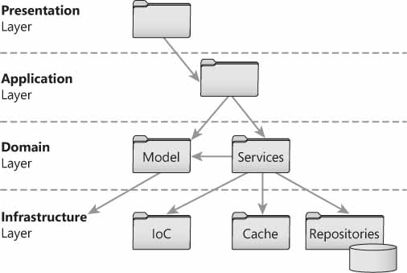
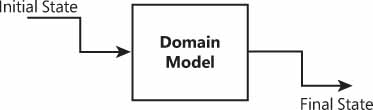

# ASP.NET Core 设计注意事项

本文将介绍web应用程序常见的一些问题，如全局配置数据、处理错误和异常的模式、控制器类的设计以及通过代码层传递数据的依赖注入等现代特性。


## 收集配置数据

在传统的ASP.NET应用程序中，获取配置数据的系统支持仅限于从web.config文件读取和写入的最小API。在启动时，开发人员通常将所有信息收集到一个全局数据结构中，该结构可以在应用程序的任何地方调用。在ASP.NET Core中，不再有web.config文件，但框架提供了更丰富和更复杂的基础结构来处理配置数据。

### 支持的数据提供者

ASP.NET Core应用程序的配置，基于在运行时从各种数据源收集的名称-值对的列表。配置数据的最常见方式是从JSON文件中读取数据。除此之外，还有许多其他方式可供选择，如下表所示：

| 数据来源                           | 描述                                               |
| ---------------------------------- | -------------------------------------------------- |
| Text files                         | 从特别的文件格式（包括JSON，XML和INI格式）读取数据 |
| Environment variables（环境变量）  | 从托管服务器上配置的环境变量中读取数据             |
| In-memory dictionaries（内存字典） | 从内存中的.NET字典类中读取数据                     |

此外，配置API还提供了一个内置的命令行参数数据提供程序，它可以直接从命令行参数生成名称 - 值配置对。但是，此选项在ASP.NET应用程序中并不常见，因为您几乎无法控制启动Web应用程序的控制台应用程序的命令行。命令行提供程序更常用于控制台应用程序开发。

#### JSON数据提供程序

任何JSON文件都可以成为ASP.NET Core应用程序配置的数据源。文件的结构完全由你决定，可以包含任何层次的嵌套。从应用程序启动时指定的内容根文件夹中，开始搜索给定的JSON文件。

#### 环境变量提供程序

服务器实例中定义的任何环境变量都自动适合添加到配置树中。你所要做的就是以编程方式将这些变量附加到树中。环境变量作为单个块添加，如果需要过滤，那么最好选择内存提供程序，并向字典中添加所选的环境变量。

#### 内存提供程序

内存提供程序是一个简单的名称-值对字典，以编程方式填充并添加到配置树中。作为开发人员，完全负责检索要存储在字典中的实际值。因此，通过内存提供程序传递的数据可以是常量，也可以从任何持久数据存储中读取。

#### 自定义配置提供程序

除了使用预定义的配置数据提供程序之外，您还可以创建自己的提供程序。在此上下文中，提供程序是实现`IConfigurationSource`接口的类，然而在实现内部，还需要引用从`ConfigurationProvider`继承的自定义类。

自定义配置提供程序的一个非常常见的示例是使用特别的数据库表来读取数据。提供程序最终隐藏所涉及的数据库表的架构和布局。要创建数据库驱动的提供程序，首先要创建一个配置源对象，该对象只不过是配置提供程序的包装器。

```c#
public class MyDatabaseConfigSource : IConfigurationSource
{
    public IConfigurationProvider Build(IConfigurationBuilder builder)
    {
        return new MyDatabaseConfigProvider();
    }
}
```

配置提供程序是执行实际数据检索的地方。配置提供程序包含并隐藏有关要使用的DbContext、表和列的名称以及连接字符串的详细信息。

```c#
public class MyDatabaseConfigProvider : ConfigurationProvider
{ 
    private const string ConnectionString = "...";
    public override void Load()
    {
        using (var db = new MyDatabaseContext(ConnectionString))
        {
            db.Database.EnsureCreated();
            Data = !db.Values.Any()
                      ? GetDefaultValues()
                      : db.Values.ToDictionary(c => c.Id, c => c.Value);
        }
    }

    private IDictionary<string, string> GetDefaultValues ()
    {
        // 用于确定要使用的默认值的伪代码
        var values = DetermineDefaultValues();
        return values;
    }
}
```

示例代码缺少`DbContext`类的实现，你可以在其中处理连接字符串，表和列。一般来说，假设`MyDatabaseContext`是你需要的另一段代码，使用`MyDatabaseContext`的代码片段引用一个名为`Values`的数据库表。

### 构建配置文档对象模型

配置数据提供程序是必需的组件，但对于在web应用程序中实际检索和使用参数信息来说还不够。所选提供者可以提供的所有信息必须聚合在一个单独的、可能是分层的DOM中。

#### 创建配置根

配置数据通常构建在`Startup`类的构造函数中，如下所示。注意，只有当您打算在某个地方使用`IHostingEnvironment`接口时，才需要注入它。通常，只有在设置定位JSON文件或其他配置文件的基本路径时，才需要注入`IHostingEnvironment`。

```c#
public IConfigurationRoot Configuration { get; }
public Startup(IHostingEnvironment env)
{
    var dom = new ConfigurationBuilder()
        .SetBasePath(env.ContentRootPath)
        .AddJsonFile("MyAppSettings.json")
        .AddInMemoryCollection(new Dictionary<string, string> { { "Timezone", "+1" } })
        .AddEnvironmentVariables()
        .Build();
        
    // 将配置根对象保存到启动成员中以供进一步引用
    Configuration = dom;
}
```

`ConfigurationBuilder`类负责聚合配置值和构建DOM。聚合数据应保存在Startup类中，以便稍后在管道初始化期间使用。下一个要解决的问题是如何读取配置数据，对配置根的引用只是你用来访问实际值的工具。

#### 配置文件的高级方面

只要你创建了自己的数据提供程序，就可以以任何格式存储配置，并且仍然可以将存储的数据作为名称 - 值对绑定到标准配置DOM。 ASP.NET Core支持现成的JSON，XML和INI格式。

要将每个都添加到配置构建器中，可以使用一个特别的扩展方法，例如`AddJsonFile`，`AddXmlFile`或`AddIniFile`。所有方法共享相同的签名，除文件名外还包括两个额外的布尔参数。

```c#
// Extension method of the IConfigurationBuilder type
public static IConfigurationBuilder AddJsonFile(this IConfigurationBuilder builder, 
     string path, 
     bool optional, 
     bool reloadOnChange);
```

第一个布尔参数指示文件是否可选。如果不是，则在找不到文件时抛出异常。第二个参数`reloadOnChange`指示是否应该监视文件的更改。如果是这样，那么只要文件发生更改，就会自动重建配置树以反映这些更改。

```c#
var builder = new ConfigurationBuilder()
       .SetBasePath(env.ContentRootPath)
       .AddJsonFile("MyAppSettings.json", optional: true, reloadOnChange: true);
Configuration = builder.Build();
```

根据这些说明，这是一种更有弹性的方式，可以从文本文件(无论是JSON、XML还是INI)加载配置数据。

> 补充说明：ASP.NET Core还支持用于设置特定于环境的文件。这意味着，与`MyAppSettings.json`一起，您还可以拥有`MyAppSettings.Development.json`，也许还有`MyAppSettings.Staging.json`。您添加了可能需要的所有JSON文件，系统只选择在给定上下文时看起来合适的文件。运行应用程序的当前环境由`ASPNETCORE_ENVIRONMENT`环境变量的值确定。在Visual Studio 2017中，您可以直接从项目的属性页面进行设置。在IIS或Azure App Service中，您只需通过相应的门户添加它。

#### 读取配置数据

要以编程方式读取配置数据，可以在配置根对象上使用`GetSection`方法，并为其传递路径字符串，以准确指示要读取的信息。要在层次架构中划分属性，可以使用:(冒号）符号。假设JSON文件如下所示：

```json
{
	"paging" : {
		"pageSize" : "20"
	},
	"sorting" : {
		"enabled" : "false"
	}
}
```

要读取设置，只要知道JSON模式中的值路径，就可以以多种不同的方式进行。例如，`paging:pagesize`是用来读取页面大小的路径字符串。您指定的路径字符串适用于当前配置DOM，和所有已定义数据源的聚合结果。路径字符串始终不区分大小写。读取设置的最简单方法是通过索引器API（以索引下标的形式），如下所示。

```c#
// 返回一个字符串
var pageSize = Configuration["paging:pageSize"];
```

需要注意的是，默认情况下，该设置作为普通字符串返回，并且必须在进一步使用之前以编程方式转换为其实际的具体类型。不过，还有一个强类型的API。

```c#
// 返回int类型数值
var pageSize = Configuration.GetValue<int>("paging:pageSize");
```

`GetSection`方法允许你选择一个完整的配置子树，可以使用索引器和强类型API来执行操作。

```c#
var pageSize = Configuration.GetSection("Paging").GetValue<int>("PageSize");
```

最后，还可以使用`GetValue`方法和`Value`属性。两者都会将设置的值作为字符串返回。请注意，`GetSection`方法是配置树上的通用查询工具，它不仅仅适用于JSON文件。

注意：配置API是只读的，表示你无法使用API回写已配置的数据源。如果您有另一种方法来编辑数据源的内容（即，程序覆盖文本文件），你需要做的就是调用`IConfigurationRoot`对象的`Reload`方法，系统允许重新加载配置树。

### 传递配置数据

通过路径字符串读取配置数据并不是特别友好，ASP.NET Core提供了一种将配置数据绑定到强类型变量和成员的机制。然而，在进一步探讨这一点之前，应该先探讨将配置数据传递给控制器和视图的方法。

#### 注入配置数据

到目前为止，我们已经在`Startup`类中使用了配置API。在Startup类中，可以配置应用程序的管道，这是读取配置数据的好地方。不过更常见的是，您需要将配置数据读入控制器方法和视图。要实现这一点，您可以采用一种旧方法和一种新方法。

旧方法包括将`IConfigurationRoot`对象转换为可从应用程序中的任何位置都可见的全局对象。它虽然有效，但这是一种不推荐的遗留方法。新方法包括使用DI系统使配置根对象可用于控制器和视图。

```c#
public class HomeController : Controller
{
     private IConfigurationRoot Configuration { get; }
     public HomeController(IConfigurationRoot config)
     {
        Configuration = config;
     }
     ...
}
```

每当创建`HomeController`类的实例时，都会注入配置根。但是，为了避免接收空引用，您必须首先将在`Startup`类中创建的配置根对象注册为单例。

```c#
services.AddSingleton<IConfigurationRoot>(Configuration);
```

您可以将这些代码放在`Startup`类的`ConfigureServices`方法中。注意，配置对象只是在`Startup`类的构造函数中创建的配置根对象。

#### 将配置映射到POCO类（没有派生自Controller类的控制器类）

在经典的ASP.NET MVC中，处理配置数据的最佳实践是，在启动时将所有数据加载到全局容器对象中。全局对象可以从控制器方法访问，它的内容可以作为参数注入到后端类，比如Repository甚至视图中。

相反，在ASP.NET Core中，可以使用所谓的Options模式将配置根DOM中的名称-值对自动绑定到配置容器模型中。Options模式是以下编码策略的描述性名称。

```c#
public void ConfigureServices(IServiceCollection services)
{
    // 初始化Options子系统
    services.AddOptions();
    
    // 在startup类的构造函数中
    // 将配置DOM的指定段映射到给定类型
    // 注意:下面使用的配置是创建的配置根 
    services.Configure<PagingOptions>(Configuration.GetSection("paging")); 
}
```

初始化Options子系统后，你可以要求子系统将从配置DOM的指定部分读取的所有值绑定到用作`Configure <T>`方法参数的类的公共成员中。绑定遵循控制器模型绑定所使用的相同规则，并且递归地应用于嵌套对象。如果给定数据和绑定对象的结构，不可能进行绑定，则绑定将静默失败。

`PagingOptions`是一个POCO类，用于存储一些（甚至全部）配置设置。这是一个可能的实现：

```c#
public class PagingOptions
{
	public int PageSize { get; set; }
	...
}
```

配置API的整体行为，类似于模型绑定在控制器级别处理请求期间的工作方式。在控制器和视图中使用配置的强类型对象的缺失链接可以在如何将其注入DI系统中找到。您必须使用`IOptions <T>`抽象类型。

向DI系统注册`IOptions`类型正是`AddOptions`扩展方法的目的。因此，剩下要做的就是在任何需要的地方注入`IOptions <T>`。

```c#
// PagingOptions是控制器类的内部成员 
protected PagingOptions Configuration { get; set; }

public CustomerController(IOptions<PagingOptions> config)
{
    PagingOptions = config.Value;
}
```

如果在所有控制器中广泛使用Options模式，那么您可能需要考虑将上面看到的`options`属性移动到某个基类，并从基类那里继承控制器类。

最后，在Razor视图中，你所做的就是使用`@inject`指令来引入`IOptions`类型的实例。


## 分层体系结构

控制器代码只是堆栈的最顶层部分，可以轻松映射到表示层。在表示层之下，我们可以识别出其他几个层，这些层使一个紧凑的应用程序易于部署到云和扩展。设计控制器及其依赖项的启发模式是分层架构模式，如下图所示：



与传统的三层架构相比，分层架构包含了第四部分，并扩展了数据访问层的概念，以涵盖任何其他所需的基础架构，例如数据访问和许多其他横切关注点，如电子邮件，日志记录和缓存等。

经典三层架构的业务层已经被分解为应用程序层和领域层。

- 应用程序逻辑是表示触发的任何任务的组合。应用程序层是发生任何特定于UI的数据转换的地方。
- 领域逻辑是特定业务的任何核心逻辑，可跨多个表示层重用。领域逻辑使用严格面向业务的数据模型来处理业务规则和核心业务任务。

在ASP.NET MVC应用程序中，表示层由控制器组成，应用程序层由特定于控制器的服务类组成。

### 表示层

表示层将数据传送到系统的其它部分，理想情况下，使用能够很好地反映页面数据结构的数据模型。

#### 输入模型

在ASP.NET中，任何输入数据都打包在HTTP请求中，无论它是在查询字符串中，还是以任何形式提交的数据中，还是在HTTP头文件或cookie中。输入数据表示提交给服务器以采取行动的数据。可以将输入数据视为松散的值和变量，也可以将其分组到充当容器的类中。输入类的集合形成应用程序的整体输入模型。

输入模型以与用户界面的期望相同的方式在系统的核心中携带数据。使用分离的输入模型可以更加轻松地以面向业务的方式设计用户界面。然后，应用程序层将负责解包数据并在适当时使用它。

#### 视图模型

任何一个请求都会得到响应，而且从ASP.NET MVC获得的响应通常是HTML视图。在ASP.NET MVC中，HTML视图的创建由控制器控制，该控制器调用系统的后端并接收响应。然后，控制器选择要使用的HTML模板，并将HTML模板和数据传递给特定的系统组件——视图引擎，它将混合模板和数据并为浏览器生成标记。

在ASP.NET MVC中，有几种方法可以将数据传递给视图引擎，并将其合并到结果视图中。您可以使用公共字典(如ViewData)、动态对象(如ViewBag) 、或者只收集要传递的所有属性的定制类。您创建的用于将数据合并到响应中的任何类都有助于创建视图模型。应用层是接收输入模型类并返回视图模型类的层。

```c#
[HttpGet]
public IActionResult List(CustomerSearchInputModel input)
{
    var model = _applicationLayer.GetListOfCustomers(input);
    return View(model);
}
```

表示层负责定义可接受数据的明确边界，应用层负责只接受和提供这些格式的数据。

### 应用层

应用层是系统后端的入口点，它是表示层和后端之间的联系点。应用层由几乎以一对一的方式绑定到表示层的用例的方法组成。建议为每个控制器创建一个服务类，并让控制器动作方法简单地屈服于服务类。服务类中的方法将接收输入模型中的类，并从视图模型中返回类。在内部，服务类将执行任何适当的转换，以使数据很好地映射到表示层，并准备好在后端进行处理。


应用层的主要目的是抽象用户感知到的业务流程，并将这些流程映射到应用程序后端的隐藏和受保护资产。 

### 领域层

领域层是业务逻辑的一部分，在大多数情况下，对用例来说是不变的。一个用例—即用户和系统之间的交互—有时会因访问站点的设备或站点的版本而不同。域逻辑提供特定于业务域而非特定于应用程序功能的代码片段和工作流。

领域层由领域模型和领域服务组成。在领域模型中，主要关注表示业务规则和领域流程的类。您不应该以识别要持久存储的数据聚合为目标;相反，您所识别的任何聚合都应该简单地从业务理解和建模开始。 

如下图所示，领域层与持久化无关，你只使用领域模型类以一种更容易编码的方式来执行业务任务。



状态被注入到域模型类中。例如，领域模型的Invoice类知道如何处理发票，但是它从外部接收要处理的数据。域模型和持久层之间的连接点是域服务。域服务是一个位于数据访问之上的类，它将数据引入，将状态加载到域模型类中，并将修改后的状态从域模型类中取出，并将其放回数据访问层。


### 基础结构层

基础结构层与使用具体技术相关，无论是数据持久性（ORM框架，如实体框架）、外部Web服务、特定的安全API，日志记录，跟踪，IoC容器，电子邮件，缓存等等。

基础结构层最突出的组成部分是持久层，它只不过是旧的忠实数据访问层，只是扩展到除普通关系数据存储之外的几个数据源。持久层知道如何读取和/或保存数据，并且由Repository类组成。

从概念上讲，Repository类是一个仅对持久化实体(如实体框架实体)执行CRUD操作的类。但是，您可以向Repository添加任何级别的逻辑。添加的逻辑越多，它看起来就越像领域服务或应用程序服务，而不是普通的数据访问工具。

总之，分层架构的目的是建立一个依赖链，从控制器开始，到达后端底部，通过应用程序服务和使用领域模型类(如果有的话)。


## 处理异常

在ASP.NET Core中，您可以找到许多经典ASP.NET MVC中的异常处理功能。您将找不到与`web.config`文件的各个部分相关的任何内容，例如自动重定向到错误页面。但是，ASP.NET Core异常处理的实践与经典ASP.NET中的实践大致相同。特别是，ASP.NET Core提供异常处理中间件和基于控制器的异常过滤器。

### 异常处理中间件

ASP.NET Core的异常处理中间件提供了一个集中的错误处理程序，它在概念上与经典ASP.NET的`Application_Error`处理程序相匹配。中间件捕获任何未处理的异常，并使用你的自定义逻辑将请求路由到最合适的错误页面。

有两种为不同的受众量身定制的中间件：开发人员和用户。合理地说，您可能希望在生产环境中使用用户的页面(甚至在演示环境中)，并在开发过程中坚持使用开发人员的页面。

#### 生产中的错误处理

无论您选择哪种中间件，配置方式始终都是一样的。您可以使用`Startup`类的`Configure`方法将中间件添加到管道中。

```c#
public class Startup
{
    public void Configure(IApplicationBuilder app)
    {
        app.UseExceptionHandler("/app/error");
        app.UseMvc();
    }
}
```

`UseExceptionHandler`扩展方法接收一个URL并将该URL的新请求放入ASP.NET管道中。最后，到指定错误页面的路由不是规范的HTTP 302重定向，而是管道将像往常一样处理的更多的内部优先化请求。

从开发人员的角度来看，您将用户“路由”到一个可以找出最合适的错误消息的页面。在某种程度上，错误处理与应用程序逻辑的主要过程是分离的。但与此同时，错误请求的内部特性使处理代码完全访问检测到的异常的所有细节。注意，在典型的重定向情况下，除非显式地将异常信息传递给HTTP 302响应之外的“下一个”请求，否则异常信息将丢失。

注意，异常处理中间件应该放在管道的最顶端，以确保检测到应用程序不会捕获的所有可能的异常。

#### 检索异常详细信息

通过正确配置异常处理中间件，任何未处理的异常都会将应用程序流路由到公共端点。在上面的代码片段中，端点是`AppController`类上的`Error`方法。这是该方法的最低限度实现。最相关的部分是如何检索异常信息。

```c#
public IActionResult Error()
{
    // 获取错误信息
    var error = HttpContext.Features.Get<IExceptionHandlerFeature>();
    if (error == null)
         return View(model);
    
    // 使用存储在检测异常对象中的信息
    var exception = error.Error;
    ...
}
```

与经典ASP.NET不同，在ASP.NET Core中，没有内置的Server对象及其流行的`GetLastError`方法。 HTTP上下文中的`Features`对象是检索未清除的异常信息的官方工具。

#### 捕获状态码

到目前为止提供的代码足以捕获和处理代码执行产生的任何内部服务器错误（HTTP 500）。如果状态代码不同怎么办？例如，如果由于URL不存在而发生异常会怎么样？要处理与HTTP 500不同的异常，您需要添加另一个中间件。

```c#
app.UseStatusCodePagesWithReExecute("/app/error/{0}");
```

如果检测到非HTTP 500异常，则`UseStatusCodePagesWithReExecute`扩展方法将流路由到给定URL。鉴于此，应重新考虑上述错误处理代码。

```c#
public IActionResult Error([Bind(Prefix = "id")] int statusCode = 0)
{
    // 切换到适当的页面
    switch(statusCode)
    {
        case 404:
           return Redirect(...);
        ...
    }

    // 在发生内部错误时检索错误信息
    var error = HttpContext.Features.Get<IExceptionHandlerFeature>();

    if (error == null)
         return View(model);

    // 使用存储在检测异常对象中的信息
    var exception = error.Error;
    ...
}
```

对于HTTP 404错误，您可以重定向到静态页面或视图，也可以在`error`方法提供的相同视图中调整错误消息。

#### 开发中的错误处理

ASP.NET Core是非常模块化的，几乎所有你想要的功能都必须显式启用。即使对于调试错误页面也是如此（经典的ASP.NET开发人员曾经称之为“死亡的黄页”）。要在发生异常时公布实际消息和堆栈跟踪，您应该使用另一个中间件。

```c#
app.UseDeveloperExceptionPage();
```

中间件不允许您路由到任何自定义页面，它只是动态地安排一个系统错误页面，该页面提供了异常发生时系统状态的详细信息（即异常黄页信息）。

通常情况下，您可能希望在生产和开发异常处理中间件之间自动切换。如果您使用宿主环境API的服务，这很容易实现：

```c#
Public void Configure(IApplicationBuilder app, IHostingEnvironment env)
{
    if (env.IsDevelopment())
    {
        app.UseDeveloperExceptionPage();
        app.UseStatusCodePagesWithReExecute("/app/error/{0}");
    } 
    else 
    {
        app.UseExceptionHandler("~/app/error");
        app.UseStatusCodePagesWithReExecute("/app/error/{0}");
    }
    ...
}
```

您可以使用`IHostingEnvironment`方法检测当前环境，并明智地决定要打开哪个异常中间件。

### 异常过滤器

作为良好开发的一般规则，您应该使用`try/catch`块来处理任何可能引发异常的代码，例如远程web服务或数据库调用。此外，您可以在控制器代码周围使用异常过滤器。

#### 设置异常过滤器

从技术上讲，异常过滤器是实现`IExceptionFilter`接口的类的实例：

```c#
public interface IExceptionFilter : IFilterMetadata
{
    void OnException(ExceptionContext context);
}
```

过滤器在`ExceptionFilterAttribute`及其所有派生类中实现，包括控制器类。这意味着您可以在任何控制器中覆盖`OnException`方法，并将其用作所有异常的捕获处理程序。

可以将异常过滤器配置为基于每个控制器全局运行，甚至可以基于每个操作运行。异常过滤器永远不会被调用来处理控制器操作领域之外的异常。

异常过滤器不会让您捕获模型绑定异常、路由异常和生成HTTP 500状态代码之外的异常，最明显的是HTTP 404，但也会有授权异常，如HTTP 401和HTTP 403。

#### 处理启动异常

到目前为止，所研究的所有异常处理机制都在应用程序管道上下文中运行。然而，在应用程序启动期间，在管道完全配置好之前，也可能发生异常。要捕获启动异常，必须在`Program.cs`中调整`WebHostBuilder`类的配置。

除了我们在前面讨论过的所有设置外，您还可以添加`CaptureStartupErrors`设置，如下所示。

```c#
var host = new WebHostBuilder()
     ...
     .CaptureStartupErrors(true) 
     .Build();
```

默认情况下，当启动进程因错误而突然终止时，主机将以静默方式退出。当`CaptureStartupErrors`设置为`true`时，主机将捕获`Startup`类中的任何异常并尝试显示错误页面。根据可以添加到`WebHostBuilder`类的其他设置的值，该页面可以是通用的或详细的。

```c#
var host = new WebHostBuilder()
     ...
     .CaptureStartupErrors(true) 
     .UseSetting("detailedErrors", "true")
     .Build();
```

### 记录异常

在ASP.NET Core中，通过`UseExceptionHandler`中间件处理的异常将被自动记录，前提是至少有一个记录器组件在系统中注册。所有日志记录器实例都经过系统提供的日志记录器工厂，默认情况下，该工厂是向DI系统添加的少数服务之一。

#### 连接日志记录提供程序

ASP.NET Core Logging API构建在一个被称为日志记录提供程序的特殊组件之上。日志记录提供程序允许您将日志发送到一个或多个目的地，例如控制台，调试窗口，文本文件，数据库等。 ASP.NET Core附带了各种内置提供程序，还允许您插入自定义提供程序。

将日志记录提供程序连接到系统的常用方法是通过`ILoggerFactory`服务上的扩展方法。

```c#
public void Configure(IApplicationBuilder app, ILoggerFactory loggerFactory)
{
    // /注册两个不同的日志提供程序
    loggerFactory.AddConsole();
    loggerFactory.AddDebug();
}
```

你可以在同一个应用程序中拥有任意数量的日志记录提供程序。添加日志记录提供程序时，您还可以选择添加日志级别，这意味着提供程序仅接收具有适当相关级别的消息。

#### 创建日志

日志记录提供程序通过在各自的目的地中存储消息来工作。日志是以某种方式（例如，按名称）标识的相关消息集。代码通过`ILogger`接口的服务写入日志。您可以通过几种不同的方式创建记录器。

首先，您可以直接从工厂创建日志记录器。以下代码段展示了如何创建一个日志记录器并为其指定唯一名称。通常，日志记录器记录在控制器的范围内。

```c#
public class CustomerController : Controller
{
    ILogger logger;
    public CustomerController(ILoggerFactory loggerFactory)
    {
        logger = loggerFactory.CreateLogger("Customer Controller");
        logger.LogInformation("Some message here");
    }
}
```

`CreateLogger`方法获取日志的名称，并在注册的提供程序中创建它。 `LogInformation`方法只是允许您写入日志的众多方法之一。 `ILogger`接口为每个支持的日志级别公开一种日志记录方法，例如，为了消除片段使用`LogInformation`输出信息性消息，使用`LogWarning`显示更严重的警告消息。日志记录方法可以接受普通字符串，格式化字符串，甚至可以接受序列化的异常对象。

或者，您可以通过DI系统解决`ILogger <T>`依赖关系，从而绕过记录器工厂。

```c#
public class CustomerController : Controller
{
    ILogger Logger;
    public CustomerController(ILogger<CustomerController> logger)
    {
        Logger = logger;
    }

    // 在动作方法中使用内部成员
    ...
}
```

此处创建的日志使用控制器类的全名作为前缀。


------


#### 参考资源

- 《Programming ASP.NET Core》


本文后续会随着知识的积累不断补充和更新，内容如有错误，欢迎指正。

最后一次更新时间：2018-10-26


------


