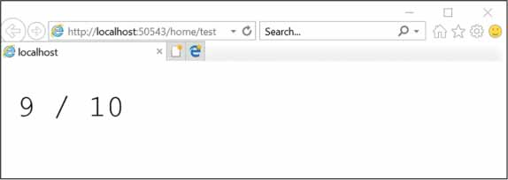

# ASP.NET Core访问应用程序数据


## .NET Core中的数据访问

在ASP.NET Core应用程序中进行数据访问时，经常会想到的第一个选项是使用Entity Framework Core（EF Core）。 本文将介绍使用EF Core可能执行的基本和最常见的任务。 

### Entity Framework 6.x

实体框架6.x（Entity Framework 6）是多年来我们在.NET应用程序中用于数据访问任务的忠实的O/RM框架。 EF6仅与新的.NET Core平台部分兼容，EF6不完全支持.NET Core。并且仅限于在Windows下运行。

注意，在Windows下运行时，ASP.NET Core应用程序可以在IIS下托管，但它也可以托管在Windows服务中并在Kestrel上运行。即使您丢失了IIS的高级服务，它也会非常高效。但与此同时，您并不总是需要这些服务。像往常一样，这是一个权衡问题。

### 在单独的类库中包装EF6代码

在ASP.NET Core应用程序中使用EF6的推荐方法是将所有类（包括DB上下文和实体类）放在单独的类库项目中，并使其针对完整的框架。接下来，对此项目的引用将添加到新的ASP.NET Core项目中。这个附加步骤是必需的，因为ASP.NET Core项目不支持您可以在EF6上下文类中以编程方式触发的所有功能。因此，不支持在ASP.NET Core项目中直接使用EF6上下文类。

#### 检索连接字符串

EF6上下文类检索其连接字符串的方式与ASP.NET Core的最新且完全重写的配置层不完全兼容。让我们考虑以下常见代码片段。

```c#
public class MyOwnDatabase : DbContext
{
   public MyOwnDatabase(string connStringOrDbName = "name=MyOwnDatabase")
       : base(connStringOrDbName)
   {
   } 
}
```

特定于应用程序的Db上下文类接收连接字符串作为参数或从`web.config`文件中检索它。在ASP.NET Core中，没有什么比`web.config`文件更好，因此连接字符串要么变成常量，要么应该通过.NET Core配置层读取并传入。

### 将EF Context与ASP.NET Core DI集成

您在Web上找到的大多数ASP.NET Core数据访问示例都显示了如何通过依赖注入（DI）将DB上下文注入应用程序的所有层。您可以像在任何其他服务中一样在DI系统中注入EF6上下文。理想的作用域是每个请求，这意味着同一个HTTP请求中所有可能的调用者共享同一个实例。

```c#
public void ConfigureServices(IServiceCollection services)
{
    // 这里添加的其他服务
    ...

    // 从配置中获取连接字符串
    var connString = ...;
    services.AddScoped<MyOwnDatabase>(() => new MyOwnDatabase(connString));
}
```

有了上面的配置，您现在可以将EF6 DB上下文直接注入控制器，或者更有可能将其注入存储库类。

```c#
public class SomeController : Controller
{
    private readonly MyOwnDatabase _context;
    public SomeController(MyOwnDatabase context)
    {
        _context = context;
    }

    // More code here
    ...
}
```

### ADO.NET适配器

在ASP.NET Core 2.0中，Microsoft带回了旧的ADO.NET API的一些组件，特别是`DataTable`对象，数据读取器和数据适配器。在ASP.NET 2.0应用程序中，您可以编写数据访问代码来管理连接，SQL命令和游标。

#### 直接使用SQL命令

在ASP.NET Core中，ADO.NET API具有与完整.NET Framework中几乎相同的编程接口，并且具有相同的编程范例。可以通过管理与数据库的连接并以编程方式创建命令及其参数来完全控制每个命令。

```c#
var conn = new SqlConnection();
conn.ConnectionString = "...";
var cmd = new SqlCommand("SELECT * FROM customers", conn);
```

准备就绪后，必须通过打开的连接发出命令：

```c#
conn.Open();
var reader = cmd.ExecuteReader(CommandBehavior.CloseConnection);

// Read data and do any required processing
...
reader.Close();
```

由于打开数据读取器时请求的紧密连接行为，因此在关闭阅读器时会自动关闭连接。 `SqlCommand`类可以通过各种方法执行命令。

`SqlCommand`类的执行方法

| 运行             | 描述                                                         |
| ---------------- | ------------------------------------------------------------ |
| ExecuteNonQuery  | 执行命令但不返回任何值。UPDATE等非查询语句的理想选择。       |
| ExecuteReader    | 执行命令并返回指向输出流开头的游标。非常适合查询命令。       |
| ExecuteScalar    | 执行命令并返回单个值。非常适合返回标量值（如MAX或COUNT）的查询命令。 |
| ExecuteXmlReader | 执行命令并返回XML阅读器。非常适合返回XML内容的命令。         |

上述表格中提供了多种选项来获取要执行的任何SQL语句或存储过程的结果。这是一个示例，说明如何浏览数据读取器的记录。

```c#
var reader = cmd.ExecuteReader(CommandBehavior.CloseConnection);
while(reader.Read())
{
    var column0 = reader[0];	             // returns an Object
    var column1 = reader.GetString(1)    // index of the column to read
    // Do something with data
}
reader.Close();
```

注意：.NET Core中的ADO.NET API与.NET Framework中的API相同，并且不支持SQL Server区域中的更新近期开发，例如SQL Server 2016及更高版本中的原生JSON支持。例如，没有像`ExecuteJsonReader`方法那样将JSON数据解析为类。

#### 在断开连接的容器中加载数据

如果需要处理长时间的响应，同时将内存数量保持在最低限度，那么使用Reader是理想的选择。否则，最好将查询结果加载到断开连接的容器（如DataTable对象）中。

```c#
conn.Open();
var reader = cmd.ExecuteReader(CommandBehavior.CloseConnection);
var table = new DataTable("Customers");
table.Columns.Add("FirstName");
table.Columns.Add("LastName");
table.Columns.Add("CountryCode");
table.Load(reader);
reader.Close();
```

DataTable对象是具有模式、关系和主键的数据库表的内存版本。填充数据的最简单方法是获取数据阅读器游标并在声明的列中加载整个内容。映射是通过列索引进行的，而`Load`方法背后的实际代码与前面介绍的循环非常接近。但是，从您的角度来看，它只需要一种方法，但是仍然由你负责管理数据库连接的状态。出于这个原因，通常，您可以采用的最安全的方法是使用Dispose模式并在C# `using`语句中创建数据库连接。

#### 通过适配器获取

将数据提取到内存容器中的最紧凑方法是通过数据适配器。数据适配器是汇总整个查询过程的组件。它由命令对象或仅选择命令文本和连接对象组成。它负责为您打开和关闭连接，并将查询的所有结果（包括多个结果集）打包到DataTable或DataSet对象中。 （DataSet是DataTable对象的集合。）

```c#
var conn = new SqlConnection();
conn.ConnectionString = "...";
var cmd = new SqlCommand("SELECT * FROM customers", conn);
var table = new DataTable();
var adapter = new SqlDataAdapter(cmd);
adapter.Fill(table);
```

### 使用微型O/RM框架

与上面讨论的DataTable对象相比，O/RM将相同的低级数据加载到强类型的类中，而不是一般的面向表的容器中。当提到.NET Framework的O/RM框架时，大多数开发人员都会想到Entity Framework或者NHibernate。这些是最流行的框架，同时也是最庞大的。对于O/RM框架，是否庞大与它支持的功能的数量有关，从映射功能到缓存，从事务性到并发性。在现代的O/RM中，对LINQ查询语法的支持至关重要。它提供了很多的特性和功能，这些不可避免地会影响内存占用，甚至影响单个操作的性能。这就是为什么开始使用微型O/RM框架的原因。

#### 微型O/RM示例

Stack Overflow团队选择创建一个量身定制的迷你O/RM——Dapper框架，负责编写超级优化的SQL查询并添加大量的外部缓存层。 Dapper框架可从http://github.com/StackExchange/Dapper获得。该框架在针对SQL数据库执行SELECT语句并将返回的数据映射到对象方面表现出色。它的性能几乎与使用数据读取器相同，这是在.NET中查询数据的最快方式，但它可以返回内存中的对象列表。

```c#
var customer = connection.Query<Customer>(
           "SELECT * FROM customers WHERE Id = @Id", 
           new { Id = 123 });
```

另一个O/RM框架——NPoco框架，同样遵循相同的指导原则，甚至代码与Dapper的差别也很小。 NPoco框架可在http://github.com/schotime/npoco上找到。

```c#
using (IDatabase db = new Database("connection_string"))  
{ 
    var customers = db.Fetch<Customer>("SELECT * FROM customers"); 
}
```

除此之外，还有其他一些微型O/RM框架，例如：

Insight.Database：https://github.com/jonwagner/Insight.Database

PetaPoco：https://github.com/CollaboratingPlatypus/PetaPoco

### 使用NoSQL存储

NoSQL可以概括为当你不希望或者不需要关系存储时，NoSQL是你选择的数据存储范式。总之，只有一个用例需要使用NoSQL存储：当记录的模式发生变化，但是记录在逻辑上是相关的。

下面是书中给出的一个场景：

> 可以考虑使用表单或问卷来填写和存储多租户应用程序。每个租户都可以有自己的字段列表，您需要为各种用户保存值。每个租户表单可能不同，但结果记录在逻辑上是相关的，最好放在同一个存储中。在关系数据库中，除了创建所有可能字段的联合模式之外，您只有很少的选项。但即使在这种情况下，为租户添加新字段也需要更改表的模式。按行而不是按列组织数据会带来其他问题，例如每当查询租户的页面大小超过SQL页面大小时，性能都会受到影响。同样，这取决于特定的应用程序使用情况，但事实是，无模式数据对于关系存储来说并不理想。
>

NoSQL存储通常作为一种缓存形式使用，很少用作主要数据存储。当它们用作主数据存储时，通常是因为应用程序具有事件源架构。

#### 物理存储

物理NoSQL存储是一种无模式数据库，可将.NET Core对象保存到磁盘，并提供获取和过滤它们的函数。最受欢迎的NoSQL存储可能是MongoDB，它与微软的Azure DocumentDB密切相关。有趣的是，只需更改连接字符串，就可以使用MongoDB API编写的应用程序写入到DocumentDB数据库。下面是一个DocumentDB查询示例。

```c#
var client = new DocumentClient(azureEndpointUri, password);
var requestUri = UriFactory.CreateDocumentCollectionUri("MyDB", "questionnaire-items");
var questionnaire = client.CreateDocumentQuery<Questionnaire>(requestUri) 
        .Where(q => q.Id == "tenant-12345" && q => q.Year = 2018) 
        .AsEnumerable() 
        .FirstOrDefault();
```

NoSQL存储的主要优点是能够存储形状不同但相关的数据和规模存储以及简单的查询功能。其他物理NoSQL数据库是RavenDB，CouchDB和CouchBase，它们特别适用于移动应用程序。

#### 内存存储

内存存储本质上是作为键值字典工作的大型缓存应用程序。尽管它们备份了内容，但它们被认为是应用程序存放数据以便快速检索的大块内存。 Redis（http://redis.io）是内存存储的一个很好的例子。

要了解此类框架的相关性，请再次考虑Stack Overflow的公开文档体系结构。 Stack Overflow（www.stackoverflow.com）使用一个定制版本的Redis作为中间二级缓存，可以长时间地维护问题和数据，而无需从数据库重新查询。 Redis支持磁盘级持久化，LRU删除，复制和分区。 Redis不能直接从ASP.NET Core访问，但可以通过ServiceStack API完成（请参阅http://servicestack.net）。

另一个内存中的NoSQL数据库是Apache Cassandra，它可以通过DataStax驱动程序在ASP.NET Core中访问。


## EF Core常见任务

EF Core支持提供程序模型，通过该模型，可以使用各种关系DBMS，特别是SQL Server，Azure SQL数据库，MySQL和SQLite。对于所有这些数据库，EF Core都有一个本机提供程序。此外，还存在内存提供程序，有助于用于测试相关的目的。对于PostgreSQL，您需要来自http://npgsql.org的外部提供程序。 

要在ASP.NET Core应用程序中安装EF Core，您需要`Microsoft.EntityFrameworkCore`包以及您打算使用的数据库提供程序的特定包（SQL Server，MySQL，SQLite或其他）。下面列出了您将执行的最常见任务。

### 建模数据库

EF Core只支持Code First方法，这意味着它需要一组类来描述数据库和包含的表。这个类集合可以从头编码，也可以通过现有数据库中的工具反向设计。

#### 定义数据库和模型

最后，数据库是根据从`DbContext`派生的类建模的。这个类包含一个或多个类型为`DbSet <T>`的集合属性，其中`T`是表中记录的类型。这是示例数据库的结构。

```c#
public class YourDatabase : DbContext
{
   public DbSet<Customer> Customers { get; set; }
}
```

`Customer`类型描述`Customers`表的记录。底层物理关系数据库应该有一个名为`Customers`的表，其模式与`Customer`类型的公共接口匹配。

```c#
public class EntityBase
{
    public EntityBase()
    {
        Enabled = true;
        Modified = DateTime.UtcNow;
    }
    public bool Enabled { get; set; }
    public DateTime? Modified { get; set; }
}
public class Customer : EntityBase
{
    [Key]
    public int Id { get; set; }
    public string FirstName { get; set; }
    public string LastName { get; set; }
}
```

在设计`Customer`类的公共接口时，仍然可以使用常见的面向对象技术并使用基类在所有表之间共享公共属性。在本例中，`Enabled`和`Modified`是自动添加到所有表中的两个属性，这些表的映射类从`EntityBase`继承。另外请注意，生成表的任何类都必须定义主键字段。例如，您可以通过`Key`属性来实现。

#### 注入连接字符串

从技术上讲，除非指定了提供者和要运行的所有信息(尤其是连接字符串)，否则`DbContext`派生类不会完全配置为在数据库上工作。您可以设置提供程序覆盖`DbContext`类的`OnConfiguring`方法。该方法接收一个选项构建器（OptionsBuilder）对象，该对象带有一个本地支持的每个提供程序的扩展方法：对于SQL Server，SQLite以及仅测试的内存数据库。若要配置SQL Server（包括SQL Express和Azure SQL数据库），需要执行以下操作：

```c#
public class YourDatabase : DbContext
{
   public DbSet<Customer> Customers { get; set; }

   protected override void OnConfiguring(DbContextOptionsBuilder optionsBuilder)
   {
       optionsBuilder.UseSqlServer("...");
   }
}
```

`UseSqlServer`的参数必须是连接字符串。如果可以接受连接字符串是常量，那么只需在上面代码片段中看到省略号的地方键入它。更实际的是，更实际的做法是，您希望根据不同的环境（生产、演示、开发等）使用不同的连接字符串。在这种情况下，您应该找到一种方法来注入它。

因为连接字符串不会动态地改变(如果它改变了，这是一种非常特殊的情况，值得以不同的方式对待)，所以首先想到的选项是向要用连接字符串设置的DbContext类添加一个全局静态属性。

```c#
public static string ConnectionString = "";
```

现在，`ConnectionString`属性以静默方式传递给`OnConfiguring`方法中的`UseSqlServer`方法。通常从配置文件中读取连接字符串，并在应用程序启动时设置。

```c#
public void Configure(IApplicationBuilder app, IHostingEnvironment env)
{
    YourDatabase.ConnectionString = !env.IsDevelopment()
        ? "production connection string"
        : "development connection string";

    // More code here
}
```

类似的，可以使用不同的JSON配置文件进行生产和开发，并存储要使用的各个连接字符串。从DevOps角度来看，这种方法也可能更容易，因为发布脚本只是按照约定获取正确的JSON文件。

### 注入DbContext对象

如果你搜索EF Core文章（包括Microsoft官方文档），你会看到许多示例显示了遵循以下指导原则的代码。

```c#
public void ConfigureServices(IServiceCollection services)
{
     var connString = Configuration.GetConnectionString("YourDatabase");
     services.AddDbContext<YourDatabase>(options =>
            options.UseSqlServer(connString));
}
```

代码将`YourDatabase`上下文对象添加到DI子系统，以便可以从应用程序的任何位置检索它。在添加上下文的同时，代码还根据当前请求的范围对其进行完全配置。在示例中，还将对给定的连接字符串使用SQL Server提供程序。

或者，可以自己创建数据库上下文的实例，并为其提供所需的生命周期（instance, singleton, or scoped），并仅在上下文中注入连接字符串。上面讨论的静态属性是一个选项，这是另一个。

```c#
public YourDatabase(IOptions<GlobalConfig> config)
{
    //将连接字符串保存到本地变量
	//从应用程序的配置JSON文件中读取。
}
```

你可以应用选项模式并将全局配置数据从JSON资源加载到类中，然后通过DI将该类注入到类的构造函数中。

#### 自动创建数据库

对数据库建模并将其映射到类的整个过程与EF6略有不同，创建数据库(如果它不存在)所需的代码也是。在EF Core中，必须显式地请求这个步骤，而不是数据库初始化器组件基础的结果。如果希望创建数据库，请在`Startup`类中的`Configure`方法中放置以下两行代码：

```c#
var db = new YourDatabase();
db.Database.EnsureCreated();
```

如果数据库不存在，则`EnsureCreated`方法创建数据库（否则跳过）。将初始数据加载到数据库也在你的完全编程控制之下。一个常见的模式是公开一个公共方法，`DbContext`类的名称由你决定，并在`EnsureCreated`之后立即调用它。

```c#
db.Database.SeedTables();
```

### 处理表数据

在很大程度上，使用EF Core读写数据与EF6中相同。

#### 获取记录

以下代码显示如何通过其主键获取记录。

```c#
public Customer FindById(int id)
{
    using (var db = new YourDatabase())
    {
        var customer = (from c in db.Customers
                        where c.Id == id
                        select c).FirstOrDefault();
        return customer;
    }
}
```

有两件事比代码本身更有意义。

- 首先，代码封装在由存储库类公开的方法中。存储库类是一个包装类，它使用`DbContext`的新实例或注入的副本来公开特定于数据库的操作。
- 第二个相关的事情是上面的代码是一个整体。它打开与数据库的连接，检索其数据并关闭连接。这一切都发生在单个透明数据库事务的上下文中。如果需要运行两个不同的查询，请考虑对存储库方法的两次调用将打开/关闭与数据库的连接两次。

如果您正在编码的业务流程需要来自数据库的两个或多个查询，您可能希望尝试将它们连接到单个透明事务中。`DbContext`实例的作用域决定了系统创建的数据库事务的作用域。

```c#
public Customer[] FindAdminAndSupervisor()
{
    using (var db = new YourDatabase())
    {
        var admin = (from c in db.Customers
                        where c.Id == ADMIN
                        select c).FirstOrDefault();
        var supervisor = (from c in db.Customers
                        where c.Id == SUPERVISOR
                        select c).FirstOrDefault();
        return new[] {admin, supervisor};
    }
}
```

在本例中，两个记录是通过不同的查询检索的，但是在同一个事务中并通过相同的连接检索。另一个有趣的用例是，整个查询是分段构建的。假设一个方法获取一大块记录，然后将输出传递给另一个方法，以便根据运行时条件进一步限制结果集。下面是一些示例代码:

```c#
//打开连接并返回结果
var customers = FindByContinent("EU");

// 运行内存查询，只选择来自上述结果的查询
if (someConditionsApply())
{
    customers = (from c in customers where c.Area.Is("EAST") select c).ToList();
}
```

最后，您可以得到您所需要的，但内存的使用并不是最佳的。这里有一个更好的方法：

```c#
public IQueryable<Customer> FindByContinent(string continent)
{
    var customers = (from c in db.Customers 
                     where c.Continent == continent
                     select c);


    // 此时实际上没有运行查询 
    // 返回查询的定义
    return customers;
}
```

在查询表达式的末尾不调用FirstOrDefault或ToList实际上并不会运行查询；相反，它只是返回它的形式描述。

```c#
// 打开连接并返回所有客户
var query = FindByContinent("EU");

// 运行内存查询，只选择来自东欧的查询
if (someConditionsApply())
{
    query = (from c in query where c.Area.Is("EAST") select c;
}
var customers = query.ToList();
```

第二个过滤器现在只是编辑查询，添加一个额外的`WHERE`子句。接下来，当调用`ToList`时，查询只运行一次。

#### 处理关系

以下代码定义了两个表之间的一对一关系。 `Customer`对象引用`Countries`表中的`Country`对象。

```c#
public class Customer : EntityBase
{
    [Key]
    public int Id { get; set; }
    public string FirstName { get; set; }
    public string LastName { get; set; }

    [ForeignKey]
    public int CountryId { get; set; }
    public Country Country { get; set; }
}
```

这足以让数据库定义表之间的外键关系。查询客户记录时，可以轻松的通过基础连接语句扩展`Country`属性。

````c#
var customer = (from c in db.Customers.Include("Country")
                where c.Id == id
                select c).FirstOrDefault();
````

由于使用了`Include`调用，现在返回的对象的`Country`属性在配置的外键上用`JOIN`语句填充。要包含的字符串是外键属性的名称。从技术上讲，在查询语句中，可以有任意多的`Include`调用。但是，您拥有的内容越多，返回的对象图表以及随后的额外内存消耗也会增长。

#### 添加记录

添加新记录需要一些代码在内存中添加对象，然后将集合持久保存到磁盘。

```c#
public void Add(Customer customer)
{
    if (customer == null)
      return;
    using (var db = new YourDatabase())
    {
        db.Customers.Add(customer);
        try 
        {
           db.SaveChanges();
        } 
        catch(Exception exception) 
        {
           // Recover in some way or expand the way
           // it works for you, For example, only catching
           // some exceptions.
        }
    }
}
```

#### 更新记录

在EF Core更新中，记录是两步操作。首先，查询要更新的记录，然后在相同的`DbContext`上下文中，更新其在内存中的状态并保持更改。

```c#
public void Update(Customer updatedCustomer)
{
   using (var db = new YourDatabase())
   {
       // Retrieve the record to update
       var customer = (from c in db.Customers
                       where c.Id == updatedCustomer.Id
                       select c).FirstOrDefault();
       if (customer == null)
           return;
           
       // Make changes   
       customer.FirstName = updatedCustomer.FirstName;
       customer.LastName = updatedCustomer.LastName;
       customer.Modified = DateTime.UtcNow;
       ...

       // Persist
       try 
       {
           db.SaveChanges();
       } 
       catch(Exception exception) 
       {
           // Recover in some way or expand the way
           // it works for you, For example, only catching
           // some exceptions.
       }
    }
}
```

#### 删除记录

删除记录就像更新记录一样。此外，在这种情况下，您必须检索要删除的记录，将其从数据库的内存中集合中删除，然后更新物理表。

```c#
public void Delete(int id)
{
    using (var db = new YourDatabase())
    {
       // Retrieve the record to delete
       var customer = (from c in db.Customers
                       where c.Id == id
                       select c).FirstOrDefault();
       if (customer == null)
           return;
       db.Customers.Remove(customer);
       
       // Persist
       try 
       {
           db.SaveChanges();
       } 
       catch(Exception exception) 
       {
           // Recover in some way or expand the way
           // it works for you, For example, only catching
           // some exceptions.
       }
    }
}
```

如果您确实需要从数据库中物理删除记录，无论是否在数据库级别配置了级联选项，您都可以使用纯SQL语句。

```c#
db.Database.ExecuteSqlCommand(sql);
```

### 处理事务

在实际应用程序中，大多数数据库操作都是事务的一部分，有时，它们也是分布式事务的一部分。默认情况下，如果基础数据库提供程序支持事务，则在事务中处理随单次调用`SaveChanges`所做的所有更改。这意味着如果任何更改失败，则回滚整个事务，以便所有尝试的更改都不会物理应用于数据库。换句话说，`SaveChanges`要么完成所有它要做的工作，要么什么都不做。

#### 事务的显式控制

如果你无法通过单次调用`SaveChanges`来驱动所有更改，则可以通过`DbContext`类上的特定方法来定义显式事务。

```c#
using (var db = new YourDatabase())
{
   using (var tx = db.Database.BeginTransaction())
   {
       try 
       {
            // 所有数据库调用，包括多个SaveChanges调用
            ...
            
            // Commit
            tx.Commit();
       }
       catch(Exception exception)
       {
           // Recover in some way or expand the way
           // it works for you, For example, only catching
           // some exceptions.
       }
   }
}
```

#### 共享连接和事务

在EF Core中，在创建`DbContext`对象的实例时，可以注入数据库连接或事务对象。这两个对象的基类是`DbConnection`和`DbTransaction`。

如果将相同的连接和事务注入到两个不同的`DbContext`对象中，那么最终结果是跨这些上下文的所有操作都将在同一事务中和同一数据库连接上发生。以下代码段显示了如何在`DbContext`中注入连接。

```c#
public class YourDatabase : DbContext
{
    private DbConnection _connection;
    public YourDatabase(DbConnection connection)
    {
       _connection = connection;
    }
    public DbSet<Customer> Customers { get; set; }

    protected override void OnConfiguring(DbContextOptionsBuilder optionsBuilder)
    {
        optionsBuilder.UseSqlServer(_connection);
    }
}
```

相反，要注入事务范围，可以执行以下操作：

```c#
context.Database.UseTransaction(transaction);
```

要从正在运行的事务中获取事务对象，请使用`GetDbTransaction`方法。

### 关于异步数据处理

EF Core中触发数据库操作的所有方法都有一个异步版本：`SaveChangesAsync`，`FirstOrDefaultAsync`和`ToListAsync`等来命名最常见的方法。

#### 异步处理的意义

异步处理本身并不比同步处理快。相反，异步调用具有比同步调用更复杂的执行流程。在Web应用程序的上下文中，异步处理主要是在等待同步调用返回时不阻塞线程。因此，整个应用程序响应速度更快，因为它可以接受并提供更多请求。从这里可以感觉到速度的提高，更重要的是可伸缩性的提高。

C＃语言使用`async` / `await`关键字以非常简单的方式将任何明显的同步代码转换为异步代码。然而，强大的功能带来了巨大的责任：始终意识到产生额外的线程来处理可能不需要异步的工作负载的成本。请记住，这里不是处理并行性，而是将工作负载转发到另一个线程，而当前线程返回池中处理更多传入请求。您可以获得更高的可扩展性，但速度上可能会有轻微的影响。

#### ASP.NET Core应用程序中的异步处理

如果你将控制器方法标记为异步，下述代码中，跟踪异步操作之前和之后的线程ID。

```c#
public async Task<IActionResult> Test()
{
    var t1 = Thread.CurrentThread.ManagedThreadId.ToString();
    var client = new HttpClient();
    await client.GetStringAsync("http://www.google.com");
    var t2 = Thread.CurrentThread.ManagedThreadId.ToString();
    return Content(string.Concat(t1, " / ", t2));
}
```

执行效果如下图所示：




上述代码中，请求由异步断点之前和之后的不同线程提供。对特定页面的请求并没有真正受益于异步实现，但该站点的其余部分将享受它。原因是没有ASP.NET线程忙于等待I / O操作完成。在请求.NET线程池调用`GetStringAsync`异步操作之后，线程＃9立即返回到ASP.NET池以提供任何新的传入请求。完成此异步方法后，将拾取池中的第一个可用线程。它可能是第9号线，但不一定。在高流量的站点中，长时间操作所需的几秒钟内到达的请求数量可能会保持较高的或降低站点的响应级别。

#### 数据访问中的异步处理

> 为了使线程返回到池中，并准备为另一个请求提供服务，线程需要等待异步操作。这种语法的措辞可能会令人困惑：当您看到await MethodAsync出现时，这意味着当前线程将对MethodAsync的调用推送到.NET线程池并返回。 在MethodAsync调用之后的代码将在方法返回后的任何可用线程上发生。如下面的代码片段中那样调用Web服务是可能的。另一种可能性是通过EF Core异步调用某个数据库。
>
> 让我们考虑一个常见的场景。假设你有一个由一些静态内容组成的Web应用程序，视图渲染速度相对较快，并且由于需要长时间的数据库操作，一些视图运行速度明显变慢。
>
> 假设有许多并发请求耗尽线程池。这些请求中有许多需要访问数据库，随后，所有这些线程都用于处理请求，但实际上是空闲的，等待数据库查询返回。您的系统无法提供更多请求，CPU几乎达到0％！将数据库访问转换为异步代码似乎可以解决这类问题。
>
> 通过将您的数据访问代码转换为异步模式，您只能获得阻塞数据库的能力！您转向异步，因为您的数据库太慢而无法响应传入的请求，您所做的就是向数据库发送更多查询。这不是解决问题的方法。在Web服务器和数据库之间添加缓存将是一个更好的解决方案。同样，要花时间在负载下度量分布式应用程序的性能，并在需要时更新代码和体系结构。
>
> 另一方面，这并不是唯一的情况。甚至有可能通过使用异步为静态资源或快速页面提供更多的请求。在这种情况下，您的站点将为用户提供更快速的响应体验并提供更好的可伸缩性。
>


------


#### 参考资源

- 《Programming ASP.NET Core》


本文后续会随着知识的积累不断补充和更新，内容如有错误，欢迎指正。

最后一次更新时间：2018-11-01

------


