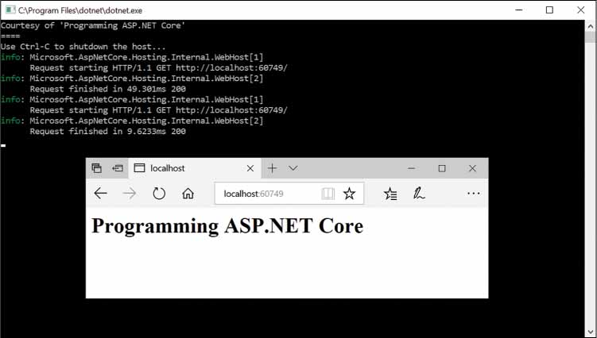
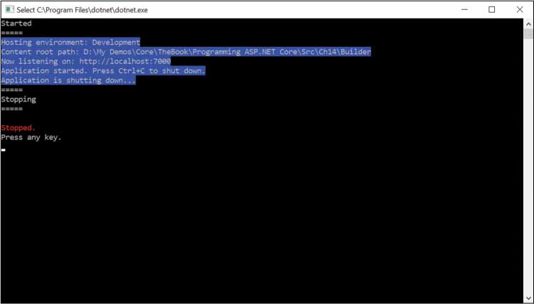

# ASP.NET Core 运行时环境

在ASP.NET Core中，运行时环境和任何请求通过的管道与以前版本的ASP.NET中的内容完全不同。此外，新的ASP.NET Core运行时环境由系统提供的嵌入式依赖注入（DI）基础架构提供支持，该基础架构像幽灵朋友一样静静地监视处理传入请求的所有步骤。

本文将进一步深入探讨ASP.NET Core运行时环境及其组件的内部体系结构，主要是Kestrel服务器和请求中间件。


## ASP.NET Core Host

ASP.NET Core应用程序的核心是一个独立的控制台应用程序，它为实际的应用程序模型（很可能是MVC应用程序模型）设置主机环境。主机负责配置侦听传入HTTP请求，并将请求传递到处理管道的服务器。以下代码展示了典型ASP.NET Core应用程序的主机程序的默认实现，因为它来自标准的Visual Studio 2017模板。以下源代码编写在ASP.NET Core项目的program.cs文件中。

```c#
public class Program
{
    public static void Main(string[] args)
    {
        BuildWebHost(args).Run();
    }

    public static IWebHost BuildWebHost(string[] args) =>
        WebHost.CreateDefaultBuilder(args)
            .UseStartup<Startup>()
            .Build();
}
```

让我们了解更多关于Web主机组件以及启动主机所需的其他更简单的选项。

### WebHost类

WebHost是一个静态类，它提供了两种方法来创建使用预定义设置公开IWebHostBuilder接口的类实例。该类还提供了许多方法来快速启动环境，只传递要侦听的URL和要实现的行为的委托。

#### 配置主机的行为

WebHost类的Start方法允许你以多种方式设置Web应用程序。

```c#
using (var host = WebHost.Start(
     app => app.Response.WriteAsync("Programming ASP.NET Core")))
{
    // Wait for the host to end
    ...
}
```

应用程序所做的全部工作是运行指定的函数，而不管调用的URL是什么。WebHost类的Start方法返回的实例是IWebHost类型，表示应用程序已启动的主机环境。在WebHost.Start方法中，运行以下伪代码：

```c#
public static IWebHost Start(RequestDelegate app) 
{
   var defaultBuilder = WebHost.CreateDefaultBuilder();
   var host = defaultBuilder.Build();

   // 这一行实际上启动了主机
   host.Start();
   return host;
}
```

注意，Start方法以非阻塞方式运行主机，这意味着主机需要一些额外的指令来继续侦听传入的请求。这是一个例子：

```c#
public static void Main(string[] args)
{
     using (var host = WebHost.Start(
         app => app.Response.WriteAsync("Programming ASP.NET Core")))
         {
            // Wait for the host to end
            Console.WriteLine("Courtesy of 'Programming ASP.NET Core'\n====");
            Console.WriteLine("Use Ctrl-C to shut down the host...");
            host.WaitForShutdown();
         }
}
```

运行代码效果如下：



默认情况下，主机侦听端口5000上的传入请求。从图中可以看出，即使在用户级代码中没有明显的行被打开，日志记录器也会自动打开。这意味着主机接收一些默认配置。 WebHost.CreateDefaultBuilder方法由Start方法在内部调用，负责接收默认配置。我们来了解有关默认设置的更多信息。

#### 默认设置

在ASP.NET Core 2.0中，方法CreateDefaultBuilder（在WebHost类上定义为静态方法）创建并返回主机对象的实例。 WebHost上定义的所有Start方法最终都在内部调用默认构建器。以下是调用默认Web主机构建器时发生的情况。

```c#
public static IWebHostBuilder CreateDefaultBuilder(string[] args)
{
   return new WebHostBuilder()
           .UseKestrel()
           .UseContentRoot(Directory.GetCurrentDirectory())
           .ConfigureAppConfiguration(
            (Action<WebHostBuilderContext, IConfigurationBuilder>) ((context, config) =>
                {
                   var env = context.HostingEnvironment;
                   config.AddJsonFile("appsettings.json", true, true)
                         .AddJsonFile(string.Format("appsettings.{0}.json", 
                                     env.EnvironmentName), true, true);
                   if (env.IsDevelopment())
                   {
                      var assembly = Assembly.Load(new AssemblyName(env.ApplicationName));
                      if (assembly != null)
                         config.AddUserSecrets(assembly, true);
                   }
                   config.AddEnvironmentVariables();
                   config.AddCommandLine(args);
                  }))
            .ConfigureLogging(
              (Action<WebHostBuilderContext, ILoggingBuilder>) ((context, logging) => 
                 {                  logging.AddConfiguration(context.Configuration.GetSection("Logging"));
                      logging.AddConsole();
					  logging.AddDebug();
                 }))
            .UseIISIntegration()
            .UseDefaultServiceProvider(
                (Action<WebHostBuilderContext, ServiceProviderOptions>) ((context, options) =>  
                    {
                      options.ValidateScopes = context.HostingEnvironment.IsDevelopment()));
                    }
    }
```

总之，默认构建器做了6件不同的事情，如下表所示：

| Action           | 描述                                                         |
| ---------------- | ------------------------------------------------------------ |
| Web server       | 添加Kestrel作为ASP.NET Core管道的嵌入式Web服务器             |
| Content root     | 将当前目录设置为Web应用程序访问的任何基于文件的内容的根文件夹。 |
| Configuration    | 添加一些配置提供程序：appsettings.json，环境变量，命令行参数和用户机密（仅在开发模式下）。 |
| Logging          | 添加一些日志记录提供程序：在配置树的日志记录部分中定义的日志提供程序以及控制台和调试记录程序。 |
| IIS              | 启用与IIS集成作为反向代理。                                  |
| Service provider | 配置默认服务提供者。                                         |

需要注意的是，每当您调用WebHost类中的一个方法来启动web应用程序的主机时，所有这些操作总是发生在您的控制之外。如果你想为主机建立一个自定义的设置集合，请继续阅读。然而，在研究自定义主机配置之前，让我们先研究一下实际运行主机并让它侦听传入调用的选项。

#### 启动主机

每当通过WebHost类公开的任何方法创建主机时，都会收到一个已经启动的主机，该主机已经在侦听配置好的地址。如之前所述，默认情况下使用的Start方法以非阻塞方式启动主机，但也存在其他选项。

Run方法启动Web应用程序，然后阻塞调用线程，直到主机关闭。相反，WaitForShutdown方法会阻塞调用线程，直到手动触发应用程序关闭，例如通过Ctrl + C.

### 自定义主机设置

使用默认主机构建器非常简单，并且可以为主机提供您仍希望拥有的大多数功能。您可以使用其他方面进一步扩展主机，例如启动类和要侦听的URL。或者，您可以拥有一个功能比默认主机更少的主机。

#### 手动创建Web主机

以下代码显示了如何从头开始创建y一个全新主机。

```c#
var host = new WebHostBuilder().Build();
```

WebHostBuilder类有许多扩展方法来添加功能。至少，您需要指定要使用的进程内HTTP服务器实现。这个Web服务器侦听HTTP请求，并将其转发给包装在HttpContext包中的应用程序。 Kestrel是默认的，也是最常用的Web服务器实现。要启用Kestrel，需要调用UseKestrel方法。

要使Web应用程序与IIS主机兼容，还需要通过UseIISIntegration扩展方法启用该功能。最后，您可能希望指定内容根文件夹和用于完成运行时环境配置的启动类。

```c#
var host = new WebHostBuilder()
               .UseKestrel() 
               .UseIISIntegration()
               .UseContentRoot(Directory.GetCurrentDirectory())
               .Build();
```

此时必须指定应用程序的另外两个方面。一个是加载应用程序设置，另一个是终止中间件。在ASP.NET Core 2.0中，您可以使用新的ConfigureAppConfiguration方法加载应用程序设置，如上面显示的代码段中所示。相反，可以使用Configure方法添加终止中间件，即处理任何传入请求的代码。

```c#
var host = new WebHostBuilder()
               .UseKestrel() 
               .UseIISIntegration()
               .UseContentRoot(Directory.GetCurrentDirectory())
               .Configure(app => {
                    app.Run(async (context) => {
                        var path = context.Request.Path;
                        await context.Response.WriteAsync("<h1>" + path + "</h1>");
                    });
                })
                .Build();
```

应用程序设置，终止中间件和各种可选的中间件组件也可以在Startup类中更加轻松地指定。Startup类只是通过UseStartup方法传递给Web主机构建器实例的另一个相关参数。

```c#
var host = new WebHostBuilder()
               .UseKestrel() 
               .UseIISIntegration()
               .UseContentRoot(Directory.GetCurrentDirectory())
               .UseStartup<Startup>()
               .Build();
```

从功能上讲，上面的代码片段提供了许多足以运行ASP.NET Core 2.0应用程序的功能。

#### 定位启动类

可以通过多种方式指定启动类。最常见的是使用UseStartup <T>扩展方法的通用版本，其中类型T标识启动类。前面的代码片段对此进行了演示。

您还可以使用非泛型形式的UseStartup方法，并将.NET类型引用作为参数传递：

```c#
var host = new WebHostBuilder()
               .UseKestrel() 
               .UseIISIntegration()
               .UseContentRoot(Directory.GetCurrentDirectory())
               .UseStartup(typeof(MyStartup))
               .Build();
```

最后，还可以通过程序集名称指定启动类型：

```c#
var host = new WebHostBuilder()
               .UseKestrel() 
               .UseIISIntegration()
               .UseContentRoot(Directory.GetCurrentDirectory())
               .UseStartup(Assembly.Load(new AssemblyName("Ch14.Builder")).FullName)
               .Build();
```

如果选择将程序集名称传递给UseStartup，则假定程序集包含一个名为Startup或StartupXxx的类，其中Xxx与当前托管环境（开发，生产或其他任何内容）相匹配。

#### 应用程序生命周期

在ASP.NET Core 2.0中，支持三个应用程序生命周期事件，供开发人员来执行启动和关闭任务。 IApplicationLifetime接口定义了您可以在代码中连接的主机事件。

```c#
public interface IApplicationLifetime
{
   CancellationToken ApplicationStarted { get; }
   CancellationToken ApplicationStopping { get; }
   CancellationToken ApplicationStopped { get; }
   void StopApplication();
}
```

如您所见，除了已启动，停止中和已停止事件外，该接口还提供了一个主动的StopApplication方法。可以在Startup类的Configure方法中添加事件处理代码。

```c#
public void Configure(IApplicationBuilder app, IApplicationLifetime life)
{
    // 配置适当的应用程序的关闭
    life.ApplicationStarted.Register(OnStarted);
    life.ApplicationStopping.Register(OnStopping);
    life.ApplicationStopped.Register(OnStopped);
}
```

当主机启动并运行并等待以编程方式控制的终止时，ApplicationStarted事件会到达您的代码。 ApplicationStopping事件表示应用程序的程序性关闭已经启动，但某些请求可能仍在队列中。主人基本上即将关闭。最后，当队列中没有更多待处理请求时，将触发ApplicationStopped事件。一旦事件的处理终止，主机的实际关闭就会发生。

StopApplication方法是启动Web应用程序主机的编程关闭的接口方法。如果您从dotnet.exe启动器控制台窗口按Ctrl + C，也会以静默方式调用该方法。如果使用以下代码，则预期输出如下图所示：

```c#
private static void OnStarted()
{
    // Perform post-startup activities here
    Console.WriteLine("Started\n=====");
    Console.BackgroundColor = ConsoleColor.Blue;
}

private static void OnStopping()
{
    // Perform on-stopping activities here
    Console.BackgroundColor = ConsoleColor.Black;
    Console.WriteLine("=====\nStopping\n=====\n");
}

private static void OnStopped()
{
    // Perform post-stopped activities here
    var defaultForeColor = Console.ForegroundColor;
    Console.ForegroundColor = ConsoleColor.Red;
    Console.WriteLine("Stopped.");
    Console.ForegroundColor = defaultForeColor;
    Console.WriteLine("Press any key.");
    Console.ReadLine();
}
```



如您所见，生命周期事件围绕着Web应用程序的任何活动。

#### 其他设置

Web主机可以通过一系列附加设置进一步自定义，这些设置可以微调行为的一些次要方面。 Web主机的其他设置：

##### CaptureStartupErrors

用于控制启动错误捕获的布尔值。除非整体配置将Kestrel设置为在IIS后面运行，否则默认值为false。如果未捕获错误，则任何异常都将导致主机退出。如果捕获了错误，那么将吞下启动异常，但主机仍会尝试启动已配置的Web服务器。

##### UseEnvironment

以编程方式设置应用程序运行环境。该方法接受一个字符串，该字符串匹配预定义的环境，如开发、生产、登台或任何其他对应用程序有意义的环境名称。通常，环境名称是从环境变量（ASPNETCORE_ENVIRONMENT）中读取的，并且在使用Visual Studio时，可以通过用户界面或launchSettings.json文件设置环境变量。

##### UseSetting

用于直接通过关联键设置选项的通用方法。使用此方法设置值时，无论类型如何，都将值设置为字符串（以引号括起）。该方法可用于配置至少以下设置：

- DetailedErrorsKey：布尔值，指示是否应捕获和报告详细错误。默认值为false。
- HostingStartupAssembliesKey：分号分隔要在启动时加载的附加程序集名称的字符串。默认为空字符串。
- PreventHostingStartupKey：防止自动加载启动程序集，包括应用程序的程序集。默认值为false。
- ShutdownTimeoutKey：指定Web主机在关闭之前等待的秒数。默认值为5秒。请注意，可以使用UseShutdownTimeout扩展方法设置相同的设置。等待使web主机充分处理请求的时间。

属性名称表示为WebHostDefaults枚举的属性。

```c#
WebHost.CreateDefaultBuilder(args)
.UseSetting(WebHostDefaults.DetailedErrorsKey, “true”);
```

##### UseShutdownTimeout

指定等待Web主机关闭的时间。默认值为5秒。该方法接受一个TimeSpan值。


您可能想知道为什么可以对Web主机配置进行如此极其详细的控制。您可能也想知道为什么应用程序设置的配置可以在Web主机级别的program.cs中完成，远在应用程序实际启动之前。答案是双重的。首先，是完整性。其次，是促进集成测试的能力。在Web主机的设置中具有很大的灵活性，可以轻松创建所有内容都相同的重复项目，但是主机和主机配置可以安排匹配给定的集成场景。

当涉及到表示web主机的配置时，设置的顺序很重要，但总的来说，它遵循一个基本规则：生效的是最后一个设置。因此，如果您指出多个启动类，那么不会抛出任何错误，但只是指定的最后一个设置优先。


## 嵌入式HTTP服务器

ASP.NET Core应用程序需要运行进程内HTTP服务器。 Web主机启动HTTP服务器并使其侦听任何已配置的端口和URL。 HTTP服务器应该捕获传入的请求并将它们推送到ASP.NET核心管道，配置的中间件将在其中处理它。图14-3显示了整体架构。


图中的图表显示了ASP.NET Core内部HTTP服务器和Internet空间之间的直接连接。实际上，这种直接连接是可选的。实际上，您可以选择在中间放置一个反向代理，以防止内部HTTP服务器被开放的Internet访问。 （我稍后会回到这里。）

### 选择HTTP服务器

图14-3的内部HTTP服务器有两种形式。它可以基于Kestrel，也可以基于名为http.sys的内核级驱动程序。在这两种情况下，实现都将侦听一组配置的端口和URL，并将任何传入的请求分派给ASP.NET Core 2.0管道。

#### Kestrel vs. Http.sys

ASP.NET Core 2.0内部HTTP服务器最常见的选择是Kestrel，它是一个基于libuv的跨平台Web服务器。特别是，libuv是一个跨平台的异步I / O库。从Visual Studio中创建新的ASP.NET Core项目时，模板使用Kestrel作为Web服务器提供代码。 Kestrel最有趣的方面是.NET Core支持的所有平台和版本都支持它。

Kestrel的替代方案是使用http.sys，即仅依赖于Windows的HTTP服务器，它依赖于旧的忠实Windows http.sys内核驱动程序的服务。通常，除了一些特定情况之外，您可能总是希望使用Kestrel。在版本2.0发布之前，不建议将Kestrel用于不必使用反向代理来保护应用程序免受公共Internet访问的情况。在这方面，http.sys代表了一种更可靠的选择（尽管仅限于Windows平台），因为它基于更成熟的技术。此外，http.sys是特定于Windows的，并且支持Kestrel中不可用的功能，例如Windows身份验证。

为了进一步强调关于http.sys的健壮性的观点，您应该考虑在http.sys之上运行相同的IIS作为HTTP侦听器。但是，未来的布局很好。 Kestrel是跨平台的，并且将作为一个足够强大的Web服务器得到越来越多的改进，能够在没有反向代理的障碍的情况下维持开放的Internet。我的建议是使用红隼，除非你有证据表明红隼不适合你。以下代码显示如何在ASP.NET Core应用程序中启用http.sys。

```c#
var host = new WebHostBuilder().UseHttpSys().Build();
```

当Kestrel不适合时，你会在Windows之外使用反向代理（例如，Nginx或Apache）。相反，在Windows下，您可以直接选择http.sys或IIS。

注意有关使用http.sys所需的额外配置的更多信息，请参阅https://docs.microsoft.com/en-us/aspnet/core/fundamentals/servers/httpsys。

#### 指定URL

可以将内部HTTP服务器配置为侦听各种URL和端口。您可以通过Web主机构建器类型上定义的UseUrls扩展方法指定此信息。

```c#
var host = new WebHostBuilder()
                .UseKestrel()
                .UseUrls("...")
                ...
                .Build();
```

UseUrls方法指示服务器应侦听传入请求的端口和协议的主机地址。如果要指定多个URL，则使用分号分隔它们。默认情况下，指示内部Web服务器侦听端口5000上的本地主机。使用*通配符指示服务器应使用指定的端口和协议侦听任何主机名上的请求。例如，以下代码也是可以接受的。

```c#
var host = new WebHostBuilder()
.UseKestrel()
.UseUrls("http://*:7000")
...
.Build();
```

请注意，ASP.NET Core内部HTTP服务器的特征是IServer接口。这意味着除了Kestrel和http.sys之外，您甚至可以通过实现接口来创建自己的自定义HTTP服务器。 IServer接口为成员配置服务器应侦听请求的端点。默认情况下，要侦听的URL列表来自Web主机。但是，您可以强制服务器通过其自己的API接受URL列表。您可以使用PreferHostingUrls Web主机扩展方法来实现。

```c#
var host = new WebHostBuilder()
                .UseKestrel()
                .PreferHostingUrls(false)
                ...
                .Build();    
```

#### hosting.json文件

使用UseUrls方法 - 甚至使用服务器的端点特定API - 提出了一个相关的缺点：URL的名称在应用程序的源代码中是硬编码的，需要更改新的编译步骤。为避免这种情况，您可以从外部文件hosting.json文件加载HTTP服务器配置。

必须在应用程序文件夹的根目录中创建该文件。这是一个示例，说明如何设置服务器的URL。

```json
{
  "server.urls": "http://localhost:7000;http://localhost:7001"
}
```

要强制加载hosting.json文件，请通过调用AddJsonFile将其添加到应用程序设置中。

### 配置反向代理

最初，Kestrel服务器并非设计为暴露于开放的Internet，这意味着出于安全原因需要反向代理，以及保护应用程序免受可能的Web攻击。但是，从ASP.NET Core 2.0开始，添加了更厚的防御屏障，从而导致需要考虑更多配置选项。

注意除了安全原因之外，需要反向代理的一种情况是，当您有多个应用程序共享同一服务器上运行的相同IP和端口时。红隼不仅仅支持这种情况;一旦配置为侦听端口;无论主机头如何，Kestrel都会处理所有流量。

#### 使用反向代理的原因

无论Kestrel背后的应用程序是设计为暴露给公共Internet还是仅暴露给内部网络，您都可以将HTTP服务器配置为使用或不使用反向代理。一般而言，反向代理是代表服务器从一个或多个服务器代表客户端检索资源的代理服务器。 （见图14-4。）


反向代理完全屏蔽了来自各种用户代理的实际Web服务器（在我们的例子中是Kestrel服务器）。反向代理通常是一个成熟的Web服务器，它捕获传入的请求，并在一些初步工作后将它们提供给后端服务器。用户代理完全不知道代理背后的实际服务器，就他们而言，他们实际上是连接到实际的服务器。

如前所述，拥有反向代理的主要原因是安全性以及防止可能有害的请求甚至到达实际Web服务器的能力。拥有反向代理的另一个原因是，额外的服务器层有助于设置最合适的负载平衡配置。您可以将IIS（或可能是Nginx服务器）配置为负载平衡器，并保持对连接到ASP.NET Core安装的实际服务器数量的控制。例如，在长代2垃圾收集器操作期间，一个进程无法处理请求，因此同一服务器上的流量可由应用程序的其他实例处理。反向代理有用的另一种情况是它简化了SSL设置。实际上，只有反向代理才需要SSL证书。之后，可以使用纯HTTP进行与应用程序服务器的任何通信。最后，使用反向代理可以在现有服务器基础结构上更顺畅地安装ASP.NET Core解决方案。

重要ASP.NET Core的设计初衷是使用自己的HTTP服务器来确保跨多个平台的一致行为。虽然IIS，Nginx和Apache都可以用作反向代理，但每个都需要自己的环境，这需要某种内置于ASP.NET Core中的提供者模型。因此，团队决定从ASP.NET Core中公开一个常见的独立外观，其他Web服务器可以通过一些额外的配置工作或编写其他插件来插入。

#### 将IIS配置为反向代理

IIS和IIS Express都可以用作ASP.NET Core的反向代理。发生这种情况时，ASP.NET Core应用程序将在与IIS工作进程分开的进程中运行。但与此同时，IIS进程需要一个ad hoc模块来桥接IIS工作进程和ASP.NET Core进程。这个额外的组件称为ASP.NET Core ISAPI模块。

ASP.NET Core模块负责启动ASP.NET Core应用程序并将HTTP请求转发给它。此外，它会在门口阻止任何可能配置拒绝服务攻击的请求或者身体太长或可能超时的请求。此外，该模块还负责在崩溃时或IIS工作进程检测到重启条件时重新启动ASP.NET Core应用程序。

作为开发人员，您需要确保在IIS计算机上安装ASP.NET Core模块。此外，您需要在配置ASP.NET Core应用程序的主机时调用UseIISIntegration Web主机扩展方法。

#### 将Apache配置为反向代理

将Apache Web服务器配置为作为反向代理运行的确切方式取决于实际的Linux操作系统。但是，可以提供一些一般性指导。 Apache正确安装并运行后，配置文件位于/etc/httpd/conf.d/目录下。在那里，您创建一个扩展名为.conf的新文件，其内容类似于以下内容：

```xml
<VirtualHost *:80>
        ProxyPreserveHost On
        ProxyPass / http://127.0.0.1:5000/
        ProxyPassReverse / http://127.0.0.1:5000/
</VirtualHost>
```

在该示例中，该文件将Apache设置为侦听任何IP地址，使用端口80，以及通过机器127.0.0.1端口5000接收的所有请求。通信是双向的，因为指定了ProxyPass和ProxyPassReverse。此步骤足以支持转发请求，但不能让Apache管理Kestrel进程。要让Apache管理Kestrel进程，您需要创建一个服务文件，该文件是一个文本文件，从根本上告诉Apache如何处理某些检测到的请求。

```
[Unit]
    Description=Programming ASP.NET Core Demo

[Service]
    WorkingDirectory=/var/progcore/ch14/builder
    ExecStart=/usr/local/bin/dotnet /var/progcore/ch14/builder.dll
    Restart=always

    # Restart service after 10 seconds in case of errors
    RestartSec=10
    SyslogIdentifier=progcore-ch14-builder
    User=apache
    Environment=ASPNETCORE_ENVIRONMENT=Production 

[Install]
    WantedBy=multi-user.target
```

请注意，必须首先创建指定的用户（如果与apache不同）并赋予文件所有权。最后，必须从命令行启用该服务。有关详细信息，请访问https://docs.microsoft.com/en-us/aspnet/core/publishing/apache-proxy。您找到的说明也非常类似于将Nginx配置为反向代理。

### Kestrel配置参数

在ASP.NET Core 2.0中，Kestrel的公共编程接口变得更加丰富。您现在可以轻松地将其配置为支持HTTPS，绑定到套接字和端点，以及过滤传入的请求。

#### 绑定到端点

Kestrel提供了自己的API来绑定到URL以侦听传入的请求。您配置这些端点，调用KestrelServerOptions类上的方法Listen。

```c#
var ip = "...";
var host = new WebHostBuilder()
             .UseIISIntegration() 
             .UseKestrel(options =>
             {
                options.Listen(IPAddress.Loopback, 5000);
                options.Listen(IPAddress.Parse(ip), 7000);
             });
```

Listen方法接受IPAddress类型的实例。可以通过Parse方法将任何IP地址解析为该类的实例。预定义值为本地主机的Loopback，所有IPv6地址的IPv6Any或任何网络地址的Any。

在Nginx下，您还可以绑定到Unix套接字以提高性能.

```c#
var host = new WebHostBuilder()
             .UseIISIntegration() 
             .UseKestrel(options =>
             {
                options.ListenUnixSocket("/tmp/progcore-test.sock");
             });
```

最后，有三种方法可以让Kestrel了解其侦听端点：您可以使用UseUrls扩展方法，ASPNETCORE_URLS环境变量或Listen API。 UseUrls和环境变量提供了一个非Kestrel特有的编程接口，可以与自定义（或备用）HTTP服务器一起使用。但请注意，这些更通用的绑定方法受到一些限制。特别是，您不能在这些方法中使用SSL。此外，如果同时使用Listen API和这些方法，则Listen端点将优先。最后，请注意，如果使用IIS作为反向代理，则IIS中硬编码的URL绑定将覆盖通过UseUrls或环境变量设置的侦听端点和端点。

#### 切换到HTTPS

然后证明，要使Kestrel能够通过HTTPS工作，您只能使用Listen API指定端点。这是一个如何运作的快速示例。

```c#
var host = new WebHostBuilder()
             .UseIISIntegration() 
             .UseKestrel(options =>
             {
                options.Listen(IPAddress.Loopback, 5000, listenOptions =>
                {
                   listenOptions.UseHttps("progcore.pfx");
                });
             }
          });
```

要启用HTTPS，只需向Listen方法添加第三个参数，并使用它来指示证书的路径。

#### 过滤传入请求

在ASP.NET Core 2.0中，Kestrel Web服务器变得更强大，因为它现在支持更多配置选项，以自动过滤掉超出预设约束的传入请求。特别是，您可以设置最大客户端连接数，请求的最大主体大小和数据速率。

```c#
var host = new WebHostBuilder()
             .UseIISIntegration() 
             .UseKestrel(options =>
             {
                options.Limits.MaxConcurrentConnections = 100;
                options.Limits.MaxRequestBodySize = 10 * 1024;
                options.Limits.MinRequestBodyDataRate = 
                   new MinDataRate(bytesPerSecond: 100, gracePeriod: TimeSpan.FromSeconds(10));
                options.Limits.MinResponseDataRate = 
                   new MinDataRate(bytesPerSecond: 100, gracePeriod: TimeSpan.FromSeconds(10));
             }
          });
```

上面设置的所有设置都适用于整个应用程序的任何请求。

并发连接的数量几乎没有限制，但建议设置限制。

注意从HTTP（或HTTPS）升级到另一个协议（可能是WebSockets）的请求不再计入并发连接总数。

默认情况下，最大请求主体大小设置为超过3000万字节（大约28 MB）。无论设置什么默认值，都可以通过action方法上的RequestSizeLimit属性覆盖它。或者，它也可以通过中间件拦截器覆盖，我们稍后会看到。

注意，Kestrel将最低数据速率设置为每秒240个字节。如果请求未发送足够的字节超过建立的宽限期（默认设置为5秒），则请求超时。欢迎您调整自己的最低和最高数据速率以及相关的宽限期。

这些限制的主要原因是使Kestrel在面对公共互联网时更加强大并且能够更好地面对拒绝服务攻击而不受反向代理的保护。事实上，这些限制是防止Web服务器泛洪攻击的常见防御障碍。


## ASP.NET Core 中间件

每个访问ASP.NET Core应用程序的请求都受配置的中间件的操作影响，然后才能到达实际处理它并生成响应的代码部分。术语中间件是指在一种被称为应用程序管道的链中组装的软件组件。

#### 管道架构

链中的每个组件都可以在处理请求之前和/或之后执行工作以生成响应，并且可以完全自由地决定是否将请求传递给管道中的下一个组件。 （见图14-5。）


如图所示，管道由中间件组件的组成产生。组件链以称为终止中间件的特殊组件结束。终止中间件是触发请求的实际处理和循环转折点的组件。中间件组件按其注册的顺序调用以预处理请求。在循环结束时，终止中间件运行，之后，相同的中间件组件有机会以相反的顺序对请求进行后处理。 （见图14-5。）

#### 中间件组件的结构

中间件组件是由请求委托完全表示的一段代码。请求代表采用以下表格。

```c#
public delegate Task RequestDelegate(HttpContext context);
```

换句话说，它是一个接收HttpContext对象并完成一些工作的函数。根据中间件组件向应用程序管道注册的方式，它可以处理所有传入请求或仅处理选定的请求。注册中间件组件的默认方式如下：

```c#
app.Use(async (context, next) =>
{
    // First chance to process the request. No response has been generated for 

    // request yet. 
    <Perform pre-processing of the request>

    // Yields to the next component in the pipeline
    await next();

    // Second chance to process the request. When here, the request's response

    // has been generated.
    <Perform post-processing of the request>
});
```

您可以在正向传递到管道中下一个组件之前和之后运行的代码块中使用流控制语句（如条件语句）。中间件组件可以采用多种形式。前面讨论的请求委托只是最简单的。

正如我们将在本章后面看到的那样，中间件组件可以打包在类中并绑定到扩展方法。因此，我们在启动类的Configure方法中调用的任何方法都可能是一个中间件组件。

#### 下一个中间件的重要性

用下一个委托是可选的，但是你应该非常清楚不调用它的后果。如果任何中间件组件忽略调用下一个委托，则该请求的整个管道将被短路，并且可能根本不会调用默认的终止中间件。

每当中间件组件返回而不屈服于下一个中间件时，响应生成过程就在那里结束。因此，只要它负责完成当前请求的响应生成，那么不会屈服于下一个组件的中间件组件是可接受的。

将请求短路的中间件组件的几个说明性示例是UseMvc和UseStaticFiles。前者解析当前URL，如果它可以与其中一个支持的路由匹配，它会将控制传递给相应的控制器以生成并返回响应。如果URL对应于位于已配置的Web路径中的物理文件，则后者执行相同操作。

相反，如果您将自己的中间件组件编写为第三方扩展，您可能需要非常小心自己所做的事情，这意味着您可能希望成为遵守规则的好公民。另一方面，如果组件的业务逻辑严格要求您将请求短路，那么您必须完全记录该行为。

#### 注册中间件组件

可以通过多种方式将中间件组件添加到应用程序的管道中，如表14-3所示。

表14-3注册中间件组件的方法

| 方法    | 描述                                                         |
| ------- | ------------------------------------------------------------ |
| Use     | 作为在任何请求上调用的参数传递的匿名方法。                   |
| Map     | 作为参数传递的匿名方法，仅在给定的URL上调用。                |
| MapWhen | 作为参数传递的匿名方法仅在为当前请求验证给定的布尔条件时才调用。 |
| Run     | 作为参数传递的匿名方法，该方法设置为终止中间件。如果未找到终止中间件，则不会生成响应。 |

请注意，可以多次调用Run方法，但只处理第一个方法。这是因为Run方法是请求处理结束的地方，也是管道链流被反转的地方。在第一次找到正在运行的中间件时发生反转。在第一个之后定义的任何正在运行的中间件永远不会到达。

```c#
public void Configure(IApplicationBuilder app)
{
    // Terminating middleware
    app.Run(async context =>
    {
        await context.Response.WriteAsync("Courtesy of 'Programming ASP.NET Core'");
    });

    // No errors, but never reached
    app.Run(async context =>
    {
        await context.Response.WriteAsync("Courtesy of 'Programming ASP.NET Core' repeated");
    });
}
```

中间件组件在启动类的Configure方法中注册。表14-3中的方法出现的顺序设置了代码运行的顺序。

注意Run终止中间件可以在使用MVC模型的应用程序中用作全能路由。如上所述，UseMvc将传入请求短路，将它们重定向到已识别的控制器操作方法。但是，如果没有为给定请求配置路由，则请求将继续通过管道的其余部分，直到找到终止中间件（如果有）。

### 编写中间件组件

让我们看一下内联中间件组件的一些示例，即通过匿名方法表示的中间件代码。在本章结束之前，我们还将了解如何在可重用元素中包装中间件代码。

#### 使用方法

以下是使用方法注册中间件组件的基本用法。该方法简单地将请求处理的实际输出包装到BEFORE / AFTER日志消息中。 （见图14-6。）


这是必要的代码。演示中的SomeWork类只通过方法Now返回当前时间。

```c#
public void Configure(IApplicationBuilder app)
{
    app.Use(async (context, nextMiddleware) =>
    {
        await context.Response.WriteAsync("BEFORE");
        await nextMiddleware();   
        await context.Response.WriteAsync("AFTER");
    });

    app.Run(async (context) =>
    {
        var obj = new SomeWork();
        await context
            .Response
            .WriteAsync("<h1 style='color:red;'>" + obj.Now() + "</h1>");
    });
}
```

您可以使用中间件执行一些重要任务或配置要测量的环境。这是另一个例子。

```c#
app.Use(async (context, nextMiddleware) =>
{
    context.Features
        .Get<IHttpMaxRequestBodySizeFeature>()
        .MaxRequestBodySize = 10 * 1024;
    await nextMiddleware.Invoke();
});
```

这里，代码使用HTTP上下文中的信息来设置所有请求的最大主体大小。按原样，代码并不是很有趣。如果我们要为所有请求设置最大体型，那么我们最好在Kestrel级别进行。但是，中间件基础结构允许我们仅针对某些请求更改请求的状态。

#### The Map Method

Map方法的工作方式与Use方法相同，只是代码的执行受传入URL的影响。

```c#
app.Map("/now", now =>
{
    now.Run(async context =>
    {
        var time = DateTime.UtcNow.ToString("HH:mm:ss (UTC)");
        await context
            .Response
            .WriteAsync("<h1 style='color:red;'>" + time + "</h1>");
    });
});
```

上述代码仅在请求的URL为/ now时运行。因此，Map方法允许基于路径分支管道。 （见图14-7。）


如果组合前面两个中间件，则注册它们的顺序可以更改输出。通常，Map调用会在管道中提前放置。

中间件组件是经典ASP.NET中HTTP模块的概念对应物。但是，Map方法设置了与HTTP模块的关键区别。事实上，HTTP模块无法过滤URL。编写HTTP模块时，您必须自己检查URL并决定是处理还是忽略该请求。没有办法只为某些URL注册模块。

#### MapWhen方法

MapWhen方法是Map的变体，它使用通用布尔表达式而不是URL路径。仅当查询字符串表达式包含名为utc的参数时，以下示例才会触发指定的示例。

```c#
app.MapWhen(
    context => context.Request.Query.ContainsKey("utc"),
    utc =>
    {
        utc.Run(async context =>
        {
            var time = DateTime.UtcNow.ToString("HH:mm:ss (UTC)");
            await context
                .Response
                .WriteAsync("<h1 style='color:blue;'>" + time + "</h1>");
        });
    });
```

#### 处理HTTP响应

由于HTTP协议的基本规则，中间件组件是一段精巧的代码。写入输出流是顺序操作。因此，一旦写入响应主体（或刚刚开始写入），就无法添加HTTP响应头。这是因为，在HTTP响应中，标题出现在正文之前。只要所有中间件代码都由团队的完全控制下的内联函数组成，这不一定是一个大问题，并且响应头的任何问题都可以轻松修复。相反，如果您正在编写其他人可以使用的第三方中间件组件呢？在这种情况下，您的组件必须能够在不同的运行时环境中运行。如果组件的业务逻辑需要更改响应主体，该怎么办？

代码开始写入输出流的那一刻，它会阻止其他后续组件添加HTTP响应头。同时，如果您需要添加HTTP标头，那么其他组件可能偶尔会阻止您。为解决此问题，ASP.NET Core中的Response对象公开了OnStarting事件。事件在第一个组件尝试写入输出流之前触发。因此，如果您的中间件需要编写响应头，那么您所做的就是为OnStarting事件注册一个处理程序并从那里附加头。

```c#
app.Use(async (context, nextMiddleware) =>
{
    context.Response.OnStarting(() =>
    {
        context.Response.Headers.Add("courtesy", "Programming ASP.NET Core");
        return Task.CompletedTask;
    });

    await nextMiddleware();
});
```

到目前为止，在本章中，我们已经讨论了内联中间件。但是，在前面的章节中，我们遇到了许多可以在启动类的Configure方法中调用的临时扩展方法。例如，我们使用UseMvcWithDefaultRoute配置MVC应用程序模型，使用UseExceptionHandler配置异常处理。这些都是中间件组件。不同的形式是因为那些中间件代码被打包成可重用的类。让我们看看如何将我们自己的中间件打包成可重用的类。

注意在OnStarting处理程序中添加响应头大部分时间都可以工作，但需要提及一些边缘情况。特别是，有时您可能需要等待生成整个响应，然后才能确定要添加的标头及其内容。在这种情况下，您可以考虑围绕Response.Body属性创建一种内存缓冲区，该属性接收所有写入而不会物理填充响应输出流。当所有中间件组件都完成后，它会将所有内容复制回来。这个想法在这里得到了很好的说明：https：//stackoverflow.com/questions/43403941。

### 包装中间件组件

除非您在初步处理HTTP请求期间只需要进行一些快速处理，否则将中间件打包成可重用的类总是一个好主意。您为Use或Map方法编写的实际代码不会改变;它只是被包裹起来。

#### 创建中间件类

中间件类是一个普通的C＃类，带有构造函数和名为Invoke的公共方法。不需要基类，也不需要已知的合同。系统动态调用该类。下面的代码演示了一个中间件类，它试图确定请求设备是否是移动设备。

```c#
public class MobileDetectionMiddleware
{
   private readonly RequestDelegate _next;

   public MobileDetectionMiddleware(RequestDelegate next)
   {
       _next = next;
   }

   public async Task Invoke(HttpContext context)
   {
       // Parse the user-agent to "guess" if it's a mobile device.
       var isMobile = context.IsMobileDevice();
       context.Items["MobileDetectionMiddleware_IsMobile"] = isMobile;

       // Yields
       await _next(context);

       // Provide some UI only as a proof of existence
       var msg = isMobile ? "MOBILE DEVICE" : "NOT A MOBILE DEVICE";
       await context.Response.WriteAsync("<hr>" + msg + "<hr>");
   }
}
```

构造函数接收RequestDelegate指针，该指针指向已配置链中的下一个中间件组件，并将其保存到内部成员。相反，Invoke方法只包含您将传递给Use方法的代码，您可以在其中注册内联中间件。 Invoke方法的签名必须与RequestDelegate类型的签名匹配。

上面的示例扫描用户代理HTTP标头以查明请求设备是否是移动设备。在演示中，IsMobileDevice是HttpContext类上一个非常天真的扩展方法，它只使用正则表达式来定位一些移动风格的子字符串。在生产中使用此代码之前我会非常小心。对于大多数设备而言，它并没有失败，但它可能会忽略其中的一些设备。 （通常，设备检测是一个非常严重的问题，因此您可能需要考虑该作业的临时库。请参阅第13章“构建设备友好视图”。）

然而，就我们的目的而言，它运作良好。特别是，它显示了一个技巧，使中间件组件能够在同一请求的上下文中共享信息。在确定请求设备是否是移动设备之后，中间件将布尔应答保存到HttpContext实例上Items字典中的适当创建的条目。 Items字典在整个请求处理过程中在内存中共享，这意味着任何中间件组件都可以检查它并出于内部原因使用调查结果。但是，为了实现这一点，需要中间件组件相互了解。移动检测中间件的净效果是在项目字典中存储表示设备是否被视为移动设备的布尔值。请注意，可以从应用程序中的任何位置以编程方式访问相同的信息 - 例如，控制器方法 - 您可以访问HttpContext对象。

#### 注册中间件类

要添加通过类表示的中间件，您需要使用与IApplicationBuilder抽象略有不同的方法。因此，在启动类的Configure方法中，您使用以下代码：

````c#
public void Configure(IApplicationBuilder app)
{
    // Other middleware configured here
    ...


    // Attach the mobile-detection middleware
    app.UseMiddleware<MobileDetectionMiddleware>();

    // Other middleware configured here
    ...
}
````

UseMiddleware <T>方法将指定的类型注册为中间件组件。

#### 通过扩展方法注册

虽然从纯粹的功能角度来看并非严格要求，但通常的做法是定义一个扩展方法来隐藏UseMiddleware <T>的使用。效果相同，但代码的可读性得到改善。

```c#
public static class MobileDetectionMiddlewareExtensions
{
    public static IApplicationBuilder UseMobileDetection(this IApplicationBuilder builder)
    {
        return builder.UseMiddleware<MobileDetectionMiddleware>();
    }
}
```

将扩展方法写入IApplicationBuilder类型只需要几行代码，并且只需要隐藏对更友好命名方法后面的UseMiddleware <T>的直接调用。这是使用上面定义的扩展方法时启动类的最终版本。

```c#
public void Configure(IApplicationBuilder app)
{
    // Other middleware configured here
    ...

    // Attach the mobile-detection middleware
    app.UseMobileDetection();

    // Other middleware configured here
    ...
}
```

虽然扩展方法的名称是任意的，但通常以UseXXX的形式给出一个名称，其中XXX是中间件类的名称。


## 概要

如果从应用程序的角度来看ASP.NET Core，与传统的ASP.NET MVC相比，您将看不到很多变化。 ASP.NET Core支持相同的MVC应用程序模型，但在完全不同的运行时环境之上执行此操作。 ASP.NET Core不支持Web窗体应用程序模型，但这不是一个简单的业务决策 - 而是纯粹的技术问题。

新的ASP.NET Core运行时从一开始就设计为跨平台并与Web服务器环境分离。为了实现在多个平台上运行的最高目标，ASP.NET Core引入了自己的主机环境以及将其桥接到实际主机的接口。在这种情况下，dotnet.exe工具扮演一个关键角色，该工具实际上连接到Web服务器并将调用转发到ASP.NET核心管道，其中Kestrel（内部HTTP服务器）接收并处理请求。

在本章中，我们首先分析了主机服务器架构，特别关注Kestrel，然后我们开始研究中间件组件。中间件组件构成内部请求管道，即处理任何传入请求的链。虽然在概念上与经典ASP.NET HTTP模块兼容，但中间件组件具有不同的结构，并通过不同的工作流程调用。

在下一章中，我们将研究ASP.NET Core应用程序的部署以及将特定于平台的应用程序容纳到特定应用程序的必要步骤。


