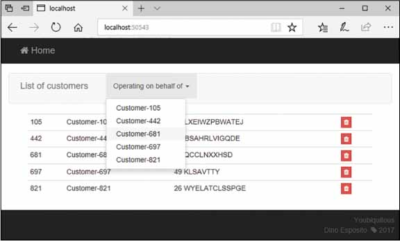

# ASP.NET Core 页面局部渲染和更新

在本文中，我们将回顾和比较一些可以用来更新用户界面和更好地反映应用程序状态的技术。最简单的方法是从服务器下载更新后的HTML块。这些片段只是动态地替换现有的HTML片段，从而提供当前显示页面的部分呈现。另一种方法是使用基于JSON的端点集，可以查询新的数据，以便在JavaScript中完全在客户端重新生成HTML布局。


## 通过HTML刷新视图

毫无疑问，对一个拥有丰富的图形和媒体的网页进行完全的刷新，对用户来说会非常缓慢和麻烦。这正是Ajax和部分页面呈现变得如此流行的原因。在页面呈现的另一个极端，我们发现了单个页面应用程序(SPA)的概念。 SPA的核心是一个由一个（或几个）最小HTML页面组成的应用程序，该页面包含一个几乎空的DIV，在运行时填充模板和从某个服务器下载的数据。在从服务器端呈现到SPA的完整客户端呈现的过程中，我建议我们从HTML部分呈现开始。

### 定义可刷新区域

要进行动态刷新的页面区域必须易于识别，并且与页面的其余部分完全隔离。理想情况下，它是具有已知ID的DIV元素。

```html
<div id="list-of-customers">
	<!-- Place here any necessary HTML -->
</div>
```

一旦为DIV下载了任何新的HTML，只需要一行JavaScript来更新它，如下所示。

```javascript
$("#list-of-customers").html(updatedHtml);
```

从Razor的角度来看，可刷新的区域完全呈现为部分视图。部分视图不仅有助于对结果页面进行组件化，而且有利于重用和关注点分离，而且还可以使从客户端刷新页面的各个部分变得更加容易，而无需重新加载整个页面。

```html
<div id="list-of-customers">
	@Html.Partial("pv_listOfCustomers")
</div>
```

缺少的链接是一个控制器操作方法，它执行一些查询或命令操作，然后返回由局部视图生成的HTML。

假设您有一个示例页面，用于呈现客户名称列表。任何有权查看页面的用户都可以单击侧面按钮来删除当前行。你会怎么编码？旧方法需要将按钮链接到URL，其中POST控制器方法将执行操作，然后重定向回一个GET页面，该页面将呈现具有最新数据的页面。它可以工作，但它需要一系列请求（Post-Redirect-Get），更重要的是，它会导致整页重新加载。对于沉重的页面 - 几乎每个现实的网页都很重 - 这绝对是麻烦的。

一个可刷新区域允许用户单击按钮，并让一些JavaScript放置POST请求并返回一些HTML。放置删除客户的初始请求的处理程序将接收到一个HTML片段，以便粘贴到现有的客户表之上。

#### The Action Method

控制器操作方法没有什么特别之处，只是它返回部分视图结果而不是完整视图结果。这种方法仅用于编辑给定视图。为了避免不必要的调用，您甚至可以使用几个自定义过滤器属性来修饰方法，如下所示。

```c#
[AjaxOnly]
[RequireReferrer("/home/index", "/home", "/")]
[HttpPost]
[ActionName("d")]
public ActionResult DeleteCustomer(int id)
{
   // Do some work
   var model = DeleteCustomerAndReturnModel(id);

   // Render HTML back
   return PartialView("pv_listOfCustomers", model);
}
```

AjaxOnly和RequireReferrer是自定义过滤器（请参阅配套源代码），仅当请求来自Ajax和任何给定的引用时才运行该方法。另外两个属性设置了POST调用和动作名称d的需要。

#### 方法的响应

通过Ajax调用，浏览器将收到一个HTML片段，并使用它来替换可刷新区域的内容。下面是一些可以绑定到单击按钮的示例代码。

```javascript
<script type="text/javascript">
    function delete(id) {
        var url = "/home/d/";
        $.post(url, { id: id })
         .done(function (response) {
                // 在这种情况下，参数“response”就是方法响应。因此，它是action方法通过PartialView()返回的HTML片段
                $("#listOfCustomers").html(response);
        });
    }
</script>
```

#### 技术的局限性

这种技术工作得很好，但仅限于一次更新一个HTML片段。这是否真的是一个限制取决于视图的性质和实际内容。更实际地说，web视图可以有两个或多个片段，这些片段需要在服务器操作之后进行更新。例如，请考虑下图中所示的页面。



该页面有两个相关的片段，需要在删除客户时进行更新。您不仅要更新表以删除已删除的客户;您还需要刷新下拉列表。显然，你可以在控制器上有两个方法，每个方法返回一个不同的片段。这将需要一些额外的代码，如下所示。

```javascript
<script type="text/javascript">
    function delete(id) {
        var url = "/home/d/";
        $.post(url, { id: id })
         .done(function (response) {
             $("#listOfCustomers").html(response);
             $.post("home/dropdown", "")
              .done(function(response) {
                  $("#dropdownCustomers").html(response);
              });
        });
    }
</script>
```


#### 介绍多视图操作结果类型

控制器方法返回一个实现IActionResult类型的类型，或者更可能是从ActionResult继承的类型。其思想是创建一个自定义操作结果类型，该类型返回多个HTML片段，这些片段组合成一个字符串，每个片段由一个常规分隔符分隔。该技术有两个主要优点。首先，根据需要为尽可能多的HTML片段生成单个HTTP请求。其次，工作流程更简单。确定应该更新视图的哪些部分的逻辑存在于服务器上，而客户端只接收HTML片段的数组。客户端仍然需要包含将每个片段粘贴到其所属的必要UI逻辑。但是，通过围绕它构建一个自定义框架，以声明方式将一个片段链接到客户机DOM中的HTML元素，可以进一步减少这个方面。让我们看一看c#类的自定义动作结果类型。

```c#
public class MultiplePartialViewResult : ActionResult
{
    public const string ChunkSeparator = "---|||---";
    public IList<PartialViewResult> PartialViewResults { get; }

    public MultiplePartialViewResult(params PartialViewResult[] results)
    {
        if (PartialViewResults == null)
            PartialViewResults = new List<PartialViewResult>();
        foreach (var r in results)
            PartialViewResults.Add(r);
    }

    public override async Task ExecuteResultAsync(ActionContext context)
    {
        if (context == null)
            throw new ArgumentNullException(nameof(context));

        var services = context.HttpContext.RequestServices;
        var executor = services.GetRequiredService<PartialViewResultExecutor>();

        var total = PartialViewResults.Count;
        var writer = new StringWriter();
        for (var index = 0; index < total; index++)
        {
            var pv = PartialViewResults[index];
            var view = executor.FindView(context, pv).View;
            var viewContext = new ViewContext(context,
                view,
                pv.ViewData, 
                pv.TempData,
                writer, 
                new HtmlHelperOptions());
            await view.RenderAsync(viewContext);

            if (index < total - 1)
                await writer.WriteAsync(ChunkSeparator);
        }

        await context.HttpContext.Response.WriteAsync(writer.ToString());
    }
}
```

操作结果类型包含一个PartialViewResult对象数组，并依次执行它们，在内部缓冲区中积累HTML标记。完成后，将缓冲区刷新到输出流。每个PartialViewResult对象的输出使用常规但任意的子字符串分隔。

有趣的部分是如何使用控制器方法中的自定义动作结果类型。让我们重写DeleteCustomer操作方法。

```c#
[AjaxOnly]
[RequireReferrer("/home/index", "/home", "/")]
[HttpPost]
[ActionName("d")]
public ActionResult DeleteCustomer(int id)
{

   // Do some work
   var model = DeleteCustomerAndReturnModel(id);

   // Render HTML back
   var result = new MultiplePartialViewResult(
          PartialView("pv_listOfCustomer", model),
          PartialView("pv_onBehalfOfCustomers", model));
   return result;
}
```

MultiplePartialViewResult类的构造函数接受PartialViewResult对象的数组，因此可以添加任意数量的对象。

最后，客户端页面中的HTML代码也略有变化。

```javascript
<script type="text/javascript">
    function delete(id) {
        var url = "/home/d/";
        $.post(url, { id: id })
         .done(function (response) {
             var chunks = Ybq.processMultipleAjaxResponse(response);
             $("#listOfCustomers").html(chunks[0]);
             $("#dropdownCustomers").html(chunks[1]);
        });
    }
</script>
```

Ybq.processMultipleAjaxResponse函数是一段简短的JavaScript代码，只是在常规的分隔符上拆分接收的字符串。代码很简单，如下所示：

```javascript
Ybq.processMultipleAjaxResponse = function (response) {
    var chunkSeparator = "---|||---";
    var tokens = response.split(chunkSeparator);
    return tokens;
};
```

 


