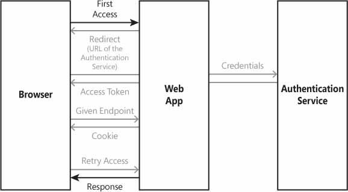
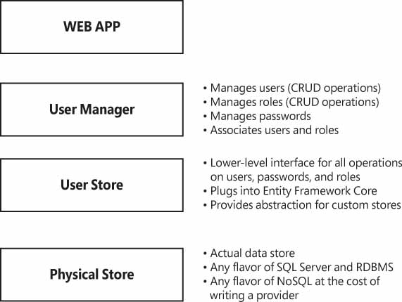

# ASP.NET Core应用程序安全性

web应用程序的安全性有很多方面。首先，在web场景中，安全性与确保交换数据的机密性有关。其次，它涉及到避免篡改数据，从而确保信息在端到端传递时保持完整性。web安全的另一个方面是防止在运行的应用程序中注入恶意代码。最后，安全性涉及到构建只有经过身份验证和授权的用户才能访问的应用程序(以及应用程序的各个部分)。

本文将主要讨论如何在ASP.NET Core中实现用户身份验证，并探索新的基于策略的API来处理用户授权。


## 网络安全的基础结构

HTTP协议在设计时并没有考虑到安全性，但后来对其进行了安全修补。显然，HTTP没有加密，这意味着第三方仍然可以拦截和收集正在两个连接的系统之间传递的数据。

### HTTPS协议

HTTPS是HTTP协议的安全形式。通过在网站上使用它，浏览器和网站之间的所有通信都是加密的。任何进出HTTPS页面的信息都会以确保完全机密性的方式自动加密。加密基于安全证书的内容。发送数据的方式取决于web服务器上启用的安全协议，例如传输层安全(TLS)及其前身安全套接字层(SSL)。

强烈建议在web服务器配置中禁用SSL 2.0和SSL 3.0，应该只启用TLS 1.x。

### 处理安全证书

在谈论HTTPS和证书时，通常使用SSL证书表达式。

HTTPS web服务器的配置决定了要使用的安全协议，证书只包含一对私有/公共加密密钥，并且绑定了域名和所有者的身份。

### 对HTTPS应用加密

当您的浏览器请求位于HTTPS连接上的网页时，网站最初会通过返回配置的HTTPS证书做出反应。证书包含安排安全对话所需的公钥。接下来，浏览器和网站将根据配置的协议（通常为TLS）的规则完成握手。如果浏览器信任该证书，那么它将生成一个对称的公钥/私钥，并与服务器共享公钥。


## ASP.NET Core中的认证

与旧版本的ASP.NET相比，用户身份验证是ASP.NET Core中变化最大的部分之一。

### 基于Cookie的身份验证

在ASP.NET Core中，用户身份验证涉及使用cookie来跟踪用户的身份。尝试访问私有页面的任何用户都将被重定向到登录页面，除非他们携带有效的身份验证cookie。然后登录页面在客户端收集凭据并在服务器上验证它们。如果一切正常，就会释放一个cookie。 Cookie会随着该用户通过同一浏览器发出的任何后续请求一起传播，直至其过期。

在ASP.NET Core中，与传统的ASP.NET相比，有两个主要变化：

- 首先，不再有`web.config`文件，这意味着以不同方式指定和检索登录路径、cookie名称和到期的配置。
- 其次，IPrincipal对象(用于建模用户身份的对象)是基于声明而不是纯用户名的。

#### 启用身份验证中间件

要在全新的ASP.NET Core应用程序中启用cookie身份验证，您需要引用`Microsoft.AspNetCore.Authentication.Cookies`命名空间。但是，与同一ASP.NET Core框架的早期版本相比，ASP.NET Core 2.0中输入到应用程序的实际代码是不同的。

身份验证中间件作为服务公开，它必须在`Startup`类的`ConfigureServices`方法中进行配置。

```c#
public void ConfigureServices(IServiceCollection services)
{
    services.AddAuthentication(CookieAuthenticationDefaults.AuthenticationScheme)
        .AddCookie(options=> {
            options.LoginPath = new PathString("/Account/Login");
            options.Cookie.Name = "CookieName_Octocean";
            options.ExpireTimeSpan = TimeSpan.FromMinutes(5);
            //SlidingExpiration设置为true，以指示处理程序在处理超过到期窗口一半的请求时，重新发出具有新到期时间的新cookie
            options.SlidingExpiration = true;
            //处理ForbidAsync时，处理程序将处理AccessDeniedPath属性用于重定向目标。
            options.AccessDeniedPath = new PathString("/Account/Denied");

        });

    services.AddMvc();
   
}
```

`AddAuthentication`扩展方法获取一个字符串作为参数，指示要使用的身份验证方案。如果您计划支持单个身份验证方案，那么您将采用这种方法。稍后，我们将看到如何稍微调整此代码以支持多个方案和处理程序。`AddAuthentication`返回的对象必须用于调用另一个表示身份验证处理程序的方法。在上面的示例中，`AddCookie`方法指示框架通过配置的cookie登录和验证用户。每个身份验证处理程序（cookie，bearer等）都有自己的一组配置属性。

相反，在`Configure`方法中，只需声明将要打算使用已配置的身份验证服务，而无需指定任何其他选项。

```c#
public void Configure(IApplicationBuilder app)
{
     app.UseAuthentication();
     ...
}
```

#### Cookie身份验证选项

存储在`web.config`文件的`<authentication>`部分中的经典ASP.NET MVC应用程序的大部分信息现在都在代码中配置为中间件选项。

Cookie身份验证选项：

| 选项               | 说明                                                         |
| ------------------ | ------------------------------------------------------------ |
| AccessDeniedPath   | 指示如果当前标识没有查看所请求资源的权限，将重定向经过身份验证的用户的路径。该选项设置用户必须重定向到的URL，而不是接收纯HTTP 403状态代码。 |
| Cookie             | CookieBuilder类型的容器对象，包含正在创建的身份验证cookie的属性。 |
| ExpireTimeSpan     | 设置身份验证cookie的到期时间。时间是作为绝对时间还是相对时间取决于SlidingExpiration属性的值。 |
| LoginPath          | 指示将匿名用户重定向到使用自己的凭据登录的路径。             |
| ReturnUrlParameter | 指示在匿名用户的情况下，用于传递最初请求的URL的参数的名称，该URL导致重定向到登录页面。 |
| SlidingExpiration  | 指示ExpireTimeSpan值是作为绝对时间还是相对时间使用。在后一种情况下，该值被视为一个间隔，如果超过一半的间隔已经过去，中间件将重新发出cookie。 |

注意，`LoginPath`和`AccessDeniedPath`等路径属性的值不是字符串。实际上，`LoginPath`和`AccessDeniedPath`的类型为`PathString`。在.NET Core中，`PathString`类型与普通`String`类型不同，因为它在构建请求URL时提供了正确的转义。实质上，它是一种更具特定于URL的字符串类型。

### 处理多种身份验证方案

在ASP.NET Core中，您可以注册多个不同的身份验证处理程序，并通过算法或通过配置确定每个请求必须使用哪个处理程序。

### 启用多个身份验证处理程序

在ASP.NET Core中，您可以选择多种身份验证处理程序，例如基于cookie的身份验证、承载身份验证、通过社交网络或身份服务器进行身份验证，以及您可以想到和实现的其他任何方式。要注册多个身份验证处理程序，您只需在ASP.NET Core 2.0 `Startup`类的`ConfigureServices`方法中逐个列出所有部分。

每个配置的身份验证处理程序都由名称标识。名称只是应用程序中用于引用处理程序的常规和任意字符串。处理程序的名称称为身份验证方案。身份验证方案可以指定为一个魔术字符串，如cookie或载体。但是，对于常见的情况，在代码中使用一些预定义的常量来限制输入错误。如果您使用了魔法字符串，那么请注意字符串是区分大小写的。

```c#
// 认证方案设置为“Cookies”
services.AddAuthentication(options =>
{
     options.DefaultChallengeScheme = CookieAuthenticationDefaults.AuthenticationScheme;

     options.DefaultSignInScheme = CookieAuthenticationDefaults.AuthenticationScheme;

     options.DefaultAuthenticateScheme = CookieAuthenticationDefaults.AuthenticationScheme;

})
    .AddCookie(options =>
    {
        options.LoginPath = new PathString("/Account/Login");
        options.Cookie.Name = "YourAppCookieName";
        options.ExpireTimeSpan = TimeSpan.FromMinutes(60);
        options.SlidingExpiration = true;
        options.AccessDeniedPath = new PathString("/Account/Denied");

    })

    .AddOpenIdConnect(options =>
    {
        options.Authority = "http://localhost:6000";
        options.ClientId = "...";
        options.ClientSecret = "...";
        ...
    });
```

您只需在对`AddAuthentication`的单个调用之后连接处理程序定义。与此同时，在注册多个处理程序时，必须指出所选择的默认challenge、身份验证和登录方案。换句话说，当用户被要求在登录时证明其身份时，您将指示在对提交的令牌进行身份验证时使用哪个处理程序。在每个处理程序中，您可以覆盖登录方案以满足您的目的。

#### 应用身份验证中间件

与传统的ASP.NET MVC一样，ASP.NET Core使用`Authorize`注解属性来修饰那些受身份验证的控制器类或操作方法。

```c#
[Authorize]
public class HomeController : Controller
{
    public IActionResult Index()
    {
        return View();
    }
}
```

如果某个操作方法不想受到身份验证的限制，可以为该方法标记`AllowAnonymous`属性，该操作方法将不受身份验证的限制。

因此，Action方法上存在`Authorize`属性会限制其仅对经过身份验证的用户使用。但是，如果有多个身份验证中间件可用，`Authorize`应该应用哪一个呢？ ASP.NET Core在`Authorize`属性上提供了一个新属性，允许您根据每个请求选择身份验证方案。

```c#
[Authorize(ActiveAuthenticationSchemes = "Bearer")]
public class ApiController : Controller
{
    ...
}
```

这段代码的最终执行效果是，ApiController类的所有公共端点都受到bearer令牌验证的用户身份的约束。

### User Identity（用户身份）

几乎所有应用程序都有某种用户存储，其中保存了关于用户的所有详细信息。这种存储中的数据项具有主键和许多其他描述性字段。当该用户登录应用程序时，将创建一个身份验证cookie，并复制一些特定于用户的信息。至少，您必须在cookie中保存标识用户的唯一值，因为它出现在应用程序的后端。同时，身份验证cookie还可以包含与安全环境严格相关的其他信息。

总之，在域和持久化层中通常有一个实体表示用户，以及一组名称/值对，它们提供从身份验证cookie读取的直接用户信息。这些名称/值对位于claims之下。

#### Claims（声明）介绍

在ASP.NET Core中，Claim是存储在身份验证cookie中的内容。作为开发人员，您可以在身份验证cookie中存储的所有内容都是Claim，即名称/值对。与过去相比，您可以添加更多信息到cookie并直接从那里读取，而无需从数据库中获取更多数据。

可以使用Claim来建模用户身份。 ASP.NET Core形式化了一长串预定义的声明，即为存储某些知名信息而预定义的键名。

在ASP.NET Core 中，Claim类如下：

```c#
public class Claim
{
    public string Type { get; }
    public string Value { get; }
    public string Issuer { get; }
    public string OriginalIssuer { get; }
    public IDictionary<string, string> Properties { get; }

    // More properties
}
```

一个Claim具有一个属性，用于标识有关用户的声明类型。例如，声明类型是给定应用程序中用户的角色。一个声明还有一个字符串值。例如，Role声明的值可能是“admin”。声明还可以包含附加属性的字典以补充该值。所有属性都是只读的，构造函数是推送值的唯一方法。声明是一个不可变的实体。

#### 在代码中使用Claim

一旦用户提供了有效凭证（或者更一般地，一旦用户已经绑定到已知身份），要解决的问题是持久存储关于所识别身份的关键信息。如前所述，在旧版本的ASP.NET中，这仅限于存储用户名。由于使用Claim，它在ASP.NET Core中更具表现力。

要准备将用户数据存储在身份验证cookie中，通常需要执行以下操作：

```c#
// 准备要绑定到用户身份的声明列表
Claim[] claims = new Claim[] {
    new Claim(ClaimTypes.Name,"smallz"),
    new Claim("display_name","wy"),
    new Claim(ClaimTypes.Email,"wy@163.com"),
    new Claim("picture_url","/images/my.png"),
    new Claim("age","24"),
    new Claim(ClaimTypes.Role,"Manager"),
    new Claim(ClaimTypes.Role,"admin")
};

// 从声明中创建认证对象
var identity = new ClaimsIdentity(claims, CookieAuthenticationDefaults.AuthenticationScheme);

//从identity创建主体对象
var principal = new ClaimsPrincipal(identity);
```

可以从声明中创建`ClaimsIdentity`标识对象类型，并从标识对象创建主体对象类型`ClaimsPrincipal`。创建标识时，还要指明选择的身份验证方案（意味着你指定了如何处理声明）。在代码片段中，`CookieAuthenticationDefaults.AuthenticationScheme`的传递值（Cookie的字符串值）表示声明将存储在身份验证Cookie中。

上面的代码片段中有几点需要注意。

- 首先，声明类型（ClaimTypes）是纯字符串值，但是对于常见类型（如角色，名称，电子邮件）存在许多预定义常量。您可以使用自己的字符串或预定义的字符串作为常量从ClaimTypes类中公开。
- 其次，您可以在同一个声明列表中拥有多个角色。

#### 声明的假设

名称和角色是两个享有ASP.NET Core基础结构（合理）特殊处理的声明。我们考虑以下代码：

```c#
var claims = new Claim[]
{
     new Claim("PublicName", userName),
     new Claim(ClaimTypes.Role, userRole),
     // More claims here
};
```

声明列表有两个元素，一个名为PublicName，另一个名为Role（通过常量`ClaimTypes.Roles`）。如你所见，不存在名为Name的声明。但是，在实际应用中，一般都至少拥有名称和角色。 ASP.NET Core 框架为`ClaimsIdentity`类提供了一个额外的构造函数，它位于声明列表之外，并且身份验证方案还允许你按名称在给定的列表中，指定带有身份名称和角色的声明。

```c#
var identity = new ClaimsIdentity(claims,
      CookieAuthenticationDefaults.AuthenticationScheme,
      "PublicName",
      ClaimTypes.Role);
```

这段代码的最终效果是，命名为Role的声明将是角色声明，无论提供的声明列表是否包含名称声明，PublicName都是你应该用作用户名称的声明。

声明列表中显示了名称和角色，因为这两个信息将被使用，主要是为了与旧的ASP.NET代码向后兼容，以支持`IPrincipal`接口的功能，例如`IsInRole`和`Identity.Name`。声明列表中指定的角色将通过`ClaimsPrincipal`类中的`IsInRole`实现自动兑现。同样，用户名默认为使用“Name”状态指定的声明的值。

总之，Name和Role声明具有默认名称，但您可以随意覆盖这些名称。覆盖发生在`ClaimsIdentity`类的一个重载构造函数中。

### 登录并注销

使用主体对象是在用户中进行签名的必要条件。注册用户并在此过程中创建身份验证cookie的实际方法由HTTP上下文对象以身份验证的名义公开。

```c#
// 获取主体对象
var principal = new ClaimsPrincipal(identity);

// 注册用户(并创建身份验证cookie)
await HttpContext.SignInAsync(
          CookieAuthenticationDefaults.AuthenticationScheme,
          principal);
```

准确的说，只有在身份验证方案设置为cookie时，才会在登录过程中创建cookie。登录过程中发生的确切操作顺序取决于所选身份验证方案的处理程序。

`Authentication`对象是`AuthenticationManager`类的实例。该类包含两个方法：`SignOutAsync`和`AuthenticateAsync`。顾名思义，前一种方法会撤销身份验证cookie并将用户从应用程序中注销 。

```c#
await HttpContext.SignOutAsync(
          CookieAuthenticationDefaults.AuthenticationScheme);
```

在调用该方法时，必须指明要从中注销的身份验证方案。 `AuthenticateAsync`方法只验证cookie并检查用户是否经过身份验证。此外，在该代码中，验证cookie的尝试基于所选的身份验证方案。

#### 读取声明内容

在经典的ASP.NET应用中，一旦系统处理了身份验证cookie，用户名就很容易访问，这是默认情况下唯一可用的信息。如果必须提供关于用户的更多信息，您可以创建自己的声明，并将其内容序列化到cookie中，实际上就是创建自己的主体对象。使用声明是在ASP.NET Core中工作的唯一方法。当你创建自己的主体时，将由自己负责读取声明的内容。

通过`HttpContext.User`属性以编程方式访问的`ClaimsPrincipal`实例具有用于查询特定声明的编程接口。这是一个从Razor视图中获取的示例。

```c#
@if(User.Identity.IsAuthenticated)
{
    var pictureClaim = User.FindFirst("picture_url");
    if (pictureClaim != null)
    {
            var picture = pictureClaim.Value;
            
    }
}
```

一旦验证了登录页面凭据，您就会遇到问题，无法获得您想要保存在cookie中的所有声明。注意，存储在cookie中的信息越多，可以免费获得的用户信息就越多。有时，可以在cookie中存储用户密钥，一旦登录开始，就可以使用密钥从数据库中检索匹配的记录，这更复杂，但确保了用户信息始终是最新的，并且在创建cookie时允许更新，而无需将用户注销或重新登录。声明的实际内容应该从您确定的位置读取。例如，声明内容可以来自数据库，云或Active Directory。

### 外部身份认证

外部身份验证是指使用外部且配置正确的服务对访问您网站的用户进行身份验证。一般来说，外部身份验证对终端用户很有帮助，因为他们不需要为每个要注册的网站创建一个帐户。另外，外部身份验证对开发人员也有好处，因为开发人员不需要添加关键的样板代码，存储和检查用户设置的每个网站的凭证。不是所有的网站都可以充当外部身份验证服务器。外部身份验证服务器需要特定特性的可用性，但几乎任何当前的社交网络都可以充当外部身份验证服务。

#### 添加对外部身份认证服务的支持

ASP.NET Core通过身份提供商支持外部身份验证。大多数情况下，只需要安装适当的NuGet包即可。例如，如果希望允许用户使用他们的Twitter凭据进行身份验证，那么在项目中要做的第一件事就是引入`Microsoft.AspNetCore.Authentication.Twitter`包并安装相关的处理程序：

```c#
services.AddAuthentication(TwitterDefaults.AuthenticationScheme)
  .AddTwitter(options =>
  {
      options.SignInScheme = CookieAuthenticationDefaults.AuthenticationScheme;
      options.ConsumerKey = "...";
      options.ConsumerSecret = "...";
  });
```

`SignInScheme`属性是身份验证处理程序的标识符，该标识符将用于持久化结果标识。 在本例中，将使用cookie身份验证。添加控制器方法以触发基于Twitter的身份验证，代码如下：

```c#
public async Task TwitterAuth()
{
   var props = new AuthenticationProperties
   {
      RedirectUri = "/"  // 认证后跳转页面
   };
   await HttpContext.ChallengeAsync(TwitterDefaults.AuthenticationScheme, props);
}
```

Twitter处理程序的内部成员知道要联系哪个URL以传递应用程序的标识(使用者密钥和机密)并启用用户验证。如果一切顺利，用户将看到熟悉的Twitter身份验证页面。如果用户已经在本地设备上对Twitter进行了身份验证，那么它只需要确认是否可以授予给定的应用程序权限来代表用户在Twitter上进行操作。

接下来，一旦Twitter成功验证了用户身份，`SignInScheme`属性将指示应用程序接下来要做什么。如果您想从外部提供者返回的声明中获取cookie(在本例中是Twitter)，那么“cookie”的值是可以接受的。如果您想通过中介表单来检查和完成信息，那么您必须通过引入一个临时登录方案来将流程一分为二。

`RedirectUri`选项指示在身份验证成功完成之后要去哪里。在这样一个简单的场景中，您只依赖于身份验证服务提供的声明列表，您无法控制登录到系统的每个用户的数据。各种社交网络默认返回的声明列表并不相同。例如，如果用户通过Facebook连接，您可能会得到用户的电子邮件地址。但是，如果用户通过Twitter或谷歌连接，您可能没有电子邮件地址。如果你只支持一个社交网络，这没什么大不了的，但如果你支持很多社交网络——而且这个数字可能会随着时间的推移而增长——那么你就必须建立一个中间页面来规范信息，并要求用户输入所有你目前缺少的声明。

下图显示了当访问需要登录的受保护资源时，在客户机浏览器、web应用程序和外部身份验证服务之间设置的工作流。



 

#### 要求完成信息

要在外部服务对用户进行身份验证后收集其他信息，您需要稍微调整一下服务配置。实际上，可以向列表添加另一个处理程序，如下所示。

```c#
services.AddAuthentication(options =>
{
    options.DefaultChallengeScheme = CookieAuthenticationDefaults.AuthenticationScheme;
    options.DefaultSignInScheme = CookieAuthenticationDefaults.AuthenticationScheme;
    options.DefaultAuthenticateScheme = CookieAuthenticationDefaults.AuthenticationScheme;
})
    .AddCookie(options =>
    {
        options.LoginPath = new PathString("/Account/Login");
        options.Cookie.Name = "YourAppCookieName";
        options.ExpireTimeSpan = TimeSpan.FromMinutes(60);
        options.SlidingExpiration = true;
        options.AccessDeniedPath = new PathString("/Account/Denied");
        })
    .AddTwitter(options =>
    {
        options.SignInScheme = "TEMP";
        options.ConsumerKey = "...";
        options.ConsumerSecret = "...";
    }) 
    .AddCookie("TEMP");
```

当外部Twitter提供程序返回时，使用TEMP方案创建一个临时cookie。通过在控制器方法中适当地设置重定向路径，你可以检查Twitter返回的主体，并进一步编辑它：

```c#
public async Task TwitterAuthEx()
{
   var props = new AuthenticationProperties
   {
       RedirectUri = "/account/external"  
   };
   await HttpContext.ChallengeAsync(TwitterDefaults.AuthenticationScheme, props);
}
```

Twitter（或使用的任何服务）现在将重定向到帐户控制器上的`External`方法，当回调`External`方法时，可以获取给定主体的声明列表，用来构建将要显示的HTML表单，用于收集其他信息。代码如下：

```c#
public async Task<IActionResult> External()
{
    var principal = await HttpContext.AuthenticateAsync("TEMP");

    // 访问主体的声明并准备一个HTML
    // 只提示缺少信息的表单
    ...

    return View();
}
```

一旦构建了表单后，用户填写的表单信息将提交回发到控制器中， 在控制器方法的主体中，保存了表单提交的内容，需要在离开之前执行几个关键步骤。检索如上所示的主体，然后登录到cookie方案并退出临时TEMP方案。这是代码：

```c#
await HttpContext.SignInAsync(CookieAuthenticationDefaults.AuthenticationScheme, principal);
await HttpContext.SignOutAsync("TEMP");
```

此时将创建身份验证cookie。

#### 外部身份认证问题

> 外部身份验证（例如通过Facebook或Twitter）在应用程序中使用时面临的一些问题：
>
> 首先，用户必须登录到您选择的社交网络或身份服务器。他们可能喜欢也可能不喜欢使用现有凭证的想法。通常，社会身份验证应该始终作为一种选择提供，除非应用程序本身与社会网络或社会本身紧密集成，以证明依赖于唯一的外部身份验证是合理的。始终要考虑到用户可能没有你支持的社交网络的账户。
>
> 从开发的角度来看，外部身份验证意味着配置身份验证的工作在每个应用程序中都是重复的。通常情况下，您必须处理用户注册并填写所有必需的字段，这就意味着您需要做大量的帐户管理工作。最后，必须在本地用户存储中的帐户与外部帐户之间保持链接。
>
>
> 最后，外部身份验证并不是一种节省时间的方法。它应该被看作是您为您的应用程序的用户提供的一个特性，如果应用程序本身的性质是合理的。


##  通过ASP.NET IDENTITY认证用户

用户身份验证背后隐藏着一大堆特性，它通常以资格制度的名义存在。资格制度不只是管理用户认证和身份数据的过程;它还处理用户管理、密码哈希、验证和重置、角色及其管理以及更高级的功能，如双因素身份验证(2FA)。

### ASP.NET Identity（身份）概述

ASP.NET Identity是一个成熟的，全面的大型框架，它在成员资格系统上提供了一个抽象层。~~如果您所需要的只是通过从简单数据库表中读取的普通凭据对用户进行身份验证，那就太过分了。但与此同时，~~ASP.NET Identity旨在将存储与安全层分离。因此，它提供了一个丰富的API，其中包含大量的可扩展性点，您可以根据上下文调整内容，同时还包括通常只需要配置的API。

配置ASP.NET Identity意味着指示存储层(关系层和面向对象层)的详细信息以及最能代表用户的标识模型的详细信息。

下图说明了ASP.NET标识的体系结构。

 

#### 用户管理器

用户管理器是中央控制台，您可以从中执行ASP.NET Identity支持的所有操作。如前所述，这包括一个用于查询现有用户、创建新用户和更新或删除用户的API。用户管理器还提供了支持密码管理、外部登录、角色管理甚至更高级功能的方法，如用户锁定、2FA、在需要时发送电子邮件以及密码强度验证。

在代码中，您可以通过`UserManager <TUser>`类的服务调用上述函数。泛型类型指的是提供的用户实体的抽象。换句话说，通过该类，您可以在给定的用户模型上执行所有编码任务。

#### 用户身份抽象

ASP.NET Identity提供了一个基本用户类，该用户类已包含您希望在用户实体上拥有的许多常用属性，例如主键，用户名，密码哈希，电子邮件地址和电话号码。 ASP.NET Identity还提供更复杂的属性，例如电子邮件确认，锁定状态，访问失败计数以及角色和登录列表。 ASP.NET Identity中的基本用户类是`IdentityUser`。您可以直接使用它，也可以从中派生自己的类。

```c#
public class YourAppUser : IdentityUser
{
    //额外的属性
    public string Picture { get; set; }
    public string Status { get; set; }
}
```

`IdentityUser`类有一些方面硬编码到框架中。将类保存到数据库时，Id属性被视为主键。这方面是无法改变的，尽管我几乎想不出做这件事的理由。主键默认情况下是作为字符串呈现的，但甚至主键的类型也在框架的设计中被抽象了，所以在从`IdentityUser`派生时，您可以根据自己的喜好修改它。

```c#
public class YourAppUser : IdentityUser<int>
{
    // App-specific properties
    public string Picture { get; set; }
    public string Status { get; set; }
}
```

事实上，Id属性定义如下：

```c#
public virtual TKey Id { get; set; }
```

注意在旧版本的ASP.NET Identity中，对于经典ASP.NET主键呈现为GUID，这在某些应用程序中产生了一些问题。在ASP.NET Core中，您可以根据需要使用GUID。

#### 用户存储抽象

身份用户类通过某些存储API的服务保存到某个持久层。最受欢迎的API基于Entity Framework Core，但是用户存储的抽象实际上允许你使用，任何知道如何存储信息的框架。主存储接口是`IUserStore <TUser>`：

```c#
public interface IUserStore<TUser, in TKey> : IDisposable where TUser : class, IUser<TKey>
{
   Task CreateAsync(TUser user);
   Task UpdateAsync(TUser user);
   Task DeleteAsync(TUser user);
   Task<TUser> FindByIdAsync(TKey userId);
   Task<TUser> FindByNameAsync(string userName);
   ...
}
```

如你所见，抽象是身份用户类之上的一个普通CRUD API。查询功能非常基本，因为它只允许你按名称或ID检索用户。

然而，一个具体的ASP.NET Identity用户存储比`IUserStore`接口建议的要多得多。下表列出了用于其他功能的存储接口。

| 额外接口              | 目的                                                         |
| --------------------- | ------------------------------------------------------------ |
| IUserClaimStore       | 接口组用于存储有关用户的声明。如果您将声明作为用户实体本身属性的不同信息存储，则此选项非常有用。 |
| IUserEmailStore       | 接口组用于存储电子邮件信息，例如用于密码重置。               |
| IUserLockoutStore     | 接口组用于存储锁定数据以跟踪暴力攻击。                       |
| IUserLoginStore       | 接口组用于存储通过外部提供程序获取的链接帐户。               |
| IUserPasswordStore    | 接口组用于存储密码和执行相关操作。                           |
| IUserPhoneNumberStore | 接口组用于存储要在2FA中使用的电话信息。                      |
| IUserRoleStore        | 接口组用于存储角色信息。                                     |
| IUserTwoFactorStore   | 接口组用于存储与2FA相关的用户信息。                          |

所有这些接口都由实际的用户存储实现的。如果创建了一个自定义用户存储（例如，针对自定义SQL Server架构或自定义NoSQL存储的用户存储），将由自己负责实现。 ASP.NET Identity附带了一个基于Entity Framework的用户存储，可通过`Microsoft.AspNetCore.Identity.EntityFrameworkCore` NuGet包获得。该存储支持上表中列出的接口。

#### 配置ASP.NET Identity

要开始使用ASP.NET Identity，首先需要选择（或创建）用户存储组件并设置基础数据库。假设您选择Entity Framework用户存储，您必须做的第一件事是在应用程序中创建一个`DbContext`类。 `DbContext`类表示通过Entity Framework以编程方式访问数据库的中央控制台。与ASP.NET Identity一起使用的`DbContext`类继承自系统提供的基类（`IdentityDbContext`类），并包含用于用户和其他实体（如登录，声明和电子邮件）的`DbSet`类。

下面是如何布置一个类：

```c#
public class YourAppDatabase : IdentityDbContext<YourAppUser>
{
   ...
}
```

在`IdentityDbContext`中，您将注入用户标识类以及许多其他可选组件。

```c#
public class IdentityDbContext<TUser, TRole, TKey, TUserLogin, TUserRole, TUserClaim> :
             DbContext
    where TUser : IdentityUser<TKey, TUserLogin, TUserRole, TUserClaim>
    where TRole : IdentityRole<TKey, TUserRole>
    where TUserLogin : IdentityUserLogin<TKey>
    where TUserRole : IdentityUserRole<TKey>
    where TUserClaim : IdentityUserClaim<TKey>
{
   ...
}
```

如上所示，可以注入用户身份，角色类型，用户身份的主键，用于链接外部登录的类型，用于表示用户/角色映射的类型以及表示声明的类型。

启用ASP.NET Identity的最后一步是使用ASP.NET Core注册框架。此步骤发生在`Startup`类的`ConfigureServices`方法中。

```c#
public void ConfigureServices(IServiceCollection services)
{
    // 获取要使用的连接字符串
    // 假设在Startup类构造函数中设置了配置
    var connString = Configuration.GetSection("database").Value;     

    // 用于在SQL Server数据库周围注册DbContext的普通EF代码
    services.AddDbContext<YourAppDatabase>(options =>       
               options.UseSqlServer(connString));              

    // 将之前创建的DbContext附加到ASP.NETCore框架
    services.AddIdentity<YourAppUser, IdentityRole>()               
            .AddEntityFrameworkStores<YourIdentityDatabase>();   
}
```

一旦知道连接所选数据库的连接字符串，就可以使用普通的实体框架代码在ASP.NET Core堆栈中注入给定数据库的DbContext。接下来，注册用户身份角色模型，角色身份模型和基于实体框架的用户存储。

在配置时，您还可以指定要创建的身份验证cookie的参数。这是一个例子。

```c#
ervices.ConfigureApplicationCookie(options =>
{
   options.Cookie.HttpOnly = true;
   options.Cookie.Expiration = TimeSpan.FromMinutes(20);
   options.LoginPath = new PathString("/Account/Login");  
   options.LogoutPath = new PathString("/Account/Logout");
   options.AccessDeniedPath = new PathString("/Account/Denied");
   options.SlidingExpiration = true;
});
```

类似地，您还可以更改cookie的名称，并且通常可以完全控制cookie。

### 使用用户管理器

`UserManager`对象是使用和管理基于ASP.NET标识的成员资格系统的中心对象。不需要直接创建它的实例，当在启动时注册ASP.NET身份时，它的一个实例将静默注册到DI系统。

```c#
public class AccountController : Controller
{
    UserManager<YourAppUser> _userManager;
    public AccountController(UserManager<YourAppUser> userManager)
    {
        _userManager = userManager;
    }

    // More code here
    ...
}
```

在任何需要使用它的控制器类中，只需以某种方式注入它。例如，您可以通过构造函数注入它，如前面的代码片段所示。

#### 处理用户

要创建一个新用户，需要调用`CreateAsync`方法并将应用程序中使用的具有ASP.NET标识的用户对象传递给它。该方法返回一个`IdentityResult`值，该值包含一个错误对象列表和一个Boolean属性来表示成功或失败。

```c#
public class IdentityResult
{
    public IEnumerable<IdentityError> Errors { get; }
    public bool Succeeded { get; protected set; }
}

public class IdentityError
{
    public string Code { get; set; }
    public string Description { get; set; }
}
```

`CreateAsync`方法有两个重载：一个只接受User对象，另一个接受密码。前一种方法只是没有为用户设置任何密码。通过使用`ChangePasswordAsync`方法，您可以稍后设置或更改密码。

将用户添加到成员资格系统时，您将面临的问题是，确定如何以及在何处验证添加到系统中的数据的一致性。您应该拥有一个知道如何验证自身的用户类，还是应该将验证部署为一个单独的层?ASP.NET Identity选择后一种模式。可以支持接口`IUserValidator <TUser>`来实现给定类型的任何自定义验证器。

```c#
public interface IUserValidator<TUser>
{
    Task<IdentityResult> ValidateAsync(UserManager<TUser> manager, TUser user)
}
```

可以创建实现该接口的类，然后在应用程序启动时将其注册到DI系统。

可以通过调用`DeleteAsync`来删除成员资格系统中的用户。该方法与`CreateAsync`具有相同的签名。相反，要更新现有用户的状态，可以使用许多预定义方法，例如`SetUserNameAsync`，`SetEmailAsync`，`SetPhoneNumberAsync`，`SetTwoFactorEnabledAsync`等。要编辑声明，您可以使用`AddClaimAsync`，`RemoveClaimAsync`和类似方法来处理登录。

每次调用特定更新方法时，都会执行对基础用户存储的调用。或者，您可以在内存中编辑用户对象，然后使用`UpdateAsync`方法以批处理模式应用所有更改。

#### 获取用户

ASP.NET身份资格系统提供了两种用于获取用户数据的模式。可以通过参数(ID、电子邮件或用户名)查询用户对象，也可以使用LINQ。下面的代码片段说明了一些查询方法的使用。

```c#
var user1 = await _userManager.FindByIdAsync(123456);

var user2 = await _userManager.FindByNameAsync("dino");

var user3 = await _userManager.FindByEmailAsync("dino@yourapp.com");
```

如果用户存储支持`IQueryable`接口，可以在从`UserManager`对象公开的`Users`集合之上构建任何LINQ查询。

```c#
var emails = _userManager.Users.Select(u => u.Email);
```

如果只需要特定的信息，例如电子邮件或电话号码，那么您可以使用单个API调用-`GetEmailAsync`，`GetPhoneNumberAsync`等来完成。

#### 处理密码

在ASP.NET Identity中，密码使用RFC2898算法自动进行哈希散列，并进行一万次迭代。从安全角度来看，这是一种非常安全的密码存储方式。散列通过`IPasswordHasher`接口的服务进行。像往常一样，您可以通过在DI系统中添加新的Hasher来替换你自己的Hasher。

要验证密码的强度，并拒绝弱密码，您可以依赖内置的验证器基础结构并对其进行配置，或者您可以创建自己的密码。配置内置验证器意味着设置最小长度并确定是否需要字母和/或数字。这是一个例子：

```c#
public void ConfigureServices(IServiceCollection services)
{
    services.AddIdentity<YourAppUser, IdentityRole>(options=>
    {
        //至少需要6个字符长和数字
        options.Password.RequireUppercase = false;
        options.Password.RequireLowercase = false;
        options.Password.RequireDigit = true;
        options.Password.RequiredLength = 6;
    })
    .AddEntityFrameworkStores<YourDatabase>();
}
```

要使用自定义密码验证程序，您需要创建一个实现`IPasswordValidator`的类，并在调用`AddIdentity`之后，在应用程序启动时使用`AddPasswordValidator`注册它。

#### 处理角色

最后，角色只是声明，事实上，在本文的前面，我们已经看到了一个预定义的声明，名为Role。抽象地说，角色只是一个没有权限和逻辑映射到它的字符串，它描述了用户可以在应用程序中扮演的角色。。将逻辑和权限映射到角色是为应用程序添加趣味并使其变得现实所必需的。

在ASP.NET Core和ASP.NET Identity中，角色是保存在用户存储中的已命名的声明组。

在ASP.NET Identity应用程序中，声明、用户、支持的角色以及用户和角色之间的映射是分开存储的。涉及角色的所有操作都分组在`RoleManager`对象中。与`UserManager`对象一样，当在应用程序启动时调用`AddIdentity`时，也会将`RoleManager`添加到DI系统。同样，您通过DI在控制器中注入`RoleManager`实例。角色存储在不同的角色存储中。在EF场景中，它只是同一SQL Server数据库中的一个不同的表。

以编程方式管理角色几乎与以编程方式管理用户相同。以下是如何创建角色的示例。

```c#
// 定义管理角色
var roleAdmin = new IdentityRole
{
    Name = "Admin"
};

// Create the ADMIN role in the ASP.NET Identity system
var result = await _roleManager.CreateAsync(roleAdmin);
```

在ASP.NET Identity中，在用户映射到角色之前，角色是无效的。

```c#
var user = await _userManager.FindByNameAsync("dino");
var result = await _userManager.AddToRoleAsync(user, "Admin");
```

要将用户添加到角色，需要使用UserManager类的API。除了`AddToRoleAsync`之外，管理器还提供了`RemoveFromRoleAsync`和`GetUsersInRoleAsync`等方法。

#### 用户身份验证

使用ASP.NET Identity对用户进行身份验证需要许多步骤，涉及诸如验证凭据，处理失败尝试和锁定用户，处理禁用用户以及处理2FA逻辑（如果启用该功能）等操作。然后，您必须使用Claim填充`ClaimsPrincipal`对象并发出身份验证cookie。

所有步骤都封装在`SignInManager`类公开的API中。`SignInManager`是通过DI获得的，方法与您在`UserManager`和`RoleManager`对象中看到的方式相同。要执行登录页面的所有步骤，请使用`PasswordSignInAsync`方法。

```c#
public async Task<IActionResult> Login(string user, string password, bool rememberMe)
{
    var shouldConsiderLockout = true;
    var result = await _signInManager.PasswordSignInAsync(
                           user, password, rememberMe, shouldConsiderLockout);
    if (result.Succeeded)
    {
        // Redirect where needed
        ...

    }
    return View("error", result);
}
```

`PasswordSignInAsync`方法使用用户名和密码（作为明文）以及一些布尔标志来表示生成的身份验证cookie的持久性，以及是否应该考虑锁定。

注意，用户锁定是ASP.NET Identity内置功能，通过该功能可以禁止用户登录系统。该功能由两条信息控制，是否为应用程序启用了锁定和锁定结束日期。您可以使用特定的方法来启用和禁用锁定，还可以使用特定的方法来设置锁定结束日期。如果禁用锁定或启用了锁定，则用户处于活动状态，但当前日期已超过锁定结束日期。

登录过程的结果来自`SignInResult`类，该类型通知身份验证是否成功，是否需要2FA，或者用户是否被锁定。


## 授权策略（Authorization Policies）

软件应用程序的授权层确保允许当前用户访问给定资源，执行给定操作。在ASP.NET Core中，有两种方式建立授权层。可以使用角色，也可以使用策略。以前的基于角色的授权是在以前版本的ASP.NET平台中维护的。基于策略的授权对于ASP.NET Core来说是全新的，并且非常强大和灵活。

### 基于角色的授权

授权比身份验证更进一步。身份验证就是发现用户的身份，以跟踪其活动，并只允许已知用户进入系统。授权更为具体，它定义了用户调用预定义应用程序的端点的需求。受权限限制的任务以及随后进入授权层的任务的常见示例包括显示或隐藏用户界面的元素、执行操作或仅仅通过其他服务传递。在ASP.NET中，角色是从早期开始实现授权层的常用方法。

从技术上讲，角色是一个没有附加行为的普通字符串。但是，它的值被ASP.NET和ASP.NET Core安全层作为元信息处理。例如，两个层都检查主体对象中存在的角色。 （请参阅主体中identity对象中的方法`IsInRole`。）除此之外，应用程序还使用角色向该角色中的所有用户授予权限。

在ASP.NET Core中，角色信息在已登录用户声明中的可用性取决于备份标识存储。例如，如果您使用社交身份验证，那么将永远不会看到角色。通过Twitter或Facebook进行身份验证的用户不会带来任何可能对您的应用程序有重要意义的角色信息。但是，您的应用程序可能会根据内部和特定领域的规则为该用户分配角色。

总之，角色只是元信息，应用程序可以转化为执行或不执行某些操作的权限。 ASP.NET Core 框架仅提供一些基础结构来保存，检索和承载角色。用户和角色之间支持的角色和映射列表通常存储在基础成员资格系统中（无论是自定义还是基于ASP.NET标识），并在验证用户凭据时检索。接下来，以某种方式，角色信息被附加到用户帐户并公开给系统。身份对象上的`IsInRole`方法（ASP.NET Core中的ClaimsIdentity）是用于实现基于角色的授权的杠杆。

#### 授权属性

`Authorize`属性是声明式方法，用于保护控制器或其部分方法。

```c#
[Authorize]
public class CustomerController : Controller
{
	...
}
```

注意，如果没有指定参数，那么`Authorize`属性只检查用户是否经过身份验证。在上面的代码片段中，所有可以成功登录系统的用户同样都可以调用`CustomerController`类的任何方法。要只选择一部分用户，可以使用角色。

`Authorize`属性上的`Roles`属性表示，只有符合列出的任何一个角色的用户才能被授予对控制器方法的访问权限。

在下面的代码中，Admin和System用户都可以调用`BackofficeController`类。

```c#
[Authorize(Roles="Admin, System")]
public class BackofficeController : Controller
{
   ...  

   [Authorize(Roles="System")]
   public IActionResult Reset()
   {
      // 您必须是系统用户才能到达这里
      ...
   }

   [Authorize]
   public IActionResult Public()
   {
      // 您只需要经过身份验证就可以查看
      // 不管分配给你的角色是什么
      ...
   }

   [AllowAnonymous)]
   public IActionResult Index()
   {
      // 您不需要经过身份验证就可以到达这里
      ...
   }
}
```

`Index`方法根本不需要身份验证。 Public方法只需要一个经过身份验证的用户。重置方法严格要求系统用户。您可能与Admin或System用户一起使用的所有其他方法。

如果访问控制器需要多个角色，则可以多次应用`Authorize`注解属性。或者，您始终可以编写自己的授权过滤器。在下面的代码中，只有具有Admin和System角色的用户才被授予调用控制器的权限。

```c#
[Authorize(Roles="Admin")]
[Authorize(Roles="System")]
public class BackofficeController : Controller
{
   ...  
}
```

（可选）`Authorize`属性还可以通过`ActiveAuthenticationSchemes`属性接受一个或多个身份验证方案。

```c#
[Authorize(Roles="Admin, System", ActiveAuthenticationSchemes="Cookies"]
public class BackofficeController : Controller
{
   ...  
}
```

`ActiveAuthenticationSchemes`属性是一个逗号分隔的字符串，列出授权层在当前上下文中将信任的身份验证组件。换句话说，它声明仅当用户通过Cookies方案进行身份验证并具有所列出的任何角色时才允许访问`BackofficeController`类。如上所述，传递给`ActiveAuthenticationSchemes`属性的字符串值必须符合在应用程序启动时向身份验证服务注册的处理程序。随后，身份验证方案本质上是一个选择处理程序的标签。

#### 授权过滤器

`Authorize`属性提供的信息由预定义的系统提供的授权过滤器使用。此筛选器在任何其他ASP.NET Core筛选器之前运行，因为它负责检查用户是否可以执行所请求的操作。如果不是，则授权过滤器使管道短路并取消当前请求。

可以创建自定义授权过滤器，但通常不需要这样做。实际上，最好配置默认过滤器所依赖的现有授权层。

#### 角色，权限和覆盖

角色是一种简单的方法，可以根据应用程序的用户可以做什么或不能做什么来对他们进行分组。然而，角色并不是很有表现力，至少还不足以满足大多数现代应用程序的需求。例如，考虑一个相对简单的授权体系结构：站点的常规用户和授权访问后台并更新内容的高级用户。基于角色的授权层可以围绕这两个角色——用户和管理员构建。在此基础上，您可以定义每组用户可以访问的控制器和方法。

问题在于，在现实世界中，事情很少如此简单。在现实世界中，通常会遇到用户在给定用户角色中可以做或不可做的细微区别。你有角色，但是您需要进行例外和重写。例如，在可以访问后台的用户中，有些只被授权编辑客户数据，有些应该只处理内容，而有些两者都可以。你将如何呈现该方案呢？

一般的作法是，可以创建四个不同的角色：User，Admin，CustomerAdmin和ContentsAdmin。 Admin角色将是CustomerAdmin和ContentsAdmin的联合。它可以工作，但是当严格遵守业务规则的例外需求数量增加时，所需角色的数量将显着增加。

最重要的是，角色不一定是处理授权的最有效方式，尽管它们对于向后兼容性和非常简单的场景非常有用。对于其他情况，还需要其他东西，输入基于策略的授权。

### 基于策略（Policy）的授权

在ASP.NET Core中，基于策略的授权框架旨在解耦授权和应用程序逻辑。策略是作为需求集合而设计的实体。需求是当前用户必须满足的条件。最简单的策略是对用户进行身份验证。一个常见的需求是用户与给定的角色相关联。另一个需求是用户具有特定的声明。在大多数通用术语中，需求是关于用户身份的断言，必须证明该声明对于用户被授予访问给定方法的权限。

#### 定义授权策略

您可以使用以下代码创建策略对象：

```c#
var policy = new AuthorizationPolicyBuilder()
    .AddAuthenticationSchemes("Cookie, Bearer")
    .RequireAuthenticatedUser()
    .RequireRole("Admin")
    .RequireClaim("editor", "contents")
    .RequireClaim("level", "senior")
    .Build();
```

构建器对象使用各种扩展方法收集需求，然后构建策略对象。如您所见，需求作用于身份验证状态和模式、角色以及通过身份验证cookie(或者，如果使用的话，Bearer 令牌)读取的任何声明组合。

Bearer toekns是身份验证cookie的替代方法，用于携带有关用户身份的信息。Bearer令牌通常由非浏览器客户端（例如移动应用程序）调用的Web服务使用。

如果用于定义需求的预定义扩展方法都不适用，那么可以通过自己的断言来定义新的需求。如下：

```c#
var policy = new AuthorizationPolicyBuilder()
    .AddAuthenticationSchemes("Cookie, Bearer")
    .RequireAuthenticatedUser()
    .RequireRole("Admin")
    .RequireAssertion(ctx =>
    {
        return ctx.User.HasClaim("editor", "contents") ||
               ctx.User.HasClaim("level", "senior");
    })
    .Build();
```

`RequireAssertion`方法接受一个接收`HttpContext`对象的lambda并返回一个布尔值。因此，断言是一个条件语句。注意，如果在策略定义中多次连接`RequireRole`，那么用户必须遵守所有角色。如果你想表达一个OR条件，那么你必须使用一个断言。实际上，在上面的示例中，该策略允许编辑内容的用户或高级用户。

一旦定义，策略也必须在授权中间件上注册。

#### 注册策略

授权中间件首先在`Startup`类的`ConfigureServices`方法中注册为服务。这样，你就可以使用所有必需的策略配置服务。可以通过构建器对象创建策略，并通过`AddPolicy`扩展方法添加（或仅声明）策略：

```c#
services.AddAuthorization(options=>
{
   options.AddPolicy("ContentsEditor", policy =>
   {      policy.AddAuthenticationSchemes(CookieAuthenticationDefaults.AuthenticationScheme);
       policy.RequireAuthenticatedUser();
       policy.RequireRole("Admin");
       policy.RequireClaim("editor", "contents");
   });
};
```

添加到授权中间件的每个策略都有一个名称，然后该名称将用于在控制器类上的`Authorize`属性中引用策略。以下是如何设置策略（而不是角色）来定义控制器方法的权限。

```c#
[Authorize(Policy = "ContentsEditor")]
public IActionResult Save(Article article)
{
	...
}
```

通过`Authorize`注解属性，您可以以声明方式设置策略，并允许ASP.NET Core的授权层在方法执行之前强制执行。或者，您可以以编程方式强制执行策略。这是必要的代码。

```c#
public class AdminController : Controller
{
    private IAuthorizationService _authorization;
    public AdminController(IAuthorizationService authorizationService)
    {
        _authorization = authorizationService;
    }

    public async Task<IActionResult> Save(Article article)
    {
        var allowed = await _authorization.AuthorizeAsync(
              User, "ContentsEditor");
        if (!allowed.Succeeded)
            return new ForbiddenResult();

        // 继续方法实现
        ...
    }
}
```

像往常一样，通过DI注入对授权服务的引用。 `AuthorizeAsync`方法获取应用程序的主体对象和策略名称，并返回具有`Succeeded`布尔属性的`AuthorizationResult`对象。当其值为`false`时，您会找到FailCalled或FailRequirements of Failure属性的原因。如果权限的编程检查失败，则应返回`ForbiddenResult`对象。

注意，当权限检查失败时，返回`ForbiddenResult`或`ChallengeResult`之间存在细微差别，如果考虑ASP.NET Core 1.x，差异甚至更加棘手。 `ForbiddenResult`是一个简洁的答案—— 你失败了，并且返回了一个HTTP 401状态代码。 `ChallengeResult`是一种温和的回应。如果用户已登录，它最终会出现在`ForbiddenResult`中，如果未登录，则会重定向到登录页面。但是，从ASP.NET Core 2.0开始，`ChallengeResult`不再将未登录的用户重定向到登录页面。因此，对失败权限作出反应的唯一合理方法是通过`ForbiddenResult`。

### Razor Views的策略

到目前为止，我们已经看到了控制器方法的策略检查。您还可以在Razor视图中执行相同的检查。

```html
@{ 
   var authorized = await Authorization.AuthorizeAsync(User, "ContentsEditor")
}
@if (!authorized)
{
   <div class="alert alert-error">
      You're not authorized to access this page.
   </div>
}
```

要使前面的代码工作，必须首先向授权服务注入依赖项。

```c#
@inject IAuthorizationService Authorization
```

在视图中使用授权服务可以帮助隐藏当前用户无法访问的用户界面的片段。

仅基于授权权限检查来显示或隐藏用户界面元素(例如链接到安全页面)是不够安全的。只要您还在控制器方法级别进行权限检查，就可以这样做。请记住，控制器方法是获得对系统后端访问权的唯一方法，人们总是可以通过在浏览器中键入URL直接访问页面。隐藏的链接不是完全安全的。理想的方法是在入口上检查权限，入口是控制器级别。唯一的例外是从ASP.NET Core 2.0开始，使用Razor页面。

#### 自定义需求（Custom Requirement）

库存需求包括声明和身份验证，并提供基于断言进行自定义的通用机制。您也可以创建自定义需求。

策略需求由两个元素组成，一个只保存数据的需求类和一个将根据用户验证数据的授权处理程序。如果未能使用库存工具表达所需的策略，则可以创建自定义需求。

例如，假设我们希望通过添加用户必须具有至少三年经验的要求来扩展ContentsEditor策略。下面是一个定制需求的示例类。

````c#
public class ExperienceRequirement : IAuthorizationRequirement
{
    public int Years { get; private set; }
    public ExperienceRequirement(int minimumYears)
    {
        Years = minimumYears;
    }
}
````

一个需求必须至少有一个授权处理程序。处理程序是`AuthorizationHandler <T>`类型的类，其中T是需求类型。下面的代码说明了`ExperienceRequirement`类型的示例处理程序。

```c#
public class ExperienceHandler : AuthorizationHandler<ExperienceRequirement>
{
    protected override Task HandleRequirementAsync( 
         AuthorizationHandlerContext context, 
         ExperienceRequirement requirement)
    {

        // 保存User对象以访问声明
        var user = context.User;
        if (!user.HasClaim(c => c.Type == "EditorSince"))
           return Task.CompletedTask;
        var since = int.Parse(user.FindFirst("EditorSince").Value);
        if (since >= requirement.Years)
            context.Succeed(requirement);

        return Task.CompletedTask;
    }
}
```

示例授权处理程序读取与用户关联的声明，并在声明之后检查自定义EditorSince 。如果没有找到，它只会返回，而不做任何事情。只有当声明存在且声明包含不小于指定年数的整数值时，才会返回成功。自定义声明应该是以某种方式链接到用户的一条信息。例如，`Users`表中的一列保存到身份验证cookie。但是，一旦您拥有对用户的引用，您始终可以从声明中找到用户名并对数据库或外部服务运行查询。

授权处理程序调用方法`Succeed`，表明已成功验证该需求。如果需求没有通过，那么处理程序不需要做任何事情，只需返回即可。但是，如果处理程序想要确定需求的失败，那么无论同一需求上的其他处理程序是否成功，它会在授权上下文对象上调用`Fail`方法。

通常，从处理程序调用`Fail`应被视为特殊情况。实际上，授权处理程序通常会成功或什么也不做，因为一个需求可能有多个处理程序，而另一个可能会成功。无论如何，当您想要阻止任何其他处理程序成功执行时，调用`Fail`仍然是关键情况下的一种选择。此外需要注意的是，即使以编程方式调用Fail，授权层也会评估其他所有需求，因为处理程序可能具有日志记录等副作用。

以下是向策略添加自定义需求的方法。~~由于这是自定义需求，因此没有扩展方法，并且必须继续执行策略对象的“要求”集合。~~

```c#
services.AddAuthorization(options =>
{
    options.AddPolicy("AtLeast3Years",
        policy => policy
                  .Requirements
                  .Add(new ExperienceRequirement(3)));
});
```

此外，您还必须在`IAuthorizationHandler`类型的范围内向DI系统注册新处理程序。

````c#
services.AddSingleton<IAuthorizationHandler, ExperienceHandler>();
````

如上所述，需求可以有多个处理程序。当在授权层中为相同的需求向DI系统注册多个处理程序时，至少有一个成功就足够了。

在授权处理程序的实现中，有时可能需要检查请求属性或路由数据。

```c#
if (context.Resource is AuthorizationFilterContext)
{
    var url = mvc.HttpContext.Request.GetDisplayUrl();
    ...
}
```

在ASP.NET Core中，`AuthorizationHandlerContext`对象将`Resource`属性集公开给过滤器上下文对象。根据所涉及的框架，上下文对象是不同的。例如，MVC和SignalR发送它们自己的特定上下文对象。是否转换`Resource`属性中保存的值取决于您需要访问的内容。例如，用户信息始终存在，因此您无需为此进行强制转换。但是，如果您需要特定于MVC的详细信息，例如路由或URL和请求信息，那么您必须进行强制转换。

 


------


#### 参考资源

- 《Programming ASP.NET Core》


本文后续会随着知识的积累不断补充和更新，内容如有错误，欢迎指正。

最后一次更新时间：2018-10-31


------


