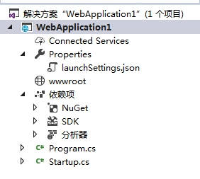

# ASP.NET Core项目初探


## 创建ASP.NET Core项目

创建ASP.NET Core项目比较简单，这里使用VS2017进行创建，选择的模板基于Empty模板，创建完成后的项目结构如下：



#### wwwroot

wwwroot：该目录是Web根目录，所有的静态资源文件，比如images、css、js等都在该路径下。ASP.NET Core运行时区分内容根目录和Web根目录。内容根目录通常是项目所在的当前目录，在生产中，它是部署的根目录。通常，Web根目录（wwwroot）是内容根目录的子文件夹。所有的客户端静态资源访问都是基于Web根目录，例如，如果在wwwroot下面有一个images文件夹，images有一个图片叫wy.jpg，那么获取该图片的有效URL如下：

```
/images/wy.jpg
```

可以在Program.cs文件中以编程的方式更改一个或多个根目录的位置。

#### Program.cs

Web服务器（例如，IIS）通过已配置的端口与远程解耦的可执行文件进行通信，并将传入的请求转发到控制台应用程序。 控制台应用程序从IIS进程空间生成，处理所需的HTTP模块，使IIS支持ASP.NET Core。 在其他Web服务器（如Apache或NGINX）上托管ASP.NET Core应用程序需要类似的扩展模块。在内部，控制台应用程序是围绕从program.cs文件中获取的以下几行代码构建的。

```c#
//注：此段代码不是自动生成的代码
public static void Main(string[] args)
{
    IWebHost host = new WebHostBuilder()
        //将Kestrel指定为Web主机要使用的服务器。
        .UseKestrel()
        //指定Web主机要使用的内容根目录。
        .UseContentRoot(Directory.GetCurrentDirectory())
        //配置服务器在AspNetCoreModule运行后应监听的端口和基本路径。
        //该应用程序还将配置为捕获启动错误。
        .UseIISIntegration()
        //指定Web主机要使用的启动类型。
        .UseStartup<Startup>()
        //构建一个托管Web应用程序的IWebHost。
        .Build();
    //运行Web应用程序
    host.Run();
}
```

ASP.NET Core应用程序需要一个要在其中执行的host。 host负责应用程序启动和生命周期管理。 WebHostBuilder是负责构建有效ASP.NET Core host的完全配置实例的类。

上述代码中调用的方法以及具体作用说明如下：

###### UseKestrel()

指示主机使用嵌入式Web服务器。 嵌入式Web服务器负责在主机上下文中接受和处理HTTP请求。 Kestrel是默认的跨平台ASP.NET嵌入式Web服务器的名称。

###### UseContentRoot()

指示主机有关内容根文件夹的位置。

###### UseIISIntegration()

指示主机使用IIS作为反向代理，该代理将从公共Internet获取请求并将其传递到嵌入式服务器。请注意，对于具有反向代理的ASP.NET Core应用程序，出于安全性和流量的原因，可能会建议使用反向代理，但从纯粹的功能角度来看，它根本不是必需的。

###### `UseStartup<T>()`

向主机指示包含应用程序初始化设置的类型。

###### Build()

构建ASP.NET Core主机类型的实例。

注：上述代码不是VS自动生成的原始代码，而是为了说明问题改写的。在我们创建的项目中，原始的Program.cs代码，由ASP.NET Core 2.0提供了一种更简单的方法来构建Web主机实例。 通过使用“默认”构建器，单个调用可以返回新创建的Web主机实例，代码如下：

```c#
//该代码来自于VS自动生成的代码
public static void Main(string[] args)
{
    BuildWebHost(args).Run();
}

public static IWebHost BuildWebHost(string[] args)
{
    return WebHost.CreateDefaultBuilder(args)
        .UseStartup<Startup>()
        .Build();
}
```

该代码中，静态方法CreateDefaultBuilder完成了所有工作，包括添加Kestrel，IIS配置和内容根以及其他选项，例如日志提供程序和配置数据等。可以反编译该方法，查看具体的实现。

#### Startup.cs

startup.cs文件包含指定用于配置请求管道的类，该管道处理对应用程序发出的所有请求。 该类至少包含主机在应用程序初始化期间将回调的几种方法。 

第一种方法称为ConfigureServices，用于添加应用程序期望使用的依赖项注入机制服务。 ConfigureServices在启动类中是可选的，但在大多数现实场景中都需要一个。

```c#
public void ConfigureServices(IServiceCollection services)
{
}
```

第二种方法称为Configure，顾名思义，它用于配置以前请求的服务。 例如，如果您在方法ConfigureServices中声明了打算使用ASP.NET MVC服务，那么在Configure中，您可以通过在提供的IApplicationBuilder参数上调用UseMvc方法来指定要处理的有效路由列表。 Configure方法是必需的。 请注意，启动类不应实现任何接口或从任何基类继承。 事实上，Configure和ConfigureServices都是通过反射发现和调用的。

启动类的名称不是一成不变的。名称Startup是一个合理的选择，但您可以根据自己的喜好进行更改。如果重命名启动类，则必须在调用UseStartup <T>时传入正确的类型。 


## 与运行时环境交互

有ASP.NET Core应用程序都托管在运行时环境中，它们使用一些可用的服务。您必须明确声明为了使应用程序正常运行所需的所有服务。

#### 解析启动类型

可以通过UseStartup <T>泛型扩展方法或通过将其作为参数传递给非泛型版本来明确指示任何名称的启动类型。 也可以传递包含启动类型的引用程序集的名称。启动类的常规名称是Startup，可以根据自己的喜好进行更改。

可以在应用程序中配置多个启动类，每个开发环境一个。 例如，可以在开发中使用启动类，在正式或生产环境中使用其他启动类。 此外，还可以根据需要定义自定义开发环境（自定义开发环境指修改环境变量，对应的值在文件launchSettings.json中）。例如，假设项目中同时存在StartupDevelopment和StartupProduction的类，要想与当前环境想关联，动态的执行不同的启动类，需要在Program.cs中包含如下代码：

```c#
 new WebHostBuilder()
     .UseStartup(Assembly.GetEntryAssembly().GetName().Name)
```

上述代码中，Host尝试查找与以下模式匹配的可加载类：StartupXXX其中XXX是当前主机环境的名称。 默认情况下，托管环境设置为“Development”，但可以更改为您喜欢的任何字符串。 例如Production。 如果未设置托管环境，则系统将仅尝试查找普通的Startup类，如果失败则抛出错误。

环境变量设置的值可以在launchSettings.json中查看到：

```
"profiles": {
    "IIS Express": {
      "commandName": "IISExpress",
      "launchBrowser": true,
      "environmentVariables": {
        "ASPNETCORE_ENVIRONMENT": "Development"
      }
    },
```

也可以右击项目-属性-调试选项卡中进行查看和设置。如果值指定为Development，程序在启动的时候，Host将会按照”StartupDevelopment“查找可加载的类，对应的将会执行StartupDevelopment类中的内容。同理，如果环境变量设置为Production，将会执行StartupProduction类。

#### 托管环境

开发环境源自名为ASPNETCORE_ENVIRONMENT的环境变量的值，默认为Development。

托管环境的配置通过IHostingEnvironment接口的成员以编程方式公开。你可以在Startup.cs中的Configure()方法里进行配置，常用的属性如下：

###### ApplicationName

获取或设置应用程序的名称。 主机将属性的值设置为包含应用程序入口点的程序集。

###### EnvironmentName

获取或设置覆盖ASPNETCORE_ ENVIRONMENT变量值的环境名称。可以使用此属性的setter以编程方式设置环境。

###### ContentRootPath

获取或设置包含应用程序文件的目录的绝对路径。 此属性通常设置为根安装路径。

###### ContentRootFileProvider

获取或设置必须用于检索内容文件的组件。 该组件可以是实现IFileProvider接口的任何类。 默认文件提供程序使用文件系统来检索文件。

###### WebRootPath

获取或设置包含客户端可通过URL请求的静态文件的目录的绝对路径。

###### WebRootFileProvider

获取或设置必须用于检索Web文件的组件。 该组件可以是实现IFileProvider接口的任何类。 默认文件提供程序使用文件系统来检索文件。

补充：

IFileProvider接口表示只读文件提供程序，它通过获取描述文件或目录名称的字符串并返回内容的抽象来工作。 

实现IHostingEnvironment接口的对象由主机创建，并通过依赖注入公开提供给启动类和应用程序中的所有其他类。

注意：启动类的构造函数可以选择性地接收对几个系统服务的引用：IHostingEnvironment和ILoggerFactory。 

#### 启动系统和应用程序服务

ConfigureServices()方法会在Configure()之前被调用。有些服务的配置可以直接在ConfigureServices中进行，也可以推迟到Configure调用，最终取决于服务的编程接口。ConfigureServices()方法如下：

```c#
public void ConfigureServices(IServiceCollection services){}
```

该方法接收一组服务，可以添加自己的服务，通常，具有大量设置阶段的服务在IServiceCollection上提供AddXXX扩展方法并接受一些参数。将服务添加到IServicesCollection容器中，使服务通过ASP.NET Core内置依赖注入系统进一步可用于应用程序的其余部分。

#### 配置系统和应用程序服务

Configure方法用于配置HTTP请求管道并指定有机会处理传入HTTP请求的模块。 可以添加到HTTP请求管道的模块和松散代码统称为中间件。

```c#
 public void Configure(IApplicationBuilder app, IHostingEnvironment env){...}
```

Configure方法接收实现IApplicationBuilder接口的系统对象的实例，并通过接口的扩展方法添加中间件。 此外，Configure方法可能会接收IHostingEnvironment和ILoggerFactory组件的实例。

例如，在Configure()方法中，启用提供静态文件和集中式错误处理程序的功能：

```c#
public void Configure(IApplicationBuilder app, IHostingEnvironment env)
{
    //如果是开发模式，就显示错误页面
    if (env.IsDevelopment())
    {
        app.UseDeveloperExceptionPage();
    }
    else
    {
        app.UseExceptionHandler("/Error/View");
    }
	app.UseStaticFiles();
}
```

上述代码中，扩展方法UseExceptionHandler充当集中式错误处理程序，并重定向到指定的URL，包含未处理的异常。

IsDevelopment，IsProduction和IsStaging等扩展方法是预定义的，用于检查当前的开发模式。 如果定义自定义环境，则可以通过IsEnvironment方法进行检查。 请注意，在Windows和Mac中，环境名称不区分大小写，但在Linux中它们区分大小写。

因为在Configure中编写的任何代码最终都会配置运行时管道，所以配置服务的顺序非常重要。 因此，您要在Configure中执行的第一件事就是在静态文件之后立即设置错误处理。

#### 特定于环境的配置方法

