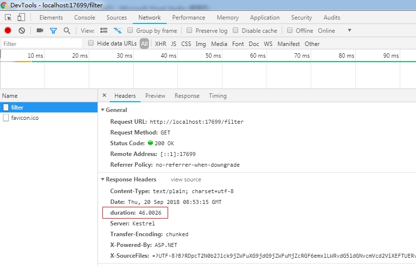

# ASP.NET MVC 控制器

通过URL路由过滤器的任何请求都映射到控制器类，并通过在类上执行给定方法来提供服务。


## 控制器类

编写控制器类可以分为两个步骤：实现可作为控制器发现的类，并添加一组可在运行时作为操作发现的公共方法。

### 发现控制器名称

MVC应用程序接收的所有内容都是要处理的URL，并且URL必须以某种方式映射到一个控制器类和一个公共方法。无论路由策略如何，您可能已选择（基于约定的路由，属性路由或两者）来填充路由表。最后，根据系统路由表中注册的路由将URL映射到控制器。

#### 通过基于约定的路由发现

如果在传入的URL与预定义的传统路由之一之间找到匹配，则控制器的名称来自解析路由。默认路由定义如下：

```c#
app.UseMvc(routes =>
{
    routes.MapRoute(
        name: "default",
        template: "{controller=Home}/{action=Index}/{id?}");
});
```

控制器名称从URL模板参数推断为服务器名称后面的URL的第一个段。常规路由通过显式或隐式路由参数设置控制器参数的值。显式路由参数是定义为URL模板一部分的参数，如上所示。隐式路由参数是未出现在URL模板中并被视为常量的参数。

在下面的示例中，URL模板是"today"，并且控制器参数的值是通过路由的defaults属性静态设置的。

```c#
app.UseMvc(routes =>
{
    routes.MapRoute(
        name: "route-today",
        template: "today",
        defaults: new { controller = "date", action = "day", offset = 0 });
});
```

请注意，从路径推断出的控制器值可能不是要使用的控制器类的确切名称。更常见的是，虽然并非总是如此，但却是一种别称。因此，可能需要一些额外的工作来将控制器值转换为实际的类名。

#### 通过属性路由发现

属性路由允许您使用特殊属性来装饰控制器类或方法，这些属性指示将最终调用方法的URL模板。属性路由的主要好处是路由定义靠近相应的操作。通过这种方式，任何阅读代码的人都清楚地知道何时以及如何调用该方法。此外，选择属性路由可使URL模板独立于控制器和用于提供请求的操作。

```c#
[Route("Day")]
public class DateController : Controller
{
	[Route("{offset}")]
	public ActionResult Details(int offset)
	{
    	return Content(DateTime.Now.AddDays(offset).ToShortDateString());
	}
}
```

通过属性指定的路由仍将流入应用程序的全局路由表，当您使用基于约定的路由时，将以编程方式显式填充相同的表。

#### 通过混合路由策略发现

基于约定和属性路由不是互斥的。两者都可以在同一应用程序的上下文中使用。属性路由和基于约定的路由都填充用于解析URL的相同路由表。在必须始终以编程方式添加基于约定的路由的意义上，必须明确启用常规路由。属性路由始终打开，无需显式启用。请注意，Web API和早期版本的ASP.NET MVC中的属性路由不是这种情况。

由于属性路由始终打开，因此通过属性定义的路由优先于基于约定的路由。

### 继承的控制器

控制器类通常是直接或间接从给定基类Microsoft.AspNetCore.Mvc.Controller类继承的类。请注意，在ASP.NET Core之前发布的所有ASP.NET MVC版本中，继承自基类Controller是一项严格的要求。相反，在ASP.NET Core中，您还可以拥有纯C＃类的控制器类，而不具有继承的功能。我稍后会对这种控制器类进行更多说明，但暂时，我们假设控制器必须最初从系统的基类继承。

系统成功解析路由后，它将保存控制器名称。这个名字是一个简单的字符串 - 一个昵称。昵称（例如，Home或Date）必须与项目中包含或引用的实际类匹配。

#### 带有后缀Controller的类名

拥有系统可以轻松发现的有效控制器类的最常见方案是为类名提供后缀“Controller”，并从上述Controller基类继承它。这意味着控制器名称Home的相应类将是HomeController类。如果存在这样的类，则系统很满意并且可以成功解决该请求。这是在ASP.NET Core之前的ASP.NET MVC的过去版本中工作的方式。

控制器类的命名空间在ASP.NET Core中并不重要，尽管社区中提供的工具和许多示例都倾向于将控制器类放在名为Controllers的文件夹下。实际情况是，您可以将控制器类放在任何文件夹和任何名称空间中。只要该类具有“Controller”后缀并从Controller继承，就会始终发现它。

#### 没有后缀Controller的类名

在ASP.NET Core中，如果控制器类缺少“Controller”后缀，也会成功发现它。但是有一些警告。第一个警告是，只有当类继承自基类Controller时，发现过程才有效。第二个警告是类的名称必须与路由分析中的控制器名称匹配。

如果从路由中提取的控制器名称是Home，那么可以使用一个名为Home的类继承自基类Controller。任何其他名称都不起作用。换句话说，您不能只使用自定义后缀，并且名称的根部分必须始终与路径中的名称匹配。

通常，控制器类直接从类Controller继承，它从Controller类获取环境属性和功能。最值得注意的是，控制器从其基类继承HTTP上下文。您可以拥有从Controller继承的中间自定义类，绑定到URL的实际控制器类将从该类继承。具有这样的中间类取决于您正在编写的应用程序的特定要求需要多少抽象。这主要是一个设计决定。

### POCO控制器（不继承自基类）

动作调用者将HTTP上下文注入控制器的实例，并且在控制器类中运行的代码可以通过方便的HttpContext属性访问它。从系统提供的基类继承您的控制器类可以免费获得所有必要的管道。但是，在ASP.NET Core中，不再需要从公共基类继承任何控制器。在ASP.NET Core中，控制器类可以是普通的旧C＃对象（POCO），其定义如下：

```c#
public class PocoController
{
   // Write your action methods here
}
```

要使系统成功发现POCO控制器，要么类名具有“Controller”后缀，要么使用Controller属性修饰类。

```c#
[Controller]
public class PocoController
{
   // Write your action methods here
}
```

拥有POCO控制器是一种优化和优化形式，通常来自于删除一些功能以减少开销和/或内存占用。因此，不从已知的基类继承可能会排除某些常见操作或使它们更加冗长实现。

下面是几个应用场景

#### 返回纯数据

POCO控制器是一个完全可测试的普通C＃类，它不依赖于周围的ASP.NET Core环境。应该注意的是，如果您不需要对周围环境的任何依赖性，POCO控制器才能正常工作。如果您的任务是创建一个超简单的Web服务，几乎不代表返回数据的固定端点，那么POCO控制器可能是一个不错的选择。 （请参阅以下代码。）

```c#
public class PocoController
{
    public IActionResult Today()
    {
        return new ContentResult() { Content = DateTime.Now.ToShortDateString() };
    }
}
```

#### 返回HTML内容

您可以通过ContentResult的服务将纯HTML内容发送回浏览器。与上面的示例不同的是，将ContentType属性设置为适当的MIME类型，并根据自己的喜好构建HTML字符串。

```c#
[Controller]
public class Poco2
{
    public IActionResult Html()
    {
        return new ContentResult()
        {
            Content = "<h1>Hello</h1>",
            ContentType = "text/html",
            StatusCode = 200
        };
    }
}
```

您可以通过这种方式构建的任何HTML内容都是通过算法创建的。

#### 返回HTML视图

访问处理HTML视图的ASP.NET基础结构不是即时的。在控制器方法中，您必须返回一个适当的IActionResult对象，但是所有可用的辅助方法都可以快速有效地属于基类，并且在POCO控制器中不可用。这是基于视图返回HTML的变通方法。

以下代码片段的主要内容是显示POCO控制器具有较小的内存占用但缺少一些内置设置。

```c#
[Controller]
public class Poco2
{
    public IActionResult Index([FromServices] IModelMetadataProvider provider)
    {
        var viewdata = new ViewDataDictionary<MyViewModel>(provider
    , new ModelStateDictionary());
        viewdata.Model = new MyViewModel() { Title = "Hi!" };
        return new ViewResult()
        {
            ViewData = viewdata,
            ViewName = "index"
        };
    }
}
```

假如存在/Views/Poco2/Index.cshtml文件，内容如下：

```c#
<body>
    @(ViewData.Model.Title)
</body>
```

当直接使用/poco2/index进行访问时，将会显示正确的结果出来。

上述中，方法签名中的附加参数值得更多解释。它是一种依赖注入的形式，在ASP.NET Core中被广泛使用（和推荐）。要创建HTML视图，至少需要对来自外部的IModelMetadataProvider的引用。坦率地说，如果没有外部注入依赖项，您将无法做很多事情。下面的代码片段，它试图简化上面的代码：

```c#
//注：该模式在poco中，并不能将数据传入到视图中去
public IActionResult Simple()
{
    return new ViewResult() { ViewName = "simple" };
}
```

您可以使用名为“simple”的Razor模板，并且返回的HTML都来自模板。但是，**您无法将自己的数据传递给视图以使渲染逻辑足够智能**。此外，无论是通过表单还是查询字符串，您都无法访问以您的方式发布的任何数据。

#### 访问HTTP上下文

POCO控制器最棘手的方面是缺少HTTP上下文。特别是，这意味着您无法检查发布的原始数据，包括查询字符串和路由参数。但是，此上下文信息可用，并且只能在您需要的地方附加到控制器。有两种方法可以做到这一点。

第一种方法包括为操作注入当前上下文。上下文是ActionContext类的一个实例，它包装HTTP上下文和路由信息。这就是你需要的东西。代码如下：

```c#
public class PocoController
{
    [ActionContext]
    public ActionContext Context { get; set; }
}
```

有了上述代码，您现在可以像访问常规的非POCO控制器一样访问Request对象或RouteData对象。以下代码允许您从RouteData集合中读取控制器名称：

```c#
public class PocoController
{
    [ActionContext]
    public ActionContext Context { get; set; }
    public IActionResult Today()
    {
    	//读取控制器名称
        var controller = Context.RouteData.Values["controller"];
        return new ContentResult() { Content = DateTime.Now.ToShortDateString() };
    }
}
```

另一种方法使用称为模型绑定的功能。模型绑定可以看作是将HTTP上下文中可用的特定属性注入到控制器方法中。

例如，下述代码采用查询字符串的形式进行模型绑定，从而获取值：

```c#
public IActionResult Http([FromQuery] int p1 = 0)
{
    return new ContentResult() { Content = p1.ToString() };
}
```

当你使用/poco/http?p1=100进行访问时，将会得到正确的显示结果。

上述代码中，通过使用FromQuery属性修饰方法参数，可以指示系统尝试查找参数名称（例如，p1）与URL查询字符串中的一个参数之间的匹配项。如果找到匹配且类型可转换，则method参数自动接收传递的值。类似地，通过使用FromRoute或FromForm属性，您可以访问RouteData集合中的数据或通过HTML表单发布的数据。

注意：在ASP.NET Core中，全局数据的概念非常模糊。从应用程序的任何地方进行全局访问，没有什么能真正实现全局化。任何旨在全局访问的数据都必须明确传递。更确切地说，它必须在可能使用它的任何上下文中导入。为了实现这一点，ASP.NET Core附带了一个内置的依赖注入（DI）框架，开发人员通过该框架注册抽象类型（如接口）及其具体类型，每当请求引用抽象类型时，在框架上留下返回具体类型实例。


## 控制器动作

传入请求的URL的路由分析的最终输出是由要实例化的控制器类的名称和要对其执行的操作的名称组成的对。在控制器上执行操作会在控制器类上调用公共方法。

### 将动作映射到方法

一般规则是控制器类上的任何公共方法都是具有相同名称的公共操作。例如，考虑像/ home / index这样的URL的情况。根据我们前面讨论过的路由事实，控制器名称是“home”，它需要在项目中提供名为HomeController的实际类。从URL中提取的操作名称是“index”。随后，HomeController类应该公开名为Index的公共方法。

#### 按名称映射

对之前的HomeController进行扩展，添加About()， 注意该方法使用了特性NonAction进行了标注：

```c#
public class HomeController : Controller
{
    public IActionResult Index()
    {
        var catchall = RouteData.DataTokens["reason"] ?? "";
        if (string.IsNullOrEmpty( catchall.ToString()))
        {
            return View();
        }
        else
        {
            return Content("Error Error");
        }
    }

    [NonAction] //表示控制器方法不是操作方法。
    public ActionResult About()
    {
        return View();
    }
}
```

上述代码中，因为Index()方法是公共的并且不是用任何属性修饰，所以它隐式绑定到具有相同名称的操作。这是最常见的情况：只需添加一个公共方法，其名称就成为您可以使用任何HTTP谓词从外部调用的控制器上的操作。

About()方法使用了NonAction特性进行修饰，该属性在编译时不会改变方法的可见性，但会使该方法在运行时对ASP.NET Core的路由系统不可见。您可以从应用程序的服务器端代码中调用它，但它不接受任何可以从浏览器和JavaScript代码调用的操作。假如此时，你直接使用/home/about进行访问，将会提示无法匹配路由地址的错误。

此时，如果在上述控制器中添加如下方法：

```c#
[ActionName("About")]
public ActionResult LoveGermanShepherds()
{
    return View();
}
```

使用/home/LoveGermanShepherds进行访问，同样会提示路由不匹配错误。因为它使用了ActionName进行了修饰，该属性将方法明确绑定到操作About。因此，只能使用/home/about进行访问， 每次用户请求操作About时，LoveGermanShepherds方法都会运行。注意：虽然LoveGermanShepherds()会被调用，但是，此处返回的视图并不是LoveGermanShepherds，而是About视图。这是因为已经存在了About视图，如果不存在，将会返回LoveGermanShepherds视图。因此，为了避免错误，建议为ActionName指定名称时，不要和已存在的视图名相同（可以添加断点追踪运行进行测试）。名称LoveGermanShepherds只能用于控制器类领域内的调用。

#### 通过HTTP动词映射

MVC应用程序模型足够灵活，允许您将方法绑定到仅针对特定HTTP谓词的操作。要将控制器方法与HTTP谓词相关联，您可以使用参数AcceptVerbs属性或直接属性，如HttpGet，HttpPost和HttpPut。 AcceptVerbs属性允许您指定执行给定方法所需的HTTP谓词。

```c#
[AcceptVerbs("post")]
public IActionResult CallMe()
{
    return Content("CallMe");
}
```

上述代码，限定了只能Post请求。无法使用GET请求调用CallMe方法。 AcceptVerbs属性接受字符串引用HTTP谓词。 有效值是与已知HTTP谓词对应的字符串，例如get，post，put，options，patch，delete和head。 您可以将多个字符串传递给AcceptVerbs属性，也可以在同一方法上多次重复该属性。

```c#
[AcceptVerbs("post","get")]
public IActionResult CallMe()
{
    return Content("CallMe");
}
```

使用AcceptVerbs或多个单独的属性，例如HttpGet，HttpPost，HttpPut完全是一个偏好问题。上述代码等同于：

```c#
[HttpPost]
[HttpGet]
public IActionResult CallMe()
{
    return Content("CallMe");
}
```

在Web上，当您按照链接或在地址栏中键入URL时，您将执行HTTP GET命令。 在提交HTML表单的内容时执行HTTP POST。 任何其他HTTP命令都可以仅通过AJAX从Web执行，也可以从任何将请求发送到ASP.NET Core应用程序的客户端代码执行。

#### 当不同的动词有帮助时

当你需要在呈现表单的视图同时，还需要处理表单将发送的值，通常渲染请求带有GET，处理请求通常通过POST进行，此时你可以分别定义不同动词的处理方法如下：

```c#
//错误示例代码，不能通过编译
[HttpGet]
public ActionResult Edit()
{
    return Content("Edit Get");
}

[HttpPost]
public ActionResult Edit()
{
    return Content("Edit Post");
}
```

上述中的代码由于C#不能定义相同名称和签名的方法，所以并不能通过编译，可以使用ActionName特性，进行动作别名指定：

```c#
[HttpGet]
[ActionName("edit")]
public ActionResult DisplayEditForm()
{
    return Content("DisplayEditForm Get");
}

[HttpPost]
[ActionName("edit")]
public ActionResult SaveEditForm()
{
    return Content("SaveEditForm Post");
}
```

方法现在具有不同的名称，但两者都绑定到相同的动作，尽管对于不同的动词。此时，分别使用/Home/edit进行GET和POST请求，可以处理不同动词对应的方法。

上述代码尤其适用于同一个URL以不同动词形式进行请求时，需要进行的不同处理的情况。使用ActionName可以大大减少不必要的以动作名作为URL一部分的情况，这在一定程度上可以简化URL。

### 基于属性的路由

基于属性的路由是将控制器方法绑定到URL的另一种方法。我们的想法是，不是在应用程序启动时定义显式路由表，而是使用ad hoc路由属性修饰控制器方法。在内部，路由属性将填充系统的路由表。

#### 路由属性

Route属性定义了对调用给定方法有效的URL模板。该属性可以放在控制器类级别和方法级别。如果放置在两个位置，则将连接URL。

```c#
[Route("goto")]
public class TourController : Controller
{
    public IActionResult NewYork() //访问形式：/goto
    {
        string action = RouteData.Values["action"].ToString();
        return Ok(action);
    }

    [Route("nyc")]
    public IActionResult NewYorkCity() //访问形式：/goto/nyc
    {
        string action = RouteData.Values["action"].ToString();
        return Ok(action);
    }

    [Route("/ny")] //绝对路径不会使用类模板
    public IActionResult BigApple() //访问形式：/ny
    {
        string action = RouteData.Values["action"].ToString();
        return Ok(action);
    }

    //public IActionResult Index() //访问形式：/goto
    //{
    //    return Ok("Index");
    //}
}
```

类级别的Route属性非常具有侵入性。使用该属性，您无法在名为TourController的类上调用任何包含该游览的控制器名称的方法。在控制器类上调用方法的唯一方法是通过Route属性指定的模板。

其中，NewYork()方法没有自己的Route属性并继承父模板。因此，要调用该方法，要使用的URL是/ goto。请注意/ goto / newyork将返回404错误（未找到URL）。

在上述代码的最后存在一个Index()方法，现在控制器类包含两个没有自己的Route属性的方法。随后，调用/ goto会导致歧义，因此代码中将Index()方法进行了注释。

当控制器方法有自己的Route属性时，事情会更清楚。指定的URL模板是调用该方法的唯一方法，如果在类级别指定了相同的Route属性，则将连接这两个模板。例如，要调用NewYorkCity方法，必须调用/ goto / nyc。

在上面的示例中，BigApple方法解决了另一种情况。如您所见，在这种情况下，Route属性的值以反斜杠开头。在这种情况下，URL旨在成为绝对路径，并且不会与父模板连接。因此，要调用BigApple方法，必须使用URL / ny。请注意，绝对路径由以/或〜/开头的URL模板标识。

#### 使用路由参数

路由还支持参数。参数是从HTTP上下文收集的自定义值。 有趣的是，如果您还在应用程序中启用了常规路由，则可以在路由中使用检测到的控制器和操作名称。

```c#
[Route("goto2")]
public class Tour2Controller : Controller
{
    [Route("/[controller]/[action]")] //绝对路由，注意以/开头
    [ActionName("ny")]
    public IActionResult NewYork() //访问形式：/tour2/ny
    {
        string action = RouteData.Values["action"].ToString();
        return Ok(action);
    }
}
```

上述示例中，虽然类具有根路由属性goto2，但由于参数路由（绝对路由）和ActionName属性的组合效果，因此可以使用/tour2/ny进行访问，这是因为，由于传统路由，控制器和操作参数在RouteData集合中定义，并且可以映射到参数。 ActionName属性只是将NewYork重命名为ny，因此可以访问。

另一个示例：

```c#
[Route("go/to/[action]")]
public class VipTourController : Controller
{
    public IActionResult NewYork() //访问形式：/go/to/newyork
    {
        var action = RouteData.Values["action"].ToString();
        return Ok(action);
    }

    public IActionResult Chicogo() //访问形式：/go/to/chicogo
    {
        var action = RouteData.Values["action"].ToString();
        return Ok(action);
    }

    public IActionResult Index()
    {
        return View();
    }
}
```

控制器中的所有方法现在都可以作为/ go / to / XXX形式的URL使用，其中XXX只是操作方法的名称。

#### 在路由中使用自定义参数

路由也可以托管自定义参数，即通过URL，查询字符串或请求正文发送给方法的参数。

```c#
[Route("go/to/[action]")]
public class VipTourController : Controller
{
   [Route("{days:int}/days")]
   public IActionResult SanFrancisco(int days) //访问形式：/go/to/sanfrancisco/2/days
   {
       var action = $"In{RouteData.Values["action"].ToString()} for {days} days";
       return Ok(action);
   } 
}
```

上述代码中，SanFrancisco()方法接收名为days of integer的参数，Route属性定义参数days的位置（注意自定义参数的不同{}表示法）并为其添加类型约束。因此，使用/go/to/sanfrancisco/2/days进行访问，可以得到显示的结果。

请注意，如果您尝试将days参数无法转换为整数的URL，则会获得404状态代码，因为可能找不到该URL。但是，如果省略类型约束并仅设置自定义参数{days}，则将识别URL，方法有机会处理它，并且days参数内部获取该类型的默认值。如果是整数，则为0.

在ASP.NET Core中，您还可以在特定于动词的属性（如HttpGet和HttpPost）中指定路由信息。因此，您可以将路由URL模板传递给verb属性，而不是指定路由，然后指定verb属性。

注意：属性路由中的中括号（[]）和花括号（{}）的不同，中括号匹配的值来自于路由参数，该参数在routes.MapRoute()中进行指定，默认值如controller、action等，而花括号匹配的是用户关联的url自定义参数的值。


## Action方法的实现

控制器操作方法的签名由您决定，不受任何约束。如果您定义无参数方法，那么您自己负责以编程方式从请求中检索代码所需的任何输入数据。如果向方法的签名添加参数，ASP.NET Core将通过模型绑定器组件提供自动参数解析。

### 基本数据检索

控制器操作方法可以访问使用HTTP请求发布的任何输入数据。可以从各种来源检索输入数据，包括表单数据，查询字符串，cookie，路由值和发布的文件。

#### 从请求对象获取输入数据

在编写操作方法的主体时，您可以直接访问通过熟悉的Request对象及其子集合（例如Form，Cookies，Query和Headers）发出的任何输入数据。ASP.NET Core提供了非常引人注目的工具（例如，模型绑定器），您可能希望使用它们来保持代码更清晰，更紧凑，更容易测试。但是，没有什么可以阻止您编写旧式的基于请求的代码。

```c#
public ActionResult Echo()
{
   var data = Request.Query["today"];
   return Ok(data);
}
```

Request.Query字典包含参数列表以及从URL的查询字符串中提取的相应值。请注意，搜索匹配条目不区分大小写。

虽然功能齐全，但这种方法存在两个主要问题。首先，您必须知道从何处获取值，无论是查询字符串，发布值列表，URL等。您必须为任何不同的源使用不同的API。其次，您获得的任何值都被编码为字符串，任何类型转换都需要您自己手动完成。

#### 从路由中获取输入数据

使用常规路由时，可以在URL模板中插入参数。这些值由路由模块捕获，并可供应用程序使用。但是，路由值不会通过从Controller继承的Request属性向应用程序公开。您必须使用稍微不同的方法以编程方式检索它们。假设您在应用程序启动时注册了以下路由：

```c#
routes.MapRoute(
    name: "demo",
    template: "go/to/{city}/for/{days}/days",
    defaults: new { controller = "Input", action = "Go" }
);
```

该路由有两个自定义参数 - city和days。控制器和方法的名称通过defaults属性静态设置。

在代码中检索city和days的值：

```c#
public ActionResult Go()
{
   var city = RouteData.Values["city"];
   var days = RouteData.Values["days"];
   return Ok(string.Format("In {0} for {1} days", city, days));
}
```

路由数据通过Controller类的RouteData属性公开。此外，在这种情况下，以不区分大小写的方式搜索匹配条目。 RouteData.Values字典是一个字符串/对象字典。任何必要的类型转换都取决于您。

### 模型绑定

ASP.NET MVC提供了一个自动绑定层，它使用一组内置规则将原始请求数据从各种值提供程序映射到输入模型类的属性。相对Request.Query而言，使用模型绑定更具有可读性和维护性。

大多数情况下，模型绑定层的内置映射规则足以让控制器接收干净且可用的数据。但是，绑定层的逻辑可以在很大程度上定制，因此就输入数据的处理而言，增加了前所未有的灵活性。

#### 默认模型绑定器

任何传入的请求都通过与DefaultModelBinder类的实例对应的内置绑定器对象的齿轮。模型绑定由动作调用者编排，包括调查所选控制器方法的签名，查看形式参数名称和类型，试图找到与请求一起上传的任何数据的名称匹配，无论是通过查询字符串，表单，路由或cookie。模型绑定器使用基于约定的逻辑将发布值的名称与控制器方法中的参数名称进行匹配。 DefaultModelBinder类知道如何处理原始和复杂类型，以及集合和字典。鉴于此，默认活页夹在大多数情况下都能正常工作。

#### 绑定原始类型

不可否认，模型绑定起初可能听起来有点神奇，但它背后并没有真正的魔法。关键的事实是，它允许您专注于您希望控制器方法接收的数据。您完全忽略了检索数据的详细信息，无论是来自查询字符串，正文还是路径。

模型绑定器以精确的顺序将参数与传入数据匹配。首先，它检查是否可以在路径参数上找到匹配，然后检查表单发布数据，最后检查查询字符串数据。

假设您需要一个控制器方法来重复给定字符串给定次数。您需要的输入数据是字符串和数字。你可以这样做：

```c#
public class BindingController : Controller
{
   public IActionResult Repeat(string text, int number)
   {
   }
}
```

以这种方式设计，您无需访问HTTP上下文来获取数据。默认模型绑定器从请求上下文中可用的完整值集合中读取文本和数字的实际值。绑定器查找可行值，尝试将形式参数名称（示例中的文本和数字）与请求上下文中找到的命名值进行匹配。换句话说，如果请求带有表单字段，查询字符串字段或名为text的路由参数，则携带的值会自动绑定到text参数。如果参数类型和实际值兼容，则映射成功。如果无法执行转换，则抛出参数异常。例如，下一个URL可以正常工作：

```
/binding/repeat?text=Dino&number=2
```

相反，以下URL可能会生成无效结果：

/binding/repeat?text=Dino&number=true

查询字符串字段文本包含Dino，并且方法Repeat上的字符串参数文本的映射成功发生。另一方面，查询字符串字段编号包含true，无法成功映射到int参数。模型绑定器返回一个参数字典，其中number的条目包含该类型的默认值，因此0.完全取决于用于处理输入的代码。它可以返回一些空内容甚至抛出异常。

默认绑定器可以映射所有基本类型，例如string，int，double，decimal，bool，DateTime和相关集合。要在URL中表示布尔类型，请使用true和false字符串。这些字符串使用.NET Framework本机布尔解析函数进行解析，这些函数以不区分大小写的方式识别true和false字符串。如果使用诸如yes / no之类的字符串来表示布尔值，则默认绑定器将无法理解您的意图，并将在参数字典中放置一个false值，这可能会影响实际输出。

#### 强制从给定源绑定

在ASP.NET Core中，您可以通过强制特定参数的源来更改模型绑定数据源的固定顺序。您可以通过以下任何新属性执行此操作：FromQuery，FromRoute和FromForm。如名称所示，这些属性强制模型绑定层分别映射来自查询字符串，路由数据和发布数据的值。

```c#
[Route("goto/{city}")]
public IActionResult Visit([FromQuery] string city)
{
}
```

FromQuery属性强制将参数代码绑定到具有匹配名称的查询字符串中的任何内容。假设请求URL / goto / rome？city = london。值Rome通过优先级较高的字典传递，但实际的方法参数绑定到查询字符串上的任何值。因此，城市参数的值是london。有趣的是，如果强制源不包含匹配值，则参数采用声明类型的默认值，而不是任何其他可用的匹配值。换句话说，任何FromQuery，FromRoute和FromForm属性的净效果都是将模型绑定约束到指定的数据源。

#### 从Header绑定

在ASP.NET Core中，一个新属性首次亮相，以简化在控制器方法的上下文中获取存储在HTTP头中的信息。新属性是FromHeader。您可能想知道为什么HTTP标头不会自动受到模型绑定的影响。有两个方面需要考虑。在我看来，第一个方面更具哲学性而非技术性。 HTTP标头可能不被视为普通用户输入，模型绑定只是设计用于将用户输入映射到控制器方法。 HTTP标头包含的信息在某些情况下可以帮助检查控制器内部。最杰出的例子是身份验证令牌，但同样，身份验证令牌并不完全是“用户输入”。模型绑定器不自动解析HTTP头的第二个方面纯粹是技术性的，与命名约定有关。 HTTP标头。

例如，映射头名称（如Accept-Language）将需要相应的参数，除了在C＃变量名称中不接受破折号。 FromHeader属性只解决了这个问题。

```c#
public IActionResult Culture([FromHeader(Name ="Accept-Language")] string language)
{
}
```

该属性将标头名称作为参数，并将关联的值绑定到方法参数。作为前面的代码的结果，该方法的语言参数将接收Accept-Language标头的当前值。

#### 从Body绑定

有时，不是通过URL或标头传递请求数据，而是作为请求主体的一部分。要使控制器方法能够接收正文内容，您必须明确告诉模型绑定层将正文内容解析为特定参数。这是新FromBody属性的工作。您需要的只是使用属性装饰参数方法，如下所示。

```c#
public IActionResult Print([FromBody] string content)
{
}
```

请求的全部内容（GET或POST）将作为单个单元处理，并尽可能映射到参数可能的类型约束。

#### 绑定复杂类型

您可以在方法的签名上列出的参数数量没有限制。但是，容器类通常比一长串单个参数更好。对于默认模型绑定器，无论是列出参数序列还是仅列出复杂类型的一个参数，结果几乎相同。两种方案都得到完全支持。这是一个例子：

```c#
public class ComplexController : Controller
{  
   public ActionResult Repeat(RepeatText input)
   {
   }
}
```

控制器方法接收RepeatText类型的对象。该类是一个普通的数据传输对象，定义如下：

```c#
public class RepeatText
{
	public string Text { get; set; }
	public int Number { get; set; }
}
```

如您所见，该类只包含您在上一个示例中作为单个参数传递的相同值的成员。模型绑定器使用此复杂类型以及单个值。

对于声明类型中的每个公共属性 - 在这种情况下为RepeatText - 模型绑定器查找其键名与属性名称匹配的已发布值。该匹配不区分大小写。

#### 绑定原始类型的数组

如果控制器方法的参数是一个数组或集合，使用默认模型绑定即可实现，唯一要求的是，页面中的多个元素的name属性值要保持一致，例如，页面中有三个文本框，每个文本框的id肯定不一样，你可以给文本框的name指定相同的名称emails，那么就可以利用绑定器构造数组的能力，将三个文本框的值组合成一个可枚举的集合，传给后台方法中的变量`IList<sring> emails`	。实际上，所有的模型绑定，都是基于表单元素的name属性进行的，如果都多个相同的name，将会构造一个集合传递给后台方法对应的变量，该变量名称应该与name属性值保持一致，这样才能更好的进行默认模型绑定。

页面HTML片段：

```html
<input name="emails" id="email1" type="text">
<input name="emails" id="email2" type="text">
<input name="emails" id="email3" type="text">
```

后台代码：

```c#
public IActionResult Email(IList<string> emails)
{
    return View();
}
```

#### 控制绑定名称

上述的HTML片段中，统一使用了复数形式的名称emails，但是，实际使用中，更多的是使用单数形式的名称，例如：

```html
<input name="email" id="email1" type="text">
<input name="email" id="email2" type="text">
<input name="email" id="email3" type="text">
```

为此，ASP.NET Core提供了Bind属性来修复问题。在控制器代码中强制绑定器将传入名称映射到指定参数。

```c#
public IActionResult Email([Bind(Prefix="email")] IList<string> emails)
```

请注意，HTML严格说明ID名称中允许的字符。例如，分配给ID属性的值不能包含方括号。但是，会为name属性发布这些约束。这种特性可以很方便地绑定复杂类型的数组。

#### 绑定复杂类型的数组

假设您的HTML表单收集多个信息聚合，例如地址。实际上，您可以定义如下地址：

```c#
public class Address
{
	public string Street { get; set; }
	public string City { get; set; }
	public string Country { get; set; }
}
```

此外，地址可能是更大的数据结构的一部分，例如公司：

```c#
public class Company
{
	public int CompanyId { get; set; }
	public IList<Address> Addresses { get; set; }
	//...
}
```

假设输入表单与Company类的结构匹配。发布表单时，服务器会收到一组地址。它如何与模型绑定一起使用？

同样，这是您如何定义HTML标记的问题。如果是复杂类型，则必须在标记中显式创建数组。

```html
<input type="text" id="..." name="company.Addresses[0].Street" ... />
<input type="text" id="..." name="company.Addresses[0].City" ... />
<input type="text" id="..." name="company.Addresses[1].Street" ... />
<input type="text" id="..." name="company.Addresses[1].City" ... />
```

上面的HTML结构将通过以下控制器方法签名很好地匹配：

```c#
public IActionResult Save(Company company)
```

绑定对象是Company类的实例，其中Addresses集合属性包含两个元素。这种方法非常优雅和功能，但并不完美。

特别是，如果您确切知道填充集合的项目有多少，则可以很好地工作，否则可能会失败。此外，如果发布值中的索引序列有漏洞，则绑定失败。索引通常从0开始，但无论起始索引如何，绑定的集合都会在第一个缺失的索引处被截断。例如，如果您有地址[0]然后是地址[2]和地址[3]，那么只有第一个将自动传递给控制器方法。

请注意，此处缺少信息的概念仅指模型装订器识别和处理的数据。浏览器正确地发布输入到HTML表单中的所有数据。但是，如果没有模型绑定，您必须自己安排一个相当复杂的解析算法来检索所有发布的数据并将这些数据相互关联。

### Action结果

动作方法可以产生各种结果。例如，action方法可以充当Web服务，并返回纯字符串或JSON字符串以响应请求。同样，操作方法可以确定没有要返回的内容，或者需要重定向到另一个URL。 action方法通常返回实现IActionResult的类型的实例。

IActionResult类型指的是代表action方法执行一些进一步操作的通用编程接口。所有这些进一步的操作涉及为请求浏览器产生一些响应。

#### 预定义的操作结果类型

ASP.NET Core附带了各种实现IActionResult接口的具体类型。表4-1列出了几种类型。下表不包含与安全性和Web API相关的操作结果类型。

一些预定义的IActionResult类型

| 类型                   | 描述                                                         |
| ---------------------- | ------------------------------------------------------------ |
| ContentResult          | 将原始文本内容（不一定是HTML）发送到浏览器                   |
| EmptyResult            | 不向浏览器发送任何内容                                       |
| FileContentResult      | 将文件的内容发送到浏览器。文件的内容表示为字节数组           |
| FileStreamResult       | 将文件的内容发送到浏览器。文件的内容通过Stream对象表示       |
| LocalRedirectResult    | 向浏览器发送HTTP 302响应代码，以将浏览器重定向到当前站点本地的指定URL。它只接受相对URL |
| JsonResult             | 将JSON字符串发送到浏览器。此类的ExecuteResult方法将内容类型设置为JSON，并调用JavaScript序列化程序将任何提供的托管对象序列化为JSON |
| NotFoundResult         | 返回404状态代码                                              |
| PartialViewResult      | 将HTML内容发送到代表整个页面视图片段的浏览器                 |
| PhysicalFileResult     | 将文件的内容发送到浏览器。该文件通过其路径和内容类型进行标识 |
| RedirectResult         | 向浏览器发送HTTP 302响应代码，以将浏览器重定向到指定的URL    |
| RedirectToActionResult | 与RedirectResult一样，它向浏览器发送HTTP 302代码并导航到新URL。 URL基于操作/控制器对构建 |
| RedirectToRouteResult  | 与RedirectResult一样，它向浏览器发送HTTP 302代码并导航到新URL。 URL基于路由名称构建 |
| StatusCodeResult       | 返回指定的状态代码                                           |
| ViewComponentResult    | 将HTML内容发送到从视图组件中获取的浏览器                     |
| ViewResult             | 将HTML内容发送到代表整页视图的浏览器                         |
| VirtualFileResult      | 将文件的内容发送到浏览器。该文件通过其虚拟路径识别           |

如果要通过下载某些文件内容或甚至表示为字节数组的某些纯二进制内容来回复请求，则可以使用与文件相关的操作结果类。

注意ASP.NET Core中不再支持以前版本的ASP.NET MVC中提供的JavascriptResult和FilePathResult操作结果类型。 FilePathResult已分为PhysicalFileResult和VirtualFileResult。要返回Javascript，现在使用具有相应MIME类型的ContentResult。此外，HttpStatusCodeResult，HttpNotFoundResult和HttpUnauthorizedResult不再可用。但是，它们刚刚分别重命名为StatusCodeResult，NotFoundResult和UnauthorizedResult。

#### 安全Action结果

ASP.NET Core提供了特定于安全操作的更多操作结果类型，例如身份验证和授权。与安全相关的IActionResult类型：

| 类型               | 描述                                                         |
| ------------------ | ------------------------------------------------------------ |
| ChallengeResult    | 返回401状态代码（未授权）并重定向到配置的访问被拒绝路径。返回此类型的实例或显式调用框架的质询方法具有相同的效果 |
| ForbidResult       | 返回403状态代码（禁止）并重定向到已配置的拒绝访问路径。返回此类型的实例或显式调用框架的禁止方法具有相同的效果 |
| SignInResult       | 为用户签名。返回此类型的实例或显式调用框架的登录方法具有相同的效果 |
| SignOutResult      | 告诉用户。返回此类型的实例或显式调用框架的注销方法具有相同的效果 |
| UnauthorizedResult | 只需返回401状态代码（未经授权），无需采取任何进一步操作      |

就登录过程而言，从控制器方法返回SignInResult对象与在新的身份验证API中显式调用该方法，以对用户进行签名具有相同的效果。如果您在控制器方法中调用（例如，登录表单后的post方法）然后通过操作结果创建主体对象可能从设计角度来看更清晰。但是，在我看来，这主要是一个偏好问题。

#### Web API Action结果

ASP.NET Core中的操作结果类型列表还包括一系列专门为Web API框架创建的类型，而不是以前版本中的ASP.NET MVC框架的一部分。下面的表中列出了特定于Web API的操作结果类型。

与Web API相关的IActionResult类型

| 类型                       | 说明                                                         |
| -------------------------- | ------------------------------------------------------------ |
| AcceptedResult             | 返回202状态代码并返回URI以监视请求的状态                     |
| AcceptedAtActionResult     | 返回202状态代码并返回URI以监视请求的状态作为控制器/操作对    |
| AcceptedAtRouteResult      | 返回202状态代码并返回URI以监视请求的状态作为路由名称         |
| BadRequestObjectResult     | 返回400状态代码，并可选择在模型状态字典中设置错误            |
| BadRequestResult           | 返回400状态代码                                              |
| CreatedResult              | 返回201状态代码以及创建的资源的URI                           |
| CreatedAtActionResult      | 返回201状态代码以及表示为控制器/操作对的资源的URI            |
| CreatedAtRouteResult       | 返回201状态代码以及表示为路由名称的资源的URI                 |
| CreatedResult              | 返回201状态代码以及创建的对象的URI                           |
| NoContentResult            | 返回204状态代码和null内容。与EmptyResult类似，但EmptyResult返回null内容但设置状态代码为200 |
| OkObjectResult             | 返回200状态代码，并在序列化提供的内容之前进行内容协商        |
| OkResult                   | 返回200状态代码                                              |
| UnsupportedMediaTypeResult | 返回415状态代码                                              |

在以前的ASP.NET版本中，Web API框架作为单独的框架提供，用于以纯REST样式接受和提供请求。在ASP.NET Core中，Web API框架（包括其自己的控制器服务和操作结果类型集）已集成到主框架中。


## Action过滤器

动作过滤器是围绕动作方法的执行运行的一段代码，可用于修改和扩展方法本身编码的行为。

### 动作过滤器的剖析

动作过滤器来自于Microsoft.AspNetCore.Mvc.Filters.IActionFilter接口，它的定义如下：

```c#
public interface IActionFilter : IFilterMetadata
{
	void OnActionExecuting(ActionExecutingContext context);
 
	void OnActionExecuted(ActionExecutedContext context);
}
```

如上所示，它提供了可以在执行操作之前和之后运行代码。在过滤器中，您可以访问请求和控制器上下文，并可以读取和修改参数。

#### 动作过滤器的本机实现

从Controller类继承的每个用户定义的控制器最终都会获得IActionFilter接口的默认实现。实际上，基本Controller类公开了一对名为OnActionExecuting和OnActionExecuted的可覆盖方法。这意味着每个控制器类使您有机会决定在调用给定方法之前，之后或之后做什么，简单地覆盖基类的方法。此功能不适用于POCO控制器。

下述代码，只要调用方法Index，就会添加一个临时响应头。

```c#
public class FilterController : Controller
{
    protected DateTime StartTime;
    public override void OnActionExecuting(ActionExecutingContext filterContext)
    {
        var action = filterContext.ActionDescriptor.RouteValues["action"];
        if (string.Equals(action, "index", StringComparison.CurrentCultureIgnoreCase))
        {
            StartTime = DateTime.Now;
        }
        base.OnActionExecuting(filterContext);
    }


    public override void OnActionExecuted(ActionExecutedContext filterContext)
    {
        var action = filterContext.ActionDescriptor.RouteValues["action"];
        if (string.Equals(action, "index", StringComparison.CurrentCultureIgnoreCase))
        {
            var timeSpan = DateTime.Now - StartTime;
            filterContext.HttpContext.Response.Headers.Add("duration", timeSpan.TotalMilliseconds.ToString());
        }
        base.OnActionExecuted(filterContext);
    }


    public IActionResult Index()
    {
        return Ok("Just processed Filter.Index");
    }
}
```

下图演示了该方法如何计算执行所需的毫秒数，并且该方法将该数字写入名为duration的新响应头。



上述代码演示了如何使用动作过滤器来计算一个Action执行所需的时间。除了使用这种方法外，可以自定义过滤器，具体见后述中的内容。

#### 过滤器的分类

Action过滤器只是ASP.NET Core管道中调用的一种过滤器。过滤器根据它们实际完成的任务分为不同类型。下表列出了介入ASP.NET Core管道的过滤器类型。

ASP.NET Core管道中的筛选器类型：

| 类型                  | 描述                                                         |
| --------------------- | ------------------------------------------------------------ |
| Authorization filters | 在管道中运行的第一类过滤器，用于确定请求用户是否获得当前请求的授权 |
| Resource filters      | 授权之后在管道的其余部分和所有流水线组件之后运行。对缓存很有用 |
| Action filters        | 在控制器方法操作之前和之后运行                               |
| Exception filters     | 如果已注册，则在未处理的异常情况下触发                       |
| Result filters        | 在执行操作方法结果之前和之后运行                             |

过滤器可以具有同步或异步实现。使用任何一个都是偏好和机会的问题。

ASP.NET Core中提供了一些内置过滤器，我们稍后会看到，可以为特定目的创建更多内置过滤器。在内置过滤器列表中，我想强调RequireHttps强制通过HTTPS调用控制器方法，ValidateAntiForgeryToken用于检查通过HTML帖子发送的令牌以避免偷偷摸摸的攻击，以及授权，这使得控制器的方法仅可用经过身份验证的用户。

#### 过滤器的可见性

您可以将筛选器应用于单个方法或整个控制器类。如果将过滤器应用于控制器类，它们将影响控制器公开的所有操作方法。相反，全局过滤器是在应用程序启动时注册的过滤器自动应用于任何控制器类的任何操作的过滤器。

全局过滤器是简单的操作过滤器，只是在启动时以编程方式注册，如下所示：

```c#
public void ConfigureServices(IServiceCollection services)
{
    services.AddMvc(options =>
    {
        options.Filters.Add(new OneActionFilterAttribute());  
        options.Filters.Add(typeof(AnotherActionFilterAttribute)); 
    });
}
```

可以按实例或按类型添加过滤器。在后一种情况下，实际实例是通过ASP.NET Core DI框架获得的。全局过滤器是第一个被调用的过滤器。

接下来是在控制器级别定义的过滤器，最后是在操作方法上定义的过滤器。请注意，如果控制器类重写OnActionExecuting，则在应用任何方法级过滤器之前运行其代码。如果控制器覆盖OnActionExecuted，则在应用任何方法级过滤器之后运行此代码。

### 手工创建自定义动作过滤器

总的来说，动作过滤器构成了ASP.NET Core中嵌入式面向方面的框架。在编写动作过滤器时，通常从ActionFilterAttribute继承并添加自己的行为。

注意操作过滤器是封装特定行为的自定义组件。只要您想隔离此行为并轻松复制它，就可以编写动作过滤器。行为的可重用性是决定是否编写动作过滤器的因素之一，但它不是唯一的因素。动作过滤器还可以保持控制器代码的精简和平均。作为一般规则，每当您的控制器的方法代码用分支和条件语句填充时，请停止并考虑是否可以将某些分支（或重复代码）移动到动作过滤器。代码的可读性将大大提高。

#### 添加自定义Header

动作过滤器的一个常见示例是为给定操作方法的每个请求添加自定义标头。在前面，您了解了如何通过重写OnActionExecuted控制器方法来实现此目的。以下代码显示如何将该代码从控制器移动到不同的类。

```c#
public class HeaderAttribute:ActionFilterAttribute
{
    public string Name { get; set; }
    public string Value { get; set; }
    public override void OnActionExecuted(ActionExecutedContext context)
    {
        if(!string.IsNullOrEmpty(Name) && !string.IsNullOrEmpty(Value))
        {
            context.HttpContext.Response.Headers.Add(Name, Value);
        }
        return;
    }
}
```

您现在拥有一条易于管理的代码。您可以将其附加到任意数量的控制器操作，控制器的所有操作，甚至全局控制器上。您需要做的就是添加一个属性，如下所示：

```c#
[Header(Name = "Action", Value = "About")]
public ActionResult About()
{
    return Ok("About");
}
```

#### 设置请求Culture

ASP.NET Core提供功能齐全且量身定制的基础架构，以支持多语言应用程序。尽管存在构建框架的各个工具，但在任何以前版本的ASP.NET中都不存在类似的特定框架。如果您拥有遗留ASP.NET MVC代码的大型代码库，那么您可能有逻辑来读取用户的首选文化并在每个传入请求上恢复它。

在这里，将展示如何使用全局动作过滤器重写相同的逻辑。正如您所看到的，这个想法是相同的，但是通过管道中早期任何文化交换机触发的ASP.NET Core中间件实现。

```c#
[AttributeUsage(AttributeTargets.Class| AttributeTargets.Method,AllowMultiple =false)]
public class CultureAttribute:ActionFilterAttribute
{
    public string Name { get; set; }
    public static string CookieName
    {
        get { return "_Culture"; }
    }

    public override void OnActionExecuting(ActionExecutingContext context)
    {
        var culture = Name;
        if (string.IsNullOrEmpty(culture))
        {
            culture = GetSavedCultureOrDefault(context.HttpContext.Request);
        }
        SetCultureOnThread(culture);

        base.OnActionExecuting(context);
    }

    
    private static string GetSavedCultureOrDefault(HttpRequest request)
    {
        var culture = CultureInfo.CurrentCulture.Name;
        var cookie = request.Cookies[CookieName] ?? culture;
        return culture;
    }

    private static void SetCultureOnThread(string language)
    {
        var _cultureInfo = new CultureInfo(language);
        CultureInfo.CurrentCulture = _cultureInfo;
        CultureInfo.CurrentUICulture = _cultureInfo;
    }

}
```

在执行操作方法之前，代码会检查名为_Culture的自定义cookie，该cookie可能包含用户对该语言的选择。如果未找到cookie，则过滤器默认为当前区域性并将其分配给当前线程。要确保Culture过滤器对每个控制器方法起作用，请在全局中注册它：

```c#
public void ConfigureServices(IServiceCollection services)
{
    services.AddMvc(options =>
    {
        options.Filters.Add(new CultureAttribute());
    });
}
```

注意全局注册的过滤器与显式分配给类或方法级别的过滤器没有区别。编写动作过滤器时，可以使用AttributeUsage属性控制过滤器的范围。

```c#
[AttributeUsage(AttributeTargets.Class|AttributeTargets.Method, AllowMultiple = false)]
```

特别是，AttributeTargets枚举允许您指定属性的放置位置，AllowMultiple属性允许您确定在同一位置使用它的次数。请注意，AttributeUsage属性适用于您创建的任何自定义属性，而不仅仅适用于操作过滤器。

### 仅限于AJAX调用的方法

到目前为止考虑的动作过滤器是旨在拦截动作方法执行的几个阶段的组件。如果您想添加一些代码来帮助确定给定方法是否适合服务给定的操作，该怎么办？对于此类自定义，需要另一类过滤器：Action选择器。

动作选择器有两种不同的风格：动作名称选择器和动作方法选择器。名称选择器决定它们装饰的方法是否可用于提供给定的操作名称。方法选择器决定是否可以使用具有匹配名称的方法来提供给定的操作。方法选择器通常根据其他运行时条件给出响应。动作名称选择器的规范示例是我们之前使用的系统的ActionName属性。相反，操作方法选择器的常见示例是NonAction和AcceptVerbs属性。让我们看看如何编写一个自定义方法选择器，只有在通过JavaScript发出请求时才接受方法调用。

您只需要一个继承自ActionMethodSelectorAttribute并重写IsValidForRequest方法的类：

```c#
public class AjaxOnlyAttribute : ActionMethodSelectorAttribute
{
    public override bool IsValidForRequest(RouteContext routeContext, ActionDescriptor action)
    {
        return routeContext.HttpContext.Request.IsAjaxRequest();
    }
}

//定义一个扩展类，用于扩展HttpRequest的方法
public static class HttpRequestExtensions
{
    public static bool IsAjaxRequest(this HttpRequest request)
    {
        if (request == null)
            throw new ArgumentNullException("request");
        if (request.Headers != null)
            return request.Headers["X-Requested-With"] == "XMLHttpRequest";
        return false;
    }
}
```

上述代码中，方法IsAjaxRequest是HttpRequest类的扩展方法。

标记有AjaxOnly属性的任何方法仅用于提供通过浏览器的XMLHttpRequest对象发出的调用。

```c#
[AjaxOnly]
public ActionResult Details(int customerId)
{ 
    var model = ...;
    return PartialView(model);
}
```

如果你尝试调用一个URL，根据路由，应该映射到一个只有Ajax的方法，那么你将获得一个未找到的异常。

注意可以使用相同的方法来检查例如请求客户端的用户代理并识别来自移动设备的呼叫。


## 概要

控制器是ASP.NET Core应用程序的核心。控制器在用户请求和服务器系统的功能之间进行调解。控制器链接到用户界面操作并与中间层联系。控制器执行旨在获取结果但不直接返回结果的操作。在控制器中，请求的处理与使结果可用的任何进一步操作完全分开，最显着的是呈现HTML视图。

从设计的角度来看，控制器是表示层的一部分，因为它们对运行时环境有严格的引用，并且知道请求的HTTP上下文。虽然ASP.NET Core引入并支持POCO控制器，但我更频繁地使用非POCO控制器。

控制器操作方法可以返回一长串操作结果类型，例如文件内容，JSON，纯文本和重定向响应。


