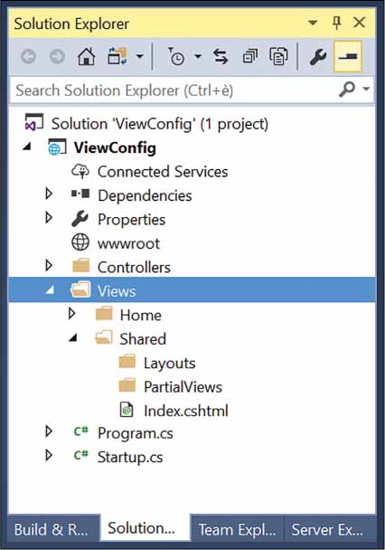

# ASP.NET MVC 视图

大多数ASP.NET MVC请求都要求将HTML标记提供给浏览器。从架构上讲，返回HTML标记的请求与返回纯文本或JSON数据的请求之间没有任何区别。但是，因为生成HTML标记有时可能需要大量工作（并且总是需要很大的灵活性），所以ASP.NET MVC附带了一个专用的系统组件 - 视图引擎 - 负责为浏览器生成纯HTML以进行处理。在这样做时，视图引擎混合应用程序数据和标记模板以创建HTML标记。

## 提供HTML内容

在ASP.NET Core中，应用程序可以通过各种方式为HTML提供服务，并且开发人员不断提高其复杂性和控制力。

### 从终止中间件提供HTML

ASP.NET核心应用程序可以是围绕某些终止中间件构建的非常瘦的Web服务器。终止中间件是一大块代码，用于处理请求。基本上，它是一个处理HTTP请求的函数。您的代码可以执行所有操作，包括返回浏览器将其视为HTML的字符串。这是一个用于此目的的示例Startup类。

```c#
public class Startup
{
    public void Configure(IApplicationBuilder app)
    {
       app.Run(async context =>
       {
          var obj = new SomeWork();
          await context.Response.WriteAsync("<h1>" + obj.Now() + "</h1><script>alert('ni');</script>");
       });
    }
}
```

通过在响应的输出流中简单地编写HTML格式的文本（并可能设置适当的MIME类型），您可以将HTML内容提供给浏览器。这一切都以非常简单的方式发生，没有过滤器，没有中介。它有效，但我们远没有一个可维护和灵活的解决方案。

#### 从控制器提供HTML

更现实地，ASP.NET Core应用程序利用MVC应用程序模型并使用控制器类。任何请求都映射到控制器类上的方法。所选方法可以访问HTTP上下文，可以检查传入的数据，并确定要采取的操作。一旦该方法收集了所有必要的数据，就可以准备好响应。 HTML内容可以在运行中以算法方式排列，或者可以从具有计算数据占位符的选定HTML模板更舒适地创建。

#### 从Action方法中将HTML作为纯文本提供

下面的代码说明了一种控制器方法的模式，该方法以某种方式检索数据，然后将其格式化为一些有效的HTML布局。

```c#
public IActionResult Info(int id)
{
	var data = _service.GetInfoAsHtml(id);
	return Content(html, "text/html");
}
```

当控制器方法重新获得对流的控制时，它保存一个它知道由HTML标记组成的文本字符串。然后，控制器只返回使用正确的HTML MIME类型修饰的文本。这种方法只比将HTML直接写入输出流要好一些，因为它允许通过模型绑定将输入数据映射到舒适的.NET类型，并且它依赖于更结构化的代码。 HTML的物理生成仍然在算法上发生;通过这种方式，我的意思是要更改布局，需要对代码进行更改，这需要后续编译。

#### 从Razor模板提供HTML

提供HTML内容的最常用方法是依靠模板文件来表达所需的布局，使用独立的引擎来解析模板并用实时数据填充它。在ASP.NET MVC中，Razor是用于表达类似HTML的模板的标记语言，而视图引擎是将模板呈现为可消费HTML的系统组件。

```c#
public IActionResult Info(int id)
{
   var model = _service.GetInfo(id);
   return View("template", model);
}
```

视图引擎由View函数调用触发，该函数返回一个对象，该对象打包要使用的Razor模板文件的名称 - 扩展名为.cshtml的文件 - 以及包含要在最终显示的数据的视图模型对象HTML布局。

这种方法的好处在于标记模板（最终HTML页面的基础）与将在其中显示的数据之间的巧妙分离。视图引擎是一个系统工具，用于编排其他组件的活动，例如Razor解析器和页面编译器。从开发人员的角度来看，编辑Razor模板（类似HTML的文件）就足以改变提供给浏览器的HTML的布局。

#### 从Razor Pages提供HTML

在ASP.NET Core 2.0中，Razor页面是另一种提供HTML内容的方式。基本上，它是关于拥有Razor模板文件，可以直接使用而无需通过控制器和控制器操作。只要Razor页面文件位于Pages文件夹下，并且其相对路径和名称与URL匹配，那么视图引擎将处理内容并生成HTML。

Razor页面和常规控制器驱动视图之间的最大区别在于Razor页面可以是单个文件 - 非常类似于ASPX页面 - 包含代码和标记。如果你已经习惯了MVC控制器，那么我希望你会发现Razor页面从根本上是无用的和毫无意义的，也许只有在你有一个控制器方法在没有任何业务逻辑的情况下呈现视图的罕见情况下才有用。如果您是MVC应用程序模型的新手，那么Razor页面可以代表一个较低的入口点障碍，以便在框架上取得进展。

注意Razor页面的奇怪之处在于，只要您的视图比静态HTML文件稍微复杂一点，它们就能很好地适应。但是，Razor页面可以变得非常复杂。他们可以执行数据库访问，依赖注入，并且可以发布和重定向。然而，有了这些功能，与常规控制器驱动视图的差距非常小。


## 视图引擎

视图引擎是MVC应用程序模型的核心组件，负责从视图中创建HTML。视图通常是HTML元素和C＃代码片段的混合。首先，让我们回顾最常见情况下视图引擎的触发器 - Controller基类上的View方法。

### 调用视图引擎

在控制器方法中，您可以通过调用View方法来调用视图引擎，如下所示：

```c#
public IActionResult Index()
{
	return View(); // same as View("index");
}
```

View方法是一个负责创建ViewResult对象的辅助方法。 ViewResult对象需要了解视图模板，可选的主视图以及要合并到最终HTML中的原始数据。

#### 视图方法

尽管在此代码段中方法View是无参数的，但这并不意味着实际上没有传递数据。这是该方法的完整签名：

```c#
protected ViewResult View(String viewName, String masterViewName, Object viewModel)
```

这是控制器方法的一种更常见的模式：

```c#
public IActionResult Index(...)
{
	var model = GetRawDataForTheView(...);
	return View(model);
}
```

在这种情况下，视图的名称默认为操作的名称，无论是从方法名称隐式推断还是通过ActionName属性显式设置。该视图是位于Views项目文件夹下的Razor文件（扩展名为.cshtml）。主视图默认为名为_Layout.cshtml的Razor文件，并且是视图所基于的HTML布局。最后，变量模型指示要合并到模板中的数据模型以生成最终的HTML。

#### 处理ViewResult对象

View方法打包Razor模板的名称，主视图和视图模型，以返回实现IActionResult接口的单个对象。该类名为ViewResult，并抽象处理action方法后获得的结果。当控制器方法返回时，尚未生成HTML，并且尚未将任何内容写入输出流。

```c#
public interface IActionResult
{
	Task ExecuteResultAsync(ActionContext context);
}
```

正如您所看到的，IActionResult接口的核心是一个单一的方法，其名称为ExecuteResultAsync。在ViewResult类的内部 - 以及作为动作结果类的任何其他类中 - 有一段逻辑处理嵌入数据以形成响应。

但是，ExecuteResultAsync方法的触发器不是控制器。当控制器返回时，动作调用者获取动作结果并执行它。当ViewResult类的实例调用其ExecuteResultAsync方法时，将触发视图引擎以生成实际的HTML。

#### 将视图引擎和控制器合在一起

视图引擎是为浏览器物理构建HTML输出的组件。视图引擎会为每个返回HTML的控制器操作中的请求启动。它通过混合视图模板和控制器传入的任何数据来准备输出。

模板以引擎特定的标记语言（例如，Razor）表示;数据传递打包在字典或强类型对象中。下图显示了视图引擎和控制器如何协同工作的总体情况。


### Razor视图引擎

在ASP.NET Core中，视图引擎只是一个实现固定接口的类--IViewEngine接口。每个应用程序都可以有一个或多个视图引擎，并在不同情况下使用所有这些引擎。但是，在ASP.NET Core中，每个应用程序都只有一个默认视图引擎 - RazorViewEngine类。最影响开发的视图引擎的方面是它支持定义视图模板的语法。

Razor语法非常干净和友好。视图模板本质上是一个带有几个代码占位符的HTML页面。每个占位符都包含一个可执行表达式 - 非常类似于代码段。在呈现视图时评估片段中的代码，并将生成的标记集成到HTML模板中。代码片段可以用C＃或.NET Core平台支持的其他.NET语言编写。

注意除了ASP.NET Core提供的RazorViewEngine类之外，还可以基于自定义语法实现自己的视图引擎

#### Razor View引擎的一般性

Razor视图引擎从磁盘上的物理位置读取模板。任何ASP.NET Core项目都有一个名为Views的根文件夹，其中模板存储在子目录的特定结构中。 Views文件夹通常有一些子文件夹 - 每个子文件夹以现有控制器命名。每个特定于控制器的子目录都包含物理文件，其名称应与操作名称匹配。扩展必须是Razor视图引擎的.cshtml。 （如果您在Visual Basic中编写ASP.NET Core应用程序，则扩展名必须为.vbhtml。）

ASP.NET MVC要求您将每个视图模板放在使用它的控制器命名的目录下。如果需要多个控制器调用相同的视图，则将视图模板文件移动到共享文件夹下。

请务必注意，部署站点时，必须在生产服务器上复制在Views文件夹下项目级别存在的相同目录层次结构。

#### 查看位置格式

Razor视图引擎定义了一些属性，您可以通过这些属性控制视图模板的位置。对于Razor视图引擎的内部工作，有必要在默认项目配置和使用区域时为主视图，常规视图和部分视图提供默认位置。

下表中显示了Razor视图引擎支持的具有预定义值的位置属性。 AreaViewLocationFormats属性是一个字符串列表，每个字符串都指向一个定义虚拟路径的占位符字符串。此外，ViewLocationFormats属性是字符串列表，其中包含的每个字符串都引用视图模板的有效虚拟路径。

Razor视图引擎的默认位置格式：

| 属性                    | 默认位置格式                        |
| ----------------------- | ----------------------------------- |
| AreaViewLocationFormats | ~/Areas/{2}/Views/{1}/{0}.cshtml    |
|                         | ~/Areas/{2}/Views/Shared/{0}.cshtml |
| ViewLocationFormats     | ~/Views/{1}/{0}.cshtml              |
|                         | ~/Views/Shared/{0}.cshtml           |

如您所见，位置不是完全限定的路径，但最多包含三个占位符。

- 占位符{0}引用视图的名称，因为它是从控制器方法调用的。
- 占位符{1}引用在URL中使用的控制器名称。
- 最后，控制器{2}（如果指定）引用区域名称。

注意如果您熟悉经典的ASP.NET MVC开发，您可能会惊讶地发现，在ASP.NET Core中，没有像部分视图和布局的视图位置格式那样。通常，~~正如我们将在第6章中看到的那样~~，视图，局部视图和布局是相似的，并且系统以相同的方式对其进行处理和发现。这可能是这一决定背后的理由。因此，要为部分视图或布局视图添加自定义视图位置，只需将其添加到ViewLocationFormats列表即可。

#### ASP.NET MVC中的区域

区域是MVC应用程序模型的一个特征，用于在单个应用程序的上下文中对相关功能进行分组。使用区域与使用多个子应用程序相当，它是将大型应用程序划分为较小段的方法。

区域提供的分区类似于名称空间，在MVC项目中，添加区域（可以从Visual Studio菜单执行）会导致添加项目文件夹，其中包含不同的控制器，模型类型和视图列表。这允许您为应用程序的不同区域提供两个或更多HomeController类。区域划分取决于您，并不一定是功能性的。您还可以考虑使用与角色一对一的区域。

最后，领域不是技术或功能;相反，它们主要与项目和代码的设计和组织有关。使用时，区域会对路由产生影响。该区域的名称是传统路由中要考虑的另一个参数。有关更多信息，请参阅http://docs.microsoft.com/en-us/aspnet/core/mvc/controllers/areas。

#### 自定义位置格式

使用与默认配置不同的配置的主要原因始终是需要在特定文件夹中组织视图和部分视图，以便在视图和部分视图的数量超过几十个时更简单，更快速地检索文件。 Razor视图可以按照任何类型的命名约定赋予任何名称。虽然严格要求命名约定和文件夹的自定义组织，但最终两者都有助于管理和维护代码。

我最喜欢的命名约定是基于在视图名称中使用前缀。例如，我的所有部分视图都以pv_开头，而布局文件以layout_开头。这保证即使在同一文件夹中找到相当多的文件，它们也会按名称分组，并且可以轻松发现。此外，我仍然希望至少部分视图和布局有一些额外的子文件夹。下面的代码显示了如何在ASP.NET Core中自定义视图位置。

```c#
public void ConfigureServices(IServiceCollection services)
{
    services.AddMvc()
        //自定义位置格式
        .AddRazorOptions(options =>
        {
            //清除当前的视图位置格式列表。 此时列表包含默认的视图位置格式。
            options.ViewLocationFormats.Clear();

            // {0} - Action Name
            // {1} - Controller Name
            // {2} - Area Name
            options.ViewLocationFormats.Add("/Views/{1}/{0}.cshtml");
            options.ViewLocationFormats.Add("/Views/Shared/{0}.cshtml");
            options.ViewLocationFormats.Add("/Views/Shared/Layouts/{0}.cshtml");
            options.ViewLocationFormats
                .Add("/Views/Shared/PartialViews/{0}.cshtml");
        });
}
```

对Clear的调用清空了视图位置字符串的默认列表，以便系统仅根据自定义位置规则工作。下图显示了示例项目中显示的结果文件夹结构。请注意，现在只有位于Views / Shared或Views / Shared / PartialViews下才会发现部分视图，并且只有位于Views / Shared或Views / Shared / Layouts下才会发现布局文件。



#### 查看位置扩展器

查看位置格式是视图引擎的静态设置。您可以在应用程序启动时定义视图位置格式，并在整个生命周期内保持活动状态。每次必须呈现视图时，视图引擎都会遍历已注册位置的列表，直到找到包含所需模板的位置。如果未找到模板，则抛出异常。到现在为止还挺好。

相反，如果您需要基于每个请求动态确定视图的路径，该怎么办？如果它听起来像一个奇怪的用例，请考虑多租户应用程序。想象一下，您有一个同时被多个客户作为服务使用的应用程序。它始终是相同的代码库，并且它始终是相同的逻辑视图集，但每个用户可以提供特定版本的视图，可能采用不同的样式或使用不同的布局。

此类应用程序的常用方法是定义默认视图的集合，然后允许客户添加自定义视图。例如，假设客户Contoso导航到视图index.cshtml并期望看到Views / Contoso / Home / index.cshtml而不是Views / Home / index.cshtml中的默认视图。你会怎么编码？

在经典的ASP.NET MVC中，您必须创建自定义视图引擎并覆盖逻辑以查找视图。这不是一项大量的工作 - 只需几行代码 - 但你必须推出自己的视图引擎并学习很多内部知识。在ASP.NET Core中，视图位置扩展器是一种新类型的组件，用于动态分析视图。视图位置扩展器是实现IViewLocationExpander接口的类。

```c#
public class MultiTenantViewLocationExpander : IViewLocationExpander
{
    public IEnumerable<string> ExpandViewLocations(ViewLocationExpanderContext context, IEnumerable<string> viewLocations)
    {
        if (!context.Values.ContainsKey("tenant") || 
            string.IsNullOrWhiteSpace(context.Values["tenant"]))
            return viewLocations;

        var tenant = context.Values["tenant"];
        var views = viewLocations.Select(f => f.Replace("/Views/", "/Views/" + tenant + "/"))
            .Concat(viewLocations)
            .ToList();

        return views;
    }

    public void PopulateValues(ViewLocationExpanderContext context)
    {
        var tenant = context.ActionContext.HttpContext.Request.GetDisplayUrl();
        context.Values["tenant"] = "contoso";  //tenant;
    }  
}
```

在PopulateValues中，您可以访问HTTP上下文并确定将确定要使用的视图路径的键值。这很容易就是您从请求URL以某种方式提取的租户代码。用于确定路径的键值存储在视图位置扩展器上下文中。在ExpandViewLocations中，您将收到当前视图位置格式列表，根据当前上下文进行适当编辑，然后返回。编辑列表通常意味着插入其他特定于上下文的视图位置格式。

根据上面的代码，如果您从http://contoso.yourapp.com/home/index获得请求并且租户代码是“contoso”，则返回的视图位置格式列表可以如下图所示：


特定于租户的位置格式已添加到列表顶部，这意味着任何被覆盖的视图将优先于任何默认视图。

您的自定义扩展器必须在启动阶段注册：

```c#
public void ConfigureServices(IServiceCollection services)
{
    services.AddMvc()
        .AddRazorOptions(options =>
        {
            options.ViewLocationExpanders.Add(new MultiTenantViewLocationExpander());
        });
}
```

请注意，默认情况下，无视图位置扩展器已在系统中注册。

### 添加自定义视图引擎

在ASP.NET Core中，视图位置扩展器组件的可用性极大地减少了拥有自定义视图引擎的需要，至少需要自定义检索和处理视图的方式。自定义视图引擎基于IViewEngine接口，如下所示。

```c#
public interface IViewEngine
{
		ViewEngineResult FindView(ActionContext context, string viewName, bool isMainPage);
		ViewEngineResult GetView(string executingFilePath, string viewPath, bool isMainPage);
}
```

方法FindView负责定位指定的视图，在ASP.NET Core中，它的行为很大程度上可以通过位置扩展器进行定制。相反，方法GetView负责创建视图对象，即随后将呈现给输出流以捕获最终标记的组件。通常，除非您需要一些不寻常的东西，例如更改模板语言，否则无需覆盖GetView的行为。

目前，Razor语言和Razor视图在很大程度上足以满足大多数需求，并且备用视图引擎的示例很少见。但是，一些开发人员开始创建和发展使用Markdown（MD）语言表达HTML内容的备用视图引擎的项目。在我看来，这是真正拥有（或使用）自定义视图引擎的少数案例之一。

无论如何，如果您碰巧有自定义视图引擎，可以通过ConfigureServices中的以下代码将其添加到系统中。

```c#
services.AddMvc()
        .AddViewOptions(options =>
            {
                options.ViewEngines.Add(new SomeOtherViewEngine());
            });
```

另请注意，RazorViewEngine是ASP.NET Core中注册的唯一视图引擎。因此，上面的代码只是添加了一个新的引擎。如果要使用自己的引擎替换默认引擎，则必须在注册新引擎之前清空ViewEngines集合。

### Razor视图的结构

从技术上讲，视图引擎的主要目标是从模板文件生成视图对象并提供视图数据。然后，视图对象由动作调用程序基础结构使用，并导致生成实际的HTML响应。因此，每个视图引擎都定义了自己的视图对象。让我们了解一下默认Razor视图引擎管理的视图对象的更多信息。

#### 视图对象的一般性

如上所述，视图引擎由控制器方法触发，该方法调用基本控制器类的View方法以呈现特定视图。此时，动作调用程序 - 管理任何ASP.NET核心请求执行的系统组件 - 遍历已注册视图引擎的列表，并为每个人提供处理视图名称的机会。这通过FindView方法的服务发生。

视图引擎的FindView方法接收视图名称，并验证其支持的文件夹树中是否存在具有给定名称和到期扩展名的模板文件。如果找到匹配项，则触发GetView方法以解析文件内容并安排新的视图对象。最终，视图对象是实现IView接口的对象。

```c#
public interface IView
{
	string Path { get; }
	Task RenderAsync(ViewContext context);
}
```

动作调用者只是调用RenderAsync来生成HTML并将其写入输出流。

#### 解析Razor模板

解析Razor模板文件以将静态文本与语言代码片段分开。 Razor模板本质上是一个HTML模板，其中包含一些用C＃编写的编程代码块（或者通常是ASP.NET Core平台支持的任何语言）。任何C＃代码段都必须以@符号为前缀。示例Razor模板文件如下所示。  

```c#
<!-- test.cshtml located in Views/Home -->

<h1>Hi everybody!</h1>
<p>It's @DateTime.Now.ToString("hh:mm")</p>
<hr>
Let me count till ten.
<ul>
@for(var i=1; i<=10; i++)
{
     <li>@i</li>
}
</ul>
```

模板文件的内容被拆分为两种类型的文本项列表：静态HTML内容和代码片段。

@符号用于告诉解析器静态内容和代码片段之间发生转换的位置。然后根据支持语言的语法规则（在本例中为C＃语言）解析@符号后面的任何文本。

#### 从Razor模板构建View对象

在Razor模板文件中发现的文本项构成了动态构建完全代表模板的C＃类的基础。使用.NET平台（Roslyn）的编译器服务动态创建和编译C＃类。假设示例Razor文件名为test.cshtml并且它位于Views / Home中，以下是实际Razor视图类静默生成的代码：

```c#
public class _Views_Home_Test_cshtml : RazorPage<dynamic>
{
    public override async Task ExecuteAsync()
    {
        WriteLiteral("<h1>Hi everybody!</h1>\r\n<p>It\'s ");
        Write(DateTime.Now.ToString("hh:mm"));
        WriteLiteral("</p>\r\n<hr>\r\nLet me count till ten.\r\n<ul>\r\n");
        for(var i=1; i<=10; i++)
        {
            WriteLiteral("<li>");
            Write(i);
            WriteLiteral("</li>");
        }
        WriteLiteral("</ul>\r\n");
    }
}
```

该类继承自RazorPage <T>，后者又实现了IView接口。由于RazorPage <T>基页的预定义成员（可在Microsoft.AspNetCore.Mvc.Razor命名空间中获得），您可以使用明显魔术对象来访问Razor模板正文中的请求和您自己的数据。值得注意的例子是Html，Url，Model和ViewData。当我们讨论可用于生成HTML视图的Razor语法时，我们将在第6章中看到这些属性对象。Razor视图通常由多个.cshtml文件组合而来，例如视图本身，布局文件以及两个名为_viewstart.cshtml和_viewimports.cshtml的可选全局文件。这两个文件的作用解释如下。

Razor系统中的全局文件：

| 文件名              | 描述                                                         |
| ------------------- | ------------------------------------------------------------ |
| _ViewStart.cshtml   | 包含在呈现任何视图之前运行的代码。您可以使用此文件添加应用程序中所有视图通用的任何配置代码。您通常使用此文件为所有视图指定默认布局文件。此文件必须位于根视图文件夹中，并且在经典ASP.NET MVC中也受支持 |
| _ViewImports.cshtml | 包含要在所有视图中共享的Razor指令。您可以在各种视图文件夹中拥有此文件的多个副本。除非文件的另一个副本存在于内层，否则其内容的范围会影响同一文件夹或其下的所有视图。经典ASP.NET不支持此文件。但是，在经典ASP.NET中，使用web.config文件可以实现相同的目的 |

当涉及多个Razor文件时，编译过程分步进行。首先处理布局模板，然后是_ViewStart和实际视图。然后合并输出，以便在视图之前呈现_ViewStart中的公共代码，并且视图在布局中输出其内容。

上表中的文件是您可能需要运行ASP.NET Core MVC应用程序的全局文件。在Visual Studio 2017中，一些预定义的应用程序模板会创建一些其他文件（例如_ValidationScriptsPartial.cshtml），除非您发现它们对您的用途有用，否则您可以愉快而幸福地忽略这些文件。

#### Razor指令

Razor解析器和代码生成器的行为由一些可选指令驱动，您可以使用这些指令进一步配置渲染上下文。下表列出了常用的Razor指令。

最流行的Razor指令：

| 指令      | 描述                                                         |
| --------- | ------------------------------------------------------------ |
| @using    | 将命名空间添加到编译上下文。与C＃的using指令相同。@using MyApp.Functions |
| @inherits | 指示用于动态生成的Razor视图对象的实际基类。默认情况下，基类是RazorPage <T>，但是@inherits指令允许您使用自定义基类，而基类必须继承自RazorPage <T>。@inherits MyApp.CustomRazorPage |
| @model    | 指示用于将数据传递到视图的类的类型。通过@model指令指定的类型成为RazorPage <T>的泛型参数T.如果未指定，则T默认为动态。@model MyApp.Models.HomeIndexViewModel |
| @inject   | 在视图上下文中注入绑定到给定属性名称的指定类型的实例。该指令依赖于系统的DI基础设施。@inject IHostingEnvironment CurrentEnvironment |

@using和@model指令几乎在任何Razor视图中都很常见。相反，@ impject指令代表Razor视图和ASP.NET Core的DI系统之间的连接点。通过@inject，您可以解析任何已注册的类型，并在视图中有一个新的实例。注入的实例将通过动态生成的Razor视图代码中具有该名称的属性提供。

#### 预编译视图

在调用视图时，动态生成和编译Razor视图。仅当系统检测到Razor视图模板已被修改时，才会缓存和删除生成的程序集。检测到此情况时，将在第一次访问时重新生成并重新编译视图。

从ASP.NET Core 1.1开始，您可以选择预编译Razor视图并将它们作为程序集部署到您的应用程序中。预编译相对容易请求，包括手动或通过IDE的接口（如果支持）更改.csproj文件。您需要做的就是引用Microsoft.AspNetCore.Mvc.Razor.ViewCompilation包，并确保.csproj文件包含以下内容：

```xml
<PropertyGroup> 
  <TargetFramework>netcoreapp2.0</TargetFramework> 
  <MvcRazorCompileOnPublish>true</MvcRazorCompileOnPublish> 
  <PreserveCompilationContext>true</PreserveCompilationContext> 
</PropertyGroup>
```

总而言之，考虑预编译视图有两个原因。然而，确定这些原因的相关性取决于开发团队。如果部署预编译视图，则第一个访问给定视图的用户将更快地获得页面。其次，在完成预编译步骤时，任何未检测到的编译错误都会快速显示，并且可以立即修复。


## 将数据传递给视图


