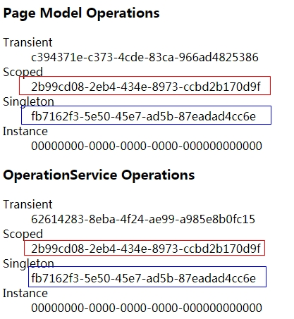
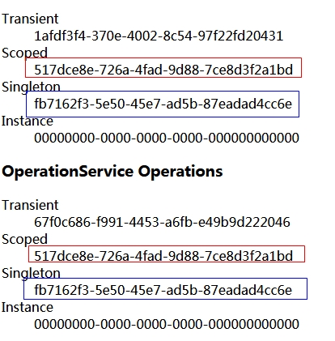

# ASP.NET Core 依赖注入

ASP.NET Core支持依赖关系注入（DI）软件设计模式，这是一种在类及其依赖关系之间实现控制反转 (IoC) 的技术。


## 依赖注入的概述

假设存在以下MyDependency类：

```c#
public class MyDependency
{
    public MyDependency()
    {
    }

    public Task<int> WriteMessage(string message)
    {
        Console.WriteLine($"MyDependency类中的WriteMessage方法被调用。 Message：{message}");
        return Task.FromResult(10);
    }
}
```

接着在其他类中定义该类的实例，并使用它，下述代码是之前常见的使用方式：

```c#
public class IndexModel : PageModel
{
    private MyDependency _dependency = new MyDependency();

    public async Task OnGetAsync()
    {
        int i = await _dependency.WriteMessage("IndexModel.OnGetAsync");
    }
}
```

依赖项是另一个对象所需的任何对象，上述代码中，MyDependency 类是 IndexModel 类的依赖项，IndexModel类创建并直接依赖于MyDependency 实例。

上述代码中的依赖项是有问题的，首先如果要用不同的实现来替换MyDependency，那么必须修改IndexModel类，并且对于具有多个依赖于MyDependency的类的大型项目，这种修改和配置代码会在整个应用中变得很分散，最后，这种实现很难进行单元测试。

依赖关系注入通过以下方式解决了这些问题：

- 使用接口抽象化依赖关系实现。
- 在服务容器中注册依赖关系。 ASP.NET Core 提供了一个内置的服务容器 IServiceProvider。 服务已在应用的 Startup.ConfigureServices 方法中注册。
- 将服务注入到使用它的类的构造函数中。 框架负责创建依赖关系的实例，并在不再需要时对其进行处理。

将上述的代码进行改写，使用接口的形式定义服务为应用提供的方法：

```c#
interface IMyDependency
{
    Task WriteMessage(string message);
}
```

接着实现该接口：

```c#
public class MyDependency : IMyDependency
{
    private readonly ILogger<MyDependency> _logger;

    public MyDependency(ILogger<MyDependency> logger)
    {
        _logger = logger;
    }

    public Task WriteMessage(string message)
    {
        _logger.LogInformation($"MyDependency类中的WriteMessage方法被调用。 Message：{message}");
        return Task.FromResult(10);
    }
}
```

MyDependency在其构造函数中请求一个ILogger< TCategoryName >实例。

> 在ASP.NET Core中，以链式方式使用依赖关系注入很常见。每个请求的依赖关系相应地请求其自己的依赖关系。容器解析关系图中的依赖关系并返回完全解析的服务。 必须被解析的依赖关系的集合通常被称为“依赖关系树”、“依赖关系图”或“对象图”。

必须在服务容器中注册 IMyDependency 和 ILogger<TCategoryName>。其中IMyDependency可以在 Startup.ConfigureServices 中注册。 ILogger<TCategoryName> 由日志记录抽象基础结构注册，它是由框架提供的默认注册的服务。（框架提供的服务具体见链接：https://docs.microsoft.com/zh-cn/aspnet/core/fundamentals/dependency-injection?view=aspnetcore-2.1#framework-provided-services）

注册服务的代码如下：

```c#
public void ConfigureServices(IServiceCollection services)
{
    services.Configure<CookiePolicyOptions>(options =>
    {
        options.CheckConsentNeeded = context => true;
        options.MinimumSameSitePolicy = SameSiteMode.None;
    });
    
    services.AddMvc().SetCompatibilityVersion(CompatibilityVersion.Version_2_1);
	//注册服务，将服务生存期的范围限定为单个请求的生存期。
    services.AddScoped<IMyDependency, MyDependency>();    
}
```

>  每个 services.Add{SERVICE_NAME} 扩展方法添加（并可能配置）服务。 例如，services.AddMvc() 添加 Razor Pages 和 MVC 需要的服务。 建议应用遵循此约定。 将扩展方法置于 Microsoft.Extensions.DependencyInjection 命名空间中以封装服务注册的组。

如果服务的构造函数需要基元（原始类型数据，如 string），则可以使用IConfiguration 或 IOptions 注入基元：

```c#
public class MyDependency : IMyDependency
{
    public MyDependency(IConfiguration config)
    {
        var myStringValue = config["MyStringKey"];
        // Use myStringValue
    }
    ...
}
```

通过使用服务并分配给私有字段的类的构造函数请求服务的实例。 该字段用于在整个类中根据需要访问服务，代码如下：

```c#
public class IndexModel : PageModel
{
    private readonly IMyDependency _myDependency;
    public IndexModel(IMyDependency myDependency)
    {
        _myDependency = myDependency;
    }
    public async Task OnGetAsync()
    {
        await _myDependency.WriteMessage("test");
    }
}
```


## 框架提供的服务

Startup.ConfigureServices 方法负责定义应用使用的服务，包括 Entity Framework Core 和 ASP.NET Core MVC 等平台功能。提供给 ConfigureServices 的 IServiceCollection 定义了的服务见链接：https://docs.microsoft.com/zh-cn/aspnet/core/fundamentals/dependency-injection?view=aspnetcore-2.1#framework-provided-services

当服务集合扩展方法可用于注册服务（及其依赖服务，如果需要）时，约定使用单个 Add{SERVICE_NAME} 扩展方法来注册该服务所需的所有服务。 以下代码是如何使用扩展方法 AddDbContext、AddIdentity 和 AddMvc 向容器添加其他服务的示例：

```c#
public void ConfigureServices(IServiceCollection services)
{
    services.AddDbContext<ApplicationDbContext>(options =>
      options.UseSqlServer(Configuration.GetConnectionString("DefaultConnection")));

    services.AddIdentity<ApplicationUser, IdentityRole>()
        .AddEntityFrameworkStores<ApplicationDbContext>()
        .AddDefaultTokenProviders();

    services.AddMvc();
}
```


## 服务生存期

在ASP.NET Core中，可以使用以下生存期配置服务：

#### Transient（暂时）

生存期是暂时的服务是每次请求时创建的。 这种生存期适合轻量级、 无状态的服务。

#### Scoped（作用域）

生存期是作用域的服务以每个请求一次的方式创建。

注意：在中间件内使用有作用域的服务时，请将该服务注入至 Invoke 或 InvokeAsync 方法。 请不要通过构造函数注入进行注入，因为它会强制服务的行为与单一实例类似。

#### Singleton（单例）

单一实例生存期服务是在第一次请求时（或者在运行 ConfigureServices 并且使用服务注册指定实例时）创建的。 每个后续请求都使用相同的实例。 如果应用需要单一实例行为，建议允许服务容器管理服务的生存期。 不要实现单一实例设计模式并提供用户代码来管理对象在类中的生存期。

注意：从单一实例解析有作用域的服务很危险。 当处理后续请求时，它可能会导致服务处于不正确的状态。


## 生存期和注册选项

为了说明各个生存期和注册选项之间的差异，先准备以下几个接口：

```c#
public interface IOperation
{
    Guid OperationId { get; }
}

public interface IOperationTransient : IOperation
{
}

public interface IOperationScoped : IOperation
{
}

public interface IOperationSingleton : IOperation
{
}

public interface IOperationSingletonInstance : IOperation
{
}
```

这些接口只有一个Guid类型的属性OperationId，然后定义一个类实现上述接口：

```c#
public class Operation : IOperationTransient, IOperationScoped, 
						 IOperationSingleton, IOperationSingletonInstance
{
    //如果无参实例化，默认调用有参实例，此处将生成一个新的GUID
    public Operation() : this(Guid.NewGuid())
    {
    }

    public Operation(Guid id)
    {
        OperationId = id;
    }

    //实现接口属性
    public Guid OperationId { get; private set; }
}
```

接着定义一个用于注册的类：

```c#
public class OperationService
{
    public OperationService(
        IOperationTransient transientOperation,
        IOperationScoped scopedOperation,
        IOperationSingleton singletonOperation, 
        IOperationSingletonInstance instanceOperation)
    {
        this.TransientOperation = transientOperation;
        this.ScopedOperation = scopedOperation;
        this.SingletonOperation = singletonOperation;
        this.SingletonInstanceOperation = instanceOperation;
    }

    public IOperationTransient TransientOperation { get; }
    public IOperationScoped ScopedOperation { get; }
    public IOperationSingleton SingletonOperation { get; }
    public IOperationSingletonInstance SingletonInstanceOperation { get; }
}
```

在 Startup.ConfigureServices 中，根据其指定的生存期，将每个类型添加到容器中：

```c#
public void ConfigureServices(IServiceCollection services)
{
    services.Configure<CookiePolicyOptions>(options =>
    {
        options.CheckConsentNeeded = context => true;
        options.MinimumSameSitePolicy = SameSiteMode.None;
    });

    services.AddMvc().SetCompatibilityVersion(CompatibilityVersion.Version_2_1);

    services.AddScoped<IMyDependency, MyDependency>();

	//将不同生存期的类型添加到容器中
    services.AddTransient<IOperationTransient, Operation>();
    services.AddScoped<IOperationScoped, Operation>();
    services.AddSingleton<IOperationSingleton, Operation>();
    services.AddSingleton<IOperationSingletonInstance>(new Operation(Guid.Empty));
	//OperationService取决于每个其他的操作类型
    services.AddTransient<OperationService, OperationService>();
}

```

注册 OperationService 取决于，每个其他 Operation 类型。 OperationService构造函数需要传入的参数，可以通过链式注入获得，当通过依赖关系注入请求 OperationService 时，它将接收每个服务的新实例或基于从属服务的生存期的现有实例。

- 如果在请求时创建了临时服务，则 `IOperationTransient` 服务的 `OperationId` 与 `OperationService` 的 `OperationId` 不同。 `OperationService` 将接收 `IOperationTransient` 类的新实例。 新实例将生成一个不同的 `OperationId`。

- 如果在请求时创建有作用域的服务，则 `IOperationScoped` 服务的 `OperationId` 与请求中 `OperationService` 的该 ID 相同。【此处需要结合后续的生命周期才能理解】 ~~在请求中，两个服务共享不同的 `OperationId` 值。~~【删除原因：不能理解】
- 如果单一数据库和单一实例服务只创建一次并在所有请求和所有服务中使用，则 `OperationId` 在所有服务请求中保持不变。

上述代码中，IOperationSingletonInstance 服务正在使用已知 ID 为 Guid.Empty 的特定实例。 此类型在使用时，其 GUID 全部为零。

为了演示各个请求中和之间的对象生存期，在IndexModel中请求每种`IOperation` 类型和 `OperationService`。 然后，页面通过属性分配显示所有页面模型类和服务的 `OperationId` 值：

```c#
public class IndexModel : PageModel
{
    private readonly IMyDependency _myDependency;

    public IndexModel(
        IMyDependency myDependency,
        OperationService operationService,
        IOperationTransient transientOperation,
        IOperationScoped scopedOperation,
        IOperationSingleton singletonOperation,
        IOperationSingletonInstance singletonInstanceOperation
        )
    {
        _myDependency = myDependency;
        OperationService = operationService;
        TransientOperation = transientOperation;
        ScopedOperation = scopedOperation;
        SingletonOperation = singletonOperation;
        SingletonInstanceOperation = singletonInstanceOperation;
    }

    public OperationService OperationService { get; }
    public IOperationTransient TransientOperation { get; }
    public IOperationScoped ScopedOperation { get; }
    public IOperationSingleton SingletonOperation { get; }
    public IOperationSingletonInstance SingletonInstanceOperation { get; }

    public async Task OnGetAsync()
    {
        await _myDependency.WriteMessage("test");
    }
}
```

IndexModel.cshtml内容如下：

```html
@page
@model IndexModel
@{
    ViewData["Title"] = "Dependency Injection Sample";
}
<h1>@ViewData["Title"]</h1>
 
<div class="row">
    <div class="col-md-6">
        <div class="panel panel-default">
            <div class="panel-heading">
                <h2 class="panel-title">Operations</h2>
            </div>
            <div class="panel-body">
                <h3>Page Model Operations</h3>
                <dl>
                    <dt>Transient</dt>
                    <dd>@Model.TransientOperation.OperationId</dd>
                    <dt>Scoped</dt>
                    <dd>@Model.ScopedOperation.OperationId</dd>
                    <dt>Singleton</dt>
                    <dd>@Model.SingletonOperation.OperationId</dd>
                    <dt>Instance</dt>
                    <dd>@Model.SingletonInstanceOperation.OperationId</dd>
                </dl>
                <h3>OperationService Operations</h3>
                <dl>
                    <dt>Transient</dt>
                    <dd>@Model.OperationService.TransientOperation.OperationId</dd>
                    <dt>Scoped</dt>
                    <dd>@Model.OperationService.ScopedOperation.OperationId</dd>
                    <dt>Singleton</dt>
                    <dd>@Model.OperationService.SingletonOperation.OperationId</dd>
                    <dt>Instance</dt>
                    <dd>@Model.OperationService.SingletonInstanceOperation.OperationId</dd>
                </dl>
            </div>
        </div>
    </div>
</div>
```

执行后，第一次请求的结果如下：



注意同颜色的框OperationId的值一样，再次刷新页面，或者重新打开链接，甚至使用不同浏览器请求页面，第二次得到的结果如下：



通过结果可以看到：

- 暂时性对象始终不同。 请注意，第一个和第二个请求的暂时性 OperationId 值对于 OperationService 操作和在请求内都是不同的。 为每个服务和请求提供了一个新实例。
- 有作用域的对象在一个请求内是相同的，但在请求之间是不同的。
- 单一实例对象对每个对象和每个请求都是相同的（不管 ConfigureServices 中是否提供 Operation 实例）。


## 从main方法调用服务

采用 IServiceScopeFactory.CreateScope 创建 IServiceScope ，以解析应用作用域中有作用域的服务。 此方法可以用于在启动时访问有作用域的服务以便运行初始化任务。

以下示例演示如何在 Program.Main 中获取 MyScopedService 的上下文：

```c#
public static void Main(string[] args)
{
    var host = CreateWebHostBuilder(args).Build();
    using (var serviceScope = host.Services.CreateScope())
    {
        var services = serviceScope.ServiceProvider;
        try
        {
            var serviceContext = services.GetRequiredService<MyScopedService>();
            // Use the context here
        }
        catch (Exception ex)
        {
            var logger = services.GetRequiredService<ILogger<Program>>();
            logger.LogError(ex, "An error occurred.");
        }
    }
    host.Run();
}
```


