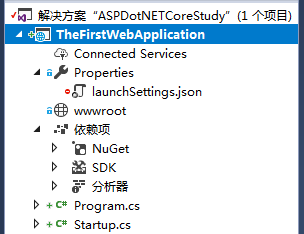

# 创建第一个ASP.NET Core Web 应用程序

这里使用Visual Studio 2017创建SP.NET Core Web 应用程序，基于ASP.NET Core 2.0，在选择的模板中选择Empty（空模板），如下图所示：


创建完成后，项目结构如下：




## 项目结构说明

对上述创建的项目结构以及包含的文件进行说明

#### wwwroot

就静态文件而言，ASP.NET Core运行时区分内容根文件夹和Web根文件夹。

- 内容根目录：内容根目录通常是项目的当前目录，在生产中，它是部署的根文件夹。 它表示代码可能需要的任何文件搜索和访问的基本路径。
- web根目录：Web根目录是应用程序可能为Web客户端提供的任何静态文件的基本路径。所有的静态资源文件，比如images、css、js等都在该路径下。 通常，Web根文件夹是内容根的子文件夹，名为wwwroot。

注意：所有的客户端静态资源访问都是基于Web根目录，例如，如果在wwwroot下面有一个images文件夹，images有一个图片叫wy.jpg，那么获取该图片的有效URL如下：

    /images/wy.jpg

即静态资源的URL的根目录（`/`）指向服务器wwwroot目录，物理映射文件必须在服务器上的wwwroot目录下。

可以在Program.cs文件中以编程的方式更改一个或多个根目录的位置。（具体见后续文章说明）

#### Program.cs

Program.cs文件在以前创建的控制台应用程序中很常见，同样，在ASP.NET Core Web应用程序中，它也具有非常重要的作用。

Web服务器（例如，IIS）通过已配置的端口与远程解耦的可执行文件进行通信，并将传入的请求转发到控制台应用程序。 控制台应用程序从IIS进程空间生成，处理所需的HTTP模块，使IIS支持ASP.NET Core。 在其他Web服务器（如Apache或NGINX）上托管ASP.NET Core应用程序需要类似的扩展模块。在内部，控制台应用程序是围绕从program.cs文件中获取的以下几行代码构建的。

```c#
//注：此段代码不是自动生成的代码
public static void Main(string[] args)
{
    IWebHost host = new WebHostBuilder()
        //将Kestrel指定为Web主机要使用的服务器。
        .UseKestrel()
        //指定Web主机要使用的内容根目录。
        .UseContentRoot(Directory.GetCurrentDirectory())
        //配置服务器在AspNetCoreModule运行后应监听的端口和基本路径。
        //该应用程序还将配置为捕获启动错误。
        .UseIISIntegration()
        //指定Web主机要使用的启动类型。
        .UseStartup<Startup>()
        //构建一个托管Web应用程序的IWebHost。
        .Build();
    //运行Web应用程序
    host.Run();
}
```

ASP.NET Core应用程序需要一个要在其中执行的Host。 Host负责应用程序启动和生命周期管理。WebHostBuilder是负责构建有效ASP.NET Core Host的完全配置实例的类。

上述代码中调用的方法以及具体作用说明如下：

###### UseKestrel()

指示主机使用嵌入式Web服务器。 嵌入式Web服务器负责在主机上下文中接受和处理HTTP请求。 Kestrel是默认的跨平台ASP.NET嵌入式Web服务器的名称。

###### UseContentRoot()

指示主机有关内容根文件夹的位置。

###### UseIISIntegration()

指示主机使用IIS作为反向代理，该代理将从公共Internet获取请求并将其传递到嵌入式服务器。请注意，对于具有反向代理的ASP.NET Core应用程序，出于安全性和流量的原因，可能会建议使用反向代理，但从纯粹的功能角度来看，它根本不是必需的。

###### `UseStartup<T>()`

向主机指示包含应用程序初始化设置的类型。

###### Build()

构建ASP.NET Core主机类型的实例。

除了上述方法外，WebHostBuilder类还有很多扩展方法，可以让您进一步自定义行为。

注：上述代码不是VS自动生成的原始代码，而是为了说明问题改写的。在我们创建的项目中，原始的Program.cs代码，由ASP.NET Core 2.0提供了一种更简单的方法来构建Web主机实例。 通过使用“默认”构建器，单个调用可以返回新创建的Web主机实例，代码如下：

```c#
//该代码来自于VS自动生成的代码
public static void Main(string[] args)
{
    BuildWebHost(args).Run();
}

public static IWebHost BuildWebHost(string[] args)
{
    return WebHost.CreateDefaultBuilder(args)
        .UseStartup<Startup>()
        .Build();
}
```

该代码中，静态方法CreateDefaultBuilder完成了所有工作，包括添加Kestrel，IIS配置和内容根以及其他选项，例如日志提供程序和配置数据等。可以反编译该方法，查看具体的实现。

#### Startup.cs

startup.cs文件包含指定用于配置请求管道的类，该管道处理对应用程序发出的所有请求。 该类至少包含主机在应用程序初始化期间将回调的几种方法。 

第一种方法称为ConfigureServices，用于添加应用程序期望使用的依赖项注入机制服务。 ConfigureServices在启动类中是可选的，但在大多数现实场景中都需要一个。

```c#
public void ConfigureServices(IServiceCollection services)
{
}
```

第二种方法称为Configure，如下：

```c#
public void Configure(IApplicationBuilder app, IHostingEnvironment env)
{
   	...
}
```

顾名思义，它用于配置之前添加的服务。 例如，如果您在方法ConfigureServices中声明了打算使用ASP.NET MVC服务，那么在Configure中，您可以通过在提供的IApplicationBuilder参数上调用UseMvc方法来指定要处理的有效路由列表。 Configure方法是必需的。 

注意，Startup类不应实现任何接口或从任何基类继承。 事实上，Configure和ConfigureServices都是通过反射的方式发现并调用的。另外，Startup类的名称不是一成不变的。名称Startup是一个合理的选择，但您可以根据自己的喜好进行更改。如果重命名Startup类，则必须在调用UseStartup <T>时传入正确的类型。 

## 与运行时环境交互


