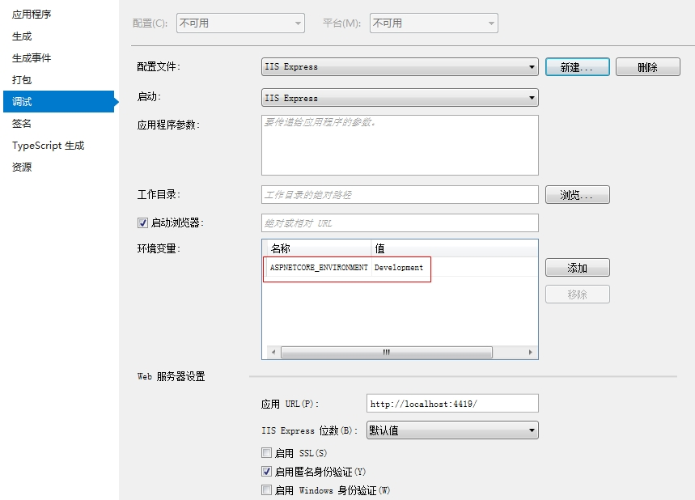

# 创建第一个ASP.NET Core Web 应用程序

这里使用Visual Studio 2017创建SP.NET Core Web 应用程序，基于ASP.NET Core 2.0，在选择的模板中选择Empty（空模板），如下图所示：


创建完成后，项目结构如下：


## 项目结构说明

对上述创建的项目结构以及包含的文件进行说明

#### wwwroot

就静态文件而言，ASP.NET Core运行时区分内容根文件夹和Web根文件夹。

- 内容根目录：内容根目录通常是项目的当前目录，在生产中，它是部署的根文件夹。 它表示代码可能需要的任何文件搜索和访问的基本路径。
- web根目录：Web根目录是应用程序可能为Web客户端提供的任何静态文件的基本路径。所有的静态资源文件，比如images、css、js等都在该路径下。 通常，Web根文件夹是内容根的子文件夹，名为wwwroot。

注意：所有的客户端静态资源访问都是基于Web根目录，例如，如果在wwwroot下面有一个images文件夹，images有一个图片叫`wy.jpg`，那么获取该图片的有效URL如下：

    /images/wy.jpg

即静态资源的URL的根目录（`/`）指向服务器wwwroot目录，物理映射文件必须在服务器上的wwwroot目录下。

可以在`Program.cs`文件中以编程的方式更改一个或多个根目录的位置。（具体见后续文章说明）

#### Program.cs

`Program.cs`文件在以前创建的控制台应用程序中很常见，同样，在ASP.NET Core Web应用程序中，它也具有非常重要的作用。

Web服务器（例如，IIS）通过已配置的端口与远程解耦的可执行文件进行通信，并将传入的请求转发到控制台应用程序。 控制台应用程序从IIS进程空间生成，处理所需的HTTP模块，使IIS支持ASP.NET Core。 在其他Web服务器（如Apache或NGINX）上托管ASP.NET Core应用程序需要类似的扩展模块。在内部，控制台应用程序是围绕从`program.cs`文件中获取的以下几行代码构建的。

```c#
//注：此段代码不是自动生成的代码
public static void Main(string[] args)
{
    IWebHost host = new WebHostBuilder()
        //将Kestrel指定为Web主机要使用的服务器。
        .UseKestrel()
        //指定Web主机要使用的内容根目录。
        .UseContentRoot(Directory.GetCurrentDirectory())
        //配置服务器在AspNetCoreModule运行后应监听的端口和基本路径。
        //该应用程序还将配置为捕获启动错误。
        .UseIISIntegration()
        //指定Web主机要使用的启动类型。
        .UseStartup<Startup>()
        //构建一个托管Web应用程序的IWebHost。
        .Build();
    //运行Web应用程序
    host.Run();
}
```

ASP.NET Core应用程序需要一个要在其中执行的Host。 Host负责应用程序启动和生命周期管理。`WebHostBuilder`是负责构建有效ASP.NET Core Host的完全配置实例的类。

上述代码中调用的方法以及具体作用说明如下：

###### `UseKestrel()`

指示主机使用嵌入式Web服务器。 嵌入式Web服务器负责在主机上下文中接受和处理HTTP请求。 Kestrel是默认的跨平台ASP.NET嵌入式Web服务器的名称。

###### `UseContentRoot()`

指示主机有关内容根文件夹的位置。

###### `UseIISIntegration()`

指示主机使用IIS作为反向代理，该代理将从公共Internet获取请求并将其传递到嵌入式服务器。请注意，对于具有反向代理的ASP.NET Core应用程序，出于安全性和流量的原因，可能会建议使用反向代理，但从纯粹的功能角度来看，它根本不是必需的。

###### `UseStartup<T>()`

向主机指示包含应用程序初始化设置的类型。

###### `Build()`

构建ASP.NET Core主机类型的实例。

除了上述方法外，`WebHostBuilder`类还有很多扩展方法，可以让您进一步自定义行为。

注：上述代码不是VS自动生成的原始代码，而是为了说明问题改写的。在我们创建的项目中，原始的`Program.cs`代码，由ASP.NET Core 2.0提供了一种更简单的方法来构建Web主机实例。 通过使用“默认”构建器，单个调用可以返回新创建的Web主机实例，代码如下：

```c#
//该代码来自于VS自动生成的代码
public static void Main(string[] args)
{
    BuildWebHost(args).Run();
}

public static IWebHost BuildWebHost(string[] args)
{
    return WebHost.CreateDefaultBuilder(args)
        .UseStartup<Startup>()
        .Build();
}
```

该代码中，静态方法`CreateDefaultBuilder`完成了所有工作，包括添加`Kestrel`，IIS配置和内容根以及其他选项，例如日志提供程序和配置数据等。可以反编译该方法，查看具体的实现。

#### `Startup.cs`

`startup.cs`文件包含指定用于配置请求管道的类，该管道处理对应用程序发出的所有请求。 该类至少包含主机在应用程序初始化期间将回调的几种方法。 

第一种方法称为`ConfigureServices`，用于添加应用程序期望使用的依赖项注入机制服务。 `ConfigureServices`在启动类中是可选的，但在大多数现实场景中都需要一个。

```c#
public void ConfigureServices(IServiceCollection services)
{
}
```

第二种方法称为`Configure`，如下：

```c#
public void Configure(IApplicationBuilder app, IHostingEnvironment env)
{
   	...
}
```

顾名思义，它用于配置之前添加的服务。 例如，如果您在方法`ConfigureServices`中声明了打算使用ASP.NET MVC服务，那么在`Configure`中，您可以通过在提供的`IApplicationBuilder`参数上调用`UseMvc`方法来指定要处理的有效路由列表。 `Configure`方法是必需的。 

注意，`Startup`类不应实现任何接口或从任何基类继承。 事实上，`Configure`和`ConfigureServices`都是通过反射的方式发现并调用的。另外，`Startup`类的名称不是一成不变的。名称`Startup`是一个合理的选择，但您可以根据自己的喜好进行更改。如果重命名`Startup`类，则必须在调用`UseStartup <T>`时传入正确的类型。 


## 与运行时环境交互

所有ASP.NET Core应用程序都托管在运行时环境中，它们使用一些可用的服务。为了使应用程序正常运行，必须明确声明所需的所有服务。

#### 解析启动类型

Host承担的首要任务之一是解析启动类型。可以通过`UseStartup <T>`泛型扩展方法或通过将其作为参数传递给非泛型版本来明确指示任何名称的启动类型。 也可以传递包含启动类型的引用程序集的名称。启动类的常规名称是Startup，可以根据自己的喜好进行更改。

#### 配置和修改启动类型

一般情况下，使用默认的Startup作为启动类型名称即可，如果应用程序有多个开发环境，那么可以在应用程序中配置多个启动类，每个开发环境一个。 例如，可以在开发中使用启动类，在正式或生产环境中使用其他启动类。 此外，还可以根据需要定义自定义开发环境（自定义开发环境指修改环境变量，对应的值在文件`launchSettings.json`中）。例如，假设项目中同时存在`StartupDevelopment`和`StartupProduction`的类，要想与当前环境想关联，动态的执行不同的启动类，需要在`Program.cs`中包含如下代码：

```c#
 new WebHostBuilder()
     .UseStartup(Assembly.GetEntryAssembly().GetName().Name)
```

上述代码中，Host将会从当前程序集中解析启动类，Host尝试查找与以下模式匹配的可加载类：`StartupXXX`其中`XXX`是当前主机环境的名称。 默认情况下，托管环境设置为“`Development`”，但可以更改为您喜欢的任何字符串。 例如`Production`。 如果未设置托管环境，则系统将仅尝试查找普通的`Startup`类，如果失败则抛出错误。

环境变量设置的值可以在`launchSettings.json`中查看到：

```
"profiles": {
    "IIS Express": {
      "commandName": "IISExpress",
      "launchBrowser": true,
      "environmentVariables": {
        "ASPNETCORE_ENVIRONMENT": "Development"
      }
    },
```

也可以右击项目-属性-调试选项卡中进行查看和设置。如果值指定为`Development`，程序在启动的时候，Host将会按照”`StartupDevelopment`“查找可加载的类，对应的将会执行`StartupDevelopment`类中的内容。同理，如果环境变量设置为`Production`，将会执行`StartupProduction`类。如果不存在上述类，就会尝试执行`Startup`类，如果没有找到，就会抛出异常。



#### 托管环境

开发环境源自名为`ASPNETCORE_ENVIRONMENT`的环境变量的值，默认为`Development`。

托管环境的配置通过`IHostingEnvironment`接口的成员以编程方式公开。你可以在`Startup.cs`中的`Configure()`方法里进行配置，常用的属性如下：

###### `ApplicationName`

获取或设置应用程序的名称。 主机将属性的值设置为包含应用程序入口点的程序集。

###### `EnvironmentName`

获取或设置覆盖`ASPNETCORE_ ENVIRONMENT`变量值的环境名称。可以使用此属性的`setter`以编程方式设置环境。

###### `ContentRootPath`

获取或设置包含应用程序文件的目录的绝对路径。 此属性通常设置为根安装路径。

###### `ContentRootFileProvider`

获取或设置必须用于检索内容文件的组件。 该组件可以是实现`IFileProvider`接口的任何类。 默认文件提供程序使用文件系统来检索文件。

###### `WebRootPath`

获取或设置包含客户端可通过URL请求的静态文件的目录的绝对路径。

###### `WebRootFileProvider`

获取或设置必须用于检索Web文件的组件。 该组件可以是实现`IFileProvider`接口的任何类。 默认文件提供程序使用文件系统来检索文件。

补充：

`IFileProvider`接口表示只读文件提供程序，它通过获取描述文件或目录名称的字符串并返回内容的抽象来工作。 

实现`IHostingEnvironment`接口的对象由主机创建，并通过依赖注入公开提供给启动类和应用程序中的所有其他类。

注意：启动类的构造函数可以选择性地接收对几个系统服务的引用：`IHostingEnvironment`和`ILoggerFactory`。 

#### 启用系统和应用程序服务

`ConfigureServices()`方法会在`Configure()`之前被调用。有些服务的配置可以直接在`ConfigureServices`中进行，也可以推迟到`Configure`调用，最终取决于服务的编程接口。`ConfigureServices()`方法如下：

```c#
public void ConfigureServices(IServiceCollection services){}
```

该方法接收一组服务，可以添加自己的服务，通常，具有大量设置阶段的服务在`IServiceCollection`上提供`AddXXX`扩展方法并接受一些参数。将服务添加到`IServicesCollection`容器中，使服务通过ASP.NET Core内置依赖注入系统进一步可用于应用程序的其余部分。

#### 配置系统和应用程序服务

`Configure()`方法用于配置HTTP请求管道并指定有机会处理传入HTTP请求的模块。 可以添加到HTTP请求管道的模块和松散代码统称为中间件。

```c#
 public void Configure(IApplicationBuilder app, IHostingEnvironment env){...}
```

`Configure()`方法接收实现`IApplicationBuilder`接口的系统对象的实例，并通过接口的扩展方法添加中间件。 此外，`Configure()`方法可能会接收`IHostingEnvironment`和`ILoggerFactory`组件的实例。

例如，在`Configure()`方法中，启用提供静态文件和集中式错误处理程序的功能：

```c#
public void Configure(IApplicationBuilder app, IHostingEnvironment env)
{
    //如果是开发模式，就显示错误页面
    if (env.IsDevelopment())
    {
        app.UseDeveloperExceptionPage();
    }
    else
    {
        app.UseExceptionHandler("/Error/View");
    }
	app.UseStaticFiles();
}
```

上述代码中，扩展方法`UseExceptionHandler()`充当集中式错误处理程序，并重定向到指定的URL，包含未处理的异常。

`IsDevelopment`，`IsProduction`和`IsStaging`等扩展方法是预定义的，用于检查当前的开发模式。 如果定义自定义环境，则可以通过`IsEnvironment`方法进行检查。 请注意，在Windows和Mac中，环境名称不区分大小写，但在Linux中它们区分大小写。

因为在`Configure()`中编写的任何代码最终都会配置运行时管道，所以配置服务的顺序非常重要。 因此，您要在`Configure()`中执行的第一件事就是在静态文件之后立即设置错误处理。

#### 特定于环境的配置方法

在启动类中，`Configure()`和`ConfigureServices()`方法的名称也可以特定于环境。 模式是`ConfigureXxx`和`ConfigureXxxServices`；`Xxx`指的是环境名称。使用默认名称`Startup`创建单个启动类并通过`UseStartup <T>`向主机注册它可能是配置ASP.NET Core应用程序启动的理想方法。 然后，在类的主体中，您可以创建特定于环境的方法，例如`ConfigureDevelopment`和`ConfigureProduction`。

注意，如果将启动类重命名为`Startup`以外的任何其他类型，则用于自动解析类型的内置逻辑将失败。

#### 管道

`IApplicationBuilder`接口提供了定义ASP.NET管道结构的方法。 管道是一系列可选模块，用于预处理和后处理传入的HTTP请求。

管道由在`Configure`中注册的中间件组件组成，并按照每个请求的注册顺序调用。所有中间件组件都有机会在ASP.NET代码实际运行之前处理该请求。 通过调用下一个模块，每个中间件组件将请求推送到队列中的下一个请求。 当最后一个注册的模块已预处理该请求时，请求将执行。 之后，中间件组件链向后遍历，并且所有已注册的模块都有机会通过查看更新的上下文及其响应来对请求进行后处理。 在返回客户端的过程中，中间件模块以相反的顺序调用。

###### 终止中间件

中间件组件链以请求运行器结束，即实际执行针对请求的操作的代码。 此代码也称为终止中间件。

终止中间件处理的代码具有以下委托的形式：

```c#
public delegate Task RequestDelegate(HttpContext context);
```

终止中间件获取`HttpContext`对象的实例并返回任务。 HTTP上下文对象是基于HTTP的信息的容器，包括响应流，身份验证声明，输入参数，会话状态和连接信息。

如果通过`Run`方法显式定义终止中间件，那么任何请求都直接从那里提供，而不需要有控制器和视图。 通过实现`Run`中间件方法，可以以最快的方式提供几乎没有开销的任何请求，并且只占用最少的内存。(具体实现见后续介绍)


## 依赖注入子系统

依赖注入（Dependency Injection，简称DI）：DI是一种促进类之间松散耦合的设计原则。

假如存在以下类：

```c#
public class Flag
{
}
//返回Flag对象
public class FlagRepository
{
    public Flag GetFlag(string country)
    {
        return new Flag();
    }
}
```

上述两个类没有特殊含义，只是为了说明依赖注入的演变过程。

下面定义一个新类，在未使用依赖注入之前，代码如下：

```c#
public class FlagService
{
    private FlagRepository _repository;

    public FlagService()
    {
        _repository = new FlagRepository();
    }

    public Flag GetFlagForCountry(string country)
    {
        return _repository.GetFlag(country);
    }
}
```

在该类中，`FlagService`类依赖于`FlagRepository`类，并且给定了两个类完成的任务，紧密的关系是不可避免的。DI原则有助于保持`FlagService`及其依赖关系之间的松散关系。 DI的核心思想是使`FlagService`仅依赖于`FlagRepository`提供的函数的抽象。 考虑到DI，可以按如下方式重写类：

```c#
public interface IFlagRepository
{
    Flag GetFlag(string country);
}

public class FlagRepository : IFlagRepository
{
    public Flag GetFlag(string country)
    {
       return new Flag();
    }
}

public class FlagService
{
    private IFlagRepository _repository;

    public FlagService(IFlagRepository repository)
    {
        _repository = repository;
    }

    public Flag GetFlagForCountry(string country)
    {
        return _repository.GetFlag(country);
    }
}
```

现在，任何实现`IFlagRepository`的类都可以安全地使用`FlagService`实例。 通过使用DI，我们将`FlagService`和`FlagRepository`之间的紧密依赖关系转换为`FlagService`与从外部导入所需服务的抽象之间的松散关系。 创建存储库抽象实例的责任已从服务类中移除。 这意味着其他一些代码现在负责引用一个接口（一个抽象）并返回一个具体类型（一个类）的可用实例。 每次需要时都可以手动编写此代码。

```c#
var repository = new FlagRepository();
var service = new FlagService(repository);
```

当然，你还可以对此语句进行封装，使其可以在其他代码层被调用，该代码层检查服务的构造函数并解析其所有依赖项。类似的调用语句如下：

```c#
var service = DependencyInjectionSubsystem.Resolve(FlagService);
```

ASP.NET Core带有自己的DI子系统，因此任何类（包括控制器）都可以在构造函数（或成员）中声明所有必需的依赖项，系统将确保创建和传递有效实例。

### ASP.NET Core中的依赖注入

要使用DI系统，你需要注册系统能够为你实例化的类型。 ASP.NET Core DI系统已经知道某些类型，例如`IHostingEnvironment`和`ILoggerFactory`。

#### 使用DI系统注册类型

在`ConfigureServices()`方法中，添加要注册新类型的代码。`ConfigureServices()`方法的`IServiceCollection`参数是访问当前在DI系统中注册的所有类型的句柄。

```c#
public void ConfigureServices(IServiceCollection services)
{
    services.AddTransient<IFlagRepository, FlagRepository>();
}
```

每次请求`IFlagRepository`接口之类的抽象时，方法`AddTransient()`都会指示DI系统为`FlagRepository`类型提供一个全新的实例。有了这一行，任何实例化由ASP.NET Core管理的类都可以简单地声明`IFlagRepository`类型的参数，以便系统提供一个新的实例。例如，在控制器中利用DI得到实例对象，而不是显示的实例化：

```c#
 public class HomeController : Controller
 {
     private IFlagRepository _flagRepository;

     public HomeController(IFlagRepository flagRepository)
     {
         _flagRepository = flagRepository;
     }
}
```

#### 基于运行时条件解析类型

假如希望在DI系统中注册抽象类型，但只有在验证某些运行时条件（例如，附加的cookie，HTTP标头或查询字符串参数）之后，才需要确定具体类型。 此时可以这么做：

```c#
public void ConfigureServices(IServiceCollection services)
{
    services.AddTransient<IFlagRepository>(provider =>
    {
    	//创建要返回的实际类型的实例
		//基于当前登录用户的身份
        var context = provider.GetRequiredService<IHttpContextAccessor>();
        return new FlagRepositoryForUser(context.HttpContext.User);
    });
}
```

上述代码中返回`FlagRepositoryForUser`的对象，但是需要基于`HttpContext`的`User`进行创建，此时可以通过要求DI容器注入`IHttpContextAccessor`实例，从而获取HTTP上下文信息。

#### 按需解析类型

在某些情况下，需要创建具有自己的依赖项的类型的实例，可以使用DI系统帮你解决这类问题。通常，DI系统以一个称为容器的根对象为中心，该容器遍历依赖树并解析抽象类型。在ASP.NET Core系统中，容器由`IServiceProvider`接口表示。要解析`FlagService`的实例，您有两个选择：使用经典的new运算符并提供`IFlagRepository`实现依赖项的有效实例，或利用`IServiceProvider`，如下所示：

```c#
var flagService = provider.GetService<FlagService>();
```

#### 控制对象的生命周期

使用DI系统注册类型有三种不同的方法，返回实例的生命周期各不相同。

###### `AddTransient`

每个调用者都会收到一个新创建的指定类型的实例。

###### `AddSingleton`

所有请求都会收到应用程序启动后第一次创建的指定类型的相同实例。 如果由于某种原因没有可用的缓存实例，则会重新创建它。 该方法还具有重载功能，允许您将实例传递给缓存并按需返回。

###### `AddScoped`

在给定请求的上下文中对DI系统的每次调用都接收在请求处理开始时创建的相同实例。 此选项类似于单例，但它的作用域为请求生存期。

下面的代码显示了如何注册用户创建的实例作为单例：

```c#
public void ConfigureServices(IServiceCollection services)
{
   services.AddSingleton<ICountryRepository>(new CountryRepository());
}
```

每个抽象类型都可以映射到多个具体类型。 发生这种情况时，系统使用最后注册的具体类型来解决依赖关系。 如果找不到具体类型，则返回null。 如果找到具体类型，但无法实例化，则抛出异常。

### 与外部DI库集成

ASP.NET Core中自带的DI框架，对于基本任务，它完成的很好，能够满足ASP.NET Core 平台的需求，但是与其他流行的DI框架相比，并不存在竞争优势。它与其他流行的DI框架最大的不同是注入点。

#### 注入点

一般来说，依赖关系可以以三种不同的方式注入到类中：作为构造函数，公共方法或公共属性中的附加参数。 但是，ASP.NET Core中的DI实现一直保持简单，并不完全支持其他流行的DI框架之类的高级用例，包括Microsoft的Unity，AutoFac，Ninject，Structure-Map等等。因此在ASP.NET Core中，依赖注入只能通过构造函数进行。但是，在完全启用的MVC上下文中使用DI时，可以使用`FromServices`属性将类的公共属性或方法参数标记为注入点。 缺点是`FromServices`属性属于ASP.NET模型绑定层，从技术上讲它不是DI系统的一部分。 因此，只有在启用ASP.NET MVC引擎且仅在控制器类的范围内时，才能使用FromServices。

#### 使用外部DI框架

如果您发现ASP.NET Core DI基础结构太简单，无法满足您的需求，或者您有针对不同DI框架编写的大型代码库，那么您可以将ASP.NET Core系统配置为切换到使用外部DI框架。 但是，要实现这一点，外部框架需要支持ASP.NET Core并提供连接到ASP.NET Core基础结构的桥梁。支持ASP.NET Core意味着提供与.NET Core框架兼容的类库以及`IServiceProvider`接口的自定义实现。作为此支持工作的一部分，外部DI框架还必须能够导入本机或以编程方式向ASP.NET Core DI系统注册的服务集合。

请务必注意，您可以在`ConfigureServices`中注册外部DI框架。 但是，在这样做时，必须将启动类中方法的返回类型从`void`更改为`IServiceProvider`。 最后，请记住，只有少数DI框架已经移植到.NET Core。 在少数人中，有Autofac和StructureMap。 您可以通过`Autofac.Extensions.DependencyInjection` NuGet包获取Autofac for .NET Core。


## 访问Web服务器上的文件

在ASP.NET Core中，在您明确启用它之前，没有任何功能可用。 启用功能意味着将适当的NuGet包添加到项目中，向DI系统注册服务，以及在启动类中配置服务。 即使对于必须注册的MVC引擎，该规则也没有例外。 同样，您必须注册一项服务，以保证访问位于Web根文件夹下的静态文件。

#### 启用静态文件服务

要启用静态文件（如HTML页面，图像，JavaScript文件或CSS文件）的检索，需要将以下行添加到startup类的`Configure()`方法中：

```
app.UseStaticFiles();
```

启用静态文件服务不会让您的用户浏览指定目录的内容。 要启用目录浏览，您还需要以下内容：

```c#
public void ConfigureServices(IServiceCollection services) 
{
   services.AddDirectoryBrowsing();
}

public void Configure(IApplicationBuilder app) 
{
   app.UseStaticFiles(); 
   app.UseDirectoryBrowser(); 
}
```

使用上面的代码，将为Web根目录下的所有目录启用目录浏览。 您还可以将浏览限制为几个目录。

```c#
public void Configure(IApplicationBuilder app) 
{
   app.UseDirectoryBrowser(new DirectoryBrowserOptions()
   {
       FileProvider = new PhysicalFileProvider(
           Path.Combine(Directory.GetCurrentDirectory(), @"wwwroot", "pics"))
   });
}
```

中间件添加了一个目录配置，只能浏览wwwroot / pics文件夹。 如果您还想启用其他目录的浏览，只需复制`UseDirectoryBrowser`调用，将路径更改为所需目录。

请注意，静态文件和目录浏览是独立设置。 您可以同时启用，不启用，也可以只启用其中一个。 但实际上，您希望在任何Web应用程序中至少启用静态文件。
注意：启用目录浏览不是建议使用的功能，因为它可能会导致用户潜入您的文件并可能了解您的网站的秘密。

#### 启用多个Web根

有时，您希望能够从wwwroot以及其他目录提供静态文件。 这绝对可以在ASP.NET Core中实现，所需要的只是对`UseStaticFiles`的多次调用，如下所示。

```c#
public void Configure(IApplicationBuilder app)
{
    //从配置的Web根文件夹（即WWWROOT）启用服务文件
    app.UseStaticFiles();
    //启用位于站点根文件夹下的\Assets中的服务文件
    app.UseStaticFiles(new StaticFileOptions()
    {
        FileProvider = new PhysicalFileProvider(
            Path.Combine(Directory.GetCurrentDirectory(), @"Assets")),
        	RequestPath = new PathString("/Public/Assets")
    });
}
```

该代码包含两个`UseStaticFiles`调用。 前者使应用程序默认只从配置的Web根文件夹-wwwroro中提供文件。 后者使应用程序还可以提供位于站点根目录下的Assets文件夹下的文件。 但是，在这种情况下，用于从Assets物理文件夹中检索文件的URL是什么？ 这正是`StaticFileOptions`类的`RequestPath`属性的作用。 要从Assets访问test.jpg，浏览器应调用以下URL：/public/assets/test.jpg。

注意：IIS有自己的HTTP模块来处理名为`StaticFileModule`的静态文件。 在IIS下托管ASP.NET Core应用程序时，ASP.NET Core模块会绕过默认的静态文件处理程序。 但是，如果IIS中的ASP.NET Core模块配置错误或丢失，则不会绕过`StaticFileModule`，并且文件将在您的控件之外提供。 为避免这种情况，作为一项额外措施，建议为ASP.NET Core应用程序禁用IIS的`StaticFileModule`。

#### 支持默认文件

默认Web文件是当用户导航到站点内的文件夹时自动提供的HTML页面。 默认页面通常名为`index.*`或`default.*`，允许的扩展名为`.html`和`.htm`。 除非您添加以下中间件，否则这些文件应放在wwroot中但忽略不计：

```c#
public void Configure(IApplicationBuilder app)
{
	app.UseDefaultFiles();
	app.UseStaticFiles();
}
```

请注意，必须在静态文件中间件之前启用默认文件中间件。 特别是，默认文件中间件将按以下顺序检查以下文件：default.htm，default.html，index.htm和index.html。 搜索在找到的第一个匹配时停止。

可以按照以下代码重新定义默认文件名列表：

```c#
var options = new DefaultFilesOptions();
options.DefaultFileNames.Clear();
options.DefaultFileNames.Add("home.html");
options.DefaultFileNames.Add("home.htm");
app.UseDefaultFiles(options);
```

如果您不愿意处理不同类型的文件相关中间件，那么您可以考虑使用结合了静态文件和默认文件功能的`UseFileServer`中间件。请注意，默认情况下，`UseFileServer`不启用目录浏览，但它支持更改该行为的选项，并且还添加了我们在`UseStaticFiles`和`UseDefaultFiles`中间件中看到的相同级别的配置。

#### 添加自己的MIME类型

静态文件中间件可识别并提供400多种不同的文件类型。 但是，如果您的网站遗漏了MIME类型，您仍然可以添加它。

```c#
public void Configure(IApplicationBuilder app)
{
   // 设置自定义内容类型 - 将文件扩展名与MIME类型关联
   var provider = new FileExtensionContentTypeProvider();

   // 添加新映射或替换（如果已存在）
   provider.Mappings[".script"] = "text/javascript";

   // Remove JS files
   provider.Mappings.Remove(".js");

   app.UseStaticFiles(new StaticFileOptions()
   {
   	  ContentTypeProvider = provider
   });
}
```

对于传统的ASP.NET Web应用程序，添加缺少的MIME类型是您在IIS中执行的配置任务。 但是，在ASP.NET Core应用程序的上下文中，IIS（以及其他平台上的Web服务器）扮演反向代理的角色，只是将传入的请求转发到ASP.NET Core嵌入式Web服务器（Kestrel）和 从那里通过请求管道。 但是，必须以编程方式配置管道。


------


#### 参考资源

- 《Programming ASP.NET Core》


本文后续会随着知识的积累不断补充和更新，内容如有错误，欢迎指正。

最后一次更新时间：2018-10-12


------


